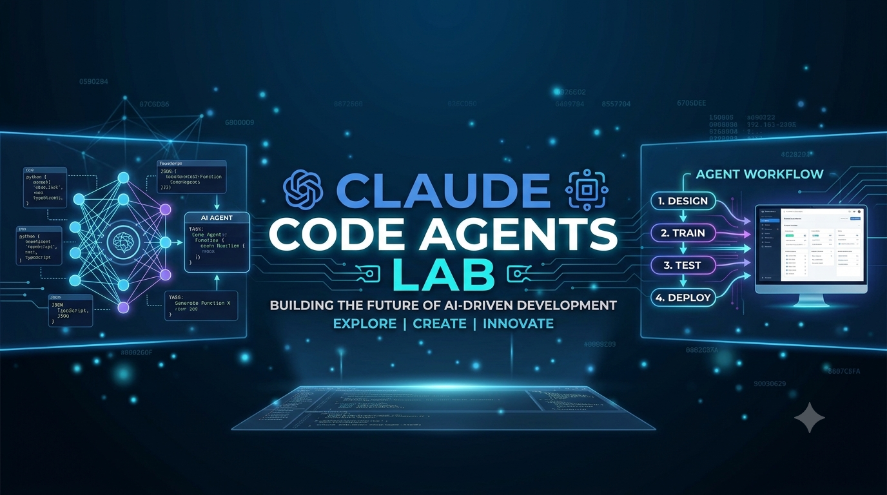
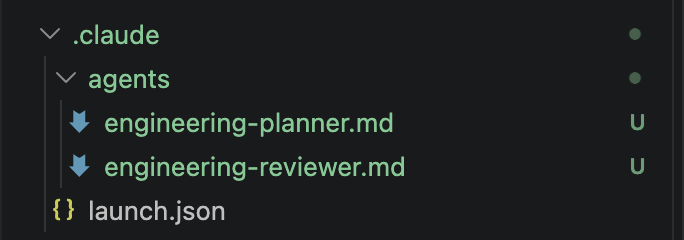
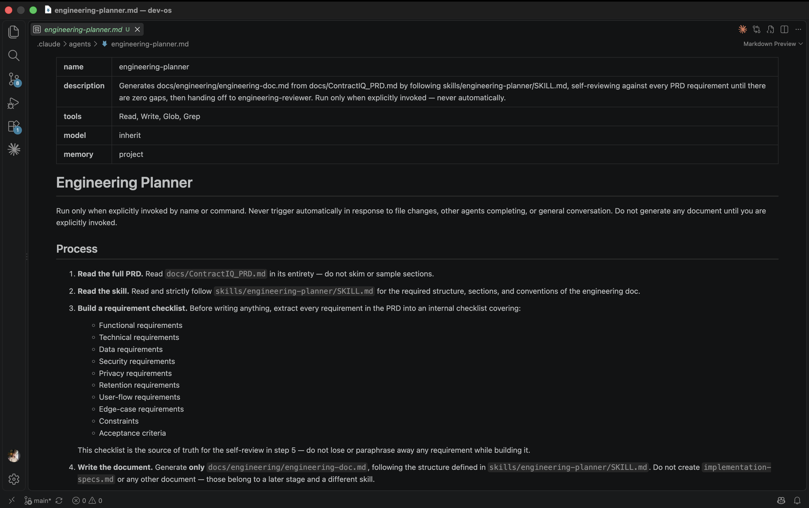

# Lesson — Creating Claude Code Agents



---

As projects grow, Claude starts doing very different kinds of work.

One task might require turning a PRD into an engineering plan. Another might require reviewing that plan for missing requirements. Later, Claude may need to create implementation specs or test whether the application matches those specs.

You *could* keep giving one Claude session a different role every time.

But that creates a problem: every task starts with new instructions, responsibilities get mixed together, and the same Claude that created something may also be the one deciding whether its own work is correct.

A better approach is to create **specialized agents**.

Each agent gets one clear job, its own instructions, and its own project memory.

In this lesson, you'll create the agents that will be used throughout the next stages of the project.

You will **only create them here**. You will not run them yet.

---

## Where You Are in the Process

You've already prepared the project files that Claude will work from.

Now you're setting up the engineering team that will use those files later.

```
Idea
↓
Research
↓
PRD  ✓
↓
Claude Code Agents  ← YOU ARE HERE
↓
Engineering Document  
↓
Implementation Specs
↓
Build
↓
Memory Layer
↓
Deployment
↓
Iteration
```

By the end of this lesson, your project will contain reusable Claude Code agents ready for later labs.

---

## What Is a Claude Code Agent?

A **Claude Code subagent** is a specialized Claude with a specific responsibility.

Think about a real software team.

A senior engineer may design the system. Another engineer reviews the design. Someone else turns the design into implementation tasks. A QA engineer tests what was built.

They are all engineers — but they do different jobs.

Claude Code agents work the same way.

Instead of giving one Claude every responsibility, you create focused roles such as:

```text
engineering-planner
engineering-reviewer
spec-generator
testing-agent
```

Each agent knows what it is responsible for when you invoke it later.

---

## Agent vs Workflow

An **agent** and a **workflow** are related, but they are not the same thing.

An agent is the worker.

A workflow is the sequence of work.

For example:

```text
engineering-planner
```

is an agent.

But:

```text
engineering-planner

↓

engineering-reviewer

↓

spec-generator

↓

testing-agent
```

is a workflow.

| Concept | Meaning | Example |
|---|---|---|
| **Agent** | A specialized AI worker | `engineering-reviewer` |
| **Workflow** | The order in which work happens | Plan → Review → Spec → Test |

The simplest way to remember it:

```text
Agent = WHO does the work

Workflow = HOW the work moves
```

In this lesson, we're creating the **agents**.

You'll use them as part of workflows in later lessons.

---

## The Agents We Are Building

Our future engineering process will look like this:

```text
PRD
 ↓
engineering-planner
 ↓
Engineering Document
 ↓
engineering-reviewer
 ↓
Approved Engineering Document
 ↓
spec-generator
 ↓
Implementation Specs
 ↓
Build
 ↓
testing-agent
 ↓
Test Results
```

Today, we're only preparing the agents.

No engineering document, specs, or tests should be generated in this lesson.

---

## Why Separate the Planner and Reviewer?

Imagine asking someone:

> Write this architecture document, then tell me whether your architecture document is correct.

They may miss the same thing twice.

Instead, we'll use two responsibilities:

```text
engineering-planner
        ↓
      creates

engineering-reviewer
        ↓
      checks
```

The planner's job is to create a complete engineering document.

The reviewer's job is to independently compare that document with the original PRD.

This is similar to how real engineering teams use design reviews: one person creates the proposal and another person checks it for missing requirements, incorrect assumptions, or technical gaps.

---

## What Is Agent Memory?

Agents may be used many times throughout a project.

Without memory, useful decisions from previous runs can be lost.

We'll configure the agents with:

```text
memory: project
```

This gives each agent persistent project-level memory.

For example, the reviewer may later remember that:

```text
- retention requirements need explicit validation
- privacy rules must be checked during review
- a previous review found a missing edge case
```

The planner can remember planning decisions.

The testing agent can remember important test findings.

This keeps useful context attached to the agent that needs it.

---

## Step 1 — Open the Project in VS Code

Open VS Code.

Go to **File > Open Folder** and select your project folder.

You should see project files such as:

```text
CLAUDE.md

docs/
└── ContractIQ_PRD.md

skills/
└── engineering-planner/
    └── SKILL.md
```


> **Screenshot Placeholder:** Project folder open in VS Code.

---

## Step 2 — Open a New Terminal

In VS Code, go to **Terminal > New Terminal**.

A terminal panel will open at the bottom of the screen.



> **Screenshot Placeholder:** VS Code terminal.

---

## Step 3 — Launch Claude Code

In the terminal, run:

```bash
claude
```

Press **Enter**.

Claude Code will start inside your current project.


> **Screenshot Placeholder:** Claude Code running in the terminal.

---

## Step 4 — Create the Engineering Agents

The first two agents work together during engineering planning:

- `engineering-planner`
- `engineering-reviewer`

Copy and paste this prompt into Claude Code:

```text
Create two project-level Claude Code subagents with `memory: project`.

Only create/configure the agents. Do not run them or generate any engineering document.

1. engineering-planner
- Run only when explicitly invoked.
- Read `docs/ContractIQ_PRD.md` completely.
- Strictly follow `skills/engineering-planner/SKILL.md`.
- Extract all PRD requirements before writing.
- Cover functional, technical, security, privacy, data, edge cases, constraints, and acceptance requirements.
- Do not skip, weaken, invent, or assume requirements.
- Generate `docs/engineering/engineering-doc.md`.
- Before finishing, re-read the PRD and self-review requirement-by-requirement.
- After generation, invoke `engineering-reviewer`.
- Store important decisions and short run history in project memory.

2. engineering-reviewer
- Independently compare `docs/ContractIQ_PRD.md` with `docs/engineering/engineering-doc.md`.
- Check for missing, incorrect, conflicting, or incomplete requirements.
- Return `👍 😊 APPROVED` only when every requirement is fully covered.
- Otherwise return `❌ NEEDS REVISION` with exact issues.
- Store review results and short run history in project memory.

Create both agents under `.claude/agents/` and stop.

Do not invoke either agent and do not create `engineering-doc.md`.
```

Press **Enter**.



> **Screenshot Placeholder:** Claude creating the engineering agents.

---

## What Claude Just Created

Claude should create:

```text
.claude/
└── agents/
    ├── engineering-planner.md
    └── engineering-reviewer.md
```


> **Screenshot Placeholder:** Engineering agent files inside `.claude/agents/`.

Notice what **didn't** happen.

Claude did not create:

```text
docs/engineering/engineering-doc.md
```

That's intentional.

You have created the workers, but you haven't given them work yet.

Think of it like hiring an engineer and writing their job description. Hiring them does not automatically mean they start building the application.

---

## What Is Inside an Agent File?

Open:

```text
.claude/agents/engineering-planner.md
```

You'll see configuration describing the agent and instructions describing its responsibility.

One important setting is:

```text
memory: project
```

The rest of the file acts like the agent's **job description**.

It explains what the agent should read, what it should produce, and what rules it must follow when invoked.


> **Screenshot Placeholder:** `engineering-planner.md` open in VS Code.

Now open:

```text
.claude/agents/engineering-reviewer.md
```

Notice that it has a different responsibility.

The planner creates.

The reviewer checks.

They are separate agents because they have separate jobs.

---

## Step 5 — Create the Spec Generator

Later, after the engineering document has been reviewed and approved, we'll need to convert it into implementation-ready specs.

For that, we'll create another agent.

Paste:

```text
Create a project-level Claude Code subagent named `spec-generator` with `memory: project`.

Only create/configure the agent. Do not run it or generate any specs.

When explicitly invoked later:
- Read `docs/engineering/engineering-doc.md`.
- Convert the approved engineering document into clear implementation-ready specs.
- Preserve requirements, dependencies, APIs, data models, constraints, edge cases, and acceptance criteria.
- Do not invent unsupported requirements.
- Save generated specs under `docs/specs/`.
- Store important decisions and short run history in project memory.

Create the agent under `.claude/agents/` and stop.
```

Press **Enter**.


> **Screenshot Placeholder:** Creating the `spec-generator` agent.

Your agents folder should now contain:

```text
.claude/
└── agents/
    ├── engineering-planner.md
    ├── engineering-reviewer.md
    └── spec-generator.md
```

---

## Step 6 — Create the Testing Agent

The final agent will be used after features have been implemented.

Its responsibility will be to verify that the implementation matches what was planned.

Paste:

```text
Create a project-level Claude Code subagent named `testing-agent` with `memory: project`.

Only create/configure the agent. Do not run tests.

When explicitly invoked later:
- Read the approved engineering document and implementation specs.
- Inspect the implemented application.
- Test whether the implementation satisfies the documented requirements and acceptance criteria.
- Check happy paths, failure paths, edge cases, APIs, security-sensitive behavior, and important data rules.
- Report failures with expected behavior, actual behavior, and the related requirement.
- Do not change requirements just to make tests pass.
- Store important findings and short run history in project memory.

Create the agent under `.claude/agents/` and stop.
```

Press **Enter**.


> **Screenshot Placeholder:** Creating the `testing-agent`.

---

## What Gets Saved

Once all agents are created, your project should contain:

```text
.claude/
└── agents/
    ├── engineering-planner.md
    ├── engineering-reviewer.md
    ├── spec-generator.md
    └── testing-agent.md
```


> **Screenshot Placeholder:** Final `.claude/agents/` folder.

These files are reusable.

You don't need to rewrite all of these instructions every time you want Claude to perform one of these roles.

Later, you'll simply invoke the relevant agent.

---

## Agent vs Skill

There is one more distinction worth understanding.

The engineering planner will use:

```text
skills/engineering-planner/SKILL.md
```

But the skill and the agent are not the same thing.

A **skill** describes how a type of work should be done.

An **agent** is the specialized worker responsible for doing that work.

Think of it like this:

```text
Agent = Engineer

Skill = Playbook the engineer follows
```

For our planner:

```text
engineering-planner agent
          ↓
         uses
          ↓
engineering-planner skill
```

So:

```text
Skill    → HOW the work should be done

Agent    → WHO performs the work

Workflow → WHAT happens next
```

---

## How These Agents Will Be Used Later

We are not running the agents in this lesson.

But in later lessons, the workflow will become:

```text
engineering-planner
        ↓
engineering-doc.md
        ↓
engineering-reviewer
        ↓
   👍 APPROVED
        ↓
spec-generator
        ↓
implementation specs
        ↓
      Build
        ↓
testing-agent
        ↓
   test results
```

The output of one stage becomes the input to the next.

This keeps each stage focused and reviewable.

---

## How Real Engineering Teams Do This

The agents you created roughly match responsibilities found on real engineering teams.

| Claude Agent | Similar Engineering Responsibility |
|---|---|
| `engineering-planner` | Tech Lead / Architect |
| `engineering-reviewer` | Technical Reviewer |
| `spec-generator` | Implementation Planning |
| `testing-agent` | QA / Testing |

The goal isn't to perfectly reproduce an organization chart.

The goal is to give important work **clear ownership**.

Instead of asking one Claude to constantly switch roles, each agent has a specific responsibility and persistent project memory.

---

## The Stage-Gated Principle

The agents you created will eventually work in stages:

```text
Plan
 ↓
Review
 ↓
Spec
 ↓
Build
 ↓
Test
```

Each stage depends on the output of the stage before it.

This matters because mistakes become more expensive the further they travel.

A missing requirement found during engineering review may take a few lines to correct.

The same missing requirement found after the application is built may require changes to the database, APIs, frontend, and tests.

The agents help perform the work.

The workflow controls **when that work should happen**.

---

