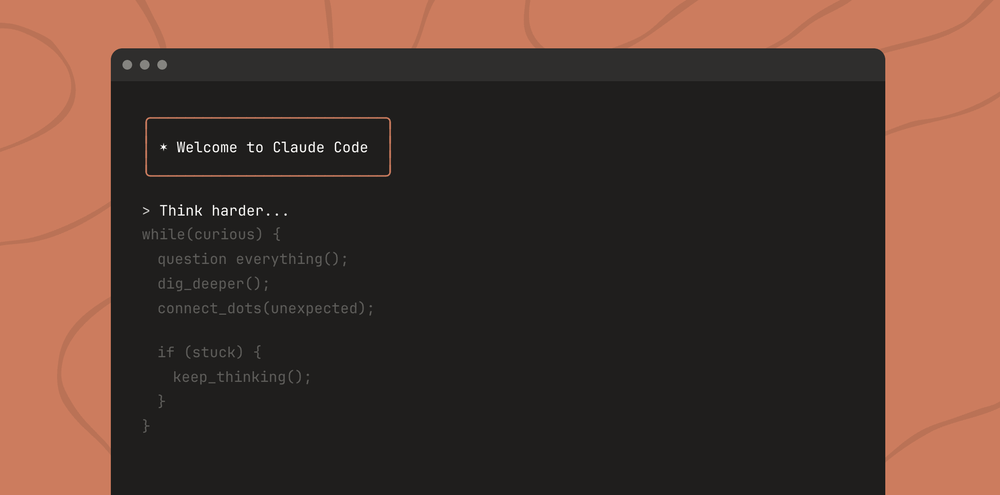
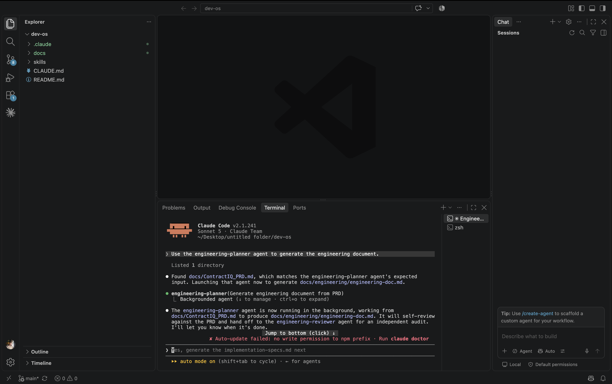
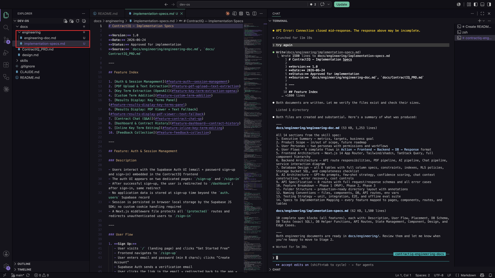

[← Back to Lab 1 Overview](../readme.md)

[← Lesson 2](../02-skills-and-design-system/readme.md) | **Lesson 3**

---

# Lesson 3 — Engineering Planning



---

You have a PRD. It describes the product in detail — the users, the features, the data, the edge cases.

Now imagine handing it to a senior engineer and saying: *"Build this."*

A good engineer doesn't open their editor and start typing. They ask questions first. What database tables do we need? What happens if a user uploads a corrupted file? Which features share the same data? What do we build first so we can ship something working — and what comes later?

They're turning a product description into an **engineering plan**.

That's exactly what this lesson does — except the senior engineer is the `engineering-planner` agent you created in the previous lesson, and the plan gets reviewed by the `engineering-reviewer` agent before it moves forward.

---

## The Problem With Jumping Straight to Code

Here's what happens when developers skip the planning step.

They paste the PRD into Claude and say *"build the frontend."* Claude builds something. Then they say *"now add authentication."* Claude adds it — but it doesn't quite match the database shape from the first prompt. Then they say *"now add the contract upload."* Claude builds it — but it assumes a file path structure that conflicts with what was set up in step one.

Each prompt produces working code in isolation. Together, they don't hold together.

The root cause is always the same: there was no shared plan. Every prompt started from scratch, making its own assumptions about how the pieces connect.

An engineering plan solves this. It answers all the structural questions once — data models, API contracts, build order, feature dependencies — so every prompt that follows is working from the same foundation.

---

## Where You Are in the Process

You've built the foundation, understood the tools, and created your Claude Code agents in the previous lesson. Now it's time to use those agents to generate the documents that Lab 2 is built from.

```
Idea
↓
Research
↓
PRD  ✓
↓
Claude Code Agents  ✓
↓
Engineering Document  ← YOU ARE HERE
↓
Implementation Specs
↓
Build
↓
Memory Layer
↓
Deployment
↓
Iteration
```

By the end of this lesson, `docs/engineering/engineering-doc.md` will exist — and the blueprint for everything in Lab 2 will be in place.

---

## Using the Agents You Created


Before running anything, remember what you created in the previous lesson: the `engineering-planner` and `engineering-reviewer` agents.

The `engineering-planner` is responsible for reading the PRD, following the engineering-planner skill, and creating the engineering document.

The `engineering-reviewer` is responsible for independently checking that document against the PRD.

When you invoke the planner, the workflow is:

```
engineering-planner
↓
engineering-doc.md
↓
engineering-reviewer
↓
👍 😊 APPROVED
```

If the reviewer finds something missing or incorrect, it returns `❌ NEEDS REVISION` with the exact gaps. The planner can then correct those gaps and send the document back for review.

This keeps the work separated: one agent creates the plan, another independently checks it.

---

## When to Use the Engineering Agents

Use these agents whenever you need to turn a PRD into an engineering document and validate it before implementation begins.

| Situation | Use the agents? |
|---|---|
| Writing a single small function | No |
| Building a new feature with multiple files | Yes |
| Translating a PRD into architecture documents | Yes |
| Reviewing architecture against requirements | Yes |
| Fixing a one-line bug | No |
| Starting a new application from a PRD | Yes |

The rule of thumb: if the work needs a structured engineering plan and an independent review before implementation, use the planner-reviewer workflow.

---

## Step 1 — Open the Project in VS Code

Open VS Code. Go to **File > Open Folder** and select the `dev-os` folder you cloned in Lesson 1.

You should see the file tree on the left with `CLAUDE.md`, `docs/`, and `skills/` visible.

---

## Step 2 — Open a New Terminal

In VS Code, go to **Terminal > New Terminal** (or press `` Ctrl+` ``).

A terminal panel will open at the bottom of the screen, already pointed at your project folder.


---

## Step 3 — Launch Claude Code

In the terminal, type:

```bash
claude
```

Claude Code will start and show its interactive prompt. You are now in a Claude Code session scoped to your project. Claude can read all files in the folder and will follow the rules defined in `CLAUDE.md`.


---

## Step 4 — Invoke the Engineering Planner Agent

Copy and paste the following prompt into the Claude Code terminal:

```
Use the engineering-planner agent to build the engineering document.
```

Press **Enter**.



> **Note:** The detailed PRD-reading, skill-following, self-review, and reviewer handoff instructions already live inside the agents you created in the previous lesson.

> **Note:** This step can take several minutes. Let Claude finish without interrupting. When the planner finishes, it will automatically hand the document to the `engineering-reviewer`.

---

# What Happens Behind the Prompt

The prompt you typed is short because the detailed instructions already live inside the agents you created in the previous lesson.

The `engineering-planner` reads:

```
docs/ContractIQ_PRD.md
skills/engineering-planner/SKILL.md
```

It uses the PRD as the source of truth and the skill as the playbook for how the engineering document should be structured.

After creating `docs/engineering/engineering-doc.md`, it hands the result to `engineering-reviewer`.

The reviewer compares the generated document with the original PRD requirement-by-requirement.

---

## What This Prompt Does

There are three parts worth understanding:

**`engineering-planner`**  
Uses the project-level planner agent created in the previous lesson. It already knows which files to read, what requirements to cover, and where to save the output.

**Self-review**  
Before handing off the document, the planner checks its own work against the PRD to catch obvious gaps.

**`engineering-reviewer`**  
Runs after the planner finishes and independently compares the engineering document against the PRD. It returns `👍 😊 APPROVED` only when all requirements are covered.

---

## What Claude Will Produce

After the `engineering-planner` processes the PRD through the engineering-planner skill, it will generate a plan covering:

- **Architecture Overview** — The system components and how they connect: Next.js frontend, Supabase database, Claude AI API, and file storage
- **Data Models** — Every database table, its columns, types, relationships, and the Row Level Security rules that control access
- **API Design** — The server-side routes the application needs, what each one accepts, and what it returns
- **Feature Breakdown** — Each PRD feature mapped to the specific components, database tables, and API routes required to build it
- **Build Sequence** — The order in which features should be built so each stage produces something working before the next one starts



---

## Reviewing and Approving the Plan

When the planner finishes, the `engineering-reviewer` automatically compares the generated document with the PRD.

If everything is covered, the reviewer returns:

```
👍 😊 APPROVED
```

If something is missing, incorrect, conflicting, or incomplete, it returns `❌ NEEDS REVISION` with the exact gaps. Send those issues back through the planner-reviewer loop until the reviewer approves the document.

This is the most important step in the entire lab. A gap caught here — a missing table, a feature with no API route, a circular dependency in the build order — takes 30 seconds to fix in a document. The same gap discovered three days into Lab 2 takes hours to untangle.

Even after the reviewer approves, read through the plan and ask yourself:

- Does the data model capture everything described in the PRD? Can every piece of information the app needs to store actually be stored?
- Can every user action be handled end to end? If a feature exists in the PRD but has no corresponding backend step in the plan, it will silently break later.
- Does the build sequence make sense — does each stage produce something you could open in a browser and actually use?
- Is anything missing that the PRD clearly requires?

---

## What Gets Saved

Once the reviewer returns `👍 😊 APPROVED`, you will find a new file under `docs/engineering/`:

```
docs/
└── engineering/
    └── engineering-doc.md
```

This document is the technical foundation for everything that follows. Every future skill — `/frontend-setup`, `/security-foundation` — reads it to understand what has already been decided.


---

## How Real Engineering Teams Do This

In a professional software company, what you just did has a name: **architecture review**.

Before any significant feature gets built, a **Tech Lead** or **Staff Engineer** writes an architecture document — sometimes called an RFC (Request for Comments) or a design doc. It covers the same things Claude just produced: the data model, the API surface, the component breakdown, the build order.

Then the team reviews it. Not the code — the plan. Other engineers look for missing edge cases, circular dependencies, data shape mismatches, security gaps. In this lab, the `engineering-reviewer` agent performs that independent review before the document moves forward.

The engineering document Claude just wrote is that document. The difference is it took 15 minutes instead of two days, and it was grounded in the PRD from the start.

---

## The Stage-Gated Principle

Every step in this lab — and the two labs that follow — follows the same pattern:

1. You invoke the appropriate agent
2. The agent produces its output
3. The reviewer validates it before the next stage
4. The approved output becomes the input for the next stage

This is intentional. Real software projects fail when decisions are made without visibility. By making the plan explicit and reviewable at each stage, you stay in control of what is being built — even when the AI is doing most of the writing.

---

## This Lab Is Complete

You now have everything Lab 2 needs:

- A local clone of `dev-os`, open in VS Code
- The Claude Code agents created in the previous lesson
- `docs/engineering/engineering-doc.md` — the reviewed architecture plan

Continue to **[Lab 2 — Building the Application](../../02-Building-the-Application-Lab/readme.md)**, where you'll scaffold the Next.js app, generate implementation specs, set up Supabase, and implement everything end to end.

---

## Claude Concepts Covered in This Lesson

| Concept | Where it appeared | Learn more |
|---------|-------------------|------------|
| **Subagent invocation** | **Step 4** — Use the `engineering-planner` created in the previous lesson instead of repeating its full instructions. | [Claude Code docs →](https://docs.anthropic.com/en/docs/claude-code) |
| **Agent delegation** | **Step 4** — The planner hands the completed engineering document to the `engineering-reviewer`. | [Claude Code docs →](https://docs.anthropic.com/en/docs/claude-code) |
| **Stage-gated principle** | **Reviewing the plan** — "A gap caught here takes 30 seconds to fix in a document. The same gap discovered three days into Lab 2 takes hours to untangle." | [Prompt engineering →](https://docs.anthropic.com/en/docs/build-with-claude/prompt-engineering/overview) |

---

[← Back to Lab 1 Overview](../readme.md)

[← Lesson 3](../03-claude-code-agents/readme.md) | **Lesson 4** | [Continue to Lab 2 →](../../02-Building-the-Application-Lab/readme.md)