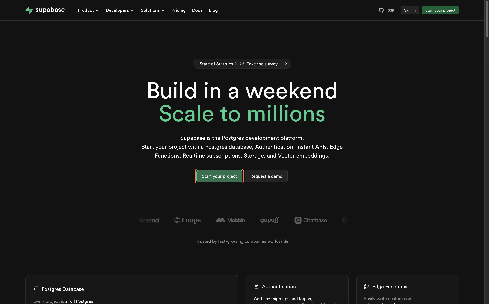
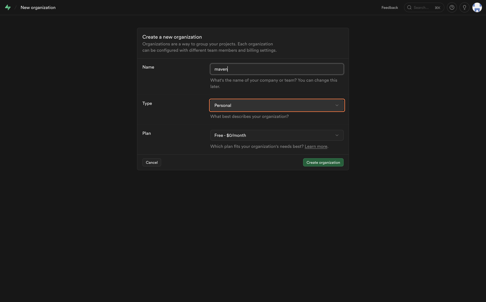
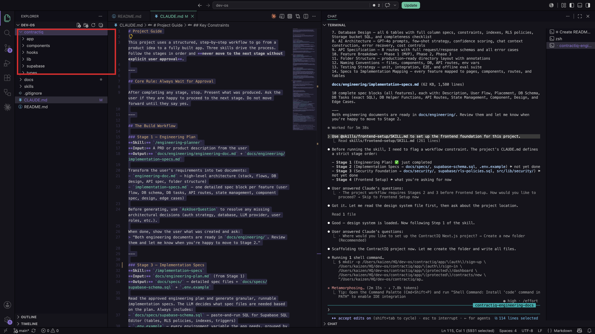
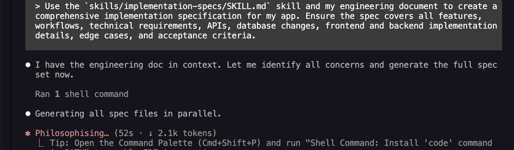
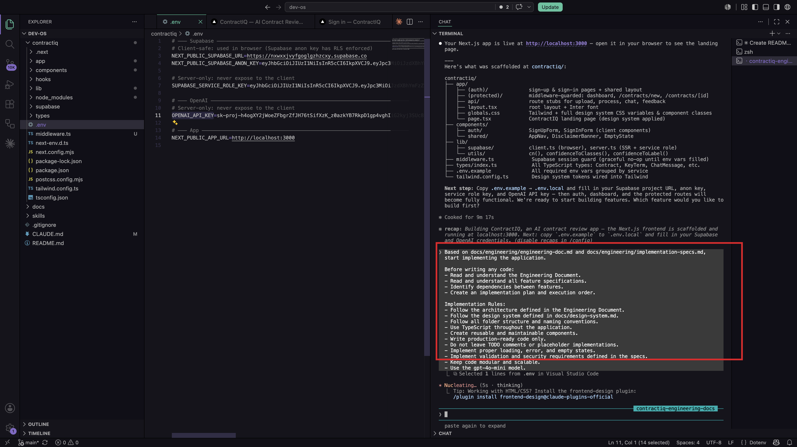
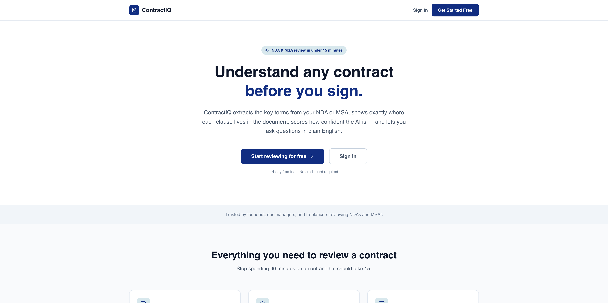
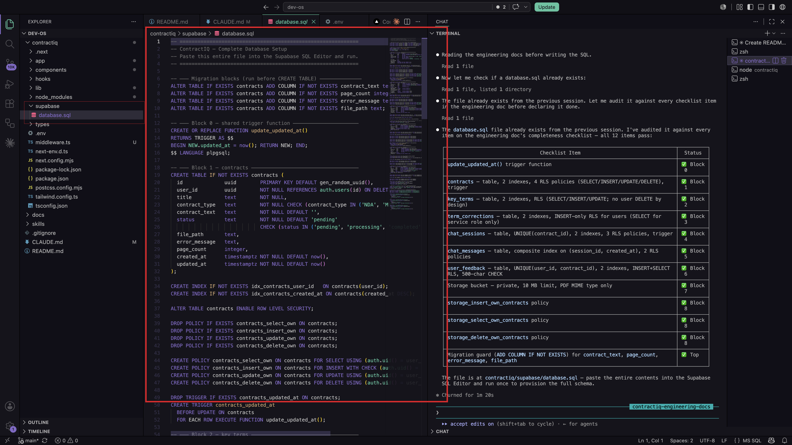
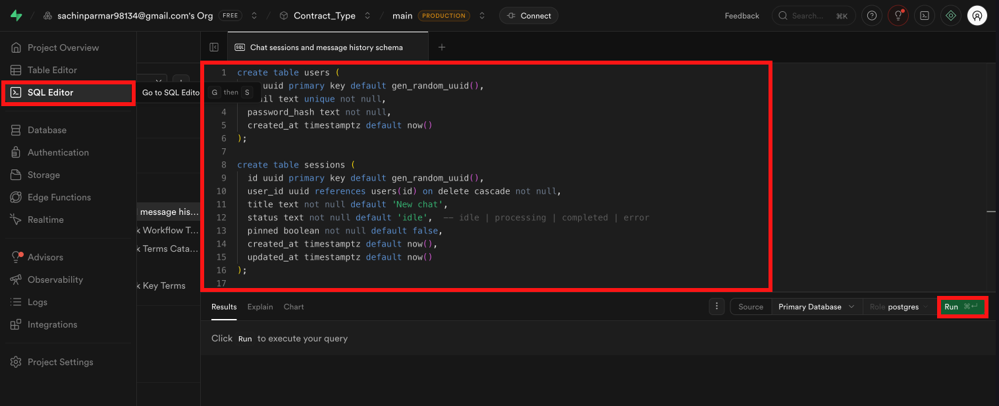

[← Back to Lab 2 Overview](../readme.md)

**Lesson 1** | [Lesson 2 →](../02-memory-layer/readme.md)

---

# Lesson 1 — Building the Application


---

## Where You Are in the Process

You finished Lab 1 with an approved engineering document in `docs/engineering/` and the Claude Code agents you created earlier, including `spec-generator`. You know what ContractIQ does, how the data connects, and what order things should be built.

Now comes the build.

Here's exactly where you are in the full engineering lifecycle:

```
Idea
↓
Research
↓
PRD  ✓
↓
Claude Code Agents  ✓
↓
Engineering Document  ✓
↓
Implementation Specs  ← (first thing we do today)
↓
Build the Application  ← YOU ARE HERE
↓
Memory Layer
↓
Deployment
↓
Iteration
```

By the end of this lesson you'll have a live database, a running Next.js application, and the core features of ContractIQ working in a browser.

---

## Before You Write a Line of Code — Set Up the Database

### Why the database comes first

Think about what ContractIQ actually does.

A user creates an account. They upload a contract. Claude analyzes it. The results appear. The user asks follow-up questions. Everything gets saved so they can come back next week and pick up where they left off.

Every one of those actions involves storing something — an account, a file, an analysis, a conversation.

If you build the UI first and add the database later, you'll spend hours rewriting components that assumed the wrong data shape. It's the software equivalent of framing the walls before you've poured the foundation.

An app that can't remember anything isn't an app. It's a demo.

The database goes first.

---

### Choosing the Right Type of Database

Databases come in two broad families, and picking the wrong one creates problems down the line.

**Relational databases (SQL)** store data in tables with rows and columns, with strict rules about how tables relate to each other. They are the right choice when records connect — a user *has many* contracts, a contract *has many* analyses. Most production apps run on relational databases.

**Non-relational databases (NoSQL)** store data as flexible documents or key-value pairs. They suit unstructured data, variable-shape records, or extreme write-speed requirements like real-time feeds.

ContractIQ has structured, relational data. The choice is clear.

---

### Why Supabase?

Now you might be wondering — why not just set up Postgres directly?

Because building an app isn't just about storing rows. It's about authentication, access control, file storage, and API integration. Setting all of that up from scratch takes weeks.

Supabase gives you all of it in one place:

- **Authentication** — built-in user sign-up, login, and session management
- **Row Level Security (RLS)** — rules written directly on the database so each user can only read or write their own rows; one user's contracts are never visible to another
- **Storage** — a place to store the actual contract PDF files alongside the metadata
- **Auto-generated APIs** — Supabase exposes your tables as REST endpoints automatically, which is what the Next.js app calls when it reads or writes data

Think of it like renting a fully staffed office. The filing cabinets (database), the security desk (authentication), and the mail room (API) all come with the building. You just move your project in.

The engineering document you generated in Lab 1 already contains the full schema for this app — every table, column, type, and access rule. Later in this lesson you'll take that schema and run it directly in Supabase to make it live.

> **Learn more:** [Supabase documentation →](https://supabase.com/docs)

---

## Step 1 — Create Your Supabase Account

Open your browser and go to [https://supabase.com/](https://supabase.com/). Click **"Start your project"**.



Sign up with **GitHub** (recommended — fastest) or with your email address.


---

## Step 2 — Create an Organization

After signing in, Supabase will prompt you to create an organization:

1. Enter a name (your name or team name works fine)
2. Select the **Free** plan
3. Click **"Create organization"**



---

## Step 3 — Create a New Project

Inside your organization, click **"New project"** and fill in the details:

1. Enter a **Project Name** — something like `contractIQ-db`
2. Set a strong **Database Password** — save this somewhere safe
3. Choose the **Region** closest to you
4. Click **"Create new project"**

Supabase will take 1–2 minutes to provision your database. Wait for it to finish before moving on.


---

## Step 4 — Copy Your Credentials

You need three values from Supabase. Here is where to find each one.

**Project URL**

Go to your project overview — the URL is shown at the top. It looks like `https://xyzxyzxyz.supabase.co`.


**Anon Key (public)**

1. Click **Project Settings** in the left sidebar
2. Click **API**
3. Scroll to **Project API keys** and copy the value next to **`anon` `public`**

**Service Role Key (secret)**

On the same **API** settings page, find **Legacy API keys** and copy the value next to **`service_role`**.


---

Here's where it gets interesting — these two keys are very different things.

The **anon key** is safe to use in your frontend code. It identifies your project but only gives users access to data they're allowed to see. Think of it as a lobby pass.

The **service role key** bypasses all access rules. It has full unrestricted access to your entire database. That makes it powerful for server-side operations — and dangerous if it leaks. It must never appear in your frontend code and must never be committed to GitHub.

Set both aside. You'll add them to your `.env` file in a few minutes.

> **Learn more:** [Supabase API keys →](https://supabase.com/docs/guides/api/api-keys)

---

## Now Let's Build

You have a live database waiting. Now it's time to wire up the application.

Open your project folder in which you are working in  **VS Code**, open the integrated terminal (**Terminal > New Terminal**, or `` Ctrl+` ``), and start Claude Code:

```bash
claude
```

Paste each prompt below into the same terminal session, one at a time. Let Claude finish completely before moving to the next one.

---

## Prompt 1 — Scaffold the Folder Structure

Before Claude writes a single line of business logic, the project needs a structure it can build into.

Think of this as putting up the skeleton of the building — every floor, every room, every doorway — before any of the furniture or wiring goes in. If you skip this and let Claude invent the structure as it goes, you'll end up with inconsistent file locations, naming conflicts, and components that don't know where to import from.

The frontend-setup skill defines exactly how this project should be organized. Claude reads it and builds the structure precisely.

```
Use @skills/frontend-setup/SKILL.md to set up the frontend foundation for this project.
```

> **Note:** Claude may ask whether to create a new subfolder or work in the current directory. Choose **New subfolder** — a new folder will be created (for example: `contractiq`).



---

When this prompt finishes, your project will have a complete Next.js 14 folder structure — every page, component folder, and API route — with your design system already baked into Tailwind:

```
contractiq/
├── app/
│   ├── (auth)/
│   │   ├── login/
│   │   └── signup/
│   ├── (dashboard)/
│   │   └── dashboard/
│   └── layout.tsx
├── components/
│   ├── ui/
│   └── shared/
├── lib/
│   ├── supabase/
│   └── utils/
├── types/
├── styles/
├── public/
├── .env.local.example
├── next.config.ts
├── tailwind.config.ts
└── package.json
```

Review the file tree once the skill finishes. If anything looks off, describe the issue to Claude and it will correct it before you move on.

---

### Add Your Credentials to `.env`

You'll now see a `.env.local.example` file in your project. Rename it to `.env.local`, then paste in the credentials you copied from Supabase:

```
NEXT_PUBLIC_SUPABASE_URL=https://xyzxyzxyz.supabase.co
NEXT_PUBLIC_SUPABASE_ANON_KEY=your-anon-key-here
SUPABASE_SERVICE_ROLE_KEY=your-service-role-key-here
OPEN_API_KEY=sk-ant-...
```

Replace each placeholder with the real values.

Notice the naming pattern: `NEXT_PUBLIC_` variables are safe to expose to the browser — React components can read them. Anything without that prefix stays server-side only and never reaches the client. The service role key has no `NEXT_PUBLIC_` prefix for exactly this reason.


---

## Prompt 2 — Generate the Implementation Specs

Here's where most people skip a step — and pay for it later.

You have an engineering document that says *what* to build. But Claude doesn't build from high-level architecture descriptions. It builds from precise instructions: exactly which file to create, exactly what that file exports, exactly what API route it calls, exactly what database columns it reads.

That gap — between "what to build" and "how to build it file by file" — is what implementation specs fill.

### What Are Implementation Specs?

Each spec covers one feature end to end:

- The exact files to create or modify
- The functions and components to write
- The API routes to wire up
- The database changes required
- The edge cases to handle
- The acceptance criteria that confirm it's working

These are the documents Claude reads when it actually writes code. Without them, Claude makes assumptions. Those assumptions create mismatches. Those mismatches surface as bugs three features later that are very hard to trace back.

### Run the Specs Prompt

```
Use the `spec-generator` agent to create the implementation specs from the approved engineering document.
```



> **Note:** The `spec-generator` agent was created in the previous lab. Its agent instructions already define how to read the approved engineering document, preserve requirements, and save implementation-ready specs, so you do not need to repeat those instructions here.

### What Gets Created

Once Claude finishes, you'll find a `specs/` folder in your project:

```
specs/
    ├── 01-auth.md
    ├── 02-contract-upload.md
    ├── 03-ai-analysis.md
    ├── 04-dashboard.md
    └── ...
```

Each file is the complete build instruction for one feature. Every prompt that follows reads from these files.

---

## Prompt 3 — Implement the Application

Now you have everything Claude needs to build correctly:

- A structured folder to build into
- An engineering document describing the architecture
- Spec files describing every feature file by file

This is the moment the plan becomes code.

```
Based on the engineering doc and all of my specs files, start implementing the application.

Before writing any code:
- Read and understand the Engineering Document.
- Read and understand all feature specifications.
- Identify dependencies between features.
- Create an implementation plan and execution order.

Implementation Rules:
- Follow the architecture defined in the Engineering Document.
- Follow the design system defined in docs/design-system.md.
- Follow all folder structure and naming conventions.
- Use TypeScript throughout the application.
- Create reusable and maintainable components.
- Write production-ready code only.
- Do not leave TODO comments or placeholder implementations.
- Implement proper loading, error, and empty states.
- Implement validation and security requirements defined in the specs.
- Keep code modular and scalable.
```



---

You might be wondering — why does this prompt tell Claude to read the documents before writing any code?

Because the order matters.

If Claude starts writing a component that references the database before it understands the full data model, it makes assumptions. Those assumptions create mismatches that surface three files later as errors that are very hard to trace back.

Reading the engineering documents and specs first gives Claude the complete picture — every feature, every dependency, every file that needs to exist before another one can reference it. It builds in the correct order. Nothing references something that doesn't exist yet.

This prompt takes the most time. Claude may ask clarifying questions before it begins — answer them fully. Do not interrupt mid-implementation unless something is clearly wrong.

Once Claude finishes, open a new terminal in VS Code and run the development server:

> **Note:** Replace `contractiq` with the actual folder name Claude created in Prompt 1.

```bash
cd contractiq
npm run dev
```

Click the local URL that appears in the terminal, or open `http://localhost:3000` in your browser.



---

## Prompt 4 — Generate the Database Schema

The application code now exists — but the database is still empty. No tables. No structure. Nowhere to store anything.

This is the same problem we talked about at the start of this lesson, and now we solve it properly.

Claude reads the data models from your engineering documents and produces a single SQL file — every table, every column, every relationship, and every Row Level Security policy. One file that you run once in Supabase and the entire database structure comes to life.

```
Create a database.sql file that contains all SQL statements required to set up the database for the application. Based on the Engineering Document and Implementation Specifications, generate a complete production-ready database schema.
```



---

Here's something worth pausing on.

This SQL file doesn't just create tables. It also writes the access rules — Row Level Security policies that determine who can read or write each row.

Row Level Security means each user can only access rows in the database that belong to them — even if they're in the same table as other users' data. Think of it like giving everyone in a shared office their own locked drawer. They can open their own. Everyone else's stays shut.

Claude generates these access rules automatically from the data model, so they're in place from the moment the database goes live. You don't have to add them later. You don't have to remember them. They're part of the schema.

---

## Step 5 — Load the Schema into Supabase

1. Open your Supabase project dashboard
2. Click **SQL Editor** in the left sidebar



3. Open `database.sql` in VS Code, select all (`Cmd+A` / `Ctrl+A`), and copy
4. Paste the SQL into the Supabase SQL Editor
5. Click **Run** (or press `Cmd+Enter`)

Supabase will execute every statement. When it finishes without errors, your database tables are live and ready.

If you see an error, read the message — it usually names the exact line that failed. Common causes are a table being referenced before it's created (a foreign key ordering issue) or a typo in a policy name. Paste the error back into the Claude Code terminal and it will fix the specific line.

---

## Step 6 — Test the Application

Open a terminal in VS Code, make sure you're inside the project folder, and start the server:

```bash
npm run dev
```

Open `http://localhost:3000` and walk through these checks one by one:

| Check | What to Look For |
|---|---|
| Home page loads | No blank screen, no console errors |
| Sign up works | Create a test account; confirm the user appears in Supabase **Authentication > Users** |
| Log in works | Sign in with the test account |
| Dashboard loads | Authenticated route renders correctly |
| Core feature works | Upload a file or trigger the main feature of the app |
| Database writes | Check the relevant table in Supabase **Table Editor** to confirm data was saved |

If anything fails, open the browser dev console (`F12`) and read the error. Most issues at this stage come from a missing environment variable or a table name mismatch between the SQL schema and the application code. Paste the error into the Claude Code terminal with the relevant file path and it will fix it.


---

## How Real Engineering Teams Do This

In a professional product team, this sequence — scaffold, spec, implement, wire up data — is not a shortcut.

It's the standard.

A **Tech Lead** sets up the project structure and enforces conventions so every engineer writes in the same way. A **Backend Engineer** defines the database schema and API contracts before the frontend touches them. A **Frontend Engineer** builds against those contracts, not against assumptions. A **QA Engineer** validates against the acceptance criteria — the same ones your specs define.

What you just did in four prompts mirrors how a well-run engineering team operates across weeks. The AI compresses the time. The thinking is the same.

---

## What You Accomplished

You started this lesson with a plan. You're ending it with:

- A live Supabase database with every table, relationship, and access rule in place
- A complete Next.js 14 application scaffold with your design system baked in
- File-by-file implementation specs for every feature, generated by the `spec-generator` agent
- A running application you can open in a browser and use

The build is no longer a document. It's a product.

---

## Claude Concepts Covered in This Lesson

| Concept | Where it appeared | Learn more |
|---------|-------------------|------------|
| **`@` skill references** | **Prompt 1** — pointing Claude at a skill file tells it exactly how to structure its output, rather than improvising from general knowledge | [Claude Code docs →](https://docs.anthropic.com/en/docs/claude-code) |
| **Subagent invocation** | **Prompt 2** — the existing `spec-generator` agent turns the approved engineering document into implementation-ready specs without repeating its full instructions | [Claude Code docs →](https://docs.anthropic.com/en/docs/claude-code) |
| **Implementation specs as build context** | **Prompt 2** — specs translate high-level architecture into precise file-by-file instructions Claude can follow without guessing | [Prompt engineering →](https://docs.anthropic.com/en/docs/build-with-claude/prompt-engineering/overview) |
| **Engineering documents as build context** | **Prompt 3** — reading the full engineering document first gives Claude the complete dependency map before it writes a single file | [Prompt engineering →](https://docs.anthropic.com/en/docs/build-with-claude/prompt-engineering/overview) |
| **Row Level Security** | **Prompt 4** — Claude writes RLS policies from the data model automatically, so access rules are live from the first SQL run | [Supabase RLS →](https://supabase.com/docs/guides/database/postgres/row-level-security) |
| **Environment variable safety** | **Add credentials** — `NEXT_PUBLIC_` variables reach the browser; everything else stays server-side only | [Next.js env vars →](https://nextjs.org/docs/app/building-your-application/configuring/environment-variables) |

---

## What's Next

You have a running application.

But there's something missing.

Right now, every conversation a user has with ContractIQ disappears the moment they close the tab. There's no memory of what was discussed, no context carried across sessions, no way for the app to feel like it knows who they are.

Imagine using an assistant that forgets everything the moment you walk out of the room. It gives you the right answer every time you ask. But you have to ask the same questions again and again.

That's ContractIQ right now.

In the next lesson, we fix that.

---

[← Back to Lab 2 Overview](../readme.md)

**Lesson 1** | [Lesson 2 →](../02-memory-layer/readme.md)