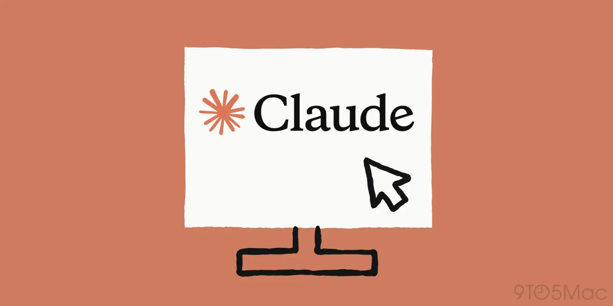
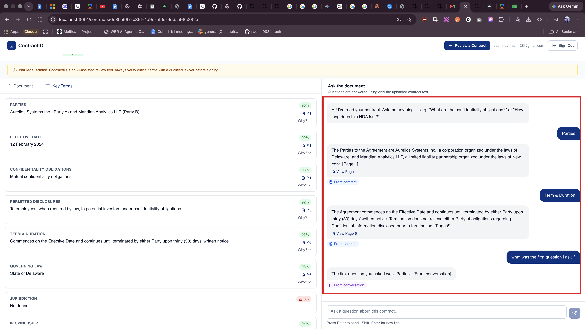

[← Back to Lab 2 Overview](../readme.md)

[← Lesson 1](../01-building-the-application/readme.md) | **Lesson 2**

---

# Lesson 2 — Memory Layer



---

Go to your running app.

Open the chat. Upload a contract. Ask the assistant something specific:

```
What is the termination clause?
```

It answers. The response is grounded in the document. Looks right.

Now ask a follow-up:

```
Can you summarize what you just told me?
```

The assistant has no idea what it just told you.

It gives you a generic response, or apologizes, or hallucinates something entirely. Because as far as the AI is concerned, this is the first message it has ever received. It has no memory of the question before it. No memory of the contract. No memory of you.

Every message is a brand new conversation starting from zero.

---

## Why This Happens

Here's something most people don't realize when they start building AI applications.

Claude is stateless.

There is no running session. There is no background thread tracking your conversation. When you call the Claude API, you send a list of messages and get a response back. The API closes. Everything in between disappears.

This is actually a feature — it makes the API simple, scalable, and predictable. But it creates a problem that every AI product has to solve: **how do you make a stateless API feel like a continuous, intelligent conversation?**

The answer is memory — and there are four completely different types.

---

## The Four Types of Memory in AI Applications

Not all memory is the same. Understanding the difference before you build matters, because using the wrong type creates either a broken experience or an unnecessarily expensive one.

Think about it the same way you think about human memory.

**Short-term memory** is what you hold in your head right now — the last few things said in a conversation. It's fast to access, but it disappears when the session ends. You don't write it down. It just lives in the moment.

**Long-term memory** is what you've stored somewhere you can come back to — a notebook, a database, a file. It survives when you close the laptop and come back tomorrow. It takes a little more work to retrieve, but it's permanent.

AI applications have the same split:

```
SHORT-TERM                              LONG-TERM
────────────────────────────────────    ────────────────────────────────────────────
In-Context Memory                       External / Persistent Memory
Lives in the messages[] array           Lives in a database (Supabase)
Gone when the session ends              Survives page refreshes and return visits
Fast — already in the API call          Requires a fetch before each call

                                        Retrieved Memory (RAG)
                                        Lives in a vector store
                                        Searches across everything ever stored
                                        Used when history is too large for context

```

What you have right now is none of them.

The app calls the API with only the current message. No history. No context. Every turn is isolated.

---

## What We Are Building

This lesson gives ContractIQ two of the four memory types working together:

**In-Context Memory** — Before every API call, the system loads the full conversation history and passes it alongside the new question. This is what makes follow-up questions work. The model can see what was said before and respond to it.

**External / Persistent Memory** — Every message is saved to Supabase immediately. When a user refreshes the page or comes back the next day, their conversation is right where they left it.

Here's how those two types combine on every turn:

```
User sends a message
        │
        ▼
Fetch all previous messages for this session from Supabase
        │
        ▼
Classify the question — does it refer to:
  → Contract content only
  → Conversation history only
  → Both
        │
        ▼
Build the context window:
  [system prompt] + [contract text if needed] + [message history] + [new question]
        │
        ▼
Send to Claude API
        │
        ▼
Save the new user message + assistant response back to Supabase
        │
        ▼
Return the response with source attribution
```

The classification step is what keeps this efficient. A question like *"what did you say earlier?"* doesn't need the full contract text. A question about a specific clause doesn't need twenty turns of chat history. The classifier decides what context is actually relevant, so the API call stays lean.

---

## Before vs After

**Before this lesson:**

```
Turn 1: "What is the termination clause?"   →  API (contract text only)
Turn 2: "Summarize what you just said"      →  API (nothing — starts fresh)
                                                ↑ BROKEN
```

**After this lesson:**

```
Turn 1: "What is the termination clause?"   →  API (contract text)
                                            ←  Answer saved to Supabase
Turn 2: "Summarize what you just said"      →  API (contract text + Turn 1 + Turn 2)
                                            ←  Works — AI remembers Turn 1
```

The difference is a single loop: load before every call, save after every response.

---

## Where You Are in the Process

```
Idea
↓
Research
↓
PRD  ✓
↓
Claude Code Agents  ✓
↓
Engineering Document  ✓
↓
Implementation Specs  ✓
↓
Build the Application  ✓
↓
Memory Layer  ← YOU ARE HERE
↓
Deployment
↓
Iteration
```

---

## Step 1 — Open Claude Code

Open your project folder in **VS Code**, open the integrated terminal (**Terminal > New Terminal**, or `` Ctrl+` ``), and start Claude Code:

```bash
claude
```

---

## Prompt — Implement the Memory Layer

This is a single focused prompt. It does not rebuild the application — it makes three surgical changes to the existing chat flow.

```
Implement a Conversation Memory Layer for the ContractIQ chat system.

CONTEXT
The chat assistant has access to an uploaded contract and a persisted conversation
history. The problem: the assistant ignores conversation history when answering
because it always uses an "answer only from the contract" system prompt, regardless
of what the user is actually asking.

WHAT IT MUST DO

Before generating a response, the system must:

1. CLASSIFY the user's question into one of three context types:
   - CONTRACT  — question is about the document content
   - HISTORY   — question is about the conversation itself
   - BOTH      — question references both the conversation and the document

2. RETRIEVE the right context based on classification:
   - CONTRACT  → send contract text + last 10 conversation turns
   - HISTORY   → send only conversation history (no contract text), up to 20 turns
   - BOTH      → send contract text + last 10 conversation turns

3. RESPOND with a system prompt matched to the source:
   - CONTRACT  → "Answer only from the contract. Cite [Page X]."
   - HISTORY   → "Answer only from the conversation. End with [From conversation]."
   - BOTH      → "Answer from both. Attribute each fact to its source."

4. ATTRIBUTE the source in the UI so the user knows where the answer came from.

CRITICAL IMPLEMENTATION REQUIREMENT
The full conversation history must be loaded from the database BEFORE the new
user message is saved. If history is loaded after saving, the classifier will
always see the new message as part of history and misclassify the context.
```

Press **Enter** and let Claude finish completely before moving on.

---

## What This Prompt Changes

The prompt makes three targeted changes to the existing chat implementation — the rest of the application is untouched.

**1. Load history before every response**

Before calling the Claude API, the chat route fetches all previous messages for the current session from the `chat_messages` table in Supabase. These are passed to the API as the `messages[]` array so the model sees the full conversation.

**2. Add a query classifier**

A lightweight classification step runs on the user's question before the API call. It categorises the question into one of three buckets:

| Classification | Context included |
|---|---|
| `contract` | System prompt + contract text only |
| `history` | System prompt + message history only |
| `both` | System prompt + contract text + message history |

This is the intelligence that keeps the context window lean. The model only sees what it actually needs.

**3. Save messages and add source attribution**

Every user message and every assistant response is saved to `chat_messages` immediately after each turn. Responses include a `[Page X]` citation so the user can trace the answer back to the exact page of the contract.

---

Files typically modified:

```
app/
└── api/
    └── chat/
        └── route.ts          ← main changes here

lib/
└── memory/
    └── index.ts              ← new: loads history, classifies query, saves messages
```

Review Claude's proposed changes before approving. Confirm that:

- The existing upload and extraction flows are unchanged
- The `chat_messages` table write happens after every turn, not just on success
- The classifier falls back to `both` when the query type is ambiguous

---

## Step 2 — Test the Memory

Start the development server if it is not already running:

```bash
npm run dev
```

Open the app and go to the chat interface for any previously uploaded contract. Run through this sequence:

| Turn | Message | What to verify |
|---|---|---|
| 1 | Ask about a specific clause — e.g. *"What is the governing law?"* | Answer is grounded in the contract and includes a page citation |
| 2 | Ask a follow-up — *"What does that mean in practice?"* | AI references its own previous answer — in-context memory is working |
| 3 | Refresh the page and reopen the same contract | Chat history reloads from Supabase — persistent memory is working |
| 4 | Ask *"What have I asked you so far?"* | AI summarises the conversation — history retrieval is working |

If Turn 3 fails and the history does not reload, check that the `chat_messages` write in Supabase is completing without error. Open the browser dev console (`F12`) and look for a failed network request.



---

## How Real Product Teams Think About Memory

Here's something worth knowing as you build AI products.

Most developers add memory as an afterthought. The app works, users start complaining that the AI "forgets everything," and the team scrambles to bolt on a solution. The result is usually fragile — messages saved inconsistently, history loaded at the wrong point in the flow, context windows that grow unbounded until the app becomes slow and expensive.

The teams that build AI products well treat memory as a first-class design decision, not a feature to add later.

Before writing any code, they ask:

- **What does the user expect the app to remember?** (Within a session? Across sessions? Across different contracts?)
- **What does the model actually need in context?** (Everything? Only relevant chunks? A summary?)
- **What is the cost of getting it wrong?** (In a legal tool, a misread context could produce a confidently wrong answer about a contract clause — that has real consequences.)

The memory architecture you just built — classify, retrieve the right context, save everything, attribute the source — is the same pattern production AI products use. You didn't invent an ad hoc solution. You built the thing properly from the start.

---

## What You Built

Your application now has:

- **In-context memory** — the full conversation history is passed to the model on every turn, enabling follow-up questions and multi-turn reasoning
- **Persistent memory** — every message is saved to Supabase so history survives page refreshes and return visits
- **Query classification** — the system includes only the context the question actually needs, keeping API calls efficient and costs low
- **Source attribution** — every response cites the page it drew from, so users can verify answers against the original contract

---

## Troubleshooting — Let Claude Fix It

If something breaks, you do not need to debug it manually. Describe the symptom clearly and Claude will diagnose and fix it.

Open a terminal, start a Claude Code session in your project root (`claude`), and paste whichever prompt matches your situation.

---

**Chat history does not reload after a page refresh**

```
The chat history is not reloading when I refresh the page. Messages are being saved
to Supabase (I can see them in the dashboard) but the chat interface starts blank
every time. Fix whatever is preventing the persisted messages from being fetched
and displayed on load.
```

---

**Follow-up questions are ignored — the assistant acts like each message is the first**

```
The assistant has no memory of previous turns within the same session. Every message
is answered as if the conversation just started. The memory layer should be loading
history from Supabase before each API call. Find out why it is not, and fix it.
```

---

**Query classifier is always returning the same type**

```
The query classifier is not working correctly — it categorises every question as the
same type regardless of what I ask. A question like "what did you say earlier?"
should be classified as "history", not "contract". Review the classifier logic and
fix the misclassification.
```

---

**Messages are being saved twice or the chat history is duplicated**

```
I am seeing duplicate messages in the chat UI and in the Supabase chat_messages table.
Each turn is being saved more than once. Find where the save is being called multiple
times and fix it so each message is written exactly once per turn.
```

---

**Source attribution is missing from responses**

```
Responses from the assistant are no longer showing source attribution like [Page X]
or [From conversation]. The system prompt instructs the model to include these but
they are missing. Find out why and restore the attribution so users can trace answers
back to the source.
```

---

**Something else is broken**

```
[Paste the error message or describe what is broken]

I am building a ContractIQ app with a memory layer in Next.js using Supabase. The
issue is happening in the chat flow — specifically around loading history, classifying
queries, or saving messages. Please diagnose the root cause and fix it.
```

---

### Tips for Getting the Best Results

- **Include the error message** — paste the full stack trace or console error, not just "it broke"
- **Say where it breaks** — "when I refresh the page", "after the second message", "when I ask about the conversation" gives Claude a precise reproduction path
- **One problem at a time** — fix the most fundamental issue first (usually the database write or the history fetch)
- **Re-test with the four-turn sequence** — after any fix, run through the test in Step 2 to confirm nothing else regressed

---

## What You Accomplished

You started Lab 2 with a plan on paper.

You now have a running application — real users, live data, a working AI chat assistant that remembers what it said, and a database that preserves every conversation.

That's a production-ready foundation.

But it's only running on your machine. No one else can use it yet. And before it goes live, there's a class of problems it needs to survive that your local environment hides completely: invalid input, authentication gaps, security vulnerabilities that are invisible in development but exploitable in production.

In Lab 3, you address all of that — and ship the app live.

---

## Claude Concepts Covered in This Lesson

| Concept | Where it appeared | Learn more |
|---------|-------------------|------------|
| **Claude API is stateless** | **Why This Happens** — "There is no running session. When you call the Claude API, you send a list of messages and get a response back. The API closes. Everything in between disappears." | [Messages API →](https://docs.anthropic.com/en/api/messages) |
| **In-context memory (messages[] array)** | **The Four Types of Memory** — "In-Context Memory lives in the messages[] array — fast to access, but gone when the session ends." | [Context windows →](https://docs.anthropic.com/en/docs/build-with-claude/context-windows) |
| **External / persistent memory** | **The Four Types of Memory** — "External / Persistent Memory lives in a database — survives page refreshes and return visits, requires a fetch before each call." | [Context windows →](https://docs.anthropic.com/en/docs/build-with-claude/context-windows) |
| **Query classification for context efficiency** | **What We Are Building** — "The classification step is what keeps this efficient. The classifier decides what context is actually relevant, so the API call stays lean." | [Prompt engineering →](https://docs.anthropic.com/en/docs/build-with-claude/prompt-engineering/overview) |

---

[← Back to Lab 2 Overview](../readme.md)

[← Lesson 1](../01-building-the-application/readme.md) | **Lesson 2** | [Continue to Lab 3 →](../../03-Security-and-Deployment-Lab/readme.md)