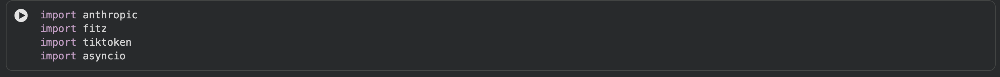
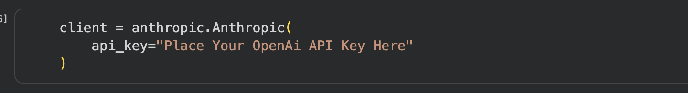
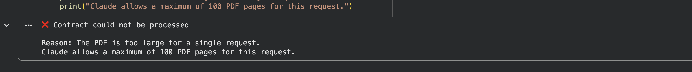
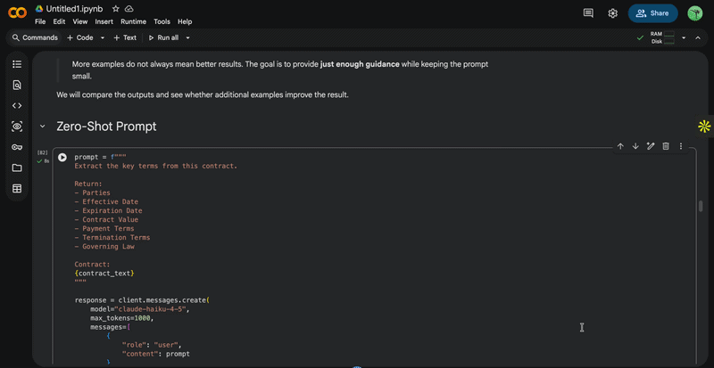

# Open the Jupyter Notebook in Google Colab

You can open this Jupyter notebook directly in Google Colab by clicking the link below:

[](https://colab.research.google.com/github/initmahesh/MLAI-community-labs/blob/main/Cohort-Labs/cohort-10/week-2/03-google-collab/notebook.ipynb)

# Welcome to Lab

#### In this Lab we will use the Claude API (via the `anthropic` Python package) to analyse real contracts, and along the way learn the core concepts every LLM application relies on: tokens, context windows, sampling, model selection, reasoning effort, prompting styles, and the different ways to call the API (sync, streaming, async, batching).

### Pre-requisites

1. **Anthropic API key** — you'll need one to call Claude from the notebook. Make sure you never commit a real key to git; paste it directly into the Colab runtime instead.
2. **Google Colab setup.** If you haven't used Colab before, follow this guide: [Click Here](https://medium.com/@aditya_dev30/getting-started-with-google-colab-your-ultimate-setup-guide-for-generative-ai-projects-53fe25f3fc04)
3. Two sample contracts are used in this lab:
   - **AWS1.pdf** (short, ~12 pages) — [Download Link](https://drive.google.com/file/d/1XSe2pSsGN1ssAbif92rvb80AnHb_Ni0F/view?usp=sharing)
   - **PROFRAC HOLDINGS, LLC Credit Agreement.pdf** (long, ~216 pages) — [Download Link](https://drive.google.com/file/d/1UyOxeaEQsK5TFxXHI63PshoKmj0yjTmW/view?usp=sharing)

Download both PDFs before you start — you'll be asked to upload them at specific points in the notebook.

## Set up

Click on the badge above to open the notebook in Colab, or open `notebook.ipynb` directly if you're running it locally / in Jupyter.

---

## Step 1: Install the required packages

Run the first cell to install everything the notebook needs:

- **anthropic** — the SDK used to call Claude models
- **PyMuPDF** — used to extract text from PDF contracts
- **tiktoken** — used to count tokens in a piece of text
- **tqdm** — progress bars

```python
!pip install -q -U anthropic
!pip install -q -U PyMuPDF tqdm tiktoken
```

## Step 2: Import the required modules

Run the next cell to import `anthropic`, `fitz` (PyMuPDF), `tiktoken`, and `asyncio`.



## Step 3: Add your Anthropic API key

Create the Anthropic client with your own API key:

```python
client = anthropic.Anthropic(api_key="<YOUR_ANTHROPIC_API_KEY>")
```



> ⚠️ Never hardcode a real key into a notebook you plan to commit — use a placeholder like above and paste your real key only in your local/Colab runtime.

## Step 4: Upload and read the short contract (AWS1.pdf)

Run the upload cell and select `AWS1.pdf` when prompted. Then run the `extract_text()` helper, which opens the PDF with PyMuPDF and returns the text of each page. Finally, combine all pages into a single string (`contract_text`) so it can be passed to Claude.

## Step 5: Understand Tokens

A **token** is the small unit of text an LLM actually processes — not quite a word, not quite a character.

In this step you'll use OpenAI's `cl100k_base` tokenizer (via `tiktoken`) to encode the first page of the contract and compare the number of **characters** vs. the number of **tokens** produced.


## Step 6: Upload the long contract and explore the Context Window

Upload the second document, **PROFRAC HOLDINGS, LLC credit agreement.pdf**, and extract its text the same way.

A **context window** is the maximum amount of tokenized information a model can handle in a single request — think of it as the model's working memory. You'll send both PDFs to Claude as base64-encoded documents:

- The **12-page** contract → processed successfully.
- The **216-page** contract → rejected, because Claude allows a maximum of 100 PDF pages per request.

This demonstrates a key limitation every LLM application has to plan around: documents can be too large to fit in a single request.



## Step 7: Sampling and Temperature

When generating a response, the model predicts the next token from a probability distribution and **samples** from it. The `temperature` parameter controls how much randomness is used:

- **Low temperature (0)** → more predictable, consistent answers.
- **High temperature (1)** → more varied, less predictable answers.

Run the same termination-notice question 3 times at `temperature=0`, then 3 times at `temperature=1`, and compare the outputs.


## Step 8: Non-Determinism and How to Test LLM Outputs

Looking at the responses from Step 7, you'll notice that even with the same input, wording can vary between runs — this is **non-determinism**.

Because of this, LLM applications shouldn't rely on exact-match testing. Instead, evaluate responses on:

- **Correctness** — did it identify the right term?
- **Relevance** — did it answer the question?
- **Completeness** — did it include the important information?
- **Grounding** — is the answer supported by the contract?

## Step 9: Choosing a Model and Reasoning Effort

Not every task needs the same level of intelligence. Compare models on capability, latency, and cost:

| Model      | Capability | Latency   | Cost      |
| ---------- | ---------- | --------- | --------- |
| **Haiku**  | Medium     | 🟢 Low    | 🟢 Low    |
| **Sonnet** | High       | 🟡 Medium | 🟡 Medium |
| **Opus**   | Very High  | 🔴 Higher | 🔴 Higher |

Then try **adaptive thinking**, where Claude decides how much extra reasoning a task needs, using:

```python
thinking={"type": "adaptive"}
output_config={"effort": "high"}
```

Run the contract-risk-analysis prompt and inspect the response — Claude returns separate **thinking** blocks (its reasoning) and **text** blocks (its final answer), which the notebook displays separately.


## Step 10: Zero-Shot, One-Shot, and Few-Shot Prompting

Using the same "extract key contract terms" task, compare three prompting styles:

- **Zero-shot** — task + context only, no examples. Best for simple tasks.
- **One-shot** — one example showing the expected output format.
- **Few-shot** — multiple examples covering different cases/edge cases (text, number, date, missing value).

Run all three prompts and compare the outputs. The takeaway: more examples isn't automatically better — add just enough guidance to get the quality you need, and consider changing model/context/reasoning effort before ballooning the prompt.



## Step 11: Synchronous requests

Run a standard `client.messages.create(...)` call and note that execution blocks until Claude returns the full response:

**Request → Wait → Complete Response**

## Step 12: Streaming responses

Use `client.messages.stream(...)` and iterate over `stream.text_stream` to print Claude's answer as it's generated, chunk by chunk, instead of waiting for the full response. Useful for chat-style interfaces.

## Step 13: Async (non-blocking) requests

Create an `AsyncAnthropic` client and call it with `await async_client.messages.create(...)` inside an `async def` function. This lets Python continue other work while waiting on the response.

> ⚠️ `AsyncAnthropic` needs an **Anthropic** API key — don't reuse an OpenAI key here.

Then run multiple independent questions concurrently with `asyncio.gather(...)` and compare how much faster this is than running them one at a time.

## Step 14: Batching contract evaluations

When you need to ask the **same set of questions** across **multiple documents**, submit them all as one **Message Batch** instead of firing requests individually:

1. Build a list of requests — one per (contract, question) pair. In this notebook: 2 contracts × 3 questions = 6 requests.
2. Submit them with `client.messages.batches.create(requests=requests)`.
3. Poll `client.messages.batches.retrieve(batch.id)` until `processing_status == "ended"`.
4. Read results with `client.messages.batches.results(batch.id)`.

Use a Message Batch when you don't need an immediate answer and are running many independent jobs in the background (e.g. evals) — use async calls when you need several answers concurrently and quickly, and a synchronous call when you just need one answer right now.
