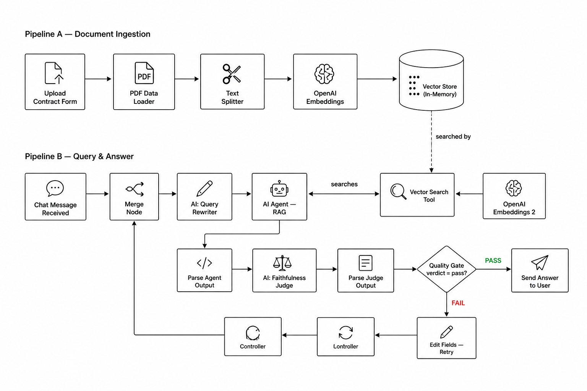
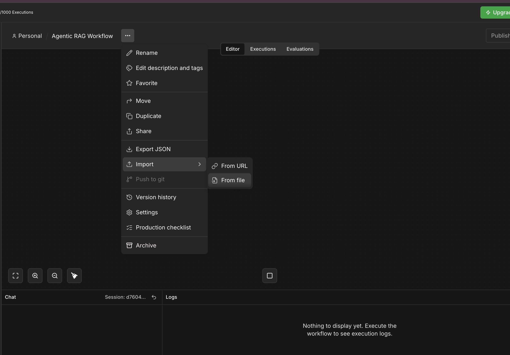
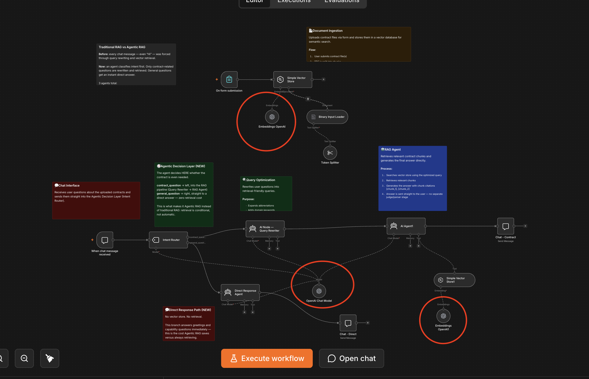
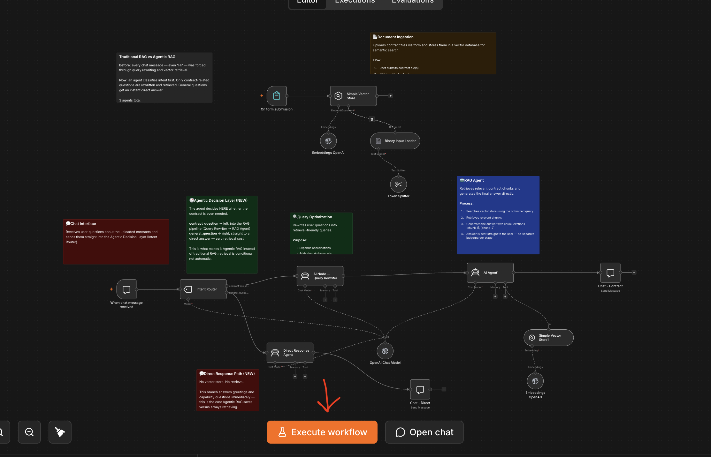
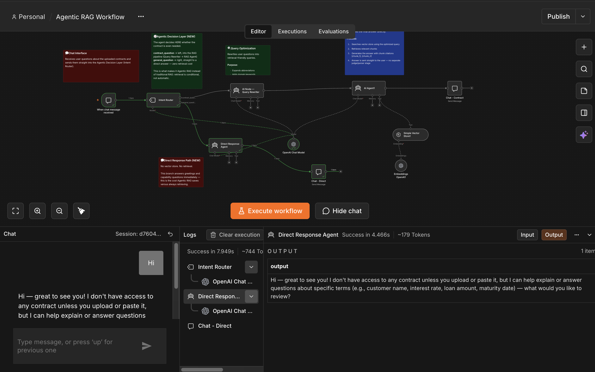
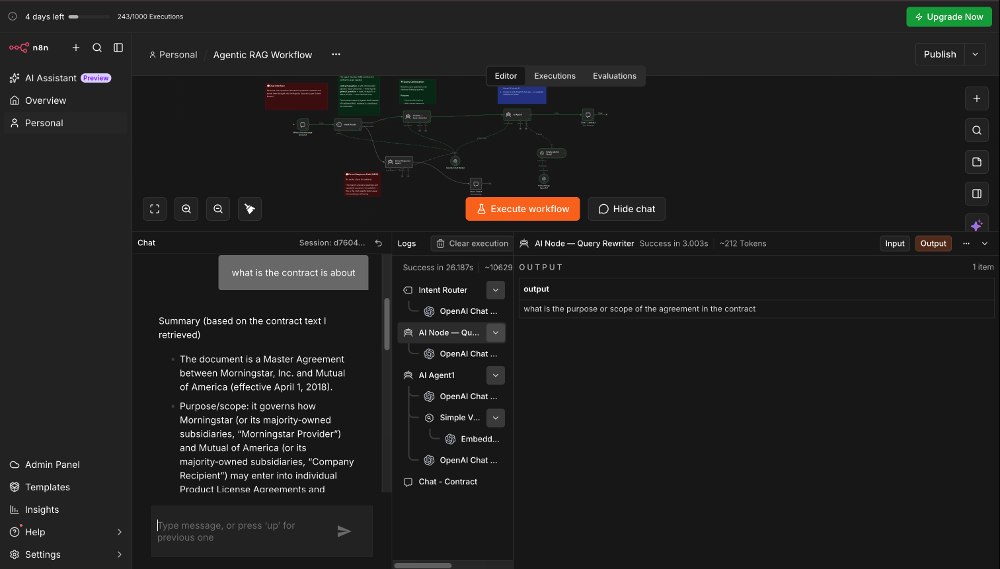
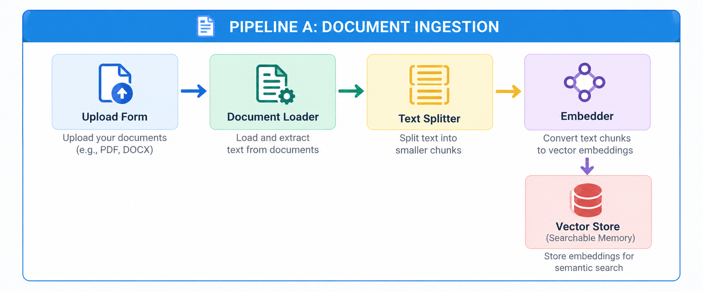
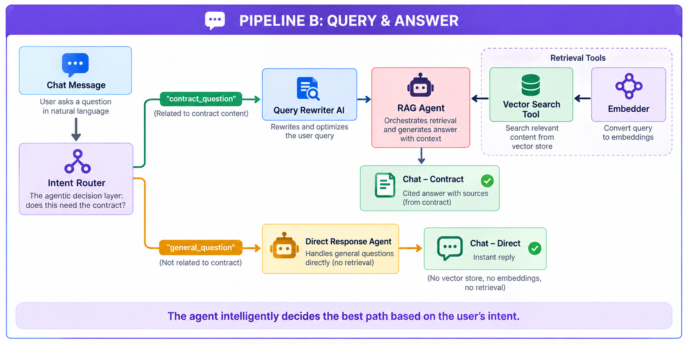
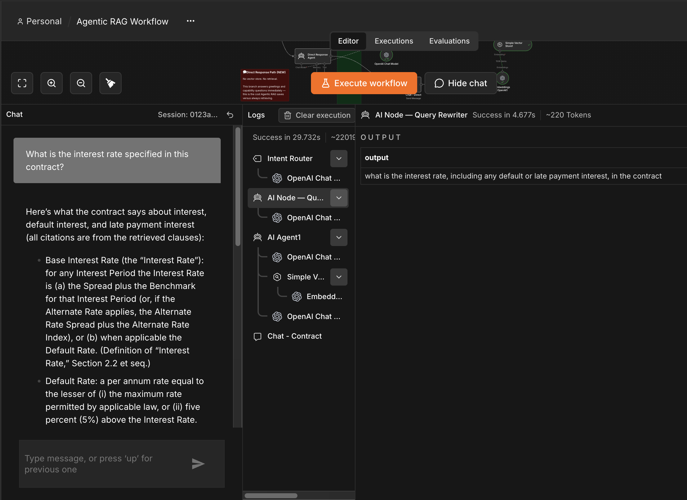

# Agentic RAG — Contract Intelligence Lab Guide

> **Who this is for:** Anyone curious about AI — no coding background needed. This guide gets you running the lab first, then explains every piece of it in plain English.

---

## Table of Contents

1. [The Problem We Are Solving](#1-the-previous-lab-was-traditional-rag--heres-what-we-fixed)
2. [The Solution — What This Workflow Does](#2-the-solution--what-this-workflow-does)
   - [Pre-Session Downloads](#pre-session-downloads)
3. [Core Concept: What Is Agentic RAG?](#3-core-concept-what-is-agentic-rag)
4. [Step-by-Step Lab Setup in n8n](#5-step-by-step-lab-setup-in-n8n)
5. [The Big Picture — How the Workflow Flows](#6-the-big-picture--how-the-workflow-flows)
6. [Example Queries to Try](#9-example-queries-to-try)
7. [Before You Move On — Test It Yourself](#10-before-you-move-on--test-it-yourself)
8. [Why This Matters — Key Takeaways](#11-why-this-matters--key-takeaways)

---

## 1. The Previous Lab Was Traditional RAG — Here's What We Fixed
 
Before you dive into the current workflow, it's worth understanding what changed — because the fix *is* the main lesson of this lab.

---

### The previous lab: Traditional RAG
 
The previous lab was a **Traditional RAG workflow** — a standard Retrieval-Augmented Generation pipeline. Its whole design was: retrieve first, always, then generate an answer from whatever was retrieved. There was no decision-making step at the front of the pipeline. Every single message typed into the chat — no matter what it was — was forced through the **entire** retrieval pipeline:
 
That means a simple greeting like **"Hi"** or **"How are you?"** triggered exactly the same expensive machinery as a real contract question:
 
- The Query Rewriter tried to turn *"Hi"* into a "keyword-rich, contract-specific" search query — which makes no sense for a greeting
- The RAG Agent still called the Vector Search Tool and searched the contract for a match to that nonsense query
- All of this cost extra OpenAI calls, added several seconds of latency, and produced an awkward, sometimes confused-looking reply to something as simple as "Hi"

---
### Why this is a problem, conceptually
 
This is exactly what makes a workflow **Traditional RAG** rather than **Agentic RAG**. A fixed pipeline that always retrieves — regardless of whether retrieval is needed — isn't making any decisions at all. It's just a longer, more expensive version of a single lookup. Real agency means the system first asks itself: *"Does this question even require the document?"*

---

## 2. The Solution — What This Workflow Does



This n8n workflow builds an **intelligent contract Q&A system** that:
 
✅ Reads and understands your uploaded contract
✅ Decides, message by message, whether the contract is even relevant
✅ Answers general chat instantly, without touching the document
✅ Answers contract questions in plain English, always citing the exact section it used
 
Think of it as a **contract research assistant with good judgment** — one that knows the difference between "Hi" and "What's the interest rate?", and only opens the filing cabinet when it actually needs to.


---

## Pre-Session Downloads

Download the following files before starting the lab:

- ✅ **n8n Workflow file** — [Download the pre-built workflow JSON here](https://pragyaallc-my.sharepoint.com/:u:/g/personal/sachin_parmar_legalgraph_ai/IQA5OM4afrVkT6IPOVS7Tt1oAdqHaDatGQNsGPHzQDXwwus?e=nPtTb6) if you'd like to import it instead of building from scratch.

- [Reference Document](https://pragyaallc-my.sharepoint.com/:w:/g/personal/sachin_parmar_legalgraph_ai/IQAbCBMxqrFrT6hzD6t9oCdpAR8pdsHtVaZf2O5HiyGq5jY?e=4s3M8D) — Download the test Contract make sure you upload the contract is docx format
---

## 3. Core Concept: What Is Agentic RAG?

This is the most important concept in this lab. Let's break it down word by word.

### RAG — Retrieval-Augmented Generation

**"Retrieval-Augmented Generation"** is a technique for making AI smarter and more accurate by giving it a reference library to look things up in, rather than relying purely on what it memorised during training.

Think of the difference between:

- **A student taking an open-book exam** (RAG) — they look up answers in the textbook before writing
- **A student taking a closed-book exam** (standard AI) — they rely entirely on memory, which may be imperfect or outdated

In RAG, the "retrieval" step finds the most relevant pages/passages from your document, and the "generation" step uses an AI to write a clear answer *based only on those passages*.

```
User Question  →  Find relevant document sections  →  AI writes answer from those sections
```

### Agentic — What Makes It "Agentic"?
 
A standard RAG system does a single lookup and gives you one answer — for *every* message, whether or not that lookup makes sense. It is passive and indiscriminate.
 
An **Agentic** RAG system has *agency* — it can **reason about what the question actually needs, decide whether to retrieve at all, and choose the right path**:
 
| Standard / Naive RAG | Agentic RAG (this workflow) |
|---|---|
| Retrieves for every message, even "Hi" | Classifies intent first — retrieves only when needed |
| One fixed pipeline for every input | Two distinct paths: direct answer vs. full retrieval |
| Wastes embedding + vector search calls on small talk | Small talk never touches the vector store |
| No routing logic | An explicit routing agent decides the path |
| Same latency and cost for every message | Faster and cheaper for anything that isn't a contract question |
 
In this workflow, the system:
1. **Classifies your message** — does it need the contract, or not?
2. If **not** — a lightweight agent replies immediately, conversationally
3. If **yes** — the RAG path kicks in:
   - **Rewrites your question** to make it easier to search
   - **Searches the document** for relevant sections using a vector-store tool
   - **Composes an answer** with citations back to the specific chunks used
That routing decision — made before any retrieval happens — is what makes this **agentic**, not just "RAG with more nodes."

---

## 5. Step-by-Step Lab Setup in n8n
 
Follow these five steps exactly to get the workflow running. No coding required.
 
---
 
### ▶ Step 1 — Create a New Workflow
 
1. Open n8n in your browser
2. Click the **"+ New Workflow"** button (or **"Create Workflow"**) in the top right corner
3. You will see a blank canvas — this is your workspace
> 💡 You should see an empty canvas with a hint that says "Add first step" or similar. This is normal — you will fill it in the next step by importing the file.

 
---
 
### ▶ Step 2 — Download and Import the n8n JSON File
 
1. Download the **n8n JSON workflow file** from the pre-session materials section
2. Back in your n8n blank canvas, click the **three-dot menu** (⋮) in the top right corner
3. Select **"Import from file"** (keyboard shortcut: `Ctrl+Shift+I` on Windows / `Cmd+Shift+I` on Mac)
4. Browse to the downloaded JSON file and select it
5. Click **Open / Import**
6. The full workflow will appear on the canvas with all the nodes already connected


 
> ✅ You should now see three clusters of nodes: **Document Ingestion** (top), the **Intent Router fork** (where the chat path splits in two), and the **Query & Answer pipeline**. Everything is pre-wired — you just need to add your API key in the next step.
 
---
 
### ▶ Step 3 — Open the OpenAI Nodes and Add Your API Key
 
This step connects the workflow to OpenAI's AI services. You need to do this for **three nodes**.
 
**For the OpenAI Chat Model node:**
1. Find and **click** the node labelled **"OpenAI Chat Model"** on the canvas
2. A settings panel opens on the right side of the screen
3. Under **"Credential"**, click **"Create New"** or select an existing OpenAI credential
4. Paste your OpenAI API key into the field and click **Save**
> 💡 This single node powers *all four* AI agents in the workflow — the Intent Router, the Query Rewriter, the RAG Agent, and the Direct Response Agent. Set the credential once here and every agent uses it.


 
**For the two OpenAI Embedding nodes:**
1. Find the node **"Embeddings OpenAI"** (connected to the Vector Store in the top/ingestion section) → click it → assign the same API key credential
2. Find the second node **"Embeddings OpenAI1"** (in the lower query pipeline section) → click it → assign the same API key credential
> 💡 You only need to create the OpenAI credential once — then select it for each of the three nodes. They all share the same key.
 
> ⚠️ Don't have an OpenAI API key yet? Get one at [platform.openai.com](https://platform.openai.com). You will need to add a small amount of credit to your account before the key will work.
 
---
 
### ▶ Step 4 — Execute the Workflow and Upload Your Contract
 
1. Click the **"Execute Workflow"** button (the ▶ Play button at the bottom of the canvas)
2. The workflow activates and starts listening



3. Click on the **"On Form Submission"** node — a **"Test URL"** link will appear in its settings panel
4. Click that URL — it opens a simple web form in a new browser tab
5. In the form, click the file upload field and **select your contract document** (the sample contract from the pre-session materials, in `.pdf` format)
6. Click **Submit**
7. Go back to the n8n canvas — watch as **green checkmarks appear** on each ingestion node one by one as your document is processed

 
> ✅ When all ingestion nodes show green, your contract is fully loaded and ready to be queried. This usually takes 5–15 seconds depending on the size of the document.
 
> 💡 What's happening during those seconds: the document is being read, cut into chunks, converted into numerical vectors, and stored in the AI's searchable memory. More on each of these steps in Section 7.
 
---
 
### ▶ Step 5 — Ask a Query and Watch the Workflow Route
 
1. Find the **"When chat message received"** node on the canvas and click it
2. In the settings panel that opens, click **"Open Chat"** or **"Test Chat"**
3. A chat window will appear


 
4. First, try typing just **"Hi"** and press **Enter**. Watch the canvas: only the **Intent Router** and **Direct Response Agent** light up — the Vector Store never activates, and you get an instant, friendly reply.



5. Now try a real question about your contract — for example: *"What is the contract about?"*
6. Press **Enter** and watch the canvas light up differently this time — the Intent Router now routes left into the **Query Rewriter → RAG Agent → Vector Search Tool** path.
You will see each node glow green as it completes its work in sequence:
- The **Intent Router** classifies your message
- **If general:** the Direct Response Agent replies immediately
- **If contract-related:** the Query Rewriter rewrites your question, the RAG Agent searches the contract and cites its sources, and the answer is sent straight to you
> ✅ For a contract question, the answer comes back with citations to the specific chunk(s) it used. For a general message, you get a quick, friendly reply with no citations — because none were needed.
 

 
See **Section 9** for a full list of example queries to try, covering both paths.
 
---
 
## 6. The Big Picture — How the Workflow Flows
 
Now that you've run the lab, here is a full picture of what you just executed. The workflow has **two separate pipelines** that work together.
 
### Pipeline A — Document Ingestion (runs once, when you upload the contract)
 

 
### Pipeline B — Query & Answer (runs every time you send a chat message)
 

 
Notice there is no retry loop and no separate judging stage anymore — the RAG Agent's answer goes straight to the user. The main "agentic" decision in this version of the lab is the **fork at the Intent Router**, not a self-correction loop. That keeps the lesson focused on one clear idea: *decide before you retrieve.*

---

 ## 9. Example Queries to Try
  
 Use these after uploading the sample contract. Try a few from each list back to back and watch how differently the canvas lights up.
  
 ### General questions (should route to Direct Response Agent — no retrieval)
  
 > *"Hi"*
 > *"Hello"*
 > *"How are you?"*
 > *"What can you do?"*
  
 ### Contract questions (should route to the RAG pipeline — full retrieval)
  
 > *"What is this contract about?"*
 > *"Who are the parties involved in this contract?"*
 > *"What are the key terms and obligations in this contract?"*
 > *"What is the interest rate?"*
 > *"When is the maturity date?"*
  
 ---

## 10. Before You Move On — Test It Yourself

> ⏱️ **This section takes about 3 minutes to read. Do not skip it — it contains the most important hands-on insight of the lab.**

---

You just ran the workflow on a lease agreement where everything was spelled out plainly. Now let's stress-test it with a different kind of document.

### The Challenge

[**Download this Loan Agreement →**]([Click here](https://pragyaallc-my.sharepoint.com/:b:/g/personal/sachin_parmar_legalgraph_ai/IQD6lbbrDHV5ToSGrWurVlejAZ9kRJYW40iwWLtE5fzC54M))

Run it through the exact same process you just completed:

1. Click **Execute Workflow** and open the upload form
2. Upload the loan agreement PDF
3. Once ingestion is complete, open the chat and ask these questions:

> *"What is the interest rate on this loan?"*
> *"Can the borrower repay the loan early, and is there a penalty?"*
> *"What happens if the borrower misses a payment?"*

---

### What You Will Notice

You **will** get answers. They will look confident. They will even cite chunk references.

**But something will feel off.**

The answers will be vague or incomplete — hedging with phrases like *"as set forth in the applicable schedule"* or *"subject to the terms described in Section 4.3"* — without actually telling you what those schedules or sections say.

This is not a bug. It is the system working exactly as designed — and it is revealing a genuine limitation of RAG.

---

### Why This Happens — The Hidden Information Problem

In the lease agreement, key facts were stated directly in a single clause:

> *"The monthly rent shall be $2,400, due on the first day of each calendar month."*

One chunk. One fact. RAG retrieves it, cites it, done.

In a loan agreement, the same kind of information is scattered and cross-referenced:

> *"The applicable interest rate shall be the Base Rate plus the Applicable Margin, as defined in Schedule 1.1(a), subject to periodic adjustment in accordance with Section 2.7(d)."*

To correctly answer *"What is the interest rate?"*, the system would need to:

1. Find this clause
2. Locate **Schedule 1.1(a)** — possibly a table buried on a separate page
3. Find **Section 2.7(d)** and read the adjustment conditions
4. Synthesise all three into a single coherent number

Instead, RAG retrieves the most relevant chunk — which only contains a *pointer* to the real answer, not the answer itself. The system cites what it found, the faithfulness check passes (because the citation technically exists), and you receive an answer that is grounded but practically incomplete.

---

### The Takeaway Before the Next Lesson

| Contract type | How answers are stored | RAG accuracy |
|---|---|---|
| Lease agreement | Direct, self-contained clauses | High |
| Loan agreement | Cross-referenced sections, defined terms, exhibits | Lower — without extra architecture |

This is the exact problem the **next lab** is built to solve. When facts are scattered across a document — or across multiple documents — you need more than vector search. You need a system that can follow references, resolve defined terms, and reason across chunks.

**That is where Knowledge Graphs come in.**

---
  
 ## 11. Why This Matters — Key Takeaways
  
 ### What You Have Built
  
 You've just run an Agentic RAG pipeline that makes a real decision before it acts. Here's what makes it special:
  
 | Feature | What It Does | Why It Matters |
 |---|---|---|
 | **Semantic Search** | Finds meaning, not just keywords | Catches relevant clauses even when phrased differently |
 | **Query Rewriting** | Improves questions before searching | Better queries → better results |
 | **Intent Routing** | Classifies every message before acting | Skips retrieval entirely for non-contract messages — faster, cheaper, and genuinely agentic |
 | **Agentic Retrieval** | Agent can search multiple times when it does retrieve | Handles complex, multi-part contract questions |
 | **Citation Enforcement** | Every contract answer must cite a source chunk | Reduces hallucination risk |
  
 ### Real-World Applications
  
 This same architecture can be applied to:
  
 - **Legal teams** — querying NDAs, contracts, IP agreements
 - **HR departments** — querying employee handbooks, offer letters, policies
 - **Finance teams** — querying loan agreements, vendor contracts, SLAs
 - **Real estate** — querying lease agreements, property management contracts
 - **Healthcare** — querying supplier agreements, compliance documents

---
10. Before You Move On — Test It Yourself

  ▎ ⏱️  This section takes about 3 minutes to read. Do not skip it — it contains the most important hands-on insight of the lab.

---

You just ran the workflow on a lease agreement where everything was spelled out plainly. Now let's stress-test it with a different kind of document.

The Challenge

Download this Loan Agreement → [Click here](https://pragyaallc-my.sharepoint.com/:b:/g/personal/sachin_parmar_legalgraph_ai/IQD6lbbrDHV5ToSGrWurVlejAZ9kRJYW40iwWLtE5fzC54M?e=VtD4Mp)

  Run it through the exact same process you just completed:

  1. Click Execute Workflow and open the upload form
  2. Upload the loan agreement PDF
  3. Once ingestion is complete, open the chat and ask these questions:

  ▎ "What is the interest rate on this loan?"
  ▎ "Can the borrower repay the loan early, and is there a penalty?"
  ▎ "What happens if the borrower misses a payment?"

  

  ---

  What You Will Notice

  You will get answers. They will look confident. They will even cite chunk references.

  But something will feel off.

  The answers will be vague or incomplete — hedging with phrases like "as set forth in the applicable schedule" or "subject to the terms
  described in Section 4.3" — without actually telling you what those schedules or sections say.

  This is not a bug. It is the system working exactly as designed — and it is revealing a genuine limitation of RAG.

  ---

  Why This Happens — The Hidden Information Problem

  In the lease agreement, key facts were stated directly in a single clause:

  ▎ "The monthly rent shall be $2,400, due on the first day of each calendar month."

  One chunk. One fact. RAG retrieves it, cites it, done.

  In a loan agreement, the same kind of information is scattered and cross-referenced:

  ▎ "The applicable interest rate shall be the Base Rate plus the Applicable Margin, as defined in Schedule 1.1(a), subject to periodic
  ▎ adjustment in accordance with Section 2.7(d)."

  To correctly answer "What is the interest rate?", the system would need to:

  1. Find this clause
  2. Locate Schedule 1.1(a) — possibly a table buried on a separate page
  3. Find Section 2.7(d) and read the adjustment conditions
  4. Synthesise all three into a single coherent number

  Instead, RAG retrieves the most relevant chunk — which only contains a pointer to the real answer, not the answer itself. The system
  cites what it found, the faithfulness check passes (because the citation technically exists), and you receive an answer that is grounded
  but practically incomplete.

  ---

  The Takeaway Before the Next Lesson

  ┌─────────────────┬────────────────────────────────────────────────────┬────────────────────────────────────┐
  │  Contract type  │               How answers are stored               │            RAG accuracy            │
  ├─────────────────┼────────────────────────────────────────────────────┼────────────────────────────────────┤
  │ Lease agreement │ Direct, self-contained clauses                     │ High                               │
  ├─────────────────┼────────────────────────────────────────────────────┼────────────────────────────────────┤
  │ Loan agreement  │ Cross-referenced sections, defined terms, exhibits │ Lower — without extra architecture │
  └─────────────────┴────────────────────────────────────────────────────┴────────────────────────────────────┘

  This is the exact problem the next lab is built to solve. When facts are scattered across a document — or across multiple documents —
  you need more than vector search. You need a system that can follow references, resolve defined terms, and reason across chunks.

  That is where Knowledge Graphs come in.
