# Lab 2.3.1: Give Your Agentic RAG a Web Layer

Your n8n agent just got a lot smarter. Back in Lab 2.3, you taught it to stop and think before it goes digging through the contract — "Hi" gets an instant reply, "What's the interest rate?" sends it off to actually search the document.

Your web app has no idea any of that happened. It's still talking to your backend the old way, from Lab 1.2 — one file, one message, one webhook, every single time someone hits send.

That's the gap this lab closes. You're not starting over. You're taking the same `contract-review-app` you already built and bringing it up to speed with the smarter backend sitting behind it — both how it talks to n8n, and how it looks.

No new coding concepts here. Just Claude Code, the app you already have, and about 35 minutes.

---

## Table of Contents

- [What Are We Building?](#what-are-we-building)
- [Prerequisites](#prerequisites)
- [Part 1: Turn On the New Workflow — and Poke Both Branches](#part-1-turn-on-the-new-workflow--and-poke-both-branches)
- [Part 2: Your App Still Thinks There's Only One Job](#part-2-your-app-still-thinks-theres-only-one-job)
- [Part 3: Test It Inside n8n First](#part-3-test-it-inside-n8n-first)
- [Part 4: Teach Claude Your Design System — as a Skill](#part-4-teach-claude-your-design-system--as-a-skill)
- [Part 5: Try the Whole Thing](#part-5-try-the-whole-thing)
- [What You Learned](#what-you-learned)

---

## What Are We Building?

**The wiring.** Your app currently bundles the uploaded PDF and the typed question into one request and fires it at one webhook — every time someone sends a message. That made sense when your backend was one webhook and one agent. It doesn't make sense anymore. Your Lab 2.3 workflow now has two separate jobs: reading the contract once (ingestion), and answering questions many times after that (chat). Two jobs, two webhooks. Your app hasn't caught up.

**The look.** In Lab 1.2 you sketched a palette with `/design` in a few sentences — "navy and orange, clean and professional" — and that was good enough for a first pass. Now you've got an actual design system sitting in this folder, `SKILL.md`. Real tokens, a real type scale, a real spacing grid. No reason to keep guessing.

By the end of this lab, your app will send the file once, ask questions cheaply after that, and look like it came from a real design system instead of a vibe.

---

## Prerequisites

✅ **Lab 1.2 done** — you've got a working `contract-review-app` folder with `index.html`, `styles.css`, and `app.js`, and it already sends messages to a webhook.

✅ **Lab 2.3 done** — your n8n workflow has an Intent Router, a Direct Response Agent, a Query Rewriter, and a RAG Agent, and it's split across two webhook triggers instead of one.

✅ **Claude Code**, pointed at your existing `contract-review-app` folder. Same session you used before or a brand new one — either works, Claude can just read the files.

---

## Part 1: Turn On the New Workflow — and Copy webhook-url from Both Branches

Open the n8n workflow from Lab 2.3. Click **Execute Workflow** so it's actually listening.

Open both webhook nodes and grab their URLs — you'll need both in a minute:

- The one starting at **Binary Input Loader → Simple Vector Store (insert)** — that's your **ingestion webhook**. It reads the PDF once.
- The one starting at **Intent Router** — that's your **chat webhook**. It handles every question.

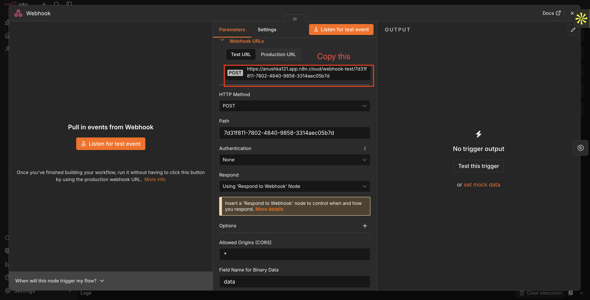

---

## Part 2: Your App Still Thinks There's Only One Job

Go back to the Claude Code session you used to build the app — or open a fresh one and point it at the `contract-review-app` folder, either is fine. Give it this single prompt, with the two URLs you copied in Part 1 swapped in:

```
My contract-review-app currently sends the uploaded file and the chat
message together, to one webhook, on every single send. My backend has
changed — it now has two separate webhooks, and app.js needs to match:

1. An ingestion webhook — takes the PDF once, right after upload:
   <Your Ingestion Webhook URL>

   When a PDF is uploaded (loadFile), immediately POST it as binary
   form-data (field name "data") to this webhook. Show a brief
   "Indexing contract…" status while this is in flight. Keep the chat
   input disabled until ingestion succeeds. If it fails, show an error
   and let the user re-upload.

2. A chat webhook — takes just the typed message, per turn:
   <Your Chat Webhook URL>

   Change the chat form submit handler to POST only the message to
   this webhook — remove the file from the FormData sent on every chat
   turn. The vector store behind this workflow is a single shared
   in-memory store that gets cleared and rewritten on every upload, so
   there's no session ID or document ID to track — one contract loaded
   at a time is the assumption.

Keep everything else — the message rendering, typing indicator, and
error handling — exactly as it is.
```

Here's what applying prompt looked like in an actual session. Claude read `app.js`, split the one webhook constant into two, and rewired both the upload handler and the chat submit handler:

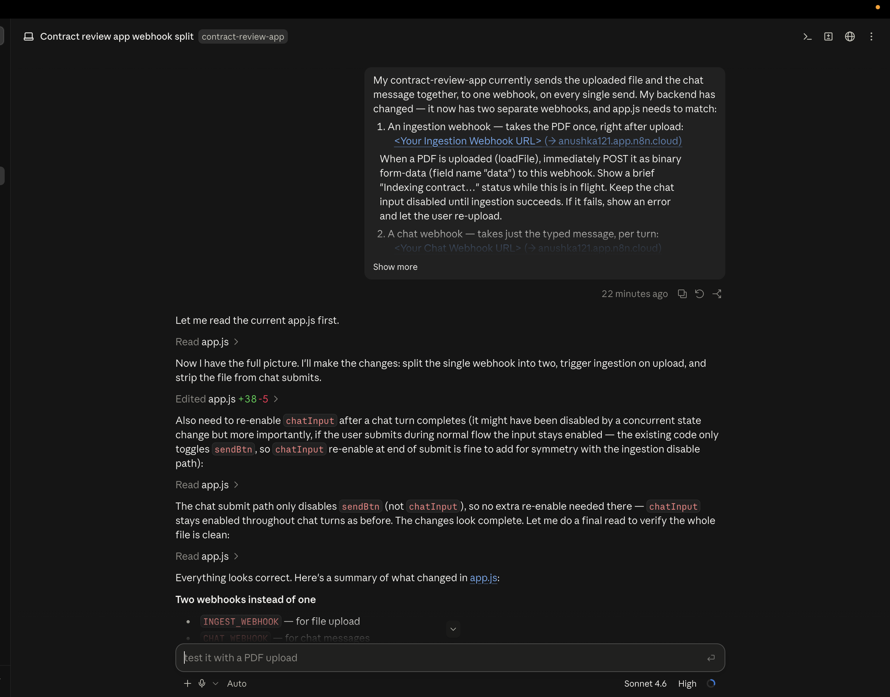

---

## Part 3: Test It Inside n8n First

Open the n8n workflow. You've got two entry points into it — **Webhook** at the top handles ingestion, **Webhook1** on the left handles chat:

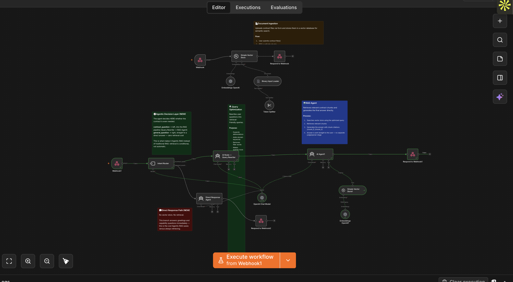

You'll need a sample contract for this — [download it here](https://pragyaallc-my.sharepoint.com/:b:/g/personal/sachin_parmar_legalgraph_ai/IQC2WQJhhIuyRq5JrVY13FwNAdwS4M5gB5w-qzBAm9V4mRQ?e=XyvLU4)

**Step 1 — test ingestion.** Click the dropdown next to **Execute Workflow** and choose **from Webhook**:

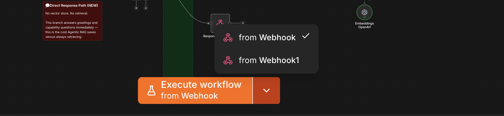

now click on execute workflow and go to your app's contract page and upload the sample contract. The chat panel should show **"Contract loaded: `<your file name>`.pdf."** Back in n8n, you should see green checkmarks travel across the whole ingestion path — Webhook → Simple Vector Store → Embeddings → Respond to Webhook :

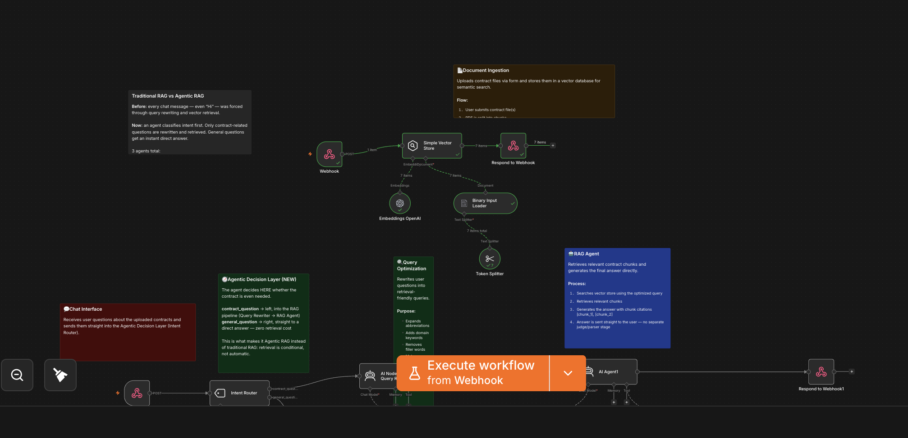

**Step 2 — test chat, first pass.** Click the same dropdown and choose **from Webhook1** instead:

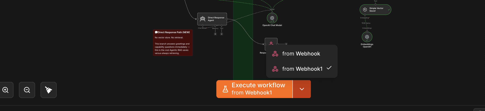

now click on execute workflow

Now go back to your app and send any message in the chat. You'll get an error back. **That's a good sign** — it means the message actually reached n8n, and you're looking at a real problem inside the workflow instead of a broken connection.

Open the **Intent Router** node — that's the first node Webhook1 hands off to, so it's the first place execution can fail. Fix text to classify, previously it was using from chat trigger now you need to update it for webhook1 trigger

```
{{ $('Webhook1').item.json.body.message }}
```

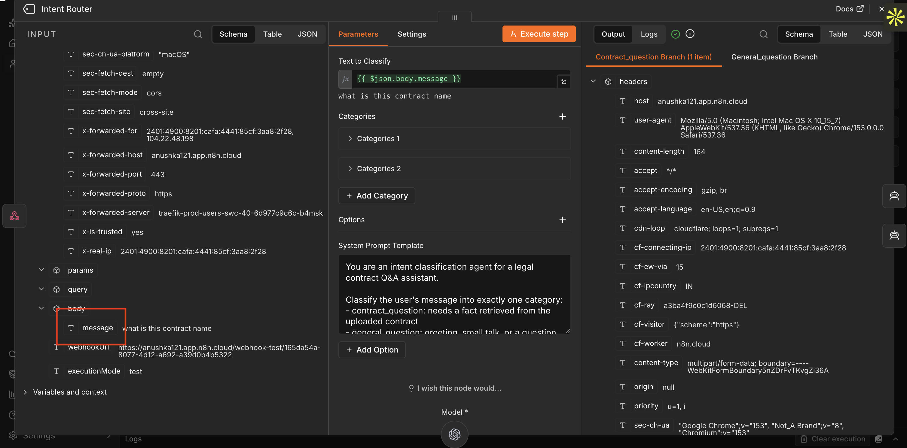

**Step 3 — test chat, second pass.** Click **Execute Workflow → from Webhook1** again (each test run only listens for one request, so you have to re-execute it before every retry). Back in the app, ask a question that has nothing to do with the contract — something like 

```
What can you help me with?
```

You'll get an error again. This time it's the **Direct Response Agent** — the node that handles anything the Intent Router classifies as a general question. Open it and apply the same fix:

```
{{ $('Webhook1').item.json.body.message }}
```

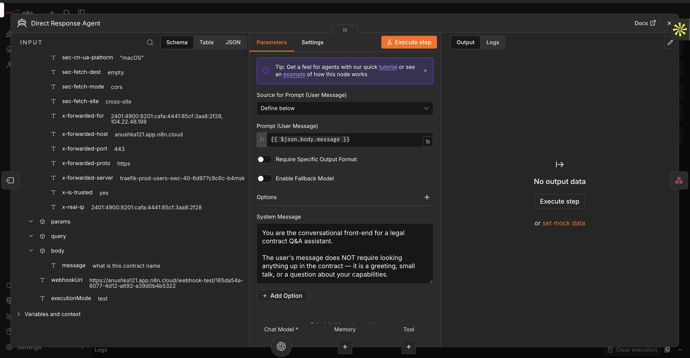

**Step 4 — confirm the general path works.** Execute Workflow → from Webhook1 once more, and ask that same non-contract question again. This time you should get a real answer back. That confirms the greeting/small-talk path is fully wired.

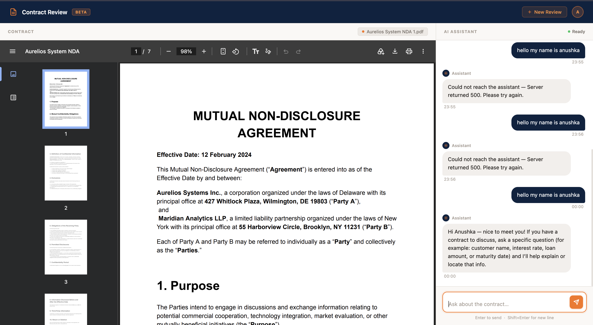

**Step 5 — now ask a contract question.** With the workflow still armed (re-execute if it's timed out), ask something that actually needs the document —

```
What is this contract about?
```

You'll hit an error a third time, and this one's on **AI Node — Query Rewriter**, still reading the same broken expression

Open it and apply the identical fix:

```
{{ $('Webhook1').item.json.body.message }}
```

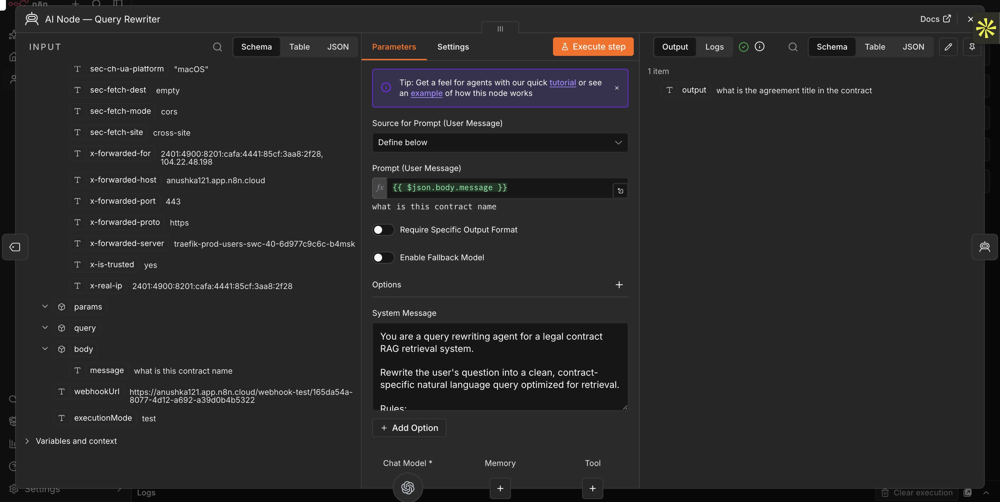

**Step 6 — confirm everything.** Execute Workflow → from Webhook1 one last time, and ask that same contract question again. You should now get a real, grounded answer:

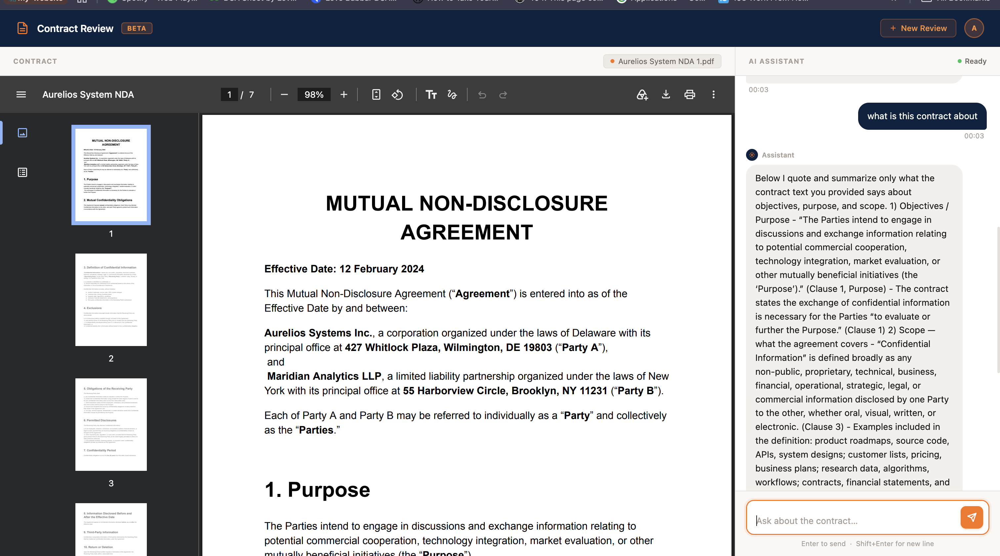

And on the n8n side, both branches of the Intent Router — general and contract — should now run clean end to end, no red errors anywhere:

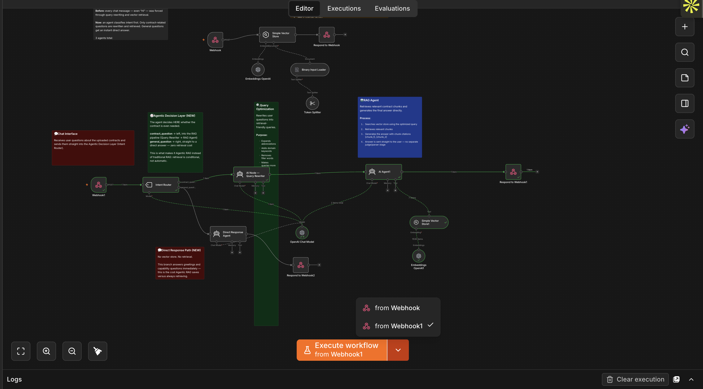

Your app is working correctly against the new backend. On to the next step.

---

## Part 4: Teach Claude Your Design System — as a Skill

Back in Lab 1.2, you described a look in a sentence and let Claude fill in the blanks. Fine for a first draft. Not something you'd want to redo from memory every time you open a new project — and not something you want to re-type into a prompt every time either.

There's a better way to hand Claude something it should follow every single time, without you re-explaining it: turn it into a **skill**. Before we restyle anything, let's build one.

### What's a Skill, Quickly

A skill is just a Markdown file with instructions in it. The filename becomes the slash command. Once it's installed, typing `/skill-name` hands Claude the whole file as a ready-made prompt — no retyping, no forgetting a rule you set last week.

**To install any skill you get your hands on (including the one we're about to use):**

1. Open Claude's settings and go to **Capabilities → Skills**
2. Click **Upload skill**
3. Select the `.md` (or `.zip`) file for the skill
4. Confirm — it now shows up as a slash command you can invoke any time

### How to Create Your Own Skills

Once you've used a starter skill or two, you can build your own the same way.

**To create a skill from scratch:**

1. Open a text editor (or ask Claude to help you write it)
2. Write the instructions you want Claude to follow — be explicit about the output format you want
3. Save the file as `your-skill-name.md`
4. Follow the install steps above to upload it

**Tips for writing effective skills:**

| Tip | Why It Matters |
|---|---|
| Be explicit about output format | Claude will follow structure instructions precisely |
| Use `$ARGUMENTS` as a placeholder | Anything you type after the command replaces `$ARGUMENTS` — makes skills dynamic |
| Keep each skill focused on one job | Narrow skills are more reliable than multi-purpose ones |
| Add a constraints or out-of-scope section | Prevents Claude from over-generating or going off-track |

**Example — a simple skill file:**

```
Write a user story for the following feature: $ARGUMENTS

Format:
**User Story**
As a [user], I want [goal] so that [benefit].

**Acceptance Criteria**
- [ ] Criterion 1
- [ ] Criterion 2

**Out of Scope**
- What this story does not cover
```

Save this as `write-user-story.md`, upload it, and invoke it with:

```
/write-user-story Export project data as a CSV
```

### Now, Back to Your App's Design

`design.md` is the fix for the "described a look in a sentence" problem — a real design system written down once: a color palette, a type scale, a 4px spacing grid, and patterns for things like status badges. Nothing in it is a guess. And instead of pasting its contents into a prompt every time you want Claude to follow it, we're going to turn it into a skill you invoke by name.

**Download the skill:**

[Download the design.md skill from GitHub](./SKILL.md)

**Upload it into Claude**, Click on your profile in the bottom left corner → Settings → Skills → Click on Add at top right corner → Select Upload skill → now upload your skill here that you just downloaded → save:

**Now use it on your app.** Notice we're not using the `/design` canvas command here — that opens a sketch-first canvas. This is a skill, invoked directly, that already knows the full design system and applies it straight to your code:

```
use design-system skill and  Restyle styles.css for the contract-review-app to follow our
design system exactly — palette, type scale, 4px spacing grid, and
border-radius rules. Don't change index.html's structure or app.js's
logic, this is a styles.css pass only.
```

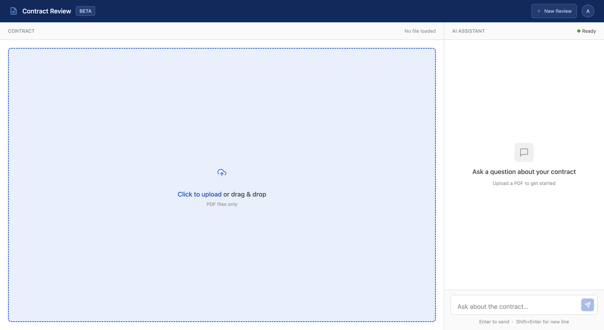

Refresh and take a look. Same layout, same behavior underneath — just a visual language you can now point back to a real source instead of a memory of what looked nice. If something still looks off, tell Claude which rule in `design.md` it missed, rather than describing the fix yourself. The skill knows better than either of you at this point.

---

## Part 5: Try the Whole Thing

You already proved the wiring works back in Part 3 — upload, ingest, ask, answer, all of it. So this last pass isn't about function anymore. It's about looking closely at the thing Part 4 actually changed: does the app now genuinely look like it came from `design.md`, or just "different from before"?

Open the app fresh and walk through it slowly, checking it against the design system as you go:

1. **The empty state, before you upload anything.** Text should be Inter Display, primary text in Grey 900, secondary/hint text in Grey 500 — not the old navy or orange showing up anywhere.
2. **Upload the sample contract.** Watch the "Indexing contract…" status — its spacing and type should match the same 4px grid and type scale as everything else, not feel like a leftover from the old style.
3. **The loaded contract + chat layout.** Check spacing between sections — does it look like multiples of 4px, or are there odd gaps that were never redone? Cards and panels should carry the rounded corners `design.md` specifies (8px for cards, 6px for buttons and inputs).
4. **Send a real question** — *"What are the payment terms?"* — and look at the response bubble itself: body text should read as Paragraph Large Medium, not a random size Claude picked on its own.


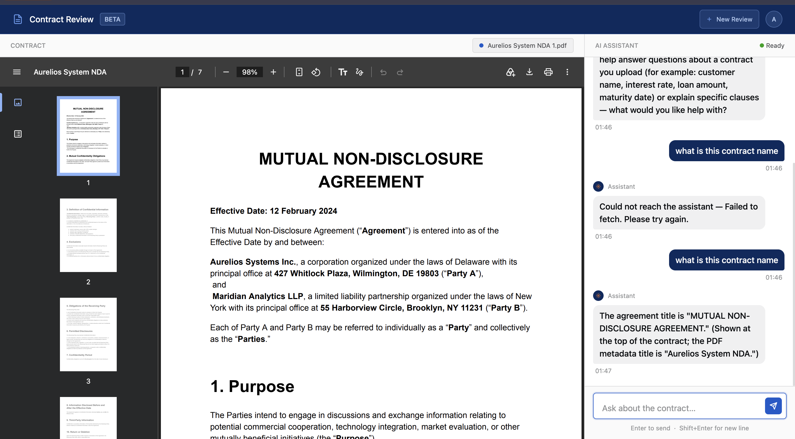

---

## What You Learned

| What | What it means | Why it matters |
|---|---|---|
| **Your app can fall behind your backend** | Your n8n workflow grew from one job into two — reading the contract, and answering questions about it — but the app was still stuck doing everything the old, one-job way | Just because a prototype works today doesn't mean the wiring is done. Check it again whenever the backend changes |
| **Reading a document and answering questions aren't the same job** | You only need to upload and read the contract once. After that, you're just asking it questions, over and over | Sending the whole file again with every single message is slow and pointless once it's already been read |
| **Check every path before you trust it** | An agent that quietly fails on one path can still look totally fine — until someone actually hits that path | It only takes a minute to test both sides of a decision point, and it saves you from a confusing bug later |
| **A real design system beats a good guess** | Describing a look in a sentence gets you something that looks fine for a day. Writing it down once, as `design.md`, gets you something everyone can keep using | When Claude follows an actual file instead of your memory of what "looked nice," you always know exactly why something looks the way it does |

---

[← Back to Week 2 Overview](../Readme.md)
