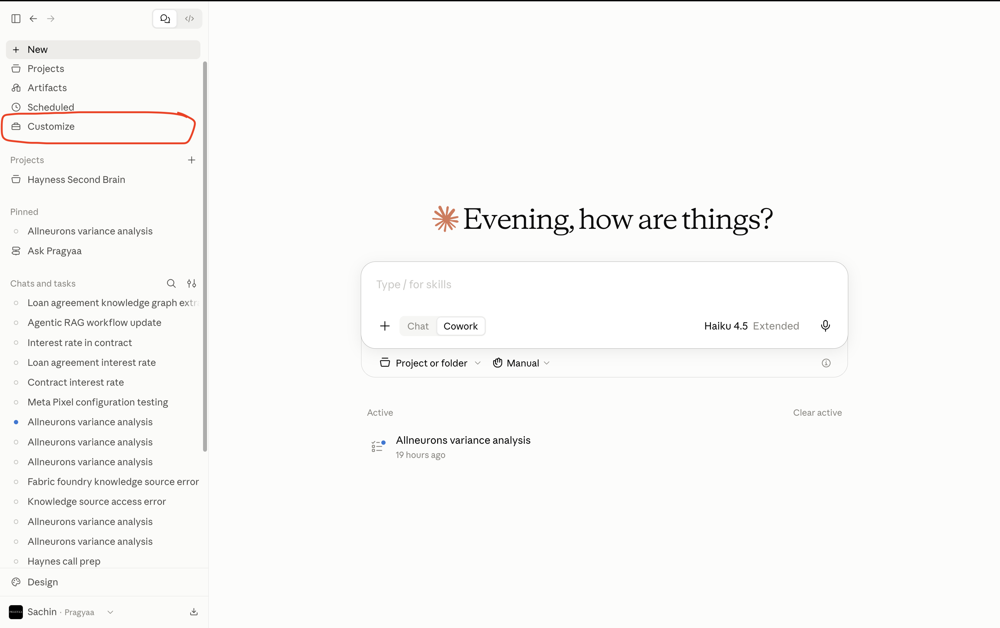

# Lab 2.4 — Knowledge Graph RAG with Claude Skills

> **Who this is for:** No coding background needed. This guide walks you through every step, then explains what is happening under the hood.

---

## Table of Contents

1. [Where We Left Off — The Problem We Are Solving](#1-where-we-left-off--the-problem-we-are-solving)
2. [The Solution — Knowledge Graphs](#2-the-solution--knowledge-graphs)
3. [Prerequisites — What to Download](#3-prerequisites--what-to-download)
4. [What Is a Claude Skill?](#4-what-is-a-claude-skill)
5. [Step 1 — Set Up the Skill in Claude](#5-step-1--set-up-the-skill-in-claude)
6. [Step 2 — Create a Project and Upload the Contract](#6-step-2--create-a-project-and-upload-the-contract)
7. [Step 3 — Invoke the Skill and Get Your Graph Files](#7-step-3--invoke-the-skill-and-get-your-graph-files)
8. [Step 4 — Visualize the Graph in Obsidian](#8-step-4--visualize-the-graph-in-obsidian)
9. [Understanding Entities and Relationships](#9-understanding-entities-and-relationships)
10. [Step 5 — Ask the Same Questions in Claude](#10-step-5--ask-the-same-questions-in-claude)
11. [What Happened Behind the Scenes](#11-what-happened-behind-the-scenes)

---

## 1. Where We Left Off — The Problem We Are Solving

In the previous lab, you ran an Agentic RAG pipeline on a loan agreement. The system looked confident. It cited sources. It passed its own checks.

But when you asked **"What is the interest rate?"**, the answer was incomplete. It gave you the clause that *mentioned* the interest rate — not the schedule that *defined* it.

Here is why that happened:

> *"The applicable interest rate shall be the Base Rate plus the Applicable Margin, as defined in Schedule 1.1(a), subject to periodic adjustment in accordance with Section 2.7(d)."*

The answer was hiding across three separate sections. RAG retrieved the clause with the most similar text to your question — and stopped there. It had no way to follow the chain of references inside the document.

**This lab fixes that.** And it does it without building a new workflow in n8n. Instead, you will use a **Claude Skill** to extract a knowledge graph directly from the contract — and then use that graph to ask the exact same questions and finally get complete answers.

---

## 2. The Solution — Knowledge Graphs

A knowledge graph is a way of storing information as a **network of connections** rather than a list of text passages.

Instead of treating a document as pages of text, a knowledge graph reads every clause and asks:
- *What are the important things mentioned here?* — these become **Entities**
- *How are those things connected to each other?* — these become **Relationships**

### A simple example from a loan agreement

Take this clause:

> *"The Borrower shall repay the Principal Amount to the Lender on the Maturity Date at the Interest Rate specified in Schedule A."*

A RAG system stores this as a chunk of text.  
A knowledge graph stores it as:

```
[Borrower] ──REPAYS──► [Principal Amount]
[Principal Amount] ──PAID_TO──► [Lender]
[Repayment] ──OCCURS_ON──► [Maturity Date]
[Repayment] ──USES_RATE──► [Interest Rate]
[Interest Rate] ──DEFINED_IN──► [Schedule A]
```

Now when you ask *"What is the interest rate?"*, the system does not search for the most similar text. It traverses the graph:

1. Find the **Interest Rate** node
2. Follow the `DEFINED_IN` edge to **Schedule A**
3. Read what Schedule A says about the rate

Every cross-reference is a visible edge in the graph. Nothing is hidden behind a chunk boundary.

### Why this matters for legal documents

| Question | RAG answer | KG-RAG answer |
|---|---|---|
| *"What is the interest rate?"* | The clause that mentions the rate | The clause + the schedule that defines the actual number |
| *"What triggers a default?"* | The most keyword-similar paragraph | The full chain: trigger → definition → consequences → notice requirements |
| *"Can the loan be repaid early?"* | The prepayment clause | The clause + the penalty formula + any referenced exhibit |

The more cross-referenced the document, the bigger the gap between RAG and KG-RAG.

---

## 3. Prerequisites — What to Download

Before you start the lab, download both of these files:

- **Claude Skill file** — the skill that extracts a knowledge graph from your contract
  [Download the Skill →](https://pragyaallc-my.sharepoint.com/:u:/g/personal/sachin_parmar_legalgraph_ai/IQAFc5y1wj7RQa1YLPVhsMslAa9EqcDaW3LFtUN--5k3F78?e=5eYchc)

- **Sample Contract** — the loan agreement you will use in this lab
  [Download the Contract →](https://pragyaallc-my.sharepoint.com/:b:/g/personal/sachin_parmar_legalgraph_ai/IQAoCWuA_rpWRq9eVWL6MJCeAeF0-mDO7j1ueQe6RxKL4mU?e=YvV2wc)

> 💡 Save both files somewhere easy to find — you will need them in Steps 1 and 2.

---

## 4. What Is a Claude Skill?

Before you set anything up, it helps to understand what a Skill actually is.

### The idea

A **Claude Skill** is a set of instructions you give Claude once — and then Claude follows them automatically every time you invoke the skill, without you needing to explain the task again.

Think of it like hiring a specialist. Instead of explaining the job from scratch every time, you write a job description once and hand it to the specialist. From that point on, you just say *"do the thing"* and they know exactly what to do.

In this lab, the skill's job is:

> *"Read this contract. Extract every entity and every relationship between those entities. Save them as a structured set of Markdown files that can be visualized as a graph."*

You give Claude that instruction once (by uploading the skill file). After that, you just upload a contract and say *"run the skill"* — and Claude does the full extraction automatically.

---

### Skills vs. just asking Claude

You could ask Claude to extract entities from a contract without a skill. But you would need to:

- Write a detailed prompt every single time
- Hope Claude interprets "entity" and "relationship" the same way each time
- Manually copy the output into a format Obsidian can read

A skill packages all of that into one reusable, consistent unit. Same output format every time. No re-explaining required.

---

### Can you build your own skill?

Yes. A Claude Skill is a Markdown file that contains:

1. A **name** for the skill
2. A **description** of when to use it
3. **Instructions** telling Claude exactly what to do, step by step
4. Optionally: **output format rules** specifying how the result should be structured

You write it once, upload it to Claude's Customize section, and it becomes available in every conversation. If you want to build your own after this lab — for a different document type, a different output format, or a completely different task — the process is the same: write the instructions in Markdown, upload the file.

---

## 5. Step 1 — Set Up the Skill in Claude

### ▶ Open Claude and go to Customize

1. Open [Claude](https://claude.ai) in your browser
2. Click your **profile icon** in the bottom-left corner
3. Select **"Customize Claude"** from the menu




---

### ▶ Add the Skill

4. In the Customize panel, find the **Skills** section
5. Click **"Add"**
6. Select **"Upload a Skill"**
7. Browse to the skill file you downloaded in the Prerequisites section and select it
8. Click **Open** — the skill will appear in your skills list


> ✅ You should see the skill listed with its name. It is now available in every new conversation you start in Claude.

> 💡 You only need to do this once. The skill stays in your account until you remove it.

---

## 6. Step 2 — Create a Project and Upload the Contract

### ▶ Open a new chat and create a Project

1. Click **"New Chat"** in the Claude sidebar
2. On the left panel, click **"Projects"** (or **"Add to Project"**)
3. Click **"Create Project"**
4. Give the project a name — for example: *"KG-RAG Lab"*
5. When prompted to select a local folder, create a new folder on your computer and select it — this is where Claude will save the graph files it generates


> 💡 A Project in Claude is a workspace that keeps your files, context, and conversation history together. Linking it to a local folder means Claude can write files directly to your computer — which is how you will get the Markdown graph files into Obsidian.

---

### ▶ Upload the contract

6. Inside the project chat, click the **paperclip icon** (or **"Attach files"**)
7. Select the sample loan agreement you downloaded in the Prerequisites section
8. The contract will appear as an attachment in the chat


> ✅ You should see the contract file listed above the message input. Claude can now read it.

---

## 7. Step 3 — Invoke the Skill and Get Your Graph Files

### ▶ Run the skill

1. In the chat message box, type `/` — a list of available skills will appear
2. Select the **Knowledge Graph skill** you uploaded in Step 1
3. Press **Enter**

Claude will now read the contract and begin extracting entities and relationships. You will see it working in real time — identifying parties, dates, obligations, cross-references, and the connections between them.


> ✅ When Claude finishes, check the local folder you linked to the project. You will find a set of **Markdown files** — one file per entity, with links between files representing the relationships. This is your knowledge graph.

> 💡 Each Markdown file represents one node in the graph. The `[[links]]` inside each file are the edges. Obsidian reads this structure and draws the visual graph automatically.

---

## 8. Step 4 — Visualize the Graph in Obsidian

### ▶ Install Obsidian (if you have not already)

1. Go to the official [Obsidian Download Page](https://obsidian.md/download)
2. Select your operating system (**Windows** or **macOS**) and click **Download**


3. Open the downloaded file and follow the on-screen instructions to install
4. Launch Obsidian

---

### ▶ Open your graph as a Vault

5. In Obsidian, click **"Open folder as Vault"**
6. Navigate to the local folder that Claude wrote the Markdown files into and select it
7. Obsidian will load all the files


8. Click the **Graph View** icon in the left sidebar (it looks like a network of dots)


> ✅ You should see a visual graph — each node is an entity from the contract, and each line connecting two nodes is a relationship. Hover over any node to see its name. Click it to open the underlying Markdown file and read the details.

> 💡 This is the same structure the AI will use to answer your questions in Step 5. You are looking at the "map" Claude built of your contract.

---

## 9. Understanding Entities and Relationships

Before you start asking questions, it helps to know what you are looking at in the graph.

### Entities — the "things" in your contract

An entity is any named concept that matters in the contract. In a loan agreement, the main entities are:

| Entity | What it is |
|---|---|
| **Borrower** | The party receiving the loan |
| **Lender** | The party providing the loan |
| **Principal Amount** | The total sum being lent |
| **Interest Rate** | The cost of borrowing, expressed as a percentage |
| **Maturity Date** | The date by which the loan must be repaid |
| **Event of Default** | A condition that triggers the lender's right to demand repayment |
| **Schedule A** | An exhibit containing defined rates or terms |
| **Prepayment Penalty** | A fee charged if the borrower repays early |

In the graph, each of these appears as a **node** — a dot you can click.

---

### Relationships — the connections between them

A relationship is a labelled connection between two entities. In the graph, each connection is a **line with a label** describing how the two nodes relate.

Examples from a loan agreement:

| From | Relationship | To | Plain English |
|---|---|---|---|
| Borrower | `OWES` | Principal Amount | The borrower owes the principal |
| Interest Rate | `DEFINED_IN` | Schedule A | The rate is specified in Schedule A |
| Event of Default | `TRIGGERS` | Acceleration | A default lets the lender demand full repayment |
| Prepayment | `SUBJECT_TO` | Prepayment Penalty | Early repayment may incur a fee |
| Maturity Date | `GOVERNS` | Final Payment | The maturity date is when the last payment is due |

When you asked *"What is the interest rate?"* in the previous lab, RAG found the **Interest Rate** node — but stopped there. KG-RAG follows the `DEFINED_IN` edge all the way to **Schedule A** and reads what it says.

That one extra step is what makes the answer complete.

---

## 10. Step 5 — Ask the Same Questions in Claude

Now you will ask the exact same questions you asked in Lab 2.3 — but this time Claude has access to the knowledge graph.

### ▶ Start a new session with the graph folder attached

1. In Claude, create a **new chat** inside the same project
2. The project already has access to your local folder — the Markdown graph files are available to Claude automatically

> 💡 You do not need to re-upload the contract. The knowledge graph files that Claude generated in Step 3 are in the project folder. Claude will use those to answer your questions.

---

### ▶ Ask the questions

Try these — the same ones that gave incomplete answers in the n8n lab:

> *"What is the interest rate on this loan?"*

> *"Can the borrower repay the loan early, and is there a penalty?"*

> *"What happens if the borrower misses a payment?"*

> *"What triggers an event of default?"*

> ✅ This time, you should see complete answers — ones that name actual values and conditions, not just phrases like *"as set forth in the applicable schedule."*

Watch how Claude's answers cite multiple sections. That is the graph traversal in action: it found the entry point through similarity, then followed the edges to collect the full picture before writing the answer.

---

## 11. What Happened Behind the Scenes

Here is the full picture of what the system did — from contract upload to final answer.

### Stage 1 — Graph extraction (when you ran the skill)

```
You uploaded the contract
        ↓
The skill instructed Claude to read every clause
        ↓
Claude identified entities: Borrower, Lender, Interest Rate, Schedule A, ...
        ↓
Claude identified relationships: Interest Rate → DEFINED_IN → Schedule A
        ↓
Claude wrote one Markdown file per entity, with [[links]] between related files
        ↓
Your local folder now contains the knowledge graph
```

---

### Stage 2 — Answering your question (when you asked in Step 5)

```
You asked: "What is the interest rate?"
        ↓
Claude searched the graph files for the most relevant entity (Interest Rate)
        ↓
Claude followed the DEFINED_IN edge to Schedule A
        ↓
Claude read Schedule A's content
        ↓
Claude synthesised both into a single complete answer
        ↓
Answer includes the actual rate — not just a pointer to where it lives
```

---

### Why this is different from what n8n did

| | n8n Agentic RAG (Lab 2.3) | Claude KG-RAG (this lab) |
|---|---|---|
| **How it stores the document** | As chunks in a vector store | As a graph of connected Markdown files |
| **How it retrieves** | Finds the most similar chunk to your question | Finds the most relevant entity, then traverses edges |
| **Cross-references** | Retrieves the clause that contains the reference | Follows the reference to its target |
| **Answer completeness** | High for self-contained clauses | High for cross-referenced, multi-section information |
| **What you can inspect** | The chunk that was retrieved | The full graph in Obsidian — every node and edge |

The n8n system is fast and works well for simple documents. The KG-RAG approach is more thorough and works on documents where the meaning is distributed across sections.

Neither is always better. Now you know how to choose.

---

> **What's next:** The next lab takes this further — building a knowledge graph that spans *multiple* related documents, so you can ask questions that pull context from an entire contract set, not just a single file.
