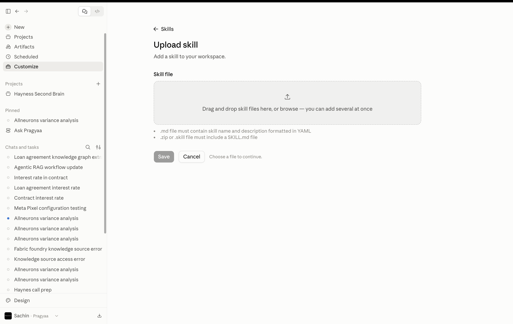
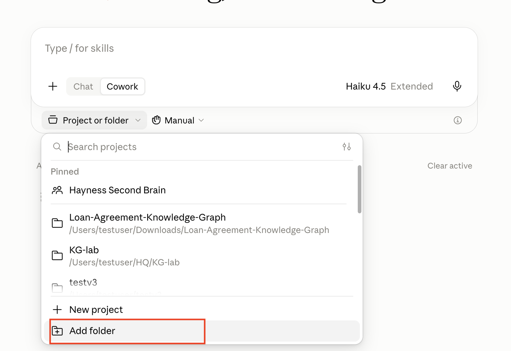
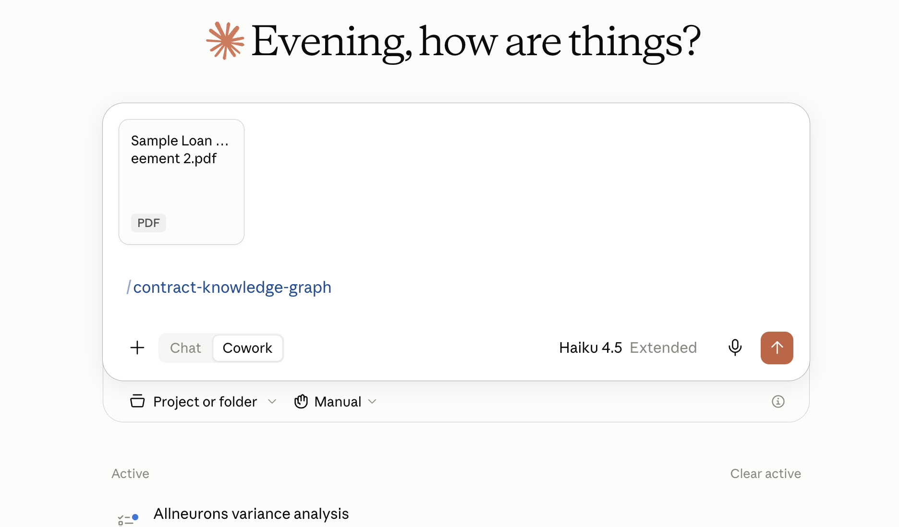
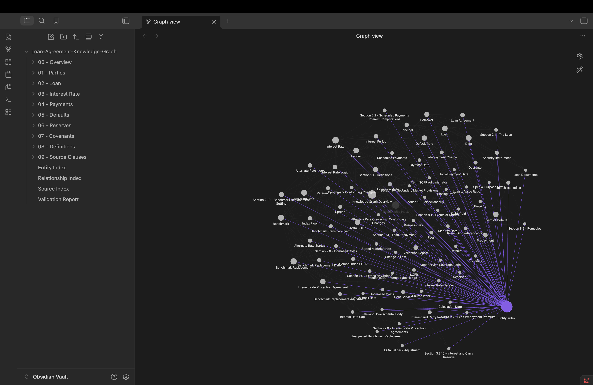

# Lab 2.4 — Creating a Context Brain on Graph

> **Who this is for:** No coding background needed. This guide walks you through every step, then explains what is happening under the hood.

---

## Table of Contents

1. [The Real Problem — Token Consumption](#1-the-real-problem--token-consumption)
2. [Before vs After — The Numbers](#2-before-vs-after--the-numbers)
3. [The Solution — A Context Brain](#3-the-solution--a-context-brain)
4. [How a Knowledge Graph Compresses Your Document](#4-how-a-knowledge-graph-compresses-your-document)
5. [Prerequisites — What to Download](#5-prerequisites--what-to-download)
6. [What Is a Claude Skill?](#6-what-is-a-claude-skill)
7. [Step 1 — Set Up the Skill in Claude](#7-step-1--set-up-the-skill-in-claude)
8. [Step 2 — Create a Project and Upload the Contract](#8-step-2--create-a-project-and-upload-the-contract)
9. [Step 3 — Invoke the Skill and Build Your Context Brain](#9-step-3--invoke-the-skill-and-build-your-context-brain)
10. [Step 4 — Visualize the Brain in Obsidian](#10-step-4--visualize-the-brain-in-obsidian)
11. [Understanding Entities and Relationships](#11-understanding-entities-and-relationships)
12. [Step 5 — Ask Questions Using the Context Brain](#12-step-5--ask-questions-using-the-context-brain)
13. [What Happened Behind the Scenes](#13-what-happened-behind-the-scenes)

---

## 1. The Real Problem — Token Consumption

In the previous lab, you uploaded a loan agreement and asked Claude questions about it. It worked. But there is a cost that most people never think about: **every word you send to Claude costs tokens**.

### What are tokens?

Tokens are the units AI models use to read and write. Roughly speaking:
- **1 token ≈ 4 characters of English text**
- A typical 30-page loan agreement = **~15,000 – 25,000 tokens**

Every time you start a new conversation and attach that contract, those tokens are consumed again — just to give Claude the context it needs to answer your question.

### The naive approach (what most people do)

```
Question 1:  Upload contract (20,000 tokens) + question (50 tokens)  = 20,050 tokens
Question 2:  Upload contract (20,000 tokens) + question (60 tokens)  = 20,060 tokens
Question 3:  Upload contract (20,000 tokens) + question (45 tokens)  = 20,045 tokens
                                                                       ─────────────
                                                              Total ≈  60,155 tokens
```

You are paying to re-read the entire document every single time. And despite that cost, the answers are often incomplete — because RAG retrieves chunks, not the connected meaning spread across sections.

---

## 2. Before vs After — The Numbers

Here is what this lab changes:

| | **Before — Raw Upload** | **After — Context Brain** |
|---|---|---|
| **What Claude reads per question** | The full contract (~20,000 tokens) | Compact graph files (~3,000–5,000 tokens) |
| **Tokens per question** | ~20,050 | ~3,050 |
| **Token reduction** | — | **~85% fewer tokens** |
| **Answer quality** | Partial — stops at the first matching chunk | Complete — follows cross-references to the full answer |
| **Re-upload needed?** | Every new conversation | No — the brain is built once and reused |
| **Can you inspect it?** | No — the document is a black box | Yes — every node and edge is visible in Obsidian |

> **The insight:** You spend tokens once to build the Context Brain. Every query after that uses only the compact, structured representation — not the raw document.

---

## 3. The Solution — A Context Brain

A **Context Brain** is a knowledge graph extracted from your document. Instead of storing your contract as pages of text, it stores it as a **network of connected facts**.

Think of it this way:

- A **raw document** is like a book. To find anything, you re-read the whole thing.
- A **Context Brain** is like a well-organized index combined with a map of how every topic connects. You jump straight to what matters and follow the connections.

Building the brain is a one-time cost. Once it exists, every question you ask uses only the lightweight graph — not the full document. Tokens drop. Accuracy goes up.

---

## 4. How a Knowledge Graph Compresses Your Document

A knowledge graph reads every clause and asks two questions:
- *What are the important things mentioned here?* — these become **Entities** (nodes)
- *How are those things connected?* — these become **Relationships** (edges)

### A simple example from a loan agreement

Take this clause:

> *"The Borrower shall repay the Principal Amount to the Lender on the Maturity Date at the Interest Rate specified in Schedule A."*

**Raw storage (what RAG does):** saves the entire sentence as a text chunk. Every time you ask about it, the whole chunk is sent.

**Context Brain storage (what this lab does):** saves only the structure:

```
[Borrower] ──REPAYS──► [Principal Amount]
[Principal Amount] ──PAID_TO──► [Lender]
[Repayment] ──OCCURS_ON──► [Maturity Date]
[Repayment] ──USES_RATE──► [Interest Rate]
[Interest Rate] ──DEFINED_IN──► [Schedule A]
```

Five short lines replace a full sentence — and they carry *more* meaning because the connections are explicit. When you ask *"What is the interest rate?"*, the brain follows the `DEFINED_IN` edge directly to Schedule A. No re-reading. No searching.

### Why this matters for answer quality

| Question | Raw upload / RAG | Context Brain (KG-RAG) |
|---|---|---|
| *"What is the interest rate?"* | The clause that mentions the rate | The clause + the schedule that defines the actual number |
| *"What triggers a default?"* | The most keyword-similar paragraph | The full chain: trigger → definition → consequences → notice requirements |
| *"Can the loan be repaid early?"* | The prepayment clause | The clause + the penalty formula + any referenced exhibit |

The more cross-referenced your document, the bigger the gap — in both token savings and answer completeness.

---

## 5. Prerequisites — What to Download

Before you start the lab, download and install the following:

- **Claude Skill file** — the skill that extracts the knowledge graph (Context Brain) from your contract
  [Download the Skill →](https://pragyaallc-my.sharepoint.com/:u:/g/personal/sachin_parmar_legalgraph_ai/IQAFc5y1wj7RQa1YLPVhsMslAa9EqcDaW3LFtUN--5k3F78?e=5eYchc)

- **Sample Contract** — the loan agreement you will use in this lab
  [Download the Contract →](https://pragyaallc-my.sharepoint.com/:b:/g/personal/sachin_parmar_legalgraph_ai/IQAoCWuA_rpWRq9eVWL6MJCeAeF0-mDO7j1ueQe6RxKL4mU?e=YvV2wc)

- **Foundation Lab** — complete this before starting if you have not already; it walks you through installing Obsidian and covers the core concepts this lab builds on
  [Open Foundation Lab →](foundation/Readme.md)

> Save the skill file and contract somewhere easy to find — you will need them in Steps 1 and 2.

---

## 6. What Is a Claude Skill?

### The idea

A **Claude Skill** is a set of instructions you give Claude once — and then Claude follows them automatically every time you invoke the skill, without you needing to explain the task again.

Think of it like hiring a specialist. Instead of explaining the job from scratch every time, you write a job description once and hand it to the specialist. From that point on, you just say *"do the thing"* and they know exactly what to do.

In this lab, the skill's job is:

> *"Read this contract. Extract every entity and every relationship between those entities. Save them as a structured set of Markdown files that form the Context Brain."*

You give Claude that instruction once (by uploading the skill file). After that, you just upload a contract and say *"run the skill"* — and Claude does the full extraction automatically.

---

### Skills vs. just asking Claude

You could ask Claude to extract entities from a contract without a skill. But you would need to:

- Write a detailed prompt every single time
- Hope Claude interprets "entity" and "relationship" the same way each time
- Manually copy the output into a format Obsidian can read

A skill packages all of that into one reusable, consistent unit. Same output format every time. No re-explaining required.

---

### Can you build your own skill?

Yes. A Claude Skill is a Markdown file that contains:

1. A **name** for the skill
2. A **description** of when to use it
3. **Instructions** telling Claude exactly what to do, step by step
4. Optionally: **output format rules** specifying how the result should be structured

You write it once, upload it to Claude's Customize section, and it becomes available in every conversation.

---

## 7. Step 1 — Set Up the Skill in Claude

### ▶ Open Claude and go to Customize

1. Open [Claude](https://claude.ai) in your browser
2. Click your **profile icon** in the bottom-left corner
3. Select **"Customize Claude"** from the menu


---

### ▶ Add the Skill

4. In the Customize panel, find the **Skills** section
5. Click **"Add"**
6. Select **"Upload a Skill"**
7. Browse to the skill file you downloaded in the Prerequisites section and select it
8. Click **Open** — the skill will appear in your skills list



> ✅ You should see the skill listed with its name. It is now available in every new conversation you start in Claude.

> You only need to do this once. The skill stays in your account until you remove it.

---

## 8. Step 2 — Create a Project and Upload the Contract

### ▶ Open a new chat 

1. Click **"New Chat"** in the Claude sidebar
2. Click on Project Fodler and add the folder that the claude skill have  reated for you the graph folder




---

### ▶ Upload the contract

6. Inside the Session, click the **paperclip icon** (or **"Attach files"**)
1. In the chat message box, type `/` — a list of available skills will appear
2. Select the **/contract-knowledge-graph** you uploaded in Step 1
3. Press **Enter**



> ✅ You should see the contract file listed above the message input. Claude can now read it.

> **This is the one time you pay the full token cost.** Claude reads the entire contract here — and converts it into a compact Context Brain. Every question you ask after this step uses only the brain, not the raw contract.


Claude will now read the contract and begin extracting entities and relationships. You will see it working in real time — identifying parties, dates, obligations, cross-references, and the connections between them.

> ✅ When Claude finishes, check the local folder you linked to the project. You will find a set of **Markdown files** — one file per entity, with links between files representing the relationships. This is your Context Brain.

> Each Markdown file represents one node in the graph. The `[[links]]` inside each file are the edges. Together they are a compressed, structured representation of the full contract — a fraction of the original token size.

---


5. In Obsidian, click **"Open folder as Vault"**
6. Navigate to the local folder that Claude wrote the Markdown files into and select it
7. Obsidian will load all the files
8. 


8. Click the **Graph View** icon in the left sidebar (it looks like a network of dots)


> ✅ You should see a visual graph — each node is an entity from the contract, and each line connecting two nodes is a relationship. Hover over any node to see its name. Click it to open the underlying Markdown file and read the details.

> This is the Context Brain you built. Every node is a compressed fact. Every edge is a connection the raw document expressed across paragraphs or pages. This is what Claude will use to answer your questions — not the full contract.

---

## Test it now in claude attach the loan agreementgraph folder with claude and ask the same question now you token consumption will be less compares to compete session 

## 11. Understanding Entities and Relationships

Before you start asking questions, it helps to know what you are looking at in the graph.

### Entities — the "things" in your contract

An entity is any named concept that matters in the contract. In a loan agreement, the main entities are:

| Entity | What it is |
|---|---|
| **Borrower** | The party receiving the loan |
| **Lender** | The party providing the loan |
| **Principal Amount** | The total sum being lent |
| **Interest Rate** | The cost of borrowing, expressed as a percentage |
| **Maturity Date** | The date by which the loan must be repaid |
| **Event of Default** | A condition that triggers the lender's right to demand repayment |
| **Schedule A** | An exhibit containing defined rates or terms |
| **Prepayment Penalty** | A fee charged if the borrower repays early |

In the graph, each of these appears as a **node** — a dot you can click.

---

### Relationships — the connections between them

A relationship is a labelled connection between two entities. In the graph, each connection is a **line with a label** describing how the two nodes relate.

Examples from a loan agreement:

| From | Relationship | To | Plain English |
|---|---|---|---|
| Borrower | `OWES` | Principal Amount | The borrower owes the principal |
| Interest Rate | `DEFINED_IN` | Schedule A | The rate is specified in Schedule A |
| Event of Default | `TRIGGERS` | Acceleration | A default lets the lender demand full repayment |
| Prepayment | `SUBJECT_TO` | Prepayment Penalty | Early repayment may incur a fee |
| Maturity Date | `GOVERNS` | Final Payment | The maturity date is when the last payment is due |

When you asked *"What is the interest rate?"* in the previous lab, RAG found the **Interest Rate** node — but stopped there. The Context Brain follows the `DEFINED_IN` edge all the way to **Schedule A** and reads what it says. That one extra step is what makes the answer complete — and it costs far fewer tokens to do it.

---

## 12. Step 5 — Ask Questions Using the Context Brain

Now you will ask the exact same questions you asked in Lab 2.3 — but this time Claude answers using the Context Brain, not the raw contract.

### ▶ Start a new session with the graph folder attached

1. In Claude, create a **new chat** inside the same project
2. The project already has access to your local folder — the Markdown graph files are available to Claude automatically

> You do not need to re-upload the contract. The Context Brain (the Markdown graph files Claude generated in Step 3) is in the project folder. Claude uses those — not the original PDF. This is where the token saving happens: the brain is ~85% smaller than the original contract.

---

### ▶ Ask the questions

Try these — the same ones that gave incomplete answers in the n8n lab:

> *"What is the interest rate on this loan?"*

> *"Can the borrower repay the loan early, and is there a penalty?"*

> *"What happens if the borrower misses a payment?"*

> *"What triggers an event of default?"*

> ✅ This time, you should see complete answers — ones that name actual values and conditions, not just phrases like *"as set forth in the applicable schedule."*

Watch how Claude's answers cite multiple sections. That is the graph traversal in action: it found the entry point through similarity, then followed the edges to collect the full picture before writing the answer — all from the compact Context Brain, not the full document.

---

## 13. What Happened Behind the Scenes

### Stage 1 — Building the Context Brain (one-time token cost)

```
You uploaded the raw contract  (~20,000 tokens — paid once)
        ↓
The skill instructed Claude to read every clause
        ↓
Claude identified entities: Borrower, Lender, Interest Rate, Schedule A, ...
        ↓
Claude identified relationships: Interest Rate → DEFINED_IN → Schedule A
        ↓
Claude wrote one Markdown file per entity, with [[links]] between related files
        ↓
Your local folder now contains the Context Brain  (~3,000–5,000 tokens total)
```

---

### Stage 2 — Answering questions (low token cost, every time)

```
You asked: "What is the interest rate?"  (~50 tokens)
        ↓
Claude searched the brain files for the most relevant entity  (~3,000 tokens)
        ↓
Claude followed the DEFINED_IN edge to Schedule A
        ↓
Claude read Schedule A's content
        ↓
Claude synthesised both into a single complete answer
        ↓
Answer includes the actual rate — not just a pointer to where it lives
Total cost per question: ~3,050 tokens  (vs. ~20,050 with the raw contract)
```

---

### Full comparison

| | **Raw Upload (Lab 2.3)** | **Context Brain — this lab** |
|---|---|---|
| **How it stores the document** | As chunks in a vector store or raw file | As a graph of connected Markdown files |
| **Tokens per question** | ~20,050 (full doc every time) | ~3,050 (compact brain only) |
| **Token reduction** | — | ~85% fewer |
| **How it retrieves** | Finds the most similar chunk | Finds the most relevant entity, then traverses edges |
| **Cross-references** | Retrieves the clause that contains the reference | Follows the reference to its target |
| **Answer completeness** | High for self-contained clauses | High for cross-referenced, multi-section information |
| **What you can inspect** | The chunk that was retrieved | The full brain in Obsidian — every node and edge |

The raw-upload approach is simple and works well for short documents. The Context Brain approach pays a one-time extraction cost and then answers every future question faster, cheaper, and more accurately — especially for complex, cross-referenced documents like legal contracts.

---

> **What's next:** The next lab takes this further — building a Context Brain that spans *multiple* related documents, so you can ask questions that pull context from an entire contract set, not just a single file.
