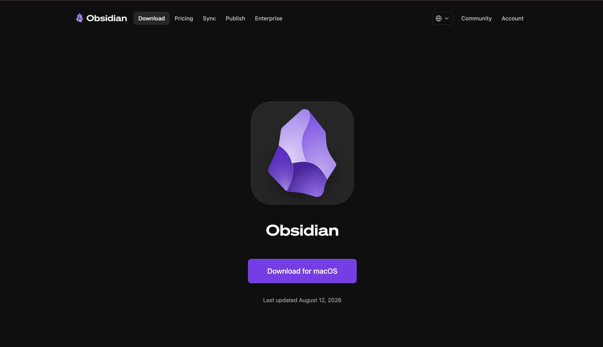

# Installing Obsidian

## What is Obsidian?

Obsidian is a knowledge-management and note-taking application that lets you create and organize notes using **Markdown**.  
It allows you to **link related notes** and visualize connections between them as a knowledge graph.  
In this lab, we will use Obsidian to **visualize entities and relationships extracted from the contract**.

## Steps to Install Obsidian

1. Go to the official [Obsidian Download Page](https://obsidian.md/download).
2. Select your operating system:
   - **Windows**
   - **macOS**
3. Click the **Download** button.

4. Open the downloaded installation file.
5. Follow the **on-screen instructions** to complete the installation.
6. Launch **Obsidian** after the installation is finished.
7. Create or open a **Vault** where you will store your Markdown files.
