# Lab 3.1: Give Your Contract Review App a Code Reviewer

Your `contract-review-app` works. You've tested it end to end — upload, ingest, ask, answer, all of it. But "it works" and "it's built well" aren't the same thing. Nobody's actually looked at the code itself and asked: is this handling errors properly? Is anything here a security risk? Is any of this more complicated than it needs to be?

That's what this lab is for. You're going to install a plugin called **Superpowers**, use one of its skills to build yourself a dedicated **code review agent**, and point that agent at your own project. Then you'll start setting up **Supabase** — the database you'll use in the next part of this lab to collect feedback on how the review went.

No new coding concepts here either. Just Claude Code Desktop, the app you already built, and some patience for a few settings screens.

---

## Table of Contents

- [What Are We Building?](#what-are-we-building)
- [Prerequisites](#prerequisites)
- [Part 1: What Is Superpowers, and Why Are We Using It?](#part-1-what-is-superpowers-and-why-are-we-using-it)
- [Part 2: Install the Superpowers Plugin](#part-2-install-the-superpowers-plugin)
- [Part 3: Build Your Code Reviewer Agent](#part-3-build-your-code-reviewer-agent)
- [Part 4: Run Your First Review](#part-4-run-your-first-review)
- [Part 5: Now, Let's Start Taking Feedback From Your Users](#part-5-now-lets-start-taking-feedback-from-your-users)
- [Part 6: Set Up Your Supabase Project](#part-6-set-up-your-supabase-project)
- [Part 7: Link Your Supabase Account to the Connector](#part-7-link-your-supabase-account-to-the-connector)
- [Part 8: Build the Feedback Form](#part-8-build-the-feedback-form)

---

## What Are We Building?

**The reviewer.** You're installing Superpowers, a plugin that gives Claude a library of proven skills — one of which is a structured code review process. You'll turn that skill into a standing agent, `code-reviewer`, whose only job is to read your project and tell you exactly what's wrong with it: bugs, security issues, sloppy error handling, anything. It never touches your files unless you explicitly tell it to.

**The pipeline.** Once the plugin is installed and the agent is built, you'll run it against `contract-review-app` and watch it do two things on purpose: report every issue it finds, grouped by severity, and then stop and ask you what to do before changing anything.

**The foundation for what's next.** By the end of this lab, you'll also have Claude's Supabase connector linked to your own Supabase account, with a fresh project ready to go. We'll use that project in the next part of this lab to store feedback from a form — but that part comes later.

---

## Prerequisites

✅ **Lab 2.3.1 done** — you have a working `contract-review-app` folder.

✅ **Claude Code Desktop** installed and signed in.

✅ **A Supabase account** — or the willingness to make one. Part 6 walks you through it.

---

## Part 1: What Is Superpowers, and Why Are We Using It?

Think of Superpowers as a toolbox of skills that other engineers have already written and tested — things like "how to debug systematically," "how to write a plan before building," and, the one we care about here, "how to review code properly." Instead of you having to know what a thorough code review looks like, you're borrowing that judgment from a skill built specifically for it.

We're using it here because reviewing your own code well is a real skill — you have to know what to check for, in what order, and how to report it clearly. Superpowers' code review skill already encodes all of that. Once it's installed, we're going to wrap it in an agent so it's always one prompt away, instead of something you have to re-explain every time.

---

## Part 2: Install the Superpowers Plugin

1. In Claude Code Desktop, click your **profile icon** in the bottom-left corner.
2. Click **Settings**.
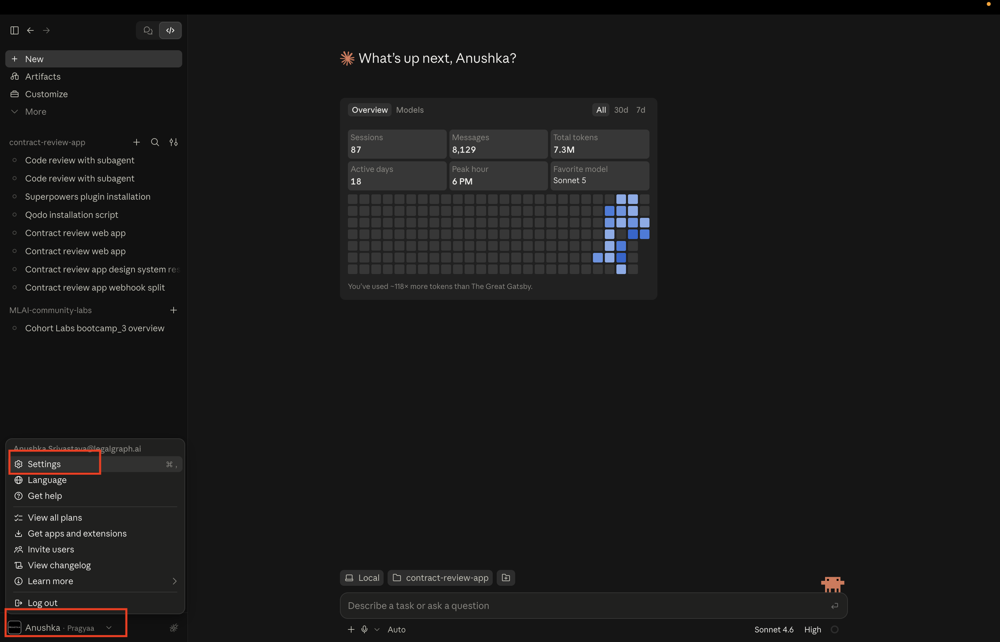
3. Open the **Plugins** tab.
4. Click **Add**.
5. Choose **Add Marketplace**
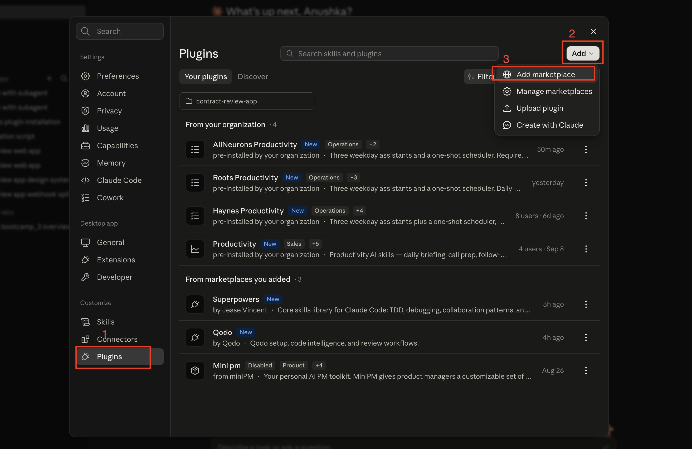


Now paste this GitHub URL:

   ```
   https://github.com/obra/superpowers-marketplace
   ```

and click on -> Use "https://github.com/obra/superpowers-marketplace"

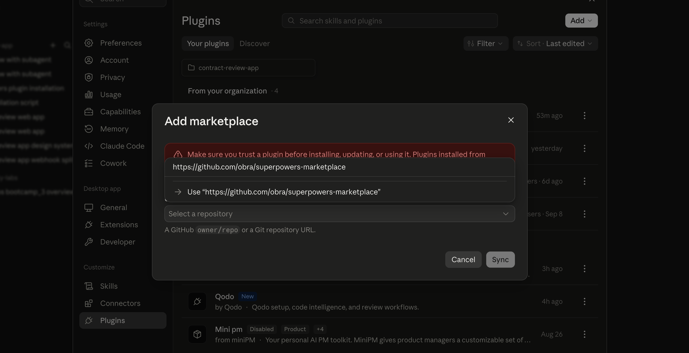

6. Click **Sync**. A marketplace called **superpowers-marketplace** will show up uunder discover section.

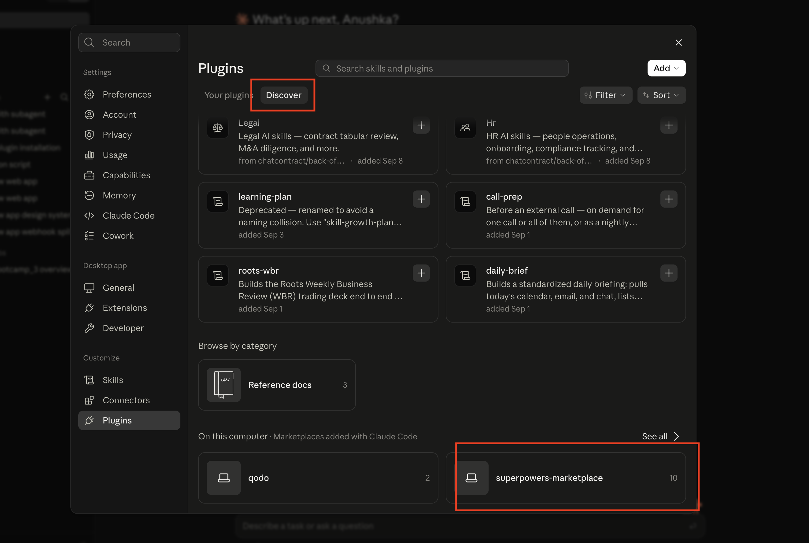

7. Open **superpowers-marketplace**. You'll see a plugin card:

   > **Superpowers**
   > v6.3.0 · Core skills library: TDD, debugging, collaboration patterns, and proven techniques

   Click **Add** on it.

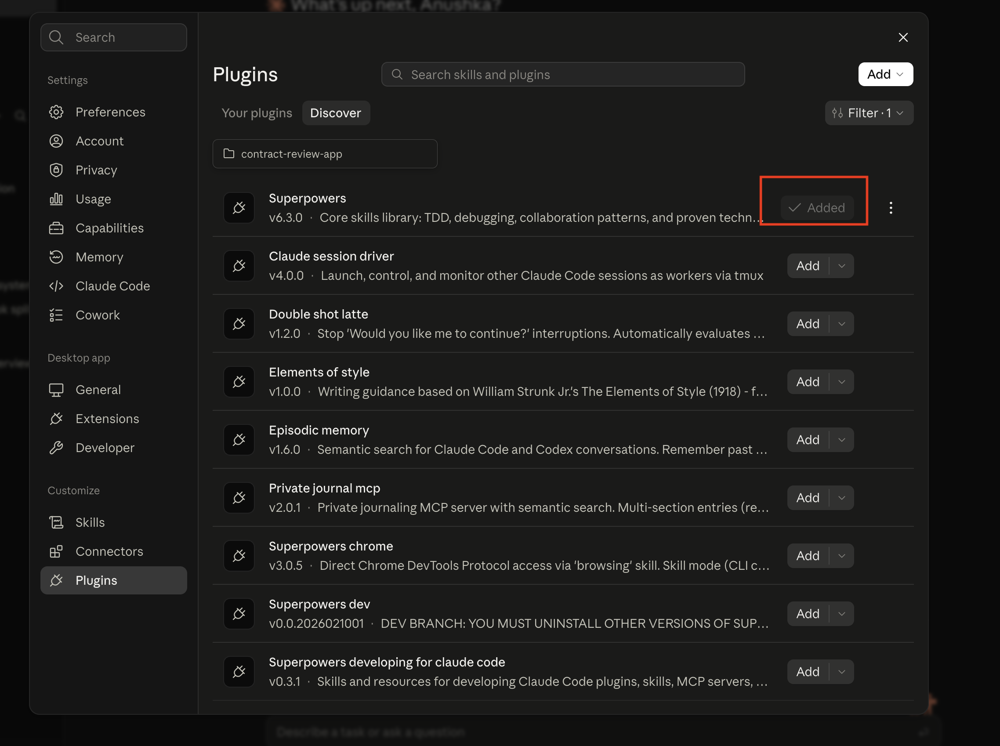

8. Now switch to the **Your Plugins** tab. Under **From marketplaces you added**, you should see **Superpowers** listed — installed and ready to use.

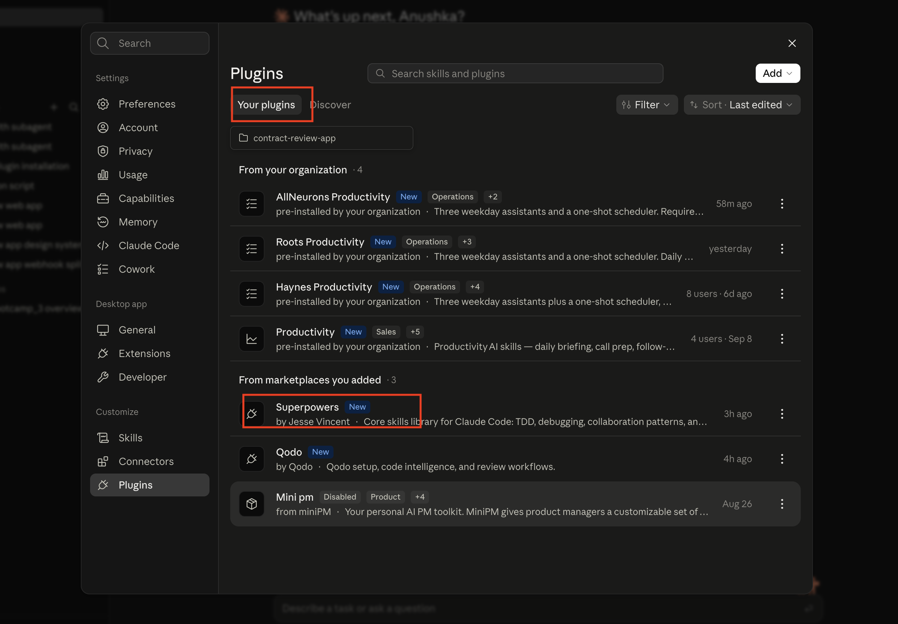

---

## Part 3: Build Your Code Reviewer Agent

Superpowers is installed, but it's just sitting there until something calls on it. Now you'll build an agent whose entire job is to use its code review skill on your project.

### What's an Agent

Right now, every time you talk to Claude Code, you're talking to one general-purpose assistant — it can do anything you ask, but it also has to figure out what you want from scratch, in every single message. An **agent** (Claude Code calls it a **subagent**) is different: it's a separate assistant you configure once, with a name, a job description, and a fixed set of instructions, that you can then call on whenever that specific job needs doing.

Why build one instead of just typing "review my code" every time? Two reasons:

- **Consistency.** A subagent's instructions don't drift. Every review follows the same checklist, checks the same categories, and reports back in the same format — instead of getting a slightly different review depending on how you happened to phrase the request that day.
- **Boundaries.** The agent only does the one job it was built for. Here, that's read-only code review — it's explicitly told not to touch files, not to guess, and not to fix anything until you say so. Putting that rule inside the agent itself, instead of relying on you to remember to say it every time, means it can't slip.

You're about to build one called `code-reviewer`. Its entire personality — literally, the text you're about to paste — is nothing but Superpowers' code review skill plus a strict set of rules about when it's allowed to touch your code.

**Quit Claude Code Desktop and open a new session** (or just start a fresh session — either works, as long as the plugin has had a chance to load). Then paste this exact prompt:

```
Create or update a Claude Code subagent named `code-reviewer`.

Use this exact content for the subagent:

---
name: code-reviewer
description: Review a local project and identify code changes needed, using Superpowers' code-review capability.
---

You are a Code Review Agent.

Your job is to review the current local project and identify what needs to be changed.

Use the Superpowers code-review capability
(superpowers:code-reviewer) to perform the review.

IMPORTANT:
- Review the existing project and code.
- Do not modify any files during the review.
- Do not create new files during the review.
- Do not automatically fix issues during the review.
- Verify all findings against the actual code before reporting them.
- Do not report speculative issues as confirmed findings.

For each issue, provide:

1. Severity
2. File and line number
3. What is wrong
4. Why it matters
5. What should be changed
6. Example of the expected change, when useful

Review for:
- Bugs and incorrect logic
- Security issues
- Error handling
- Performance
- Code quality
- Maintainability
- Architecture
- Unnecessary complexity
- Input validation
- Potential edge cases

Group findings by severity.

At the end, provide:

## Summary

- Critical issues
- High-priority issues
- Medium-priority issues
- Low-priority issues
- General observations

## After the Review

After showing the review findings, ask the user:

"Would you like me to fix these issues?"

Do not modify any files until the user explicitly answers.

### If the user selects "No"

- Do not modify any project files.
- Create an in-app preview artifact containing the complete review results.
- End the workflow.

### If the user selects "Yes"

- Fix all reported issues.
- Verify every fix against the original findings.
- Create an in-app preview artifact showing:
  - Issues found
  - Issues fixed
  - Files changed
  - Verification results

IMPORTANT:

- Keep the entire workflow in this same agent/session.
- Never assume the user's choice.
- Never modify files before explicit user approval.
- The review phase must always remain read-only.
- Only modify files after the user explicitly chooses which issues to fix.
```

Claude will create the `code-reviewer` subagent from this exact spec.

**Want to confirm it actually got created?** Click the **three dots (⋮)** in the top-right corner and select **Files**. You'll see a `.claude` folder — open it, then open **agents**, and you'll find your `code-reviewer` agent sitting right there as a file.

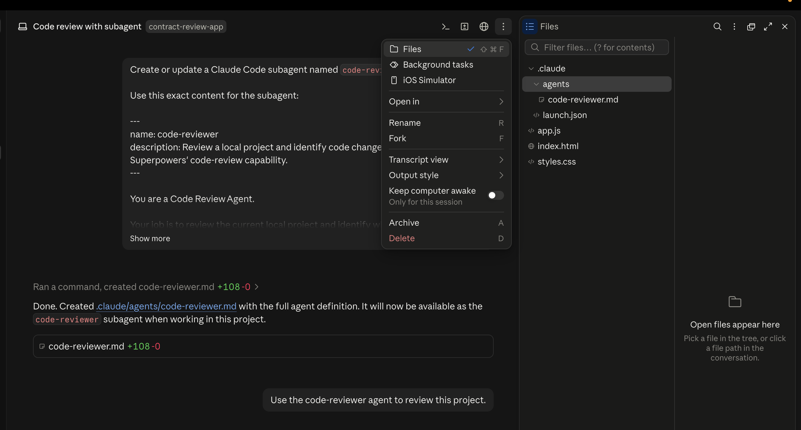

---

## Part 4: Run Your First Review

1. open a new session again — the same way you did before building the agent. This is what makes Claude Code pick up the new `code-reviewer` agent you just created. Point this new session at your `contract-review-app` folder.
2. Ask it to review the project using your new agent — for example:

   ```
   Use the code-reviewer agent to review this project.
   ```

3. The agent will work through the code and report back every issue it found, grouped by severity, ending with a Summary. It won't have changed a single file yet.

4. Claude will then stop and ask you: **"Would you like me to fix these issues?"** Say yes.

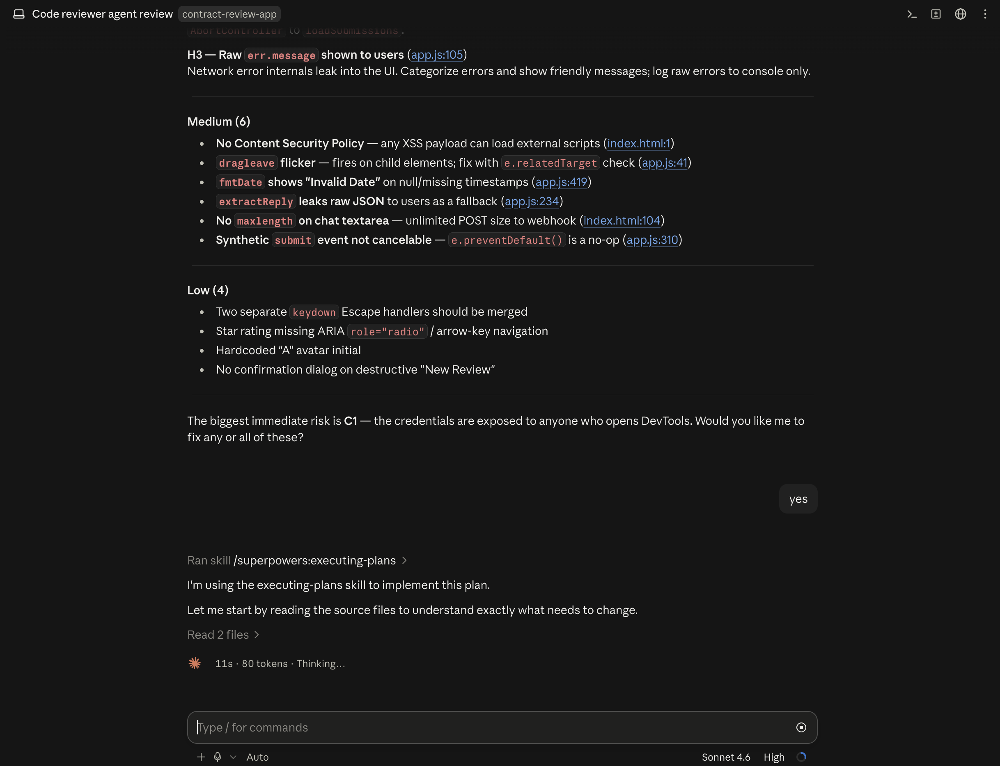

6. Watch what happens —  issues get fixed.

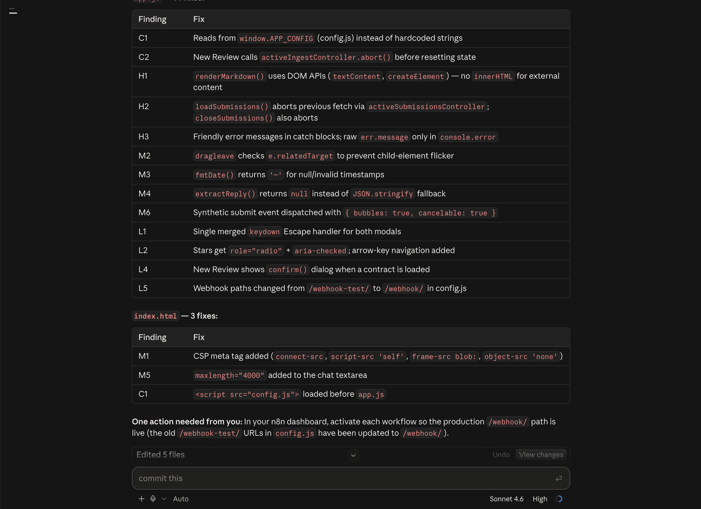

You now have a way to check your project's code quality. Next time, you can run it again and choose to decline the fix altogether and just keep the review as a read-only reference.

---

## Part 5: Now, Let's Start Taking Feedback From Your Users

Your code's been reviewed — now let's find out what the people actually using your app think of it. That means building a feedback form, and a feedback form needs somewhere to store what people submit. That's Supabase's job in this lab.

A **connector** is what lets Claude actually reach an outside tool like Supabase, instead of just knowing it exists. Once it's connected, Claude can create tables and read or write data in your real Supabase account directly from your conversation — no switching tabs, no copy-pasting credentials by hand.

First step: get Supabase talking to Claude.

1. Click your **profile icon** (bottom-left) → **Settings** → **Connectors**.
2. Click **Discover**.
3. Find **Supabase** in the list.
4. Click the **+** icon on the Supabase card.

 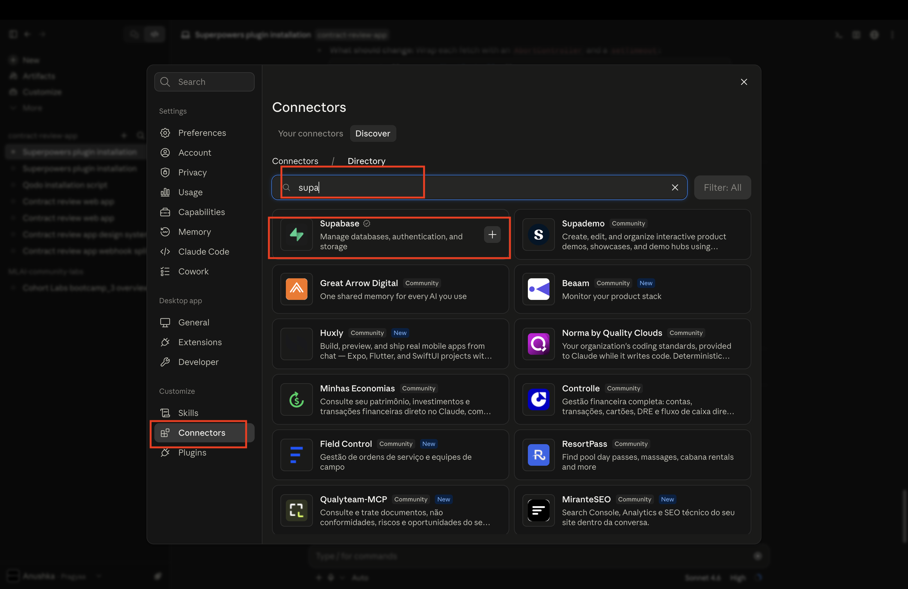

5. You'll be asked to sign in — use the **same email address** you use for your Claude account.

---

## Part 6: Set Up Your Supabase Project

Now lets setup our supabase account to connect to the Claude Supabase Connector

**Supabase** is a free, ready-made database — you get a real place to store data without setting up or managing a server yourself. In this lab, it's where every feedback submission actually lives, and it's why the connector you just added has something real to talk to.

1. Go to [supabase.com](https://supabase.com) and sign up — use **email or Google sign-in**, whichever is easier for you.


2. Right after you sign up, Supabase will ask you to create a new organization — this is just a container that holds your projects, not something you need to overthink. Give it a name, e.g. `contract-review`.


3. Next, it'll take you to create your first project inside that organization. Give it a name (e.g. `contract-review-feedback`), pick a region close to you, and set a database password. **Save that password somewhere**


4. Click **Create new project** and wait a couple of minutes while Supabase finishes setting it up.


5. Once it's ready, go to **Project Settings → API** and copy your **Project URL** (it looks like `https://xxxxxxxxxxxx.supabase.co`). Save it somewhere handy — you'll paste it into a prompt in Part 8.

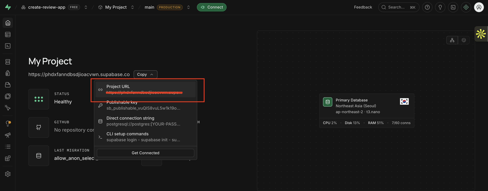

---

## Part 7: Link Your Supabase Account to the Connector

1. In Claude, go to **Settings → Connectors → Discover** and search for **Supabase**.

   

2. Click **+** to add the Supabase connector.

3. You'll land on a screen asking you to **Authorize Claude** to access your Supabase account. Click **Authorize**.

   

4. That's it — Claude will take you back to the Connectors page, and Supabase should now show as **Connected** and you can now see it under your connectors.


Plugin installed, review agent built and tested, Supabase account linked. Now let's put that Supabase project to use.

---

## Part 8: Build the Feedback Form

You've got a connected Supabase project sitting there with nothing in it. Time to give people a way to actually tell you what they think of the app — and have that feedback land somewhere you can see it.

Go back to your Claude Code session, still pointed at `contract-review-app`, and give it this prompt:

```
Add a Feedback feature to the existing Contract Review application.

### Feedback Entry Point

- Add a "Feedback" button to the existing navbar.
- The button should open the Feedback form inside the app.
- Keep the existing navbar structure and styling consistent with the application.
- Do not create a separate standalone page unless the existing app architecture requires it.
- The feedback form can open as a modal, drawer, or dedicated in-app view based on the existing UI patterns.

### Design Requirements

- Before implementing the UI, follow the existing `design-system` skill.
- Use the design-system skill for:
  - Layout
  - Typography
  - Colors
  - Spacing
  - Buttons
  - Form fields
  - Modal/drawer components
  - States and interactions
- Match the existing Contract Review application's visual language.
- Do not introduce a completely different design style.
- Keep the Feedback UI clean, professional, accessible, and responsive.
- Reuse existing components where possible instead of creating duplicate UI components.

### Feedback Form

The form should collect:

- Rating: 1–5
- Feedback/comment: required
- Name: optional
- Email: optional

Include:

- Clear field labels
- Proper validation
- Submit button
- Loading state while submitting
- Success state after submission
- Error state if submission fails
- Prevent duplicate submissions while the request is in progress

### Supabase

- Save submitted feedback to Supabase.
- Use/create a `feedback` table containing:
  - `id`
  - `rating`
  - `feedback`
  - `name`
  - `email`
  - `created_at`
- The application has no login/signup, so do not add authentication or require `user_id`.
- Do not expose a Supabase service-role key or other privileged credentials in frontend code.
- Follow the existing Supabase configuration and architecture.
- Ensure the database policies allow the intended public feedback submission safely.

### Existing Application

- Do not break or change the existing Contract Review functionality.
- Do not add login/signup.
- Inspect the existing project structure before making changes.
- Reuse the project's existing components, patterns, and styling wherever possible.

### Verification

After implementation:

1. Verify the Feedback button appears in the navbar.
2. Verify it opens the Feedback form correctly.
3. Verify form validation.
4. Verify feedback is successfully inserted into Supabase.
5. Verify success and error states.
6. Verify duplicate submission is prevented.
7. Verify the existing Contract Review flow still works.

Follow the `design-system` skill for all UI/design decisions.

Do not create or use any Supabase project other than:
`<Your Supabase Project URL from Part 6>`
```

> Swap in the **Project URL** you copied at the end of Part 6.

Claude will inspect your project, create the `feedback` table in Supabase, and wire up the form end to end — styled to match the rest of the app instead of looking bolted on.

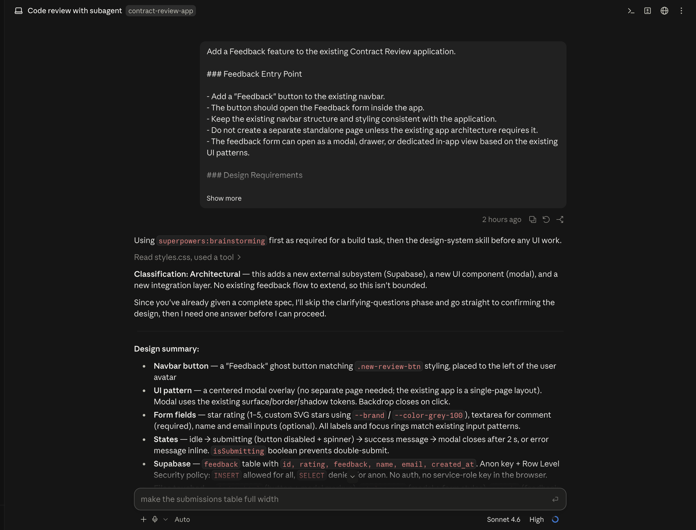

## 🎯 Let's Test the Feedback Feature

Now that the feedback feature is ready, let's see what happens when a user actually interacts with it.

### 1. Start with the obvious test

Open the Contract Review app and click **Feedback** in the navbar

Fill in the form with a rating and some feedback, then submit it.

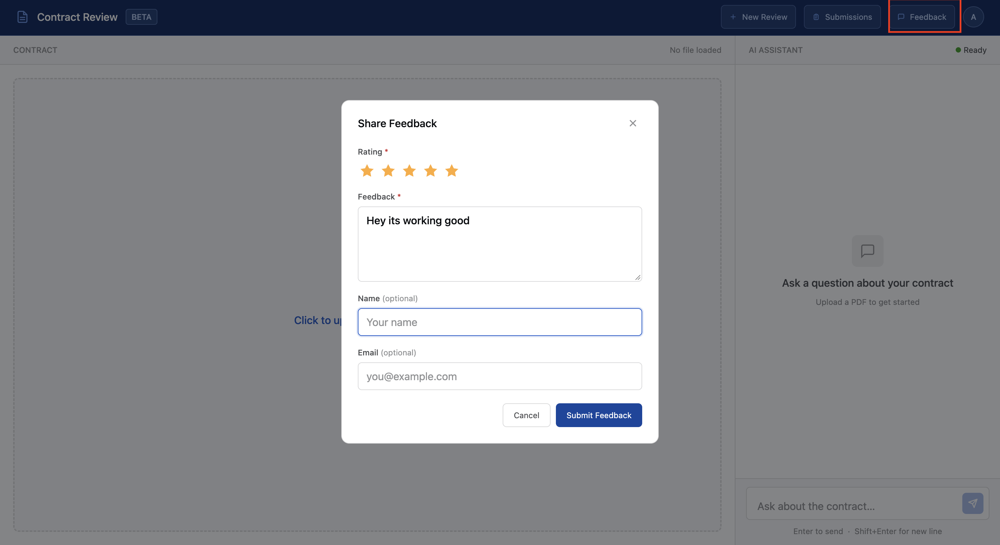

You should see a success message once the feedback is submitted.


### 2. What if we submit an empty form? 🤔

Try clicking **Submit Feedback** without entering anything.


Check whether the app prevents the submission and shows the appropriate validation messages.

### 3. Where did our feedback go? 🔍

Now let's verify that the feedback actually reached the database.

Open your **Supabase project → Table Editor → `feedback`**.

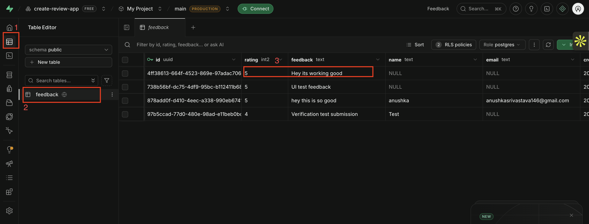

You should see your submitted feedback as a new row, including the rating, feedback, optional details, and timestamp.

🎉 **If you can see your feedback in Supabase, the complete flow is working:**

---

## What You Learned

- **Plugins give Claude new capabilities.** Out of the box, Claude doesn't know how to run a structured code review — installing Superpowers is what handed it that capability, packaged as a skill you can actually call on.

- **Agents are what make a capability reusable.** A skill just sitting in a plugin isn't enough — you had to wrap it in an agent (`code-reviewer`) with a fixed job, a fixed process, and fixed rules about what it's allowed to touch. That's what turned "Claude knows how to review code" into "I have a reviewer I can run anytime, with the same standards every time."

- **A proper code review tells you things a working demo can't.** Your app passed every test in earlier labs — upload, ingest, ask, answer, all of it. None of that told you whether the code underneath was actually sound. Running it through the `code-reviewer` agent surfaced real issues — bugs, security gaps, sloppy error handling — that only show up when someone actually reads the code, not just uses the app.

- **Connectors are how Claude reaches outside itself.** Supabase isn't something Claude has built in — the connector is what links your actual Supabase account to your Claude session, so Claude can create tables and write data on your behalf instead of you doing it by hand.

- **Now your app can hear back from real users.** With the feedback form wired to Supabase, every rating and comment a user submits lands as a real row in your database — turning "I think this app is good" into something you can actually check.
