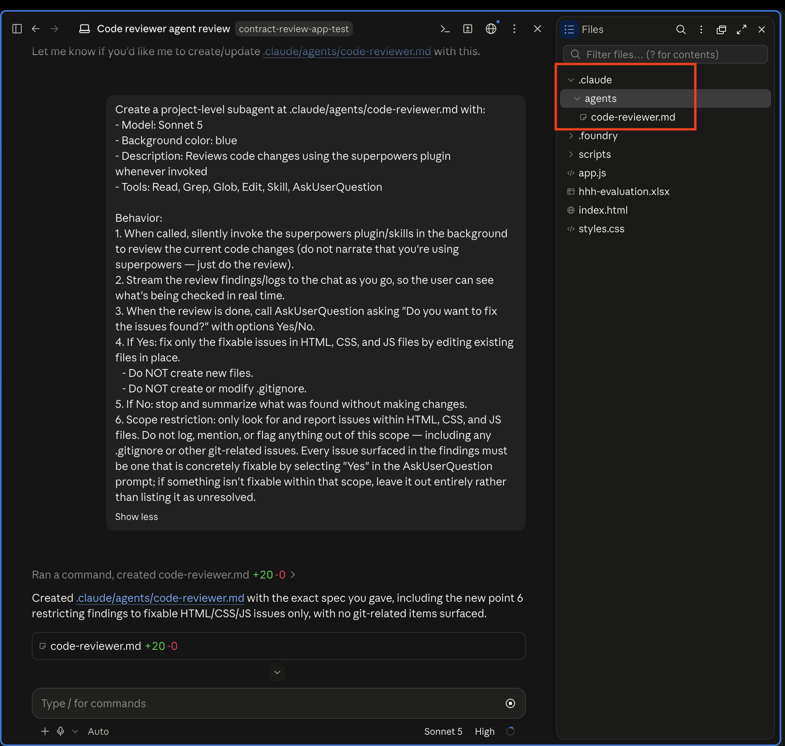
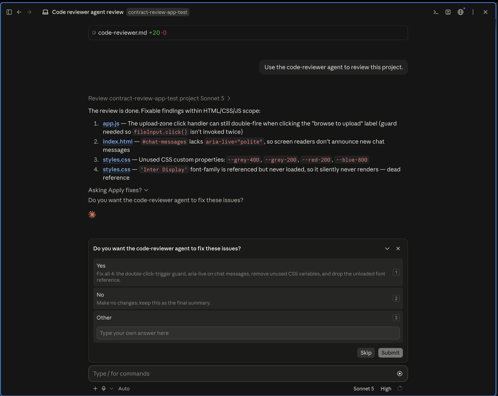
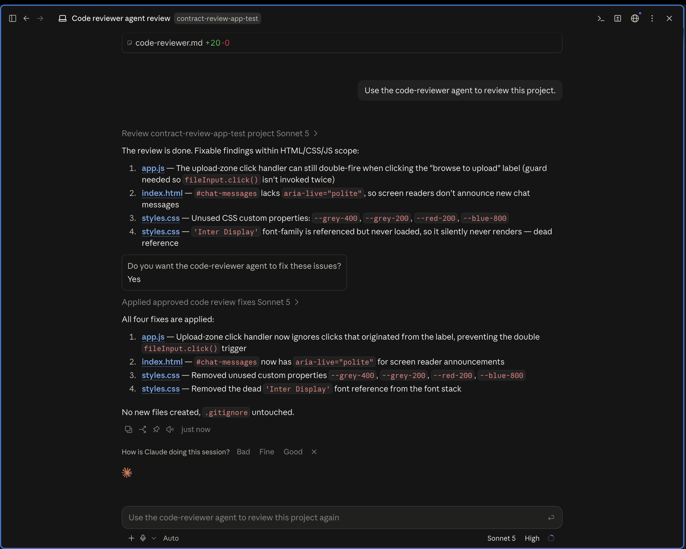

# Lab 3.1.1: Review Your App Using Claude's Sub Agent

## From Working to Well-Built — Give Your App a Standing Code Reviewer

You built `contract-review-app` in week 1, then updated its backend in week 2. It works — you've tested it end to end — upload, ingest, ask, answer, all of it. But "it works" and "it's built well" aren't the same thing. Nobody's actually looked at the code itself and asked: is this handling errors properly? Is anything here a security risk? Is any of this more complicated than it needs to be?

That's what this lab fixes. You're going to install a plugin called **Superpowers**, use one of its skills to build yourself a dedicated **code review agent**, and point that agent at your own project.

Here's the flow for this lab:

- **Review the code.** We'll turn Superpowers' code review skill into a standing agent, `code-reviewer`, and run it against `contract-review-app` to see every issue it finds.

---

## Table of Contents

- [Prerequisites](#prerequisites)
- [Part 1: Review the Code](#part-1-review-the-code)
- [Part 2: Install the Superpowers Plugin](#part-2-install-the-superpowers-plugin)
- [Part 3: Build Your Code Reviewer Agent](#part-3-build-your-code-reviewer-agent)
- [Part 4: Run Your First Review](#part-4-run-your-first-review)

---

## Prerequisites

✅ **Lab 2.3.1 done** — you have a working `contract-review-app` folder.

✅ **Claude Code Desktop** installed and signed in.

---

## Part 1: Review the Code

Your app works, and you've confirmed it end to end — upload, ingest, ask, answer, all of it. But "it works" and "it's built well" aren't the same thing. Nobody's actually looked at the code itself and asked: is this handling errors properly? Is anything here a security risk? Is any of this more complicated than it needs to be?

The honest answer is: you probably can't tell either. Knowing what a thorough code review looks like — what to check, what actually counts as an issue versus nitpicking — takes its own expertise. So instead of guessing, we're going to borrow that judgment from somewhere it's already been built and tested.

---

## Part 2: Install the Superpowers Plugin

For a structured, repeatable code review, we're going to use a plugin called **Superpowers**. It's a library of pre-built skills — including one made specifically for reviewing code — so you get a proper checklist instantly instead of writing your own from scratch.

### What's a Plugin

Right now, Claude Code only knows how to do what it comes with out of the box. A **plugin** is how you extend that — it's a packaged bundle of extra skills that someone else has already built, tested, and shared, that you can just add to your own Claude Code setup instead of building from scratch.

Why install one instead of teaching Claude everything yourself? Two reasons:

- **You don't have to reinvent it.** Someone already figured out what a good code review checklist looks like, tested it, and packaged it as a skill. Installing the plugin means you get that expertise instantly, instead of writing your own from a blank page.
- **It stays with your setup.** Once installed, the plugin's skills are available any time you open Claude Code — not just for this one project — so you only ever do this install step once.

Let's install the plugin

1. In Claude Code Desktop, click your **profile icon** in the bottom-left corner.
2. Click **Settings**.

3. Open the **Plugins** tab.
4. Click **Add**.
5. Choose **Add Marketplace**


Now paste this GitHub URL:

   ```
   https://github.com/obra/superpowers-marketplace
   ```

and click on -> Use "https://github.com/obra/superpowers-marketplace"


6. Click **Sync**. A marketplace called **superpowers-marketplace** will show up uunder discover section.


7. Open **superpowers-marketplace**. You'll see a plugin card:

   > **Superpowers**
   > v6.3.0 · Core skills library: TDD, debugging, collaboration patterns, and proven techniques

   Click **Add** on it.


8. Now switch to the **Your Plugins** tab. Under **From marketplaces you added**, you should see **Superpowers** listed — installed and ready to use.


---

## Part 3: Build Your Code Reviewer Sub-Agent

Superpowers is installed, but it's just sitting there until something calls on it. And realistically, you're not going to remember to type out exactly the right request, with the right instructions, every single time you want a review. So instead, we're going to turn it into a standing agent — something you can call on by name, that already knows exactly what to check and how to report back.

### What's a Sub-Agent

Right now, every time you talk to Claude Code, you're talking to one general-purpose assistant — it can do anything you ask, but it also has to figure out what you want from scratch, in every single message. An **agent** (Claude Code calls it a **subagent**) is different: it's a separate assistant you configure once, with a name, a job description, and a fixed set of instructions, that you can then call on whenever that specific job needs doing.

Why build one instead of just typing "review my code" every time? Two reasons:

- **Consistency.** A subagent's instructions don't drift. Every review follows the same checklist, checks the same categories, and reports back in the same format — instead of getting a slightly different review depending on how you happened to phrase the request that day.
- **Boundaries.** The agent only does the one job it was built for. Here, that's read-only code review — it's explicitly told not to touch files, not to guess, and not to fix anything until you say so. Putting that rule inside the agent itself, instead of relying on you to remember to say it every time, means it can't slip.

You're about to build one called `code-reviewer`. Its entire personality — literally, the text you're about to paste — is nothing but Superpowers' code review skill plus a strict set of rules about when it's allowed to touch your code.

**Quit Claude Code Desktop and open a new session** (or just start a fresh session — either works, as long as the plugin has had a chance to load). Then paste this exact prompt:

```
Create a project-level subagent at .claude/agents/code-reviewer.md with:
- Model: Sonnet 5
- Background color: blue
- Description: Reviews code changes using the superpowers plugin whenever invoked
- Tools: Read, Grep, Glob, Edit, Skill, AskUserQuestion

Behavior:
1. When called, silently invoke the superpowers plugin/skills in the background to review the current code changes (do not narrate that you're using superpowers — just do the review).
2. Stream the review findings/logs to the chat as you go, so the user can see what's being checked in real time.
3. When the review is done, call AskUserQuestion asking "Do you want to fix the issues found?" with options Yes/No.
4. If Yes: fix only the fixable issues in HTML, CSS, and JS files by editing existing files in place.
   - Do NOT create new files.
   - Do NOT create or modify .gitignore.
5. If No: stop and summarize what was found without making changes.
6. Scope restriction: only look for and report issues within HTML, CSS, and JS files. Do not log, mention, or flag anything out of this scope — including any .gitignore or other git-related issues. Every issue surfaced in the findings must be one that is concretely fixable by selecting "Yes" in the AskUserQuestion prompt; if something isn't fixable within that scope, leave it out entirely rather than listing it as unresolved.
```

Claude will create the `code-reviewer` subagent from this exact spec.

**Want to confirm it actually got created?** Click the **three dots (⋮)** in the top-right corner and select **Files**. You'll see a `.claude` folder — open it, then open **agents**, and you'll find your `code-reviewer` agent sitting right there as a file.



> **Note:** Make sure you're doing this inside the same `contract-review-app` folder you've been working in this whole time — if you're in a different folder, you won't see the agent, even though it was created successfully.

---

## Part 4: Run Your First Review

1. Open a new session again — the same way you did before building the agent. This is what makes Claude Code pick up the new `code-reviewer` agent you just created. Point this new session at your `contract-review-app` folder.
2. Ask it to review the project using your new agent — for example:

   ```
   Use the code-reviewer agent to review this project.
   ```

3. The agent will work through the code and report back every issue it found, grouped file by file    
   -`app.js`
   -`index.html`
   -`styles.css` 

It won't have changed a single file yet.

4. Claude will then stop and ask you: **"Would you like me to fix these issues?"** Say yes.



5. Watch what happens — issues get fixed.



You now have a way to check your project's code quality. Next time, you can run it again and choose to decline the fix altogether and just keep the review as a read-only reference.

---

## What You Learned

- **Plugins give Claude new capabilities.** Out of the box, Claude doesn't know how to run a structured code review — installing Superpowers is what handed it that capability, packaged as a skill you can actually call on.

- **Agents are what make a capability reusable.** A skill just sitting in a plugin isn't enough — you had to wrap it in an agent (`code-reviewer`) with a fixed job, a fixed process, and fixed rules about what it's allowed to touch. That's what turned "Claude knows how to review code" into "I have a reviewer I can run anytime, with the same standards every time."

- **A proper code review tells you things a working demo can't.** Your app passed every test in earlier labs — upload, ingest, ask, answer, all of it. None of that told you whether the code underneath was actually sound. Running it through the `code-reviewer` agent surfaced real issues — bugs, security gaps, sloppy error handling — that only show up when someone actually reads the code, not just uses the app.

---

Your code is in good shape now. But you still don't know if the app is actually satisfying anyone using it — that's what the next lab finds out.

[Go to Lab 3.1.2: Give Your Contract Review App a Feedback Form →](../3.1.2-connectors-feedback-form/Readme.md)
