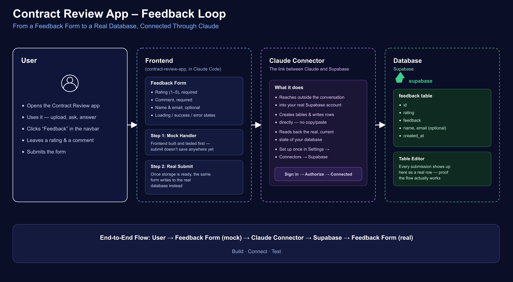
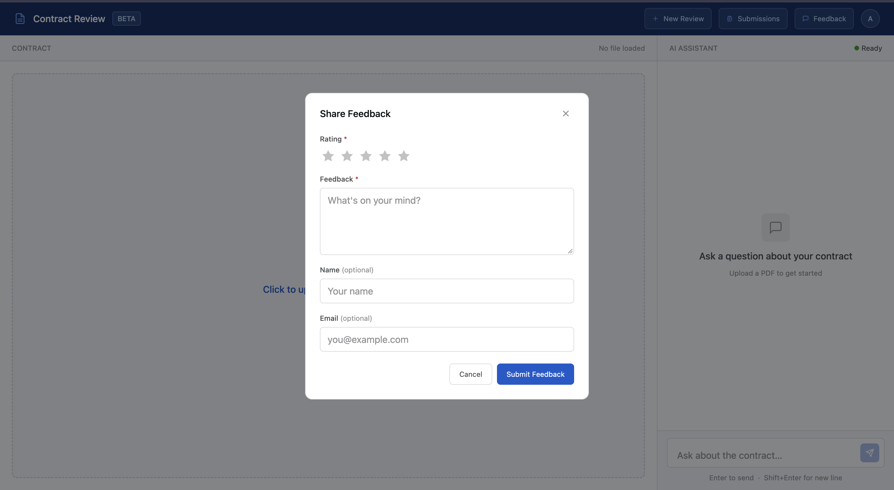
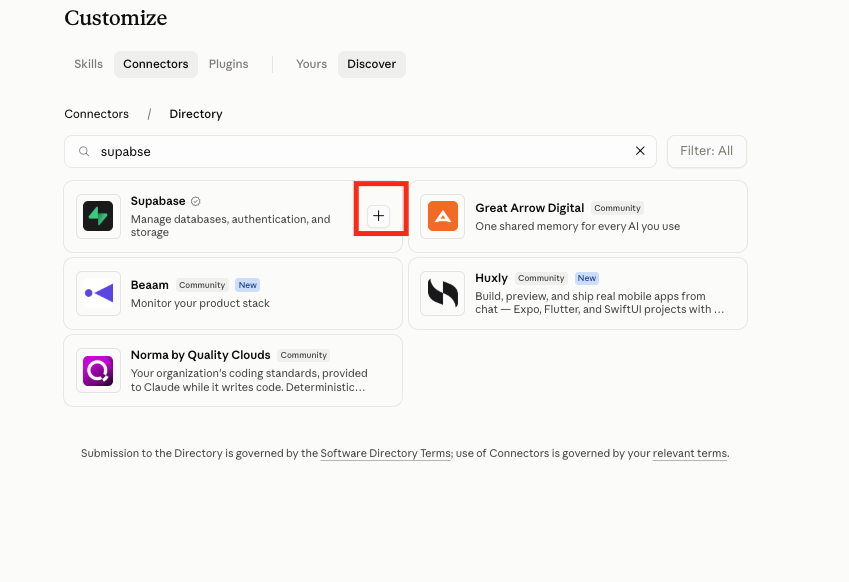
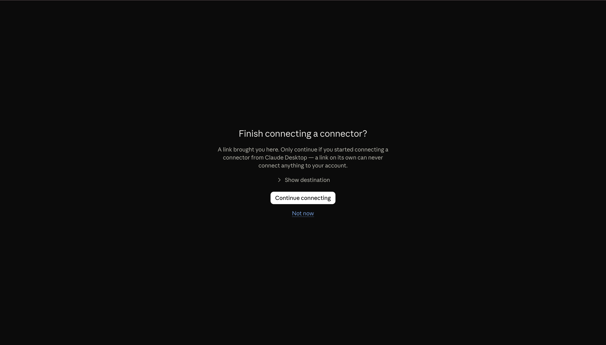
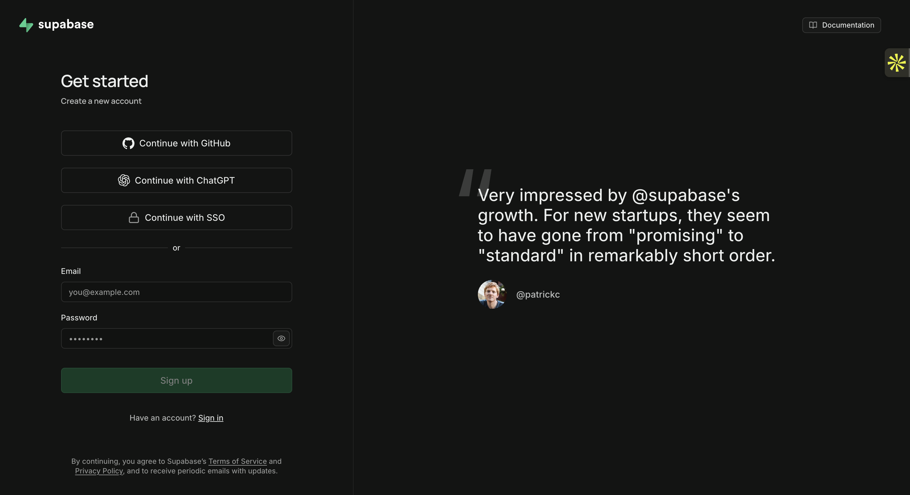
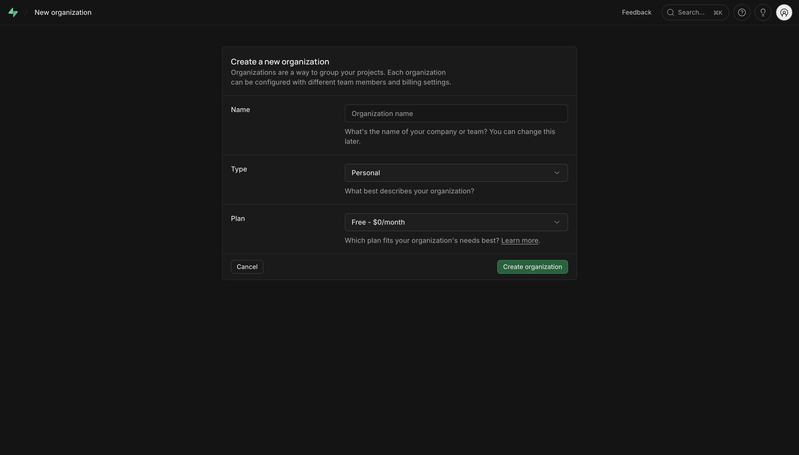
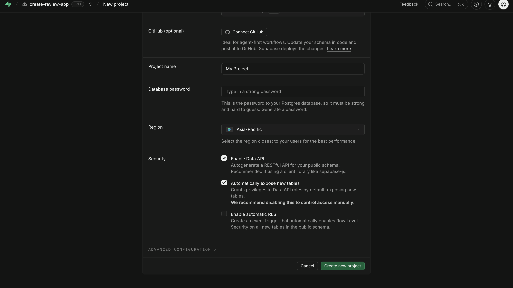
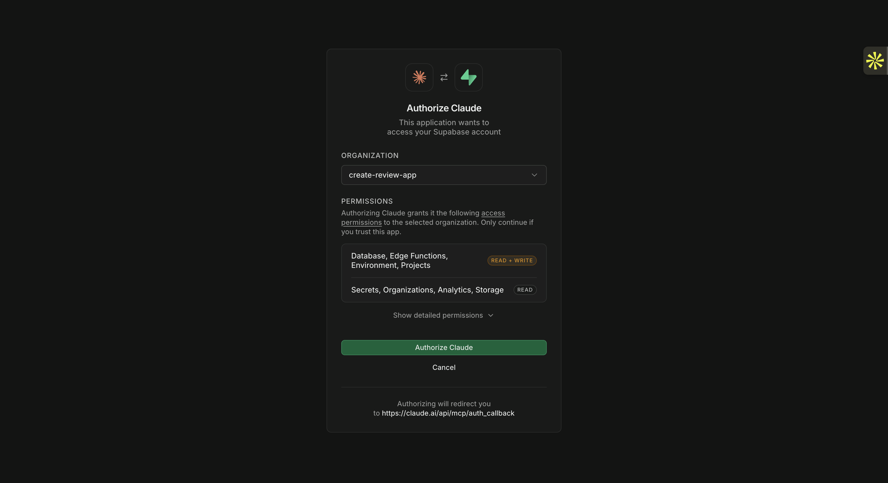
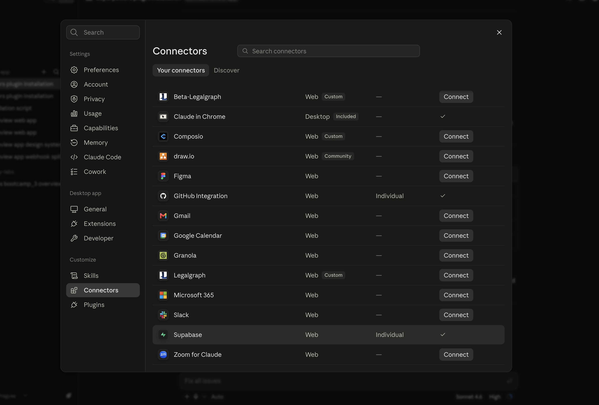
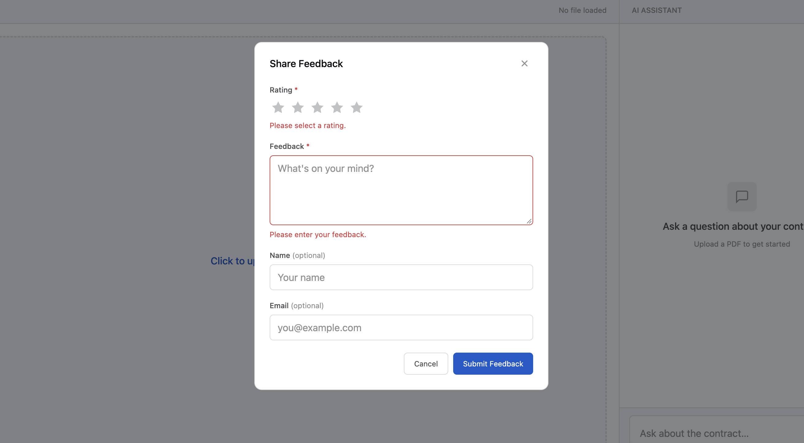

# Lab 3.1.2: Give Your Contract Review App a Feedback Form



In [Lab 3.1.1](../3.1.1-code-review-subagent/Readme.md), you reviewed `contract-review-app`'s code with a dedicated `code-reviewer` agent and fixed what needed fixing. The code's in good shape now — but "the code is sound" and "you know it satisfies the people using it" aren't the same thing. You haven't actually asked anyone.

That's what this lab fixes. You're going to build a feedback form so real users can tell you what they think, then connect it to a real database — **Supabase** — through something called a **connector**, so those answers don't just vanish.

Here's the flow for this lab:

- **Build a feedback form.** So real users can tell you how the app is doing.
- **Store it in Supabase, connected through Claude.** So every submission lands in a real database instead of disappearing.

---

## Table of Contents

- [Prerequisites](#prerequisites)
- [Part 1: Build a Feedback Form](#part-1-build-a-feedback-form)
- [Part 2: Store the Feedback Somewhere Real](#part-2-store-the-feedback-somewhere-real)
- [Part 3: Connect Database to Claude (the Connector)](#part-3-connect-database-to-claude-the-connector)
- [Part 4: Set Up Your Supabase Account and Project](#part-4-set-up-your-supabase-account-and-project)
- [Part 5: Finish Connecting Supabase to Claude](#part-5-finish-connecting-supabase-to-claude)
- [Part 6: Connect the Feedback Form to Supabase](#part-6-connect-the-feedback-form-to-supabase)
- [Part 7: Test the Feedback Feature](#part-7-test-the-feedback-feature)

---

## Prerequisites

✅ **Lab 3.1.1 done** — you have a working `contract-review-app` with its code already reviewed.

✅ **Claude Code Desktop** installed and signed in.

---

Your app works. You've tested it yourself, end to end. But "it works for me" isn't the same as "it works for the people using it." You don't actually know whether `contract-review-app` is satisfying anyone else — whether the answers it gives are useful, whether the flow makes sense, whether people would even want to keep using it.

The only way to find out is to ask. **The solution: a feedback form** — a simple way for users to tell you what they think, right inside the app they're already using.

---

## Part 1: Build a Feedback Form

The obvious first move is the one you'd expect: build the form itself.

Go to your Claude Code session, pointed at `contract-review-app`, and give it this prompt:

```
Add a Feedback feature to the existing Contract Review application.

Build only the frontend for the Feedback form.

- Add a "Feedback" button to the existing navbar.
- Open the form inside the app using the existing UI pattern (modal, drawer, or in-app view).
- Inspect the existing project structure and reuse existing components.
- Before implementing, follow the existing `design-system` skill for layout, typography, colors, spacing, buttons, form fields, and states.
- Keep the design consistent with the existing Contract Review application.
- Do not add login/signup.
- Do not change or break existing Contract Review functionality.

Feedback form fields:
- Rating: 1–5, required
- Feedback/comment: required
- Name: optional
- Email: optional

Include:
- Clear labels
- Client-side validation
- Submit button
- Loading state
- Success state
- Error state
- Prevent duplicate submissions while submitting

For this step, do NOT integrate Supabase yet. Use a temporary/mock submit handler so the complete frontend flow can be tested.
```

Claude will build the form itself — styled to match the rest of the app.



It works — you can click through the whole flow, even see a fake success state. But hit submit for real and nothing actually happens: there's nowhere for that data to land yet. Once real users start filling this out, where does their feedback actually go?

---

## Part 2: Store the Feedback Somewhere Real

Right now the feedback form works, but its submit handler is fake — fill it out, hit submit, and the data just disappears into nothing. You need a real database — somewhere to actually store every rating and comment that comes in.

You could build that yourself: set up a database, write the code that talks to it, handle authentication, write the API endpoints that let your form send data back and forth. That's a lot of work, and it's exactly the kind of work that's easy to get wrong.

So instead of building and wiring up a database by hand, we're going to let Claude connect to database directly. Using Claude Connectors - A connector allows Claude to interact with another tool for you. Instead of switching between Claude and Database, copying information, or creating everything manually, Claude can use the connector to work with database directly.
for database we are going to use Supabase - Supabase is an online platform where we can store and manage the data our application needs. You can think of it as a ready-to-use place for keeping information, so we don’t need to build our own database from scratch.

---

## Part 3: Connect Database to Claude (the Connector)

Right now, Claude can't reach anything outside this conversation on its own — it doesn't know your Supabase account exists. A **connector** is how you fix that: it's a direct link between Claude and an outside tool, so Claude can actually reach in and use it instead of just knowing the tool exists.

Let's start setting that up:

1. Click your **profile icon** (bottom-left) → **Settings** → **Connectors**.
2. Click **Discover**.
3. Find **Supabase** in the list.
4. Click the **+** icon on the Supabase card.




5. Claude will show a **"Finish connecting a connector?"** screen. Click **Continue connecting**.



6. Next, it'll ask you to sign in to Supabase — except you don't have an account yet. To actually connect Claude to a database, you first need a real Supabase account with a project in it. Let's go set that up now, then come back and finish this.

---

## Part 4: Set Up Your Supabase Account and Project

**Supabase** is a free, ready-made database — you get a real place to store data without setting up or managing a server yourself. In this lab, it's where every feedback submission actually lives.

1. Go to [supabase.com](https://supabase.com) and sign up — use **email or Google sign-in**, whichever is easier for you.



2. Right after you sign up, Supabase will ask you to create a new organization — this is just a container that holds your projects, not something you need to overthink. Give it a name, e.g. `contract-review`.



3. Next, it'll take you to create your first project inside that organization. Give it a name (e.g. `contract-review-feedback`), pick a region close to you, and set a database password.

```
contract-review-feedback
```



4. Click **Create new project** and wait a couple of minutes while Supabase finishes setting it up.

5. Once it's ready, copy your **Project URL** (it looks like `https://xxxxxxxxxxxx.supabase.co`). Save it somewhere handy — you'll paste it into a prompt in Part 6.


---

## Part 5: Finish Connecting Supabase to Claude

Your Supabase account and project are ready. Now let's go back and finish the connection you started in Part 3.

1. Go back to Claude → **Settings** → **Connectors**, and click the **+** icon on the Supabase card again.

2. You'll land on a screen asking you to **Authorize Claude** to access your Supabase account. Click **Authorize**.



3. That's it — Claude will take you back to the Connectors page, and Supabase should now show as **Connected**, and you can see it listed under your connectors.



Your Supabase account is set up, and Claude is now connected to it. Let's put that connection to use.

---

## Part 6: Connect the Feedback Form to Supabase

Your Supabase account is ready, and Claude is connected to it. Now let's go back and replace that mock submit handler with the real thing — wiring the feedback form you already built to your actual Supabase project.

Go back to your Claude Code session, still pointed at `contract-review-app`, and give it this prompt:

> Replace `<YOUR SUPABASE PROJECT URL>` in the prompt below with the Supabase Project URL you copied in Part 4.

```
Integrate the existing Feedback form with Supabase.

- Inspect the existing Supabase configuration and architecture first.
- Use only the existing Supabase project:
  <YOUR SUPABASE PROJECT URL>

- Do not create or use another Supabase project.
- Create/use a `feedback` table with:
  `id`, `rating`, `feedback`, `name`, `email`, `created_at`
- No authentication or `user_id` is required because the app has no login/signup.
- Connect the existing Feedback form submission to Supabase.
- Add safe database policies allowing public feedback submission.
- Never expose a Supabase service-role key or privileged credentials in frontend code.
- Preserve the existing frontend design and `design-system` implementation.
- Handle loading, success, error, validation, and duplicate-submission states correctly.

Verify:
1. Feedback button opens the form.
2. Valid feedback is inserted into Supabase.
3. Invalid input is rejected.
4. Success/error states work.
5. Duplicate submissions are prevented.
6. Existing Contract Review functionality still works.
```

Claude will inspect your Supabase setup, create the `feedback` table to store the feedback submitted by users.

---

## Part 7: Test the Feedback Feature

Now that the feedback feature is ready, let's see what happens when a user actually interacts with it.

### 1. Start with the obvious test

Open the Contract Review app and click **Feedback** in the navbar.

Fill in the form with a rating and some feedback, then submit it.


You should see a success message once the feedback is submitted.

### 2. What if we submit an empty form? 🤔

Try clicking **Submit Feedback** without entering anything.



Check whether the app prevents the submission and shows the appropriate validation messages.

### 3. Where did our feedback go? 🔍

Now let's verify that the feedback actually reached the database.

Open your **Supabase project → Table Editor → `feedback`**.


You should see your submitted feedback as a new row, including the rating, feedback, optional details, and timestamp.

🎉 **If you can see your feedback in Supabase, the complete flow is working.**

---

### Plugins vs. Connectors — When to Use Which

Between [Lab 3.1.1](../3.1.1-code-review-subagent/Readme.md) and this lab, you've now used both a plugin and a connector — and they solve two different problems. Here's how to tell them apart:

| | Plugin | Connector |
|---|---|---|
| **What it gives Claude** | A new skill or way of working — like knowing how to run a proper code review | Access to an external account or tool you already have — like your real Supabase database |
| **Where it lives** | Attached to Claude Code itself, so it's available in every project you open, not just this one | Attached to your Claude account, so Claude can reach outside into that specific service |
| **When to reach for it** | You want Claude to know *how* to do something it doesn't do by default | You want Claude to actually read or write real data somewhere else, not just know that tool exists |

---

## What You Learned

- **Connectors are how Claude reaches outside itself.** Supabase isn't something Claude has built in — the connector is what links your actual Supabase account to your Claude session, so Claude can create tables and write data on your behalf instead of you doing it by hand.

- **Now your app can hear back from real users.** With the feedback form wired to Supabase, every rating and comment a user submits lands as a real row in your database — turning "I think this app is good" into something you can actually check.

---

Feedback tells you how people feel about the app — it doesn't tell you whether each answer is actually correct. That's the gap the next lab closes.

[Go to Lab 3.2: Find Out If Your Agent's Answers Are Actually Good →](../../3.2-microsoft-foundry-eval-plugin/Readme.md)
