# Lab 3.2: Evaluating Your n8n AI Agent with Azure AI Foundry

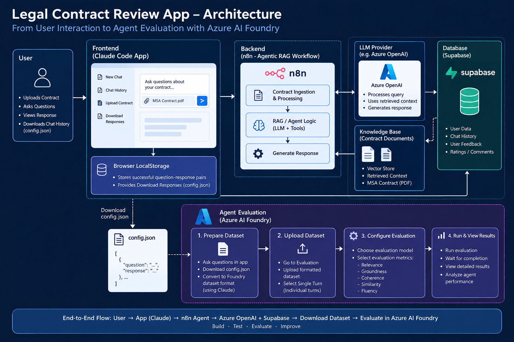

## Closing the Loop — From Building to Measuring What Your Agent Actually Does

You have come a long way. Over the previous weeks you built a contract-review app, wired it to an n8n agentic RAG backend, and connected a Supabase database to capture user feedback. The app works — but "it works" is not the same as "it works well." That gap is exactly what this lab closes.

This week the focus is **evaluation**. You will measure how well your agent actually answers questions by running a structured eval inside Azure AI Foundry. By the end of this lab you will have a scored report across five quality dimensions — Relevance, Groundedness, Coherence, Similarity, and Fluency — that tells you, with numbers, how your agent is performing.

---

## Prerequisites

Before you begin, confirm all of the following are in place:

1. You have completed all labs from the previous weeks.
2. The contract-review app you have been building since Week 1 is running locally in Claude Code.
3. You have access to an Azure account where you can create an Azure AI Foundry resource. New accounts receive $300 in free credits — you will set this up in Step 4.
4. Download the MSA (Master Services Agreement) sample contract — **[Download From Here]** — you will upload this into your app when generating the dataset.

**Video walkthrough**: [Watch the full lab walkthrough](https://youtu.be/Is3GgsCEPho?si=WhCt7DQQG_UOMP2o)

---

## Phase 1: Prepare Your App to Export Data

### Step 1: Add the "Download Responses" Feature to Your App

**What you're doing**: Teaching your app to remember every successful chat exchange and give you a way to export it. This exported file becomes your evaluation dataset.

**Why this matters**: Azure AI Foundry needs a dataset of real question-and-answer pairs to evaluate. The cleanest source for that dataset is your own app, with real answers from your own agent. Rather than hand-crafting examples, you'll generate them naturally by chatting with the app — and the Download button captures them automatically.

**Action items**:

1. Open Claude Code with your contract-review app project.
2. Run the following prompt exactly as written:

```
Update the existing contract-review-app to save successful chatbot questions and responses using browser `localStorage`.
Requirements:
- Do not create or use a backend/server for saving responses.
- After every successful chatbot response, automatically save the user's exact question and assistant's exact response to `localStorage`.
- Save only successful responses. Do not save errors or failed requests.
- Append new question-response pairs without removing previous ones.
- After the first successful response, show a `Download Responses` button.
- When clicked, export all saved question-response pairs from `localStorage` as a `config.json` file.
- Keep updating `localStorage` as the user asks more questions.
- If `Download Responses` is clicked again, download the latest `config.json` containing all successful responses.
- Keep the existing contract upload and chatbot functionality unchanged.
- Do not make any other changes.

Export `config.json` in this format:
[
  {
    "question": "What is the effective date?",
    "response": "April 1, 2023"
  }
]
```

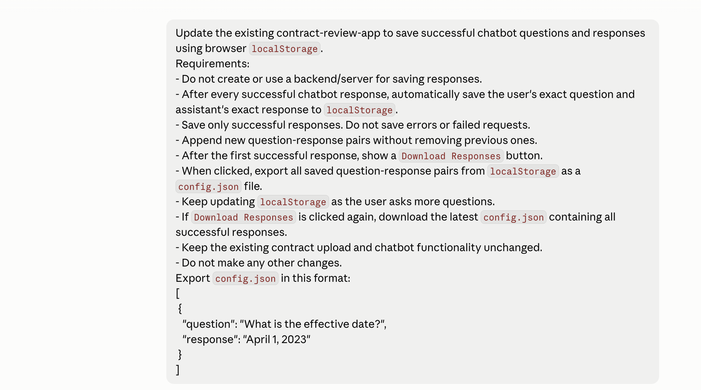

3. Claude Code will update your app. Once it finishes, run your app and verify it still loads correctly.
4. Upload the MSA contract you downloaded in the Prerequisites step.

**Output**: Your app now silently logs every successful Q&A pair in the browser's localStorage. A "Download Responses" button will appear after your first successful chat response.

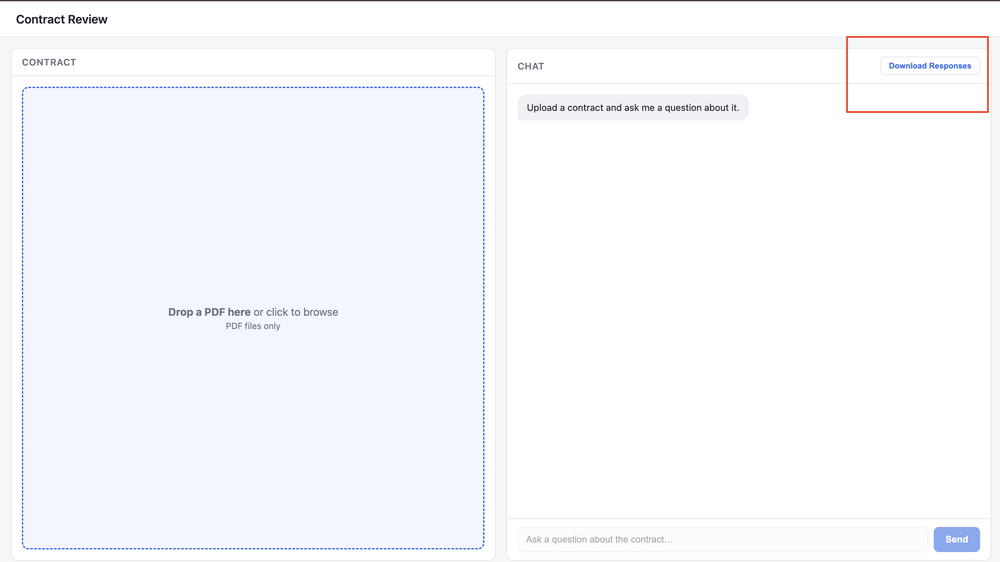

---

## Phase 2: Generate Your Evaluation Dataset

### Step 2: Ask the Five Evaluation Questions

**What you're doing**: Using your live agent to answer five carefully chosen contract-law questions, generating the raw material for your evaluation dataset.

**Why these five questions**: Each question targets a different clause category — termination, IP, liability, payment, and dispute resolution. Together they give the evaluator broad coverage of how well your agent handles the full contract, not just one narrow topic.

**Action items**:

1. Make sure the MSA contract is uploaded in your app's contract section.
2. Go to the chat section of your app.
3. Ask each of the following five questions, one at a time. Wait for a complete response before moving to the next:

> **Question 1**: What is the termination notice period, and what payments are still owed if either party terminates the agreement?

> **Question 2**: Who owns the intellectual property created during the services, and what rights does the Client receive to use the Service Provider's intellectual property?

> **Question 3**: What is the Service Provider's maximum liability under this agreement, and what types of damages are excluded?

> **Question 4**: What are the payment terms, including the invoice due date, late-payment fee, and deadline for disputing an invoice?

> **Question 5**: How are disputes resolved, and where would mediation or arbitration take place?

4. After all five responses appear, confirm that no errors occurred. All five must be successful responses for the dataset to be complete.

**Output**: Five question-and-answer pairs are now stored in your browser's localStorage.

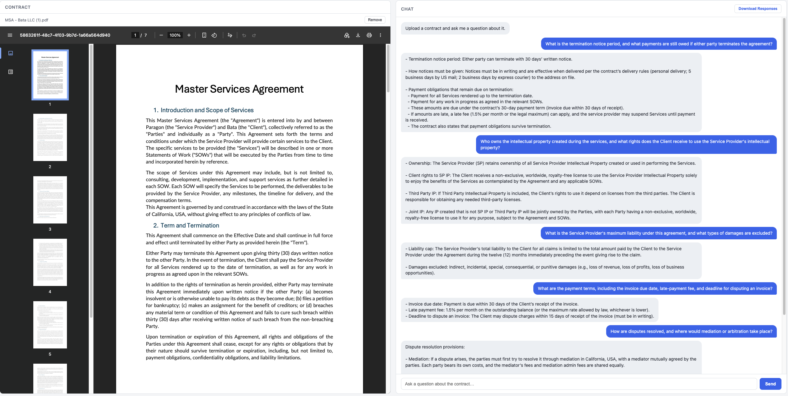

---

### Step 3: Download Your Responses

**What you're doing**: Exporting the five Q&A pairs as a `config.json` file that you will convert into a properly formatted evaluation dataset in the next phase.

**Action items**:

1. Look for the **Download Responses** button that appeared in your app after the first successful response.
2. Click it. A file named `config.json` will download to your machine.
3. Open the file and verify it contains all five question-response pairs in the correct format. It should look like this:

```json
[
  {
    "question": "What is the termination notice period...",
    "response": "The agreement requires 30 days written notice..."
  },
  ...
]
```

4. Keep this file handy — you will need it in the next step.

**Output**: A `config.json` file on your machine containing your agent's answers to the five contract questions.

---

## Phase 3: Set Up Azure AI Foundry

### Step 4: Create Your Azure AI Foundry Account and Project

**What you're doing**: Creating the cloud workspace where the evaluation will run before you touch anything else in Foundry.

> **Note**: If you already have an Azure AI Foundry account and project from a previous lab, skip ahead to Step 5.

**Action items**:

1. Go to Azure AI Foundry and create a new account. [Watch: How to create an Azure AI Foundry account](https://youtu.be/Is3GgsCEPho?si=WhCt7DQQG_UOMP2o). New accounts receive $300 in free credits.

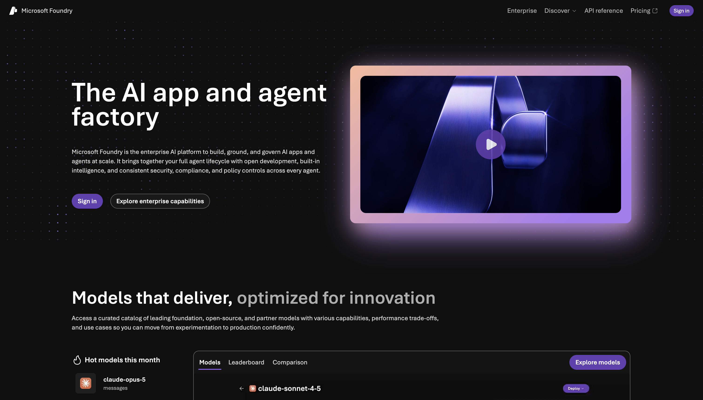

2. Once your account is ready, create a new resource group first. [Watch: How to create a resource group in Azure](https://youtu.be/bTeD1Ec62dY?si=gBTiO-oc0M3hvv2q). Then create a new project inside that resource.

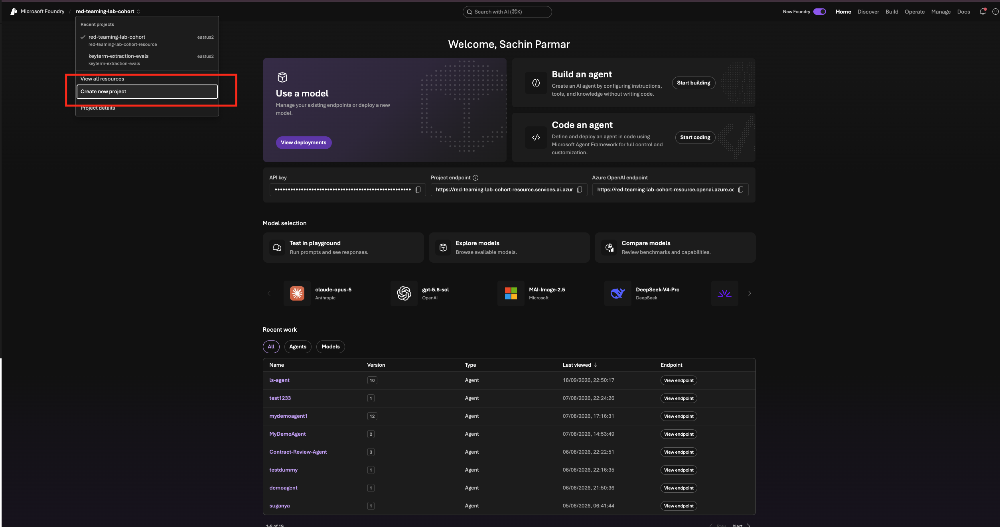

3. Fill in all the required details — resource name, region, and subscription — then confirm.

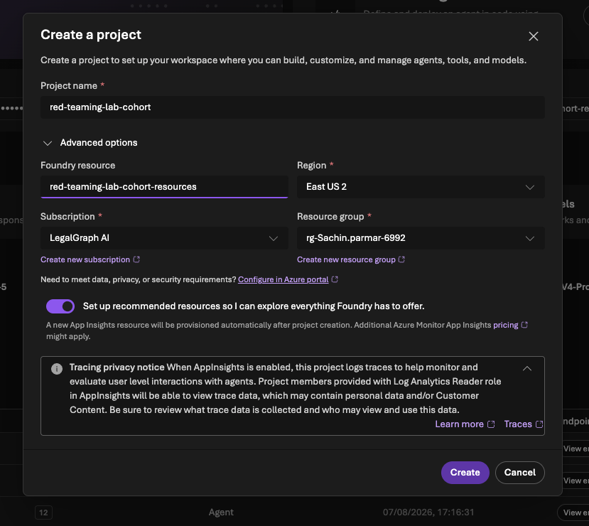

**Output**: An active Azure AI Foundry project ready to receive your dataset and evaluation.

---

## Phase 4: Format the Dataset for Azure AI Foundry

### Step 5: Try to Upload — and Discover the Format Requirement

**What you're doing**: Starting the evaluation setup in Foundry and attempting to upload your `config.json` — and discovering exactly why it needs one more step first.

**Action items**:

1. Inside your Foundry project, navigate to the **Build** section.

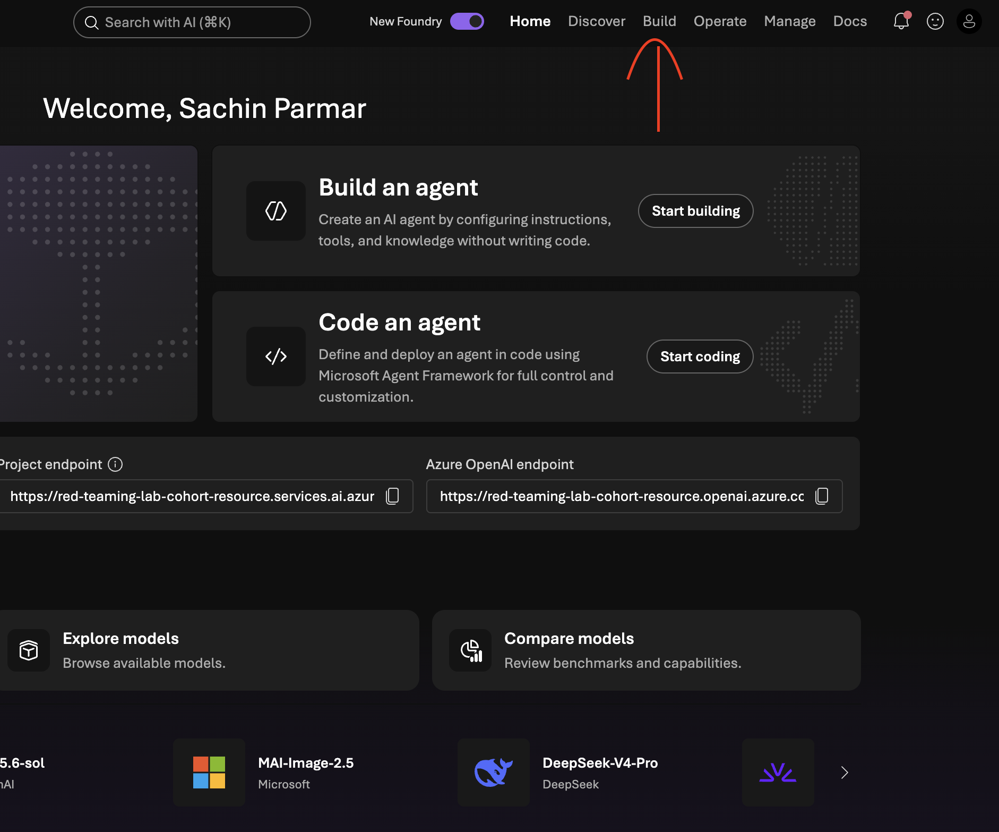

2. Click on **Evaluation**, then click **Create**.

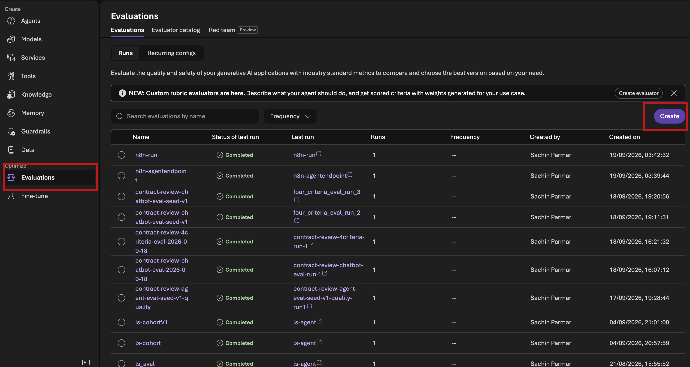

3. Select **Dataset** → **Upload Dataset**.

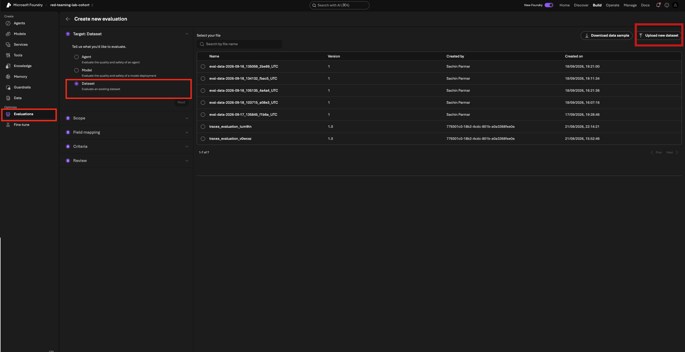

> **Note**: In the next step there may be an option to select **Single Turn** or **Multi-Turn** format. Select **Single Turn**.

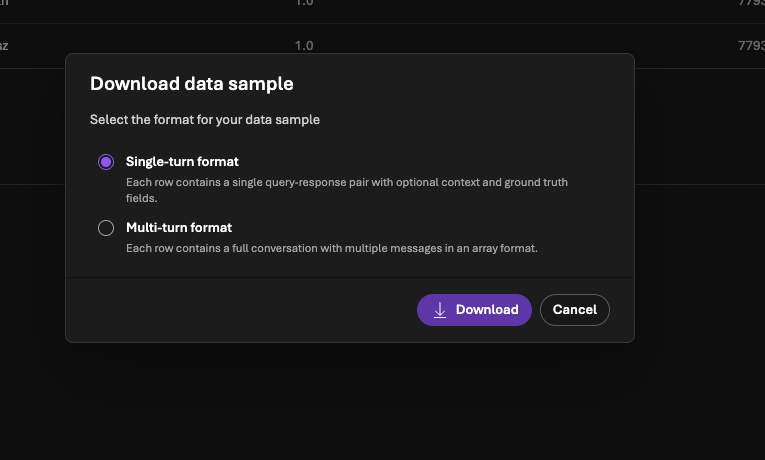

4. Try to upload your `config.json` file.

You will notice that **Foundry rejects the file**. This is expected — Foundry requires datasets to follow a specific schema, and `config.json` does not match it yet. Rather than being a blocker, this moment tells you exactly what needs to happen next: reformat the file.

5. Download the **sample dataset** and confirm **Single Turn** is selected as the format type. This sample file is your formatting specification — keep it alongside your `config.json`.

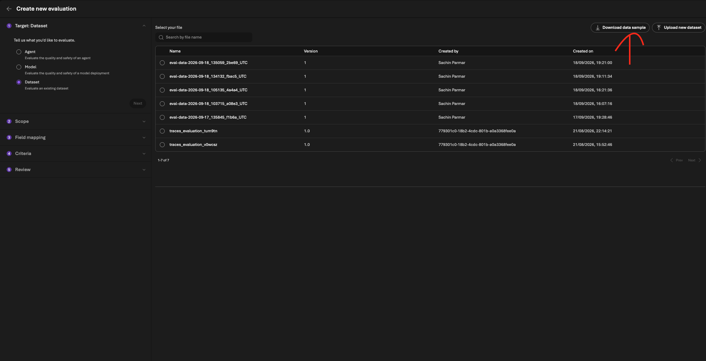

**Output**: You now have the Foundry sample dataset downloaded, and you understand exactly why your `config.json` needs to be reformatted.

---

### Step 6: Convert Your Dataset Using Claude Code

**What you're doing**: Asking Claude Code to reformat your `config.json` into the schema Foundry requires, using the sample file as the specification.

**Action items**:

1. Open Claude Code.
2. Attach both files: your `config.json` and the sample dataset you downloaded from Foundry.
3. Run the following prompt:

```
Create a dataset based on the config.json file. Treat config.json as the ground truth and use it as the source of truth for generating the dataset.

I have also attached a sample dataset showing the required format and structure. Follow that format exactly when creating the new dataset.
```

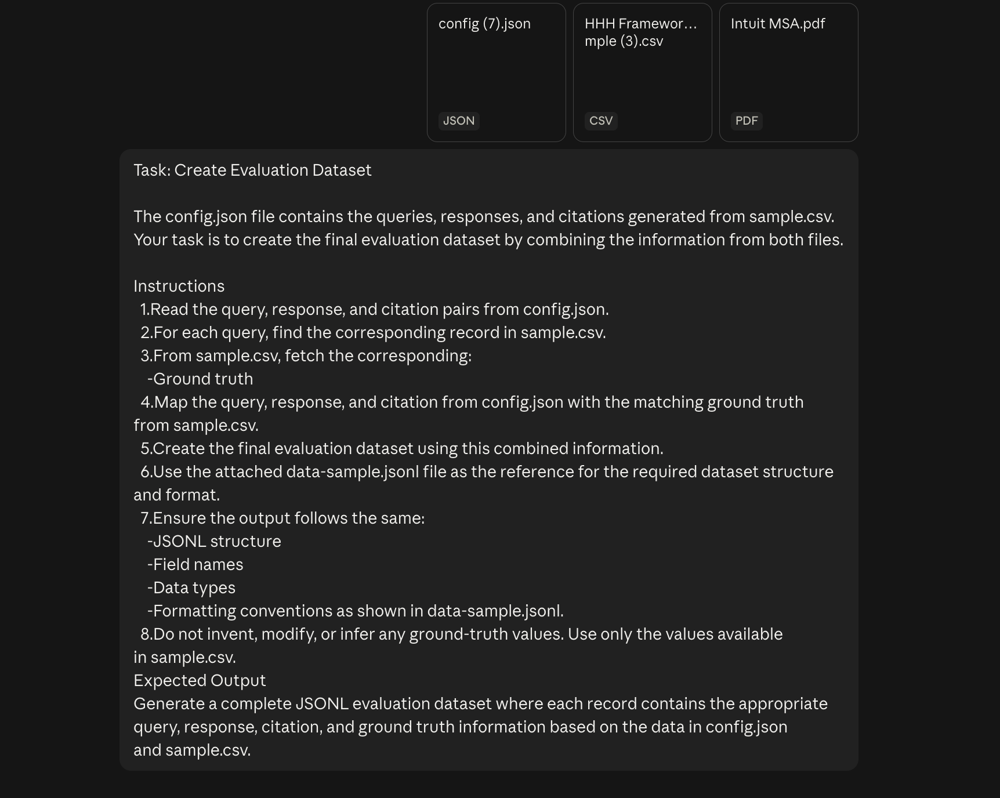

4. Claude may ask you a clarifying question about the format — if it does, select the first option it offers (Single Turn).

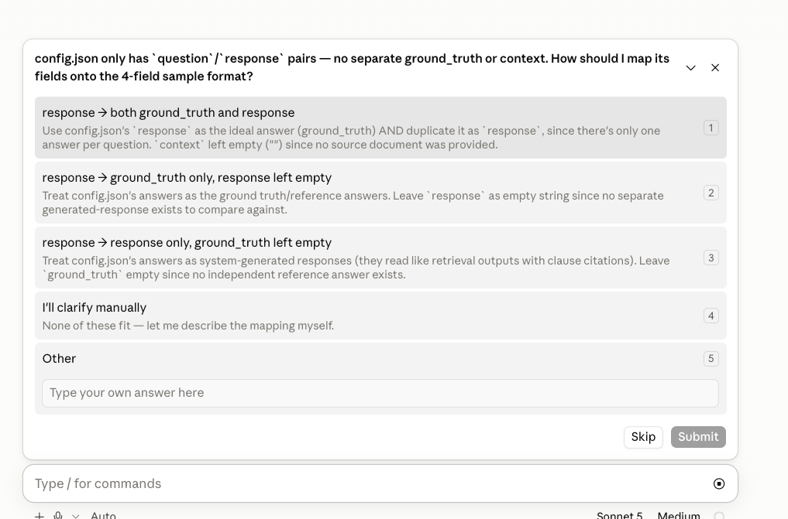

5. Claude will produce a new file formatted to Foundry's specification. Save it.

**Output**: A Foundry-compatible dataset file ready for upload.

---

## Phase 5: Run the Evaluation

### Step 7: Upload Your Formatted Dataset

**What you're doing**: Bringing your formatted dataset into Foundry so the evaluation engine can read it.

**Action items**:

1. Inside your Foundry project, navigate to **Build** → **Evaluation** → **Create**.


2. Select **Dataset** → **Upload Dataset**.

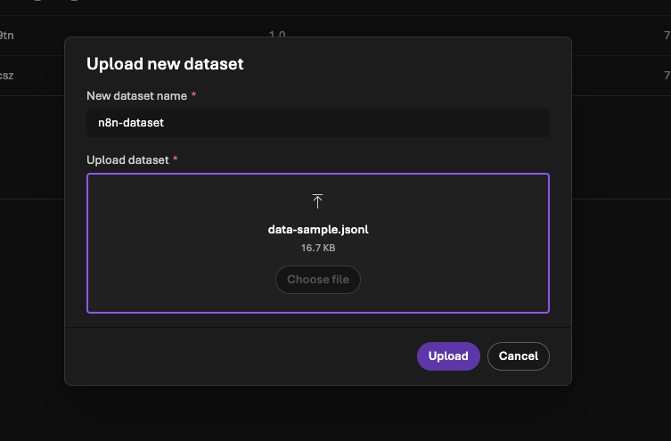

3. Upload the formatted dataset file that Claude produced in Step 6 (not the original `config.json`).
4. Once uploaded successfully, click **Next**.

**Output**: Your dataset is live inside Foundry and ready to be evaluated.

---

### Step 8: Configure and Run the Evaluation

**What you're doing**: Telling Foundry which model to use as the judge, which quality dimensions to measure, and kicking off the evaluation run.

Before you configure the run, Foundry will ask what you are evaluating — an **Agent**, a **Model**, or a **Dataset**. Select **Dataset**, since you are evaluating a pre-generated set of responses rather than running the agent live inside Foundry.

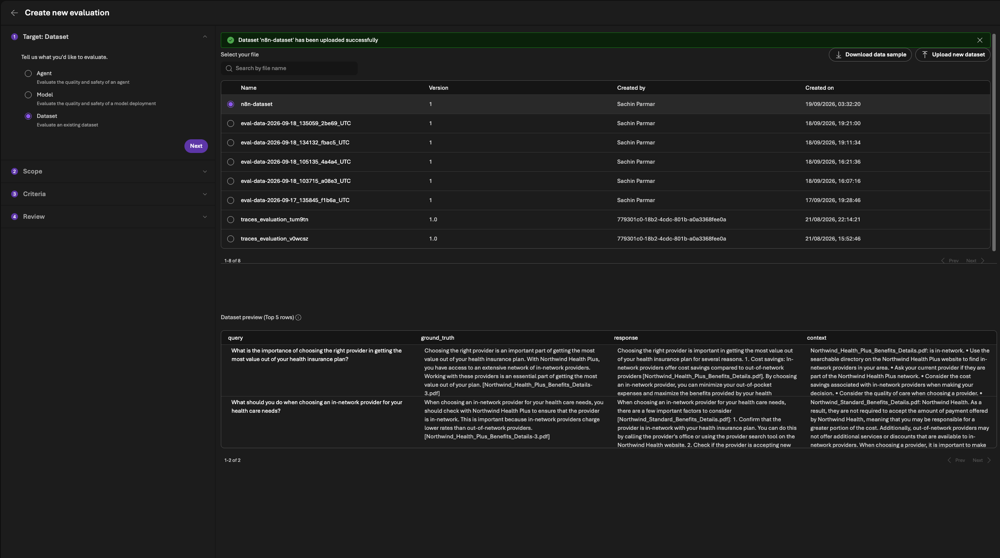

**Action items**:

1. When prompted for scope, select **Individual Turns**.

   > **Why Individual Turns?** Your dataset contains five separate, independent questions — each one stands alone. Individual Turns tells Foundry to evaluate each Q&A pair on its own merits rather than treating the whole conversation as a single unit. This gives you granular scores per question, which is far more useful for diagnosing specific weaknesses.

   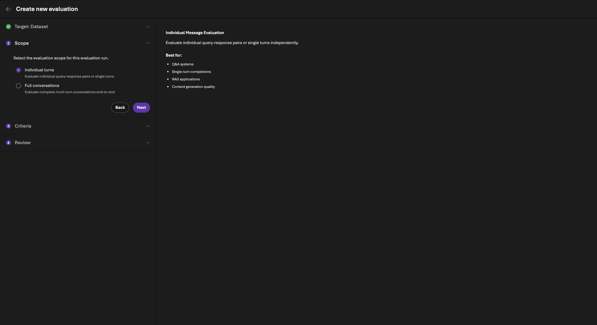

2. Select the **model** you want to use as the evaluator (this is the judge model, not your agent). Choose a capable model available in your Foundry project — GPT-4o is a reliable default if available.

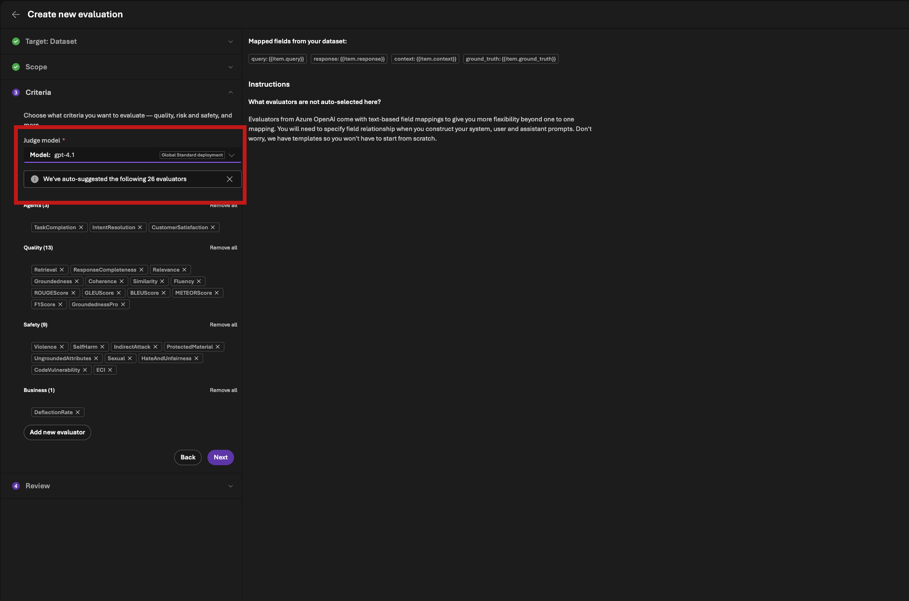

3. Under the **Quality** evaluation category, select the following five metrics:

   | Metric | What it measures |
   |---|---|
   | **Relevance** | Does the response directly address what was asked? |
   | **Groundedness** | Is the response supported by the source contract? |
   | **Coherence** | Is the response logically structured and easy to follow? |
   | **Similarity** | How close is the response to the ground-truth answer? |
   | **Fluency** | Is the language natural, grammatical, and well-formed? |

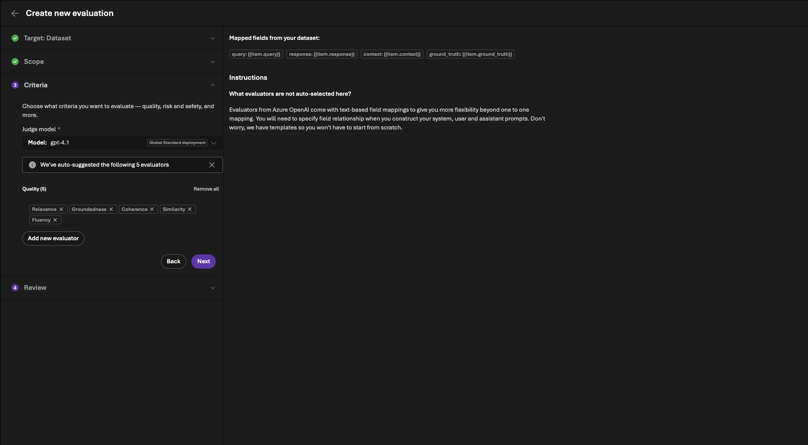

4. Give your evaluation run a descriptive name (e.g., `msa-contract-agent-eval-v1`).

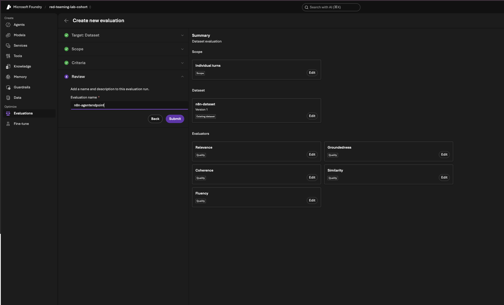

5. Click **Submit**. The run will take a few minutes to complete.

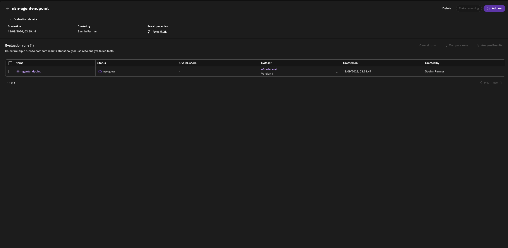

**Output**: A scored evaluation report showing your agent's performance across five quality dimensions for each of the five contract questions.

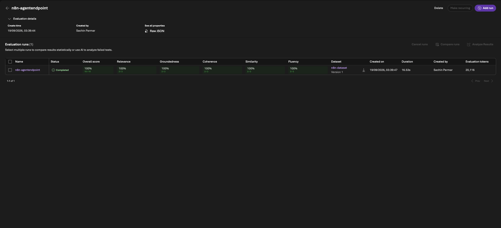

---

## What You End Up With

- **A live evaluation pipeline**: You now know the full path from agent response → dataset → Foundry eval → scored report. You can repeat this any time you change your agent.
- **Five quality scores**: Relevance, Groundedness, Coherence, Similarity, and Fluency — each one a signal for a different kind of failure or success.
- **A reusable workflow**: The Download Responses feature you added to your app means generating a new evaluation dataset in the future takes five questions and one button click.
- **A feedback loop**: Supabase captures what users flag; Foundry measures what the model produces. Together they give you both qualitative and quantitative signals about your agent's quality.

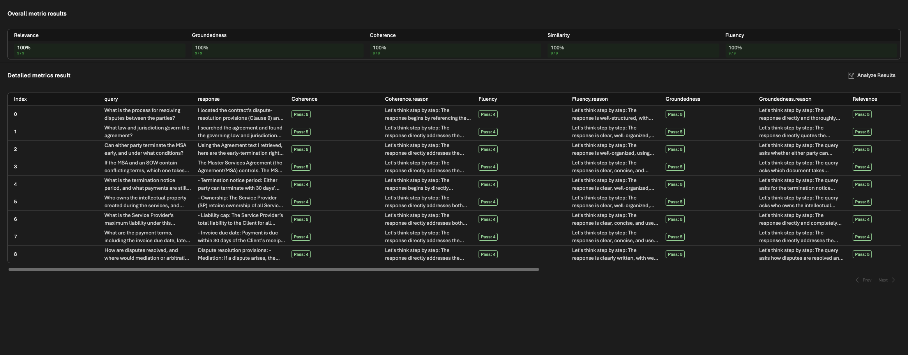

---

## Complete Process Flow

1. Add localStorage + Download Responses feature to the app (Claude Code prompt).
2. Upload the MSA contract and ask the five evaluation questions.
3. Download `config.json` from the app.
4. Create your Azure AI Foundry account and project.
5. Download the Foundry sample dataset (Single Turn format).
6. Convert `config.json` to Foundry format using Claude Code.
7. Upload the formatted dataset to Foundry.
8. Configure the eval: Individual Turns scope, judge model, five quality metrics.
9. Name the run and submit.
10. Review the scored report.

---

## Key Principles to Keep in Mind

**Ground truth matters**: Your agent's responses become the ground truth for this eval. Make sure all five chat responses were complete and error-free before downloading — a truncated or failed response will skew your scores.

**The judge model is not your agent**: The model you select in Step 8 is an independent evaluator. It reads your agent's responses and the source contract and scores them. Keep these roles mentally separate.

**Individual Turns = per-question granularity**: Choosing Individual Turns gives you a score for each question independently. This tells you if your agent handles IP clauses differently than payment terms — which is the insight that actually drives improvements.

**Evaluation is iterative**: One run gives you a baseline. Change something in your n8n workflow, regenerate the dataset, rerun the eval, and compare. That loop is how agents get better.
