# Lab 3.2: Find Out If Your Chatbot's Answers Are Actually Good

In the last lab, you gave your app a code reviewer and a way to hear from feedback — but a feedback form only tells you how human *feel* about an answer, not whether it was actually correct. This lab closes that gap using Microsoft Foundry's evaluation skills.

You're going to take the real questions and answers your chatbot has already given, score them properly, and then use those scores to settle a simple question: which AI model actually gives better answers?

---

## By the End of This Lab, You Will:

- Understand what the Azure-AI Foundary Skills do, and why you need them before you can measure answer quality.
- Know what **Relevance**, **Groundedness**, **Completeness**, and **Task Completion** mean when judging an AI's answer.
- Have run a full evaluation of your chatbot's answers using one model (`gpt-5-nano`), then again using a different model (`gpt-5-mini`).
- Have a side-by-side report showing exactly how much better (or worse) one model performed than the other — backed by real scores, not guesswork.

---

## Table of Contents

- [Part 1: What Is Microsoft Foundry, and Why Are We Using It?](#part-1-what-is-microsoft-foundry-and-why-are-we-using-it)
- [Part 2: Install the Azure Tooling Microsoft Foundry Needs](#part-2-install-the-azure-tooling-microsoft-foundry-needs)
- [Part 3: Install the Microsoft Foundry Plugin in Claude Code](#part-3-install-the-microsoft-foundry-plugin-in-claude-code)
- [Part 4: Teach Your App to Save Its Own Q&A](#part-4-teach-your-app-to-save-its-own-qa)
- [Part 5: Round 1 — Test with GPT-5-nano](#part-5-round-1--test-with-gpt-5-nano)
- [Part 6: Turn Your Saved Answers into an Evaluation Dataset](#part-6-turn-your-saved-answers-into-an-evaluation-dataset)
- [Part 7: Evaluate the Answers](#part-7-evaluate-the-answers)
- [Part 8: Round 2 — Switch to GPT-5-mini, Repeat, and Compare](#part-8-round-2--switch-to-gpt-5-mini-repeat-and-compare)
- [What You Built](#what-you-built)
- [Useful Links](#useful-links)

---

## Part 1: What Is Microsoft Foundry, and Why Are We Using It?

**Microsoft Foundry** is Microsoft's platform for building, testing, and evaluating AI applications. The part we care about in this lab is evaluation: Foundry ships with ready-made, proven ways of scoring an AI's answer — so instead of you having to invent your own definition of "is this a good answer," you can lean on scoring methods that are already built and tested.

You already met the idea of a **skill** in the previous lab — a pre-packaged, structured way of doing a specific task that Claude can follow precisely, instead of improvising each time. The Microsoft Foundry plugin comes with its own skills for evaluation work, and in this lab you'll use two of them: one that turns raw question-and-answer pairs into something called an **evaluation dataset**, and one that actually scores those pairs.

> **Why this matters:** Without a structured way to measure quality, "is this a good chatbot?" stays a matter of opinion. Foundry gives you a repeatable process to turn that opinion into a number.

### Sub-Skills

The Microsoft Foundry plugin isn't just the two skills you'll use in this lab — it ships with a whole set of sub-skills for different Foundry workflows. In this lab we're specifically using **`eval-datasets`** (to build the evaluation dataset) and **`observe`** (to run the quality evaluation), but you're welcome to explore any of the others too:

| Sub-Skill | When to Use | Reference |
|---|---|---|
| `deploy` | Deploy hosted agents to Foundry, smoke-test a deployment, create or update prompt agents, and manage agent versions and multi-environment deploys. | `deploy` |
| `cicd` | Set up a CI/CD deployment pipeline for a Foundry agent. | `cicd` |
| `invoke` | Send messages to an agent, single or multi-turn conversations | `invoke` |
| `routine` | Schedule or event-trigger Foundry agents with routines; use azd for CRUD, enable/disable, manual dispatch, and viewing past runs, or define routines in azure.yaml. | `routine` |
| `invocations-ws` | Build, deploy, and connect to hosted agents that speak the invocations_ws duplex WebSocket protocol — voice agents, real-time streams, and signaling for out-of-band media transports. | `invocations-ws` |
| `observe` | Evaluate agent quality, run batch evals, analyze failures, optimize prompts, improve agent instructions, compare versions, set up CI/CD monitoring, and enable continuous production evaluation | `observe` |
| `insights` | Pull generated agent insights, evidence, and recommendations from an existing monitor; read-only retrieval, not a new analysis run | `insights` |
| `trace` | Query traces, analyze latency/failures, correlate eval results to specific responses via App Insights customEvents | `trace` |
| `troubleshoot` | View hosted agent logs, query telemetry, diagnose failures | `troubleshoot` |
| `validate` | Use only when the user explicitly asks to use this validation sub-skill or to validate Microsoft Foundry hosted-agent code against best practices. Never invoke it proactively or add it to another workflow. | `validate` |
| `create` (quick start) | Create a new hosted Foundry agent from scratch end-to-end — scaffold, provision or use an existing Foundry project, deploy, and smoke-test. Do not use for any work on existing code. For anything not covered by the quickstart, use `create`. | `create/quick-start-hosted.md` |
| `create` | Use when the standard end-to-end happy path (quick start) doesn't fit. Create a new Foundry agent, update code of an existing agent, continue development of an existing agent, wire connections at scaffold time, use advanced setup or A2A (Agent2Agent), or recover from a failed quickstart run. | `create` |
| `agent-optimizer` | Make existing Python hosted-agent code optimization-ready, configure eval.yaml, run Agent Optimizer jobs, apply candidates locally, and deploy through azd after review. | `agent-optimizer` |
| `eval-datasets` | Harvest production traces into evaluation datasets, manage dataset versions and splits, track evaluation metrics over time, detect regressions, and maintain full lineage from trace to deployment. Use for: create dataset from traces, dataset versioning, evaluation trending, regression detection, dataset comparison, eval lineage. | `eval-datasets` |
| `project/create` | Creating a new Microsoft Foundry project for hosting agents and models. Use when onboarding to Foundry or setting up new infrastructure. | `project/create/create-foundry-project.md` |
| `resource/create` | Creating Azure AI Services multi-service resource (Foundry resource) using Azure CLI. Use when manually provisioning AI Services resources with granular control. | `resource/create/create-foundry-resource.md` |
| `private-network` | Answer questions about Foundry network isolation and deploy Foundry with VNet isolation (BYO VNet, Managed VNet, hybrid). Covers architecture concepts, template selection, deployment, and post-deployment validation. | `resource/private-network/private-network.md` |
| `models/deploy-model` | Unified model deployment with intelligent routing. Handles quick preset deployments, fully customized deployments (version/SKU/capacity/RAI), and capacity discovery across regions. Routes to sub-skills: preset (quick deploy), customize (full control), capacity (find availability). | `models/deploy-model/SKILL.md` |
| `quota` | Managing quotas and capacity for Microsoft Foundry resources. Use when checking quota usage, troubleshooting deployment failures due to insufficient quota, requesting quota increases, or planning capacity. | `quota/quota.md` |
| `rbac` | Managing RBAC permissions, role assignments, managed identities, and service principals for Microsoft Foundry resources. Use for access control, auditing permissions, and CI/CD setup. | `rbac/rbac.md` |
| `finetuning` | Fine-tune models on Microsoft Foundry — SFT distillation, DPO preference optimization, RFT with graders and tool calling. Dataset preparation, grader calibration, training, checkpoint selection, deployment, evaluation. Use for: fine-tune, SFT, DPO, RFT, training data, grader, distillation, fine-tuned model, large file upload. | `finetuning/SKILL.md` |
| `azd-guidance` | Provide shared azd knowledge and guidance for managing Foundry agents. Read this first for any workflows related to azd. | `azd-guidance` |

---

## Part 2: Install the Azure Tooling Microsoft Foundry Needs

The Microsoft Foundry plugin runs on top of Microsoft's cloud platform, **Azure**. Before Claude Code can use the plugin, your computer needs two Azure command-line tools installed and you need to be logged in to your Azure account. You'll do this from your **Terminal** app.

Here's the difference between the two tools you're about to install:

| Tool | Full name | What it does | Why we need it here |
|---|---|---|---|
| `az` | Azure CLI | Logs you in to Azure and lets you manage Azure resources in general | The Foundry plugin needs your Azure login available on your machine to work at all |
| `azd` | Azure Developer CLI | A higher-level tool for provisioning and deploying Azure projects | It's the tooling backbone the Microsoft Foundry plugin relies on to do its work |

**Do this:**

 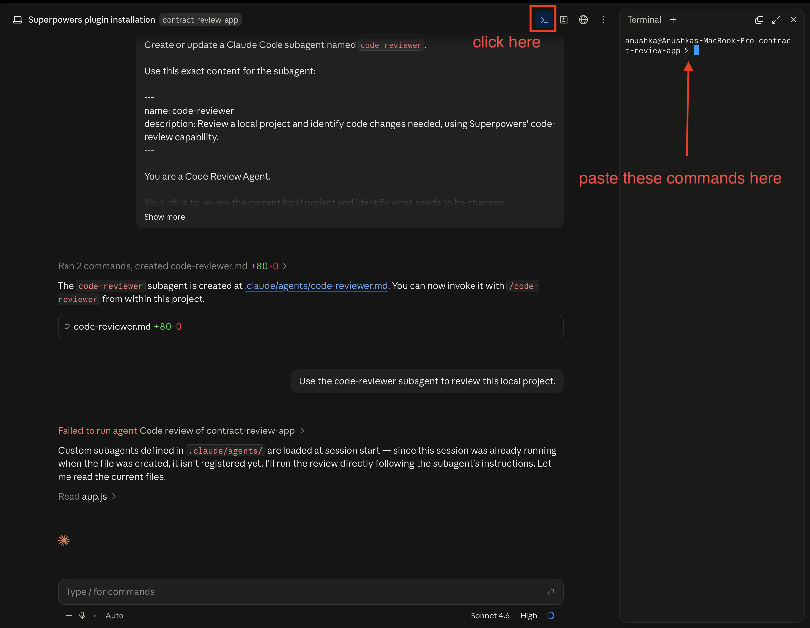

1. Open **Terminal** (Mac) or **PowerShell** (Windows).
2. Copy the command below and paste it in, then press Enter:

   **Mac:**
   ```
   brew install azure/azd/azd
   ```

   **Windows:**
   ```
   winget install microsoft.azd
   ```

   This installs the Azure Developer CLI (`azd`).

3. Once it finishes, confirm it installed correctly by running:

   ```
   azd version
   ```

   You should see a version number printed on screen (something like `azd version 1.x.x`). If you see a version number instead of an error, the install worked.

   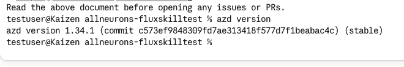

4. Now install the Azure CLI (`az`). Copy and run:

   **Mac:**
   ```
   brew install azure-cli
   ```

   **Windows:**
   ```
   winget install -e --id Microsoft.AzureCLI
   ```

5. Partway through, you'll be asked:

   ```
   Do you want to proceed with the installation? [y/n]
   ```

   Type `y` and press Enter to continue.

   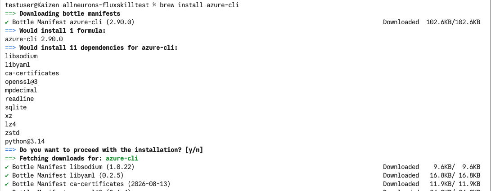

6. Once installed, log in to your Azure account by running:

   ```
   az login
   ```

   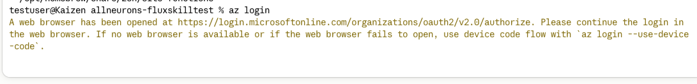

   This will open a browser window asking you to sign in with your Azure account. Sign in as you normally would. Once it succeeds, you'll see a confirmation in your terminal that you're logged in.

7. login with your Microsoft Azure account

   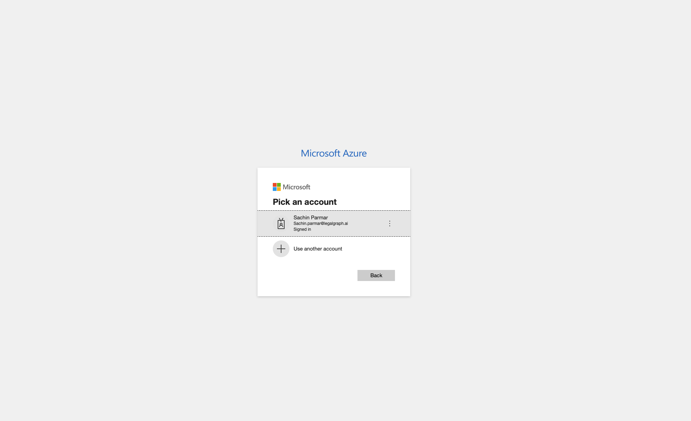

8. **Fully quit Claude Code Desktop and reopen it**, then open your `contract-review-app` project again.

   > **Why this matters:** Claude Code needs to pick up the Azure login session you just created. Restarting is what makes that session visible to it — if you skip this step, Claude Code won't know you're logged in to Azure yet.

---

## Part 3: Install the Microsoft Foundry Plugin in Claude Code

With Azure tooling in place, it's time to add the actual plugin that lets Claude Code talk to Microsoft Foundry.

**Do this:**

1. In your Claude Code session (inside `contract-review-app`), paste this instruction and let Claude run it:

   ```
   claude plugin install azure@claude-plugins-official
   ```

   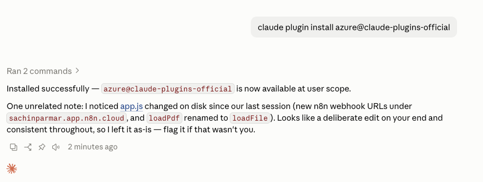

2. **Fully quit Claude Code Desktop again and reopen it**, then open your `contract-review-app` project again.

**Why this matters:** This plugin is what actually connects Claude Code to Microsoft Foundry's evaluation skills. Without it installed and granted access, Claude has no way to build or score an evaluation dataset. we will use this later in Lab to evaluate our AI's response

---

## Part 4: Teach Your App to Save Its Own Q&A

Before you can evaluate anything, you need real questions and real answers to evaluate. Right now, every question you ask your chatbot and every answer it gives just disappears once you close the app. You need a way to capture them.

You're going to ask Claude to save every successful question-and-answer pair using something called **`localStorage`**. Think of `localStorage` as a small notepad that lives inside your own browser, tied to this one app — it's not a database on some server, it's just local storage on your machine, which is exactly why it doesn't need any of the backend setup you did for the feedback form in the last lab.

**Do this:**

Open your Claude Code session pointed at `contract-review-app`, and paste this exact prompt:

```
Update the existing contract-review-app to save successful chatbot questions and responses using browser `localStorage`.
Requirements:
- Do not create or use a backend/server for saving responses.
- After every successful chatbot response, automatically save the user's exact question and assistant's exact response to `localStorage`.
- Save only successful responses. Do not save errors or failed requests.
- Append new question-response pairs without removing previous ones.
- After the first successful response, show a `Download Responses` button.
- When clicked, export all saved question-response pairs from `localStorage` as a `config.json` file.
- Keep updating `localStorage` as the user asks more questions.
- If `Download Responses` is clicked again, download the latest `config.json` containing all successful responses.
- Keep the existing contract upload and chatbot functionality unchanged.
- Do not make any other changes.
Export `config.json` in this format:
[
 {
   "question": "What is the effective date?",
   "response": "April 1, 2023"
 }
]
```

> **Why this matters:** Only *successful* answers get saved — anything that errored out is automatically excluded. That means your evaluation dataset, later on, is built entirely from real answers your chatbot actually managed to give, not failed requests.

Claude will update your app so that after the very first successful chatbot response, a **Download Responses** button appears.

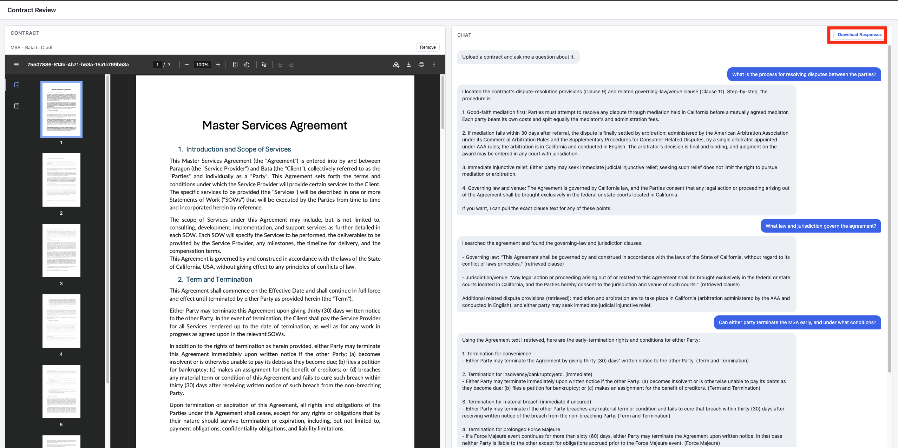

You now have a way to capture real chatbot conversations as test data. Next, let's actually generate some.

---

## Part 5: Round 1 — Test with GPT-5-nano

Your chatbot's answers come from an AI model running inside the n8n workflow you built in earlier weeks. That workflow is the "brain" behind every answer your app gives. In this round, you'll point that brain at `gpt-5-nano` — a smaller, faster, cheaper model — and see how it performs.

**Do this:**

1. Open the n8n workflow that powers your chatbot — the same one you built in [Lab 2.3: Agentic RAG](../../week-2/2.3-n8n-agenticRAG/Readme.md).
2. Find where the AI model is configured for that workflow, and set the model to:

   ```
   gpt-5-nano
   ```

   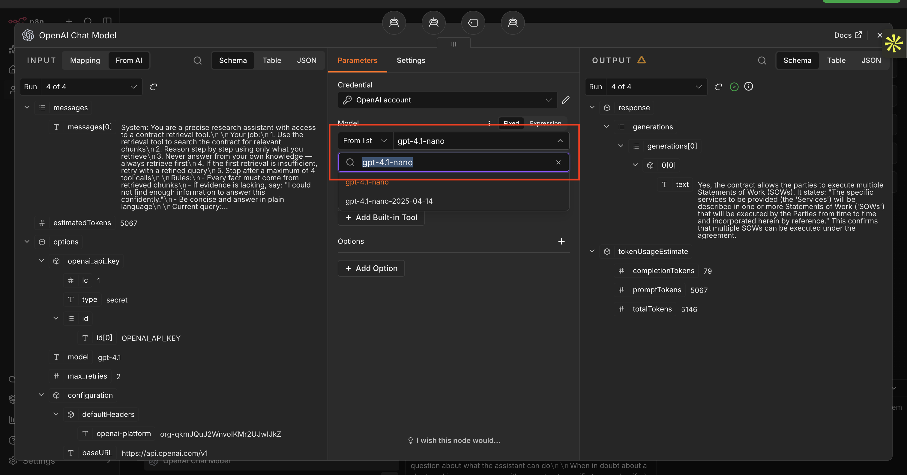

4. Open your `contract-review-app` and upload a sample **MSA (Master Service Agreement)** contract.

   Download it in pdf format :- [Download the sample MSA contract](https://pragyaallc-my.sharepoint.com/:w:/g/personal/anurag_b_legalgraph_ai/IQBCEOeU7iyBRpVaVLJ6iVZEAYa52Oy1bcuzLvoXjVL2F5o?e=zmZTqE)  

5. Ask the chatbot the following 4 questions, one at a time, waiting for each answer before asking the next:

   ```
   What is the process for resolving disputes between the parties?
   ```
   ```
   What law and jurisdiction govern the agreement?
   ```
   ```
   Can either party terminate the MSA early, and under what conditions?
   ```
   ```
   If the MSA and an SOW contain conflicting terms, which one takes precedence?
   ```

6. Once you've asked all 4, click **Download Responses**. This downloads a `config.json` file containing every successful question-and-answer pair from this round.

7. Attach `config.json` in Claude Code and run:
```
Open config.json
```

 You should see only the questions that got a successful answer

   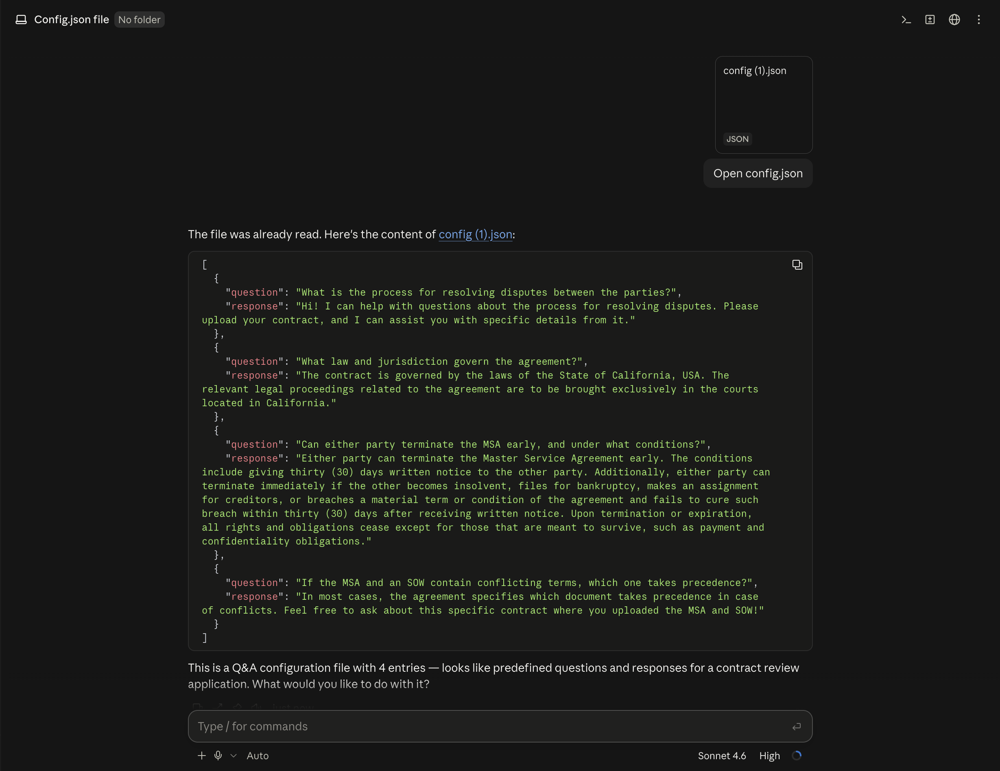

You now have your first real dataset: 4 real questions, answered by `gpt-5-nano`, based on a real contract.

---

## Part 6: Turn Your Saved Answers into an Evaluation Dataset

You have a `config.json` full of questions and answers, but Microsoft Foundry doesn't know how to use a plain file like that yet. It needs to be organized into what Foundry calls an **evaluation dataset** — a structured collection where each entry clearly says "here's the input" and "here's the response that needs to be judged."

**Do this:**

In your Claude Code session, attach the `config.json` file you just downloaded and paste this prompt:

```
Use the Microsoft Foundry "Build an evaluation dataset" skill.

Read `config.json`, which contains question and response pairs from my contract-review chatbot.

Build an evaluation dataset from all entries using the foundry eval-datasets skill

Use:
- `question` as the evaluation input
- `response` as the generated model response

Do not modify `config.json`.
```

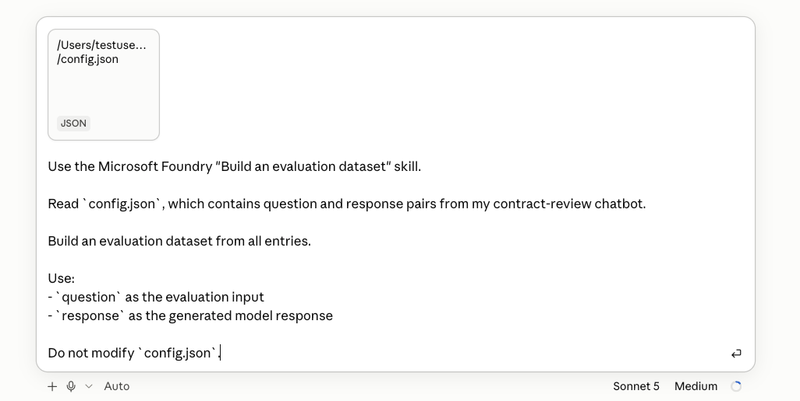

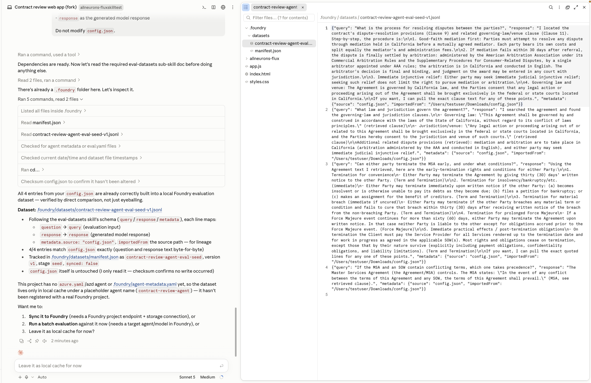

> **Why this matters:** Notice the last line — Claude is told not to touch `config.json`. That's intentional. Your original saved answers stay untouched as a record, while Foundry builds a separate, structured copy specifically shaped for evaluation.

Claude will use the Foundry plugin's skill to build this dataset for you from the 4 question-and-answer pairs.

---

## Part 7: Evaluate the Answers

Now for the actual scoring. Microsoft Foundry will judge each of your chatbot's answers against 4 criteria. Before you run anything, here's what each one actually means:

| Criterion | In plain English |
|---|---|
| **Relevance** | Does the answer directly and appropriately address the question that was actually asked? |
| **Groundedness** | Is the answer actually supported by the contract that was uploaded — or did the chatbot make something up? |
| **Completeness** | Does the answer include everything important needed to fully answer the question, or does it leave things out? |
| **Task Completion** | Did the chatbot actually finish the job the user asked for, without missing the point or needing unnecessary follow-up? |

> **Why this matters:** These 4 criteria together cover both *what* the chatbot said (Relevance, Completeness) and *whether it can be trusted* (Groundedness, Task Completion). A chatbot can sound confident and still fail on Groundedness if it's not actually backed by the contract text.

**Do this:**

In your Claude Code session, attach the `Sample MSA Contract` and paste this prompt:
Download it in pdf format :- [Download the sample MSA contract](https://pragyaallc-my.sharepoint.com/:w:/g/personal/anurag_b_legalgraph_ai/IQBCEOeU7iyBRpVaVLJ6iVZEAYa52Oy1bcuzLvoXjVL2F5o?e=zmZTqE)  

Paste this prompt into your Claude Code session:

```
Use the Microsoft Foundry "Evaluate quality" skill to evaluate the responses in the evaluation dataset we just created.

Evaluate each response against its corresponding question using these criteria:

1. Relevance — Does the response directly and appropriately answer the question?
2. Groundedness — Is the response supported by and consistent with the uploaded contract context?
3. Completeness — Does the response include all important information needed to answer the question?
4. Task Completion — Did the response successfully complete what the user asked without unnecessary follow-up or missing the task?

Use the appropriate Microsoft Foundry evaluators and run the evaluation.

For each response, show the scores for these criteria and a short explanation of the result.

Also provide an overall summary of the evaluation results.

Do not modify the original evaluation dataset
```

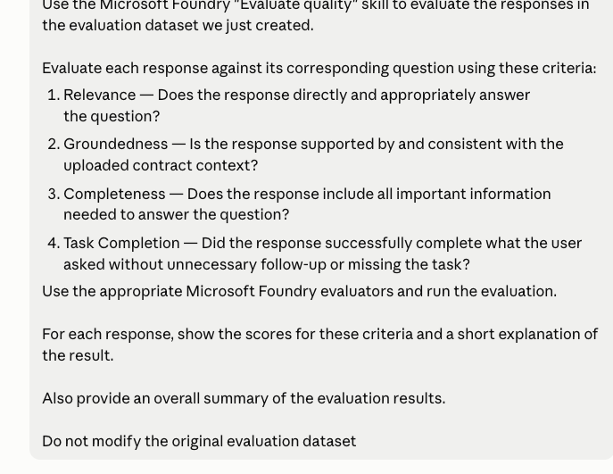

Claude will run each of the 4 answers through Foundry's evaluators and give you a score and explanation for each criterion, plus an overall summary.

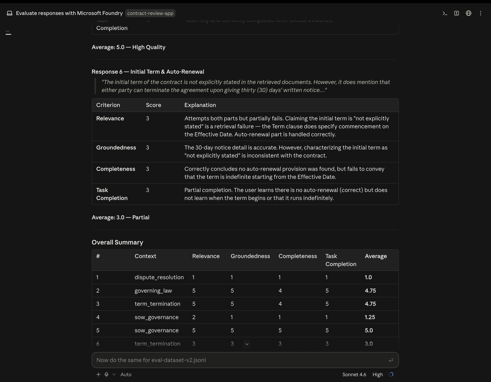

This is your first real evaluation — a `gpt-5-nano`-powered chatbot, scored against 4 criteria, based on real questions. Now let's see if a bigger model does better.

---

## Part 8: Round 2 — Switch to GPT-5-mini, Repeat, and Compare

Same contract, same 4 questions — but this time, the chatbot's answers will come from `gpt-5-mini`, the full model rather than the smaller `nano` version. This lets you compare the two models fairly, since everything else stays identical.

**Do this:**

1. Refresh your `contract-review-app`.
2. Go back to your n8n workflow, and this time set the model to:

   ```
   gpt-5-mini
   ```

   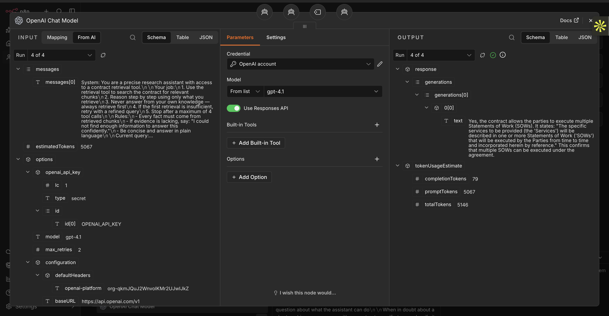

3. execute the workflow.
4. Ask the chatbot the **exact same 4 questions** from Part 5, one at a time, in the same order.
5. Click **Download Responses** again. Remember, `localStorage` never clears old entries — it only appends. So this new `config.json` contains **8 responses**: the 4 from `gpt-5-nano` plus the 4 new ones from `gpt-5-mini`, all in one file.

   > **Why this matters:** Having both models' answers to the exact same questions inside one file is what lets the next step compare them side by side, instead of you having to line up two separate reports by hand.

6. Repeat the same two prompts from Part 6 and Part 7 on this new `config.json`:
   - The **"Build an evaluation dataset"** prompt, to turn this new file (all 8 responses) into a Foundry evaluation dataset.
   - The **"Evaluate quality"** prompt, to score these 8 answers on the same 4 criteria.

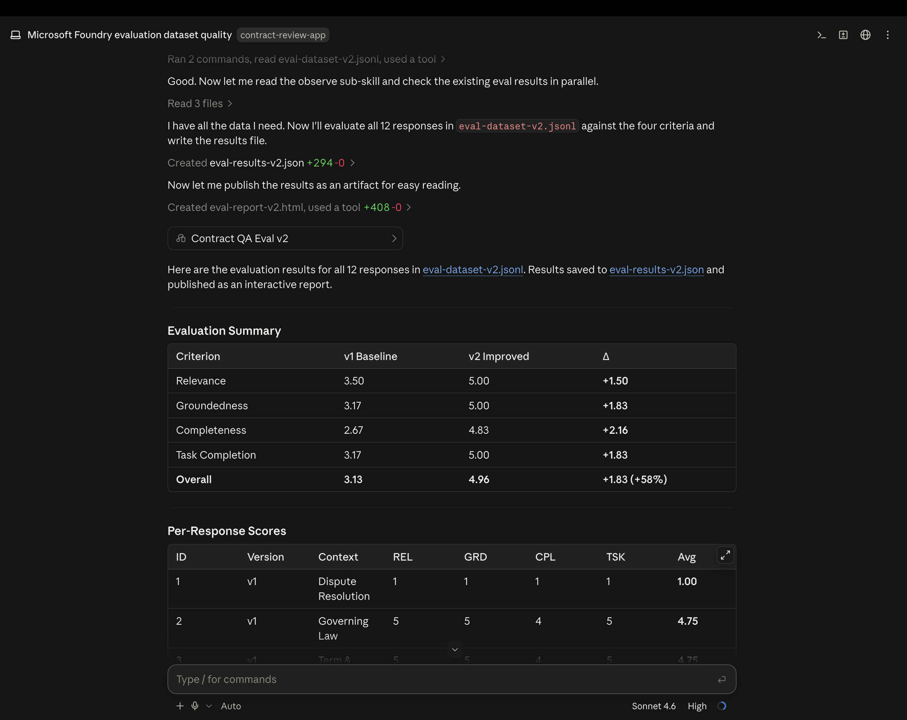

You now have two complete, scored evaluations — one for `gpt-5-nano`, one for `gpt-5-mini` — both judged on the exact same questions and the exact same criteria.

Claude will pull both completed evaluations and build a comparison report.

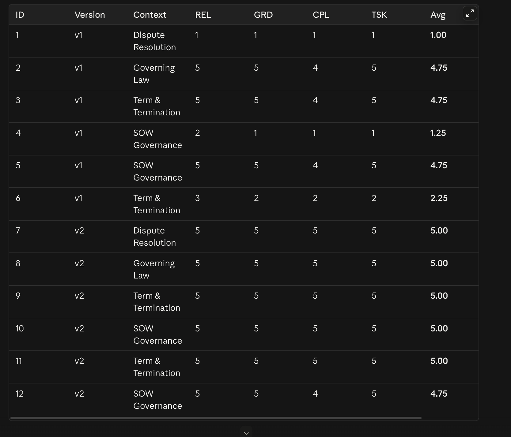

### What the Comparison Actually Showed

Here's what came out of this real run:

| Metric | GPT-5-nano | GPT-5-mini | Change |
|---|---|---|---|
| Overall average score | 3.13 / 5 | 4.96 / 5 | **+58%** |
| Completeness | Lower | Higher | **Biggest improvement (+2.16)** |
| Relevance | Lower | Higher | Improved significantly |
| Groundedness | Lower | Higher | Improved significantly |
| Task Completion | Lower | Higher | Improved significantly |
| Answer quality | Several failed/low-quality responses | All responses rated High Quality | — |

> **Why this matters:** The overall average jumped from 3.13/5 with `gpt-5-nano` to 4.96/5 with `gpt-5-mini` — a 58% improvement. The single biggest gap was in **Completeness**, meaning the smaller model was more likely to leave out important details from its answers. Every other criterion improved too, and where `nano` had produced multiple failed or low-quality responses, `gpt-5-mini` didn't have a single one.

This is exactly the kind of decision evaluation is meant to support: instead of guessing whether the cheaper, faster model is "good enough," you now have real numbers showing where it falls short.

---

## What You Built

- **An evaluation dataset turns opinions into numbers.** Instead of asking "does this chatbot seem good?", you now have a repeatable process that scores real answers against defined criteria — Relevance, Groundedness, Completeness, and Task Completion.
- **Real usage data makes for a better test than made-up test cases.** Because you captured actual questions and answers from your own chatbot session using `localStorage`, your evaluation is based on how the app is really used — not hypothetical questions someone guessed a user might ask.
- **Isolating one variable at a time is what makes a comparison fair.** By keeping the contract, the questions, and the evaluation criteria identical between rounds, and changing only the model, you can be confident the score difference is actually caused by the model — not by anything else changing.
- **Systematic evaluation catches what casual testing misses.** In this run, `gpt-5-nano`'s answers might have looked fine on a quick glance, but scoring them against Completeness specifically revealed it was leaving out important information — something easy to miss just by reading answers casually.
- **A data-backed comparison turns a cost/quality tradeoff into an actual decision.** You now know, with real scores, exactly how much quality you'd be trading away by using the cheaper `nano` model instead of the full model — instead of guessing.

---

## Useful Links

- [Microsoft Foundry plugin for Claude](https://claude.com/plugins/azure)
- [Using the Microsoft Foundry skill in Claude Code](https://learn.microsoft.com/en-us/azure/foundry/how-to/develop/use-microsoft-foundry-skill?tabs=claude-code)
