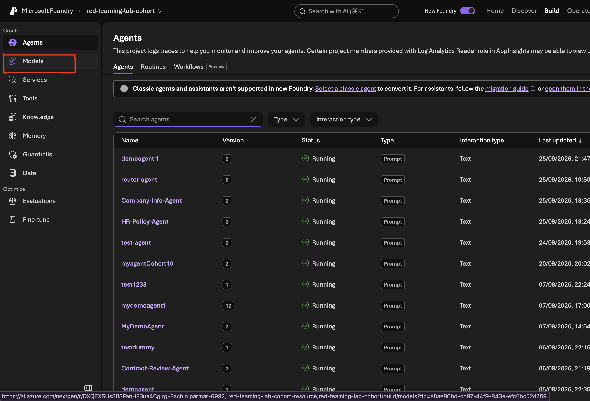
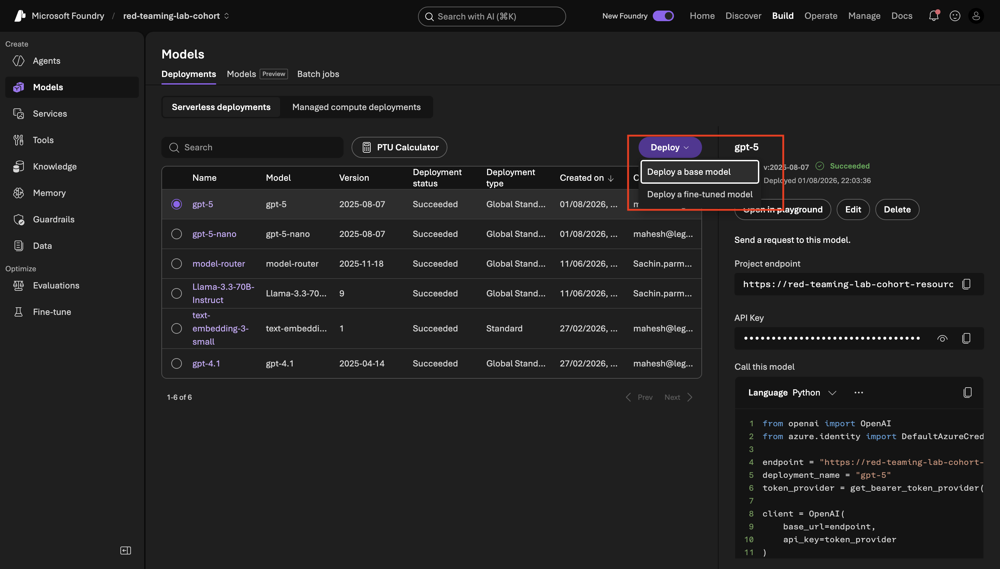
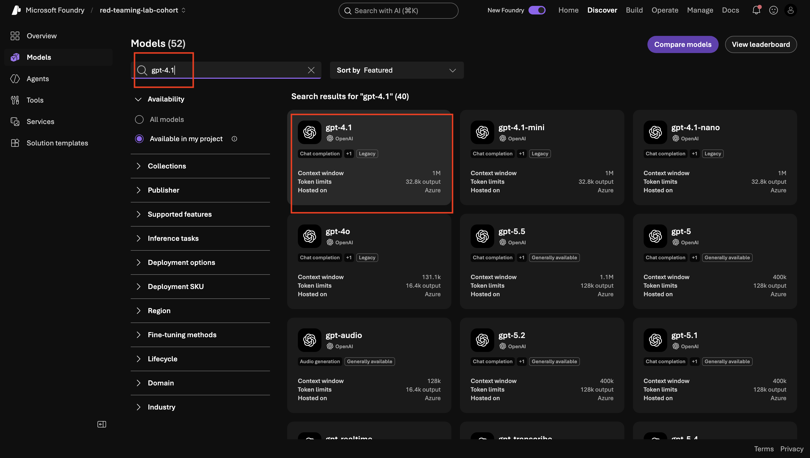
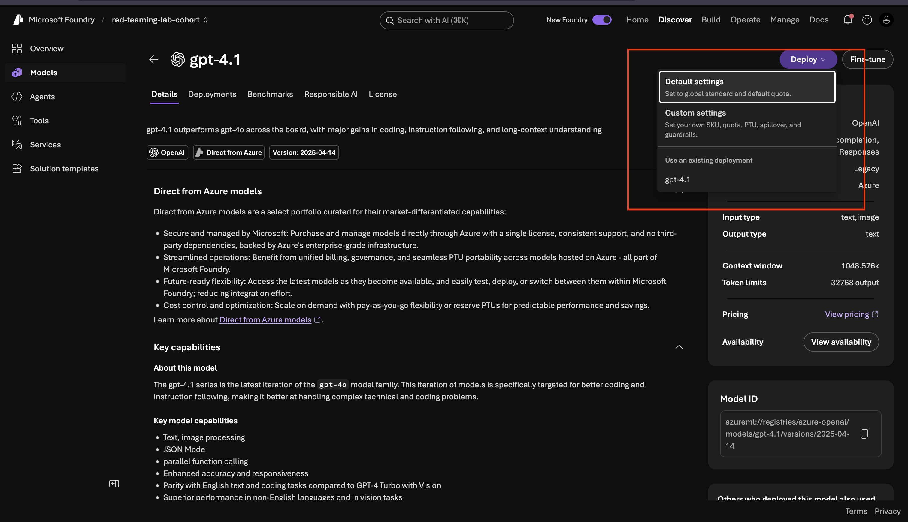

# Lab 3.3: Fix the Greyed-Out Judge Model in Azure AI Foundry

## When the Dropdown Stays Locked — Why It Happens and How to Fix It

You're in Step 9 of Lab 3.2, you've uploaded your dataset, selected your evaluation criteria, and then you hit a wall: the **Judge model** dropdown is greyed out and unclickable. Nothing's broken — billing is set up fine, your account is active — and yet the dropdown won't respond.

This lab explains exactly why that happens and walks you through the fix. It takes about five minutes and you only ever need to do it once per Foundry project.

---

## Why the Dropdown Is Greyed Out

The Judge model dropdown only lists models that are already **deployed** inside your Foundry project. It does not pull from a general catalogue — it pulls from your project's own deployments tab. If you have not deployed any models yet, the dropdown has nothing to show, so it locks itself.

The fix is straightforward: deploy a model first, then come back and configure the evaluation.

---

## What You'll Do in This Lab

- **Step 1**: Deploy **gpt-4.1** as your first model — this unlocks the Judge model dropdown for Lab 3.2, Step 9.
- **Step 2**: Return to your evaluation and confirm the dropdown is now active.
- **Step 3**: Deploy **gpt-5** — needed for Lab 3.2, Step 10, when you re-run the evaluation with a stronger judge.

Work through the steps in order. Step 3 can be done now or when you reach Step 10 in Lab 3.2.

---

## Step 1: Deploy gpt-4.1

**What you're doing**: Adding a model deployment to your Foundry project so the Judge model dropdown has something to show.

**Why this matters**: The Judge model dropdown is not a catalogue you browse — it reads from whatever models you have already deployed in this specific project. No deployments means an empty, locked dropdown. One deployment means the dropdown opens.

**Action items**:

1. Inside your Azure AI Foundry project, look at the **left sidebar** and click **Models**.

2. Click the **Deployments** tab. If the list is empty, that confirms the problem — this is what you need to fix.

3. Click **Deploy a base model** in the top-right corner.

4. In the search bar, type **gpt-4.1** and select it from the results.

   > **Note**: Avoid **gpt-4o** and **gpt-4o-mini** — both are deprecated and being retired. Use gpt-4.1 instead.

   > **Note**: You may see **gpt-4.1** labelled as "Legacy" in the Foundry interface. This label means the model is on a slower release track, not that it is broken or unavailable. It works correctly for this evaluation.

   

5. Click **Deploy**, choose **Default settings**, and confirm.

6. Wait for the status to update to **Succeeded**. This usually takes under a minute.

**Output**: Your Foundry project now has one active model deployment — gpt-4.1. The Judge model dropdown in your evaluation setup will recognise it.

---

## Step 2: Return to Your Evaluation

**What you're doing**: Going back to the evaluation configuration you were setting up in Lab 3.2 and confirming the Judge model dropdown is now unlocked.

**Action items**:

1. In the left sidebar, click **Evaluations**.
2. Click **Create** (or open the evaluation run you were configuring before you hit the greyed-out dropdown).
3. Navigate to the **Criteria** section.
4. Click the **Judge model** dropdown — it should now show **gpt-4.1** as an option.
5. Select **gpt-4.1** and continue with the rest of the evaluation setup from Lab 3.2, Step 9.

**Output**: The Judge model dropdown is active and gpt-4.1 is selected. You can now complete the evaluation run you started in Lab 3.2.

---

## Step 3: Deploy gpt-5 (for Step 10)

**What you're doing**: Deploying a second model — gpt-5 — so it is available when you re-run the evaluation with a stronger judge in Lab 3.2, Step 10.

**Why this matters**: Lab 3.2 asks you to run the same evaluation twice — once with gpt-4.1 as the judge and once with gpt-5 — and compare how the choice of judge affects your scores. Just as you needed to deploy gpt-4.1 before it appeared in the dropdown, you need to deploy gpt-5 before it appears there too.

You can do this step now, before you finish Lab 3.2, or come back to it when you reach Step 10. Either works.

**Action items**:

1. In the left sidebar, click **Models**, then open the **Deployments** tab.
2. Click **Deploy a base model**.
3. Search for **gpt-5** and select it.
4. Click **Deploy**, choose **Default settings**, and confirm.
5. Wait for the status to show **Succeeded**.

**Output**: gpt-5 is now deployed in your Foundry project and will appear in the Judge model dropdown when you set up the second evaluation run in Lab 3.2, Step 10.

---

## Quick Reference

| Problem | Cause | Fix |
|---|---|---|
| Judge model dropdown is greyed out | No models deployed in this Foundry project | Deploy gpt-4.1 via Models → Deployments → Deploy a base model |
| gpt-5 not showing in dropdown | Not yet deployed | Deploy gpt-5 the same way, then return to the evaluation |
| Model shows as "Legacy" | Release track label, not a quality issue | Ignore it — gpt-4.1 works correctly for this evaluation |

---

## What's Next

Head back to **Lab 3.2, Step 9** and complete the evaluation run. Once your first run is done, return to **Step 10** to run it again with gpt-5 as the judge and compare the two scored reports side by side.
