# Airtable Setup & Personal Access Token

## Overview

In this lab you will create a free Airtable account, build a base to store contract data, configure the fields your agent will read and write, and generate a Personal Access Token.

By the end of this lab you will:

- Have an active Airtable account and a base named **cohort-10**
- Have a table with five properly typed contract fields
- Have a **Personal Access Token** with full access saved for the next lab

---

## The Problem This Solves

Your Azure AI Foundry agent needs a place to store structured contract data — that it can read from and write to in real time.

Most teams default to a spreadsheet. The problem: spreadsheets have no API, no field types, no filtering, and no way to trigger automations when data changes.

**Airtable** gives you a spreadsheet-style interface on the surface but a proper database underneath — with a REST API, typed fields, and token-based authentication. This lab gets you to the point where your automation tools can talk to it.

---

## What is Airtable?

**Airtable** is a cloud-based database that looks like a spreadsheet but behaves like a relational database. Teams use it to track projects, contracts, CRM records, and any structured data that needs to be both human-readable and machine-accessible.

| Feature | What It Means |
|---|---|
| Bases | A workspace container — like a database |
| Tables | A sheet inside a base — like a SQL table |
| Fields | Typed columns — text, date, number, dropdown |
| REST API | Every table is instantly queryable over HTTP |
| Personal Access Tokens | Secure credentials to authenticate API calls |
| Free tier | 1,000 records per base, no credit card required |

---

## Step 1 — Create Your Airtable Account

1. Open your browser and go to [https://airtable.com/login](https://airtable.com/login)
2. Enter your email address and create a password, or sign up with Google

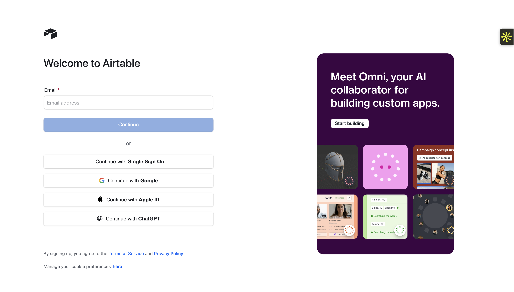

---

## Step 2 — Set Up Your Account Profile

Airtable will walk you through a short onboarding form. Fill it in as follows:

1. **What is your company name?** → type company name for example `maven`
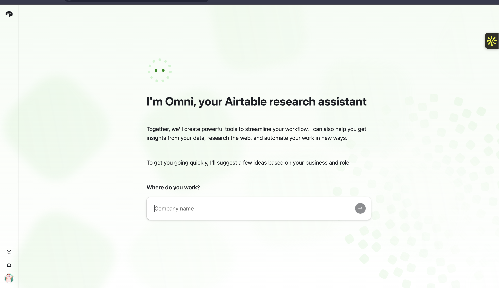
similarly
2. **Which industry is your company in?** → type **Tech**
3. **Which team are you on?** → type **Tech**

---

## Step 3 — Create a Blank Base

now click on **X** on top and it will prompt you **"Create a Black App"**

1. Click **"Create"**

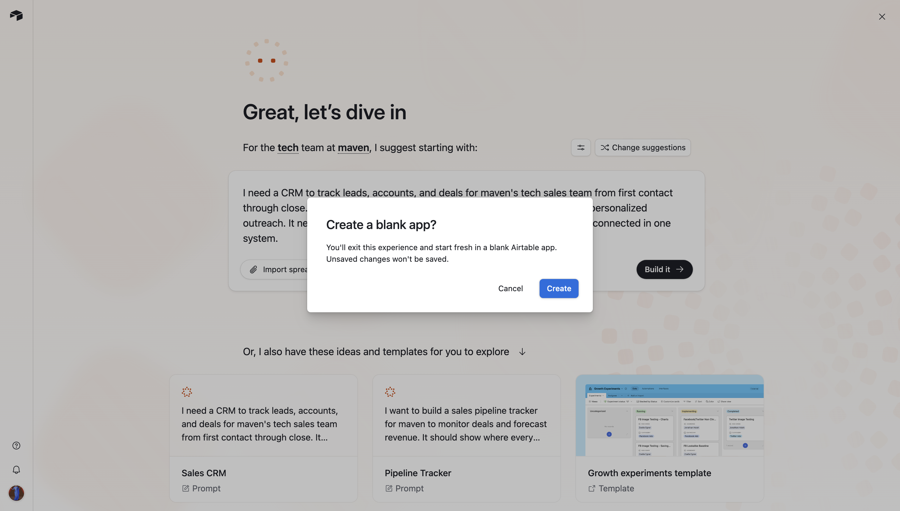

After you click, Airtable may show a prompt: **"Start your Airtable journey with a 14-day trial of the Team plan."** Click **"Get started"** on the next screen, then click **"Skip"** — you will use the free plan.

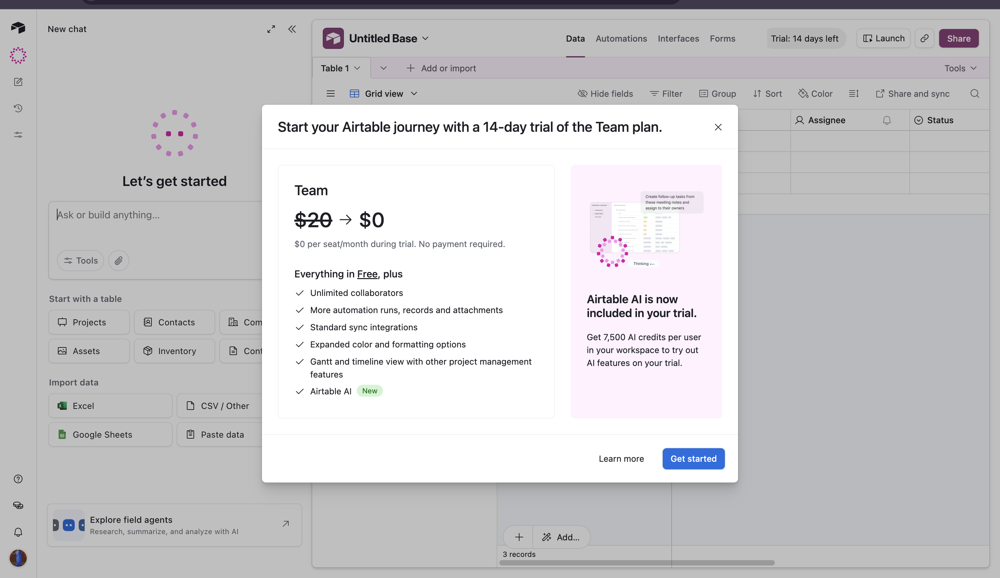

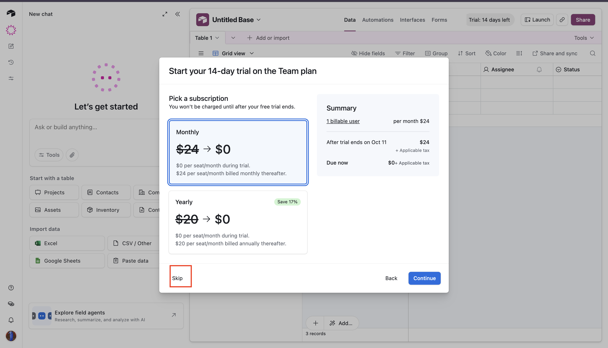

---

## Step 4 — Rename the Base

At the top of the screen you will see the base name (it defaults to something like "Untitled Base").

1. Click the base name at the top
2. Replace it with `cohort-10`
3. Press **Enter** to save

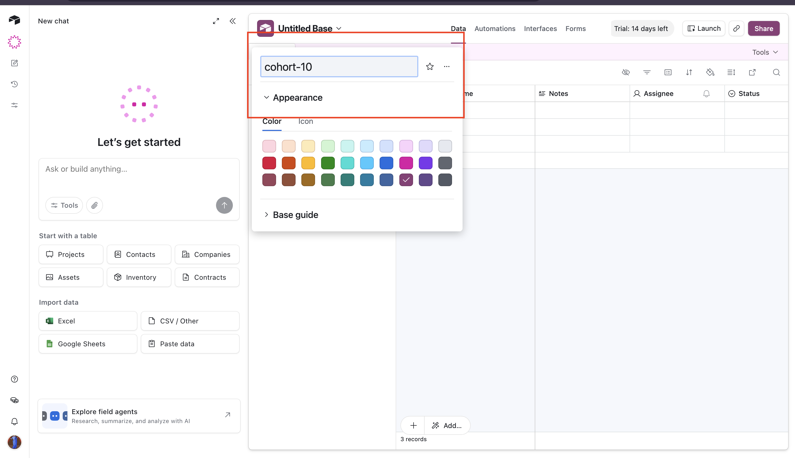

---

## Step 5 — Configure the Contract Table Fields

Your table currently has a generic **Name** column and some empty extras. You will replace them with five contract-specific fields.

Rename and configure each column by double-clicking on the column header:

| Column | Field Name | Field Type |
|---|---|---|
| 1 | Contract Name | Single line text |
| 2 | Service Provider | Single line text |
| 3 | Customer | Single line text |
| 4 | Start Date | Date |
| 5 | End Date | Date |

### How to rename and retype each field

1. **Double-click** on the column header
2. Clear the existing name and type the new field name
3. In the dropdown below the name, select the correct field type (**Single line text**)
4. Click **"Save"**

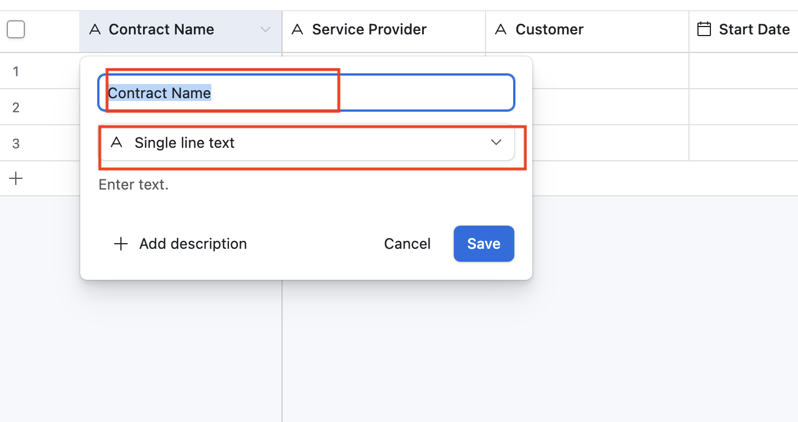

### How to delete unwanted extra fields

If your table has extra columns you do not need:

1. **Right-click** on the extra column header
2. Click **"Delete field"**

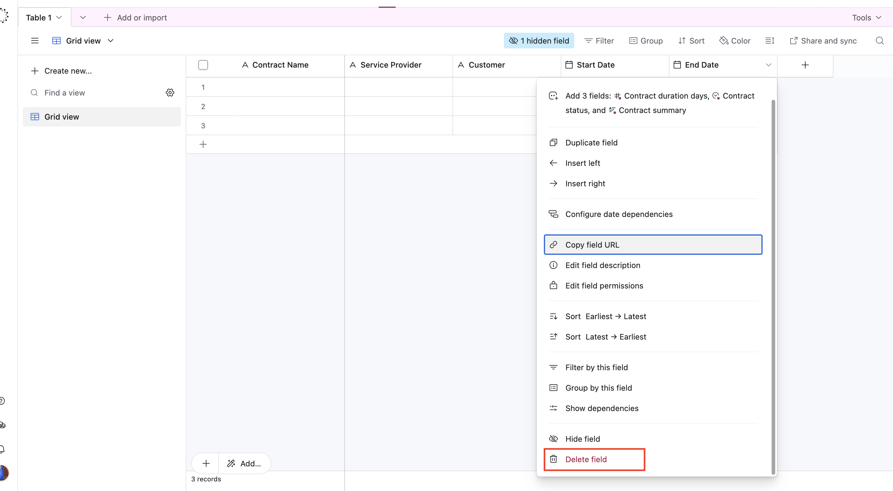

> When you are done, your table should have exactly five columns: **Contract Name**, **Service Provider**, **Customer**, **Start Date**, **End Date**.

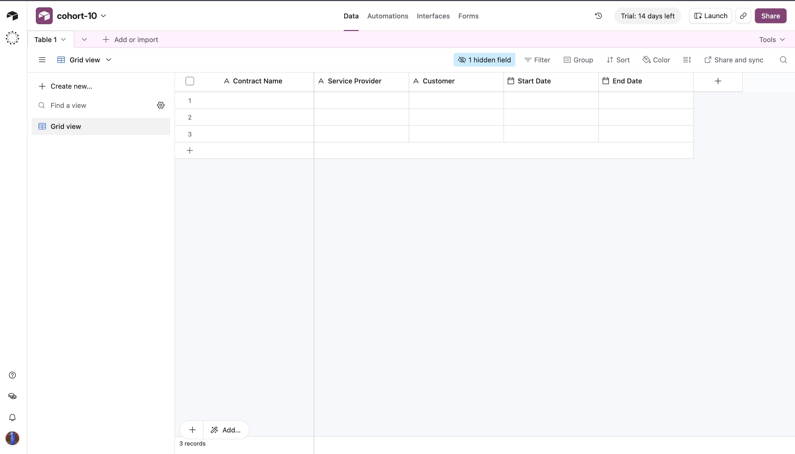

---

## Step 6 — Open the Builder Hub

In the left sidebar, click **"Builder Hub"**.

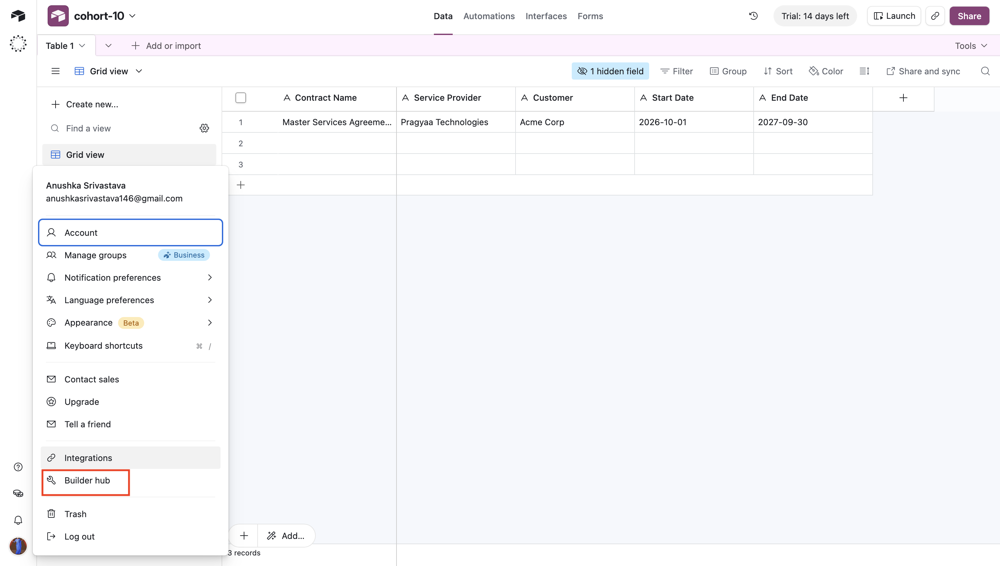

---

## Step 7 — Open Personal Access Tokens

Inside Builder Hub:

1. Click **"Personal access tokens"**

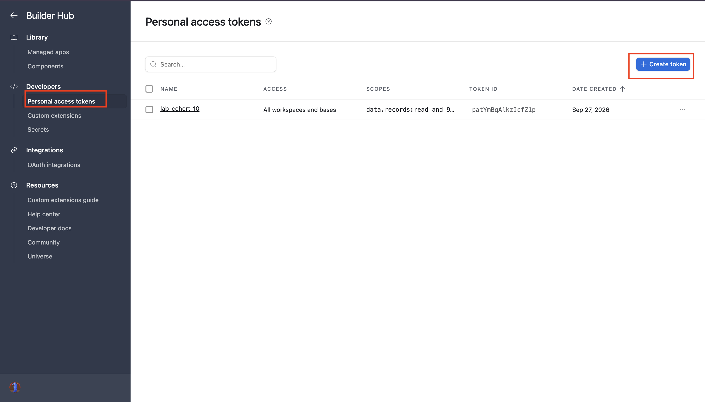

---

## Step 8 — Create a New Token

1. Click **"Create new token"**

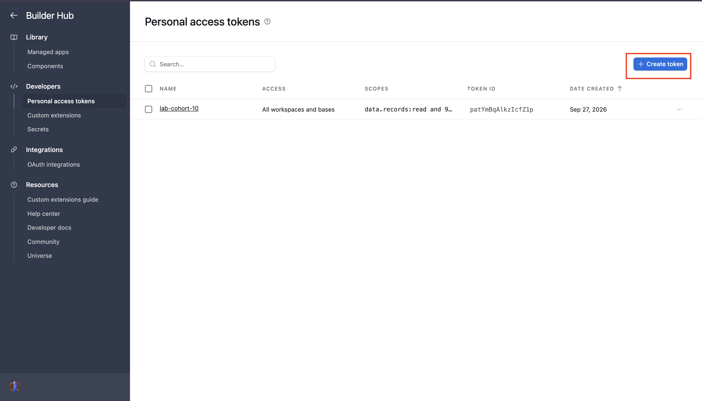

2. Give your token a name — for example: `cohort-10-token`

## Step 9 — Set Token Scopes and Access

You need to give this token full access to your base and all available operations.

**Add access:**

1. Under **"Add access"**, click **"Add a base"** and select **All workspaces** (or select `cohort-10` specifically)

**Add scopes:**

2. Under **"Add scopes"**, click **"Add a scope"** and select every available scope — add them all

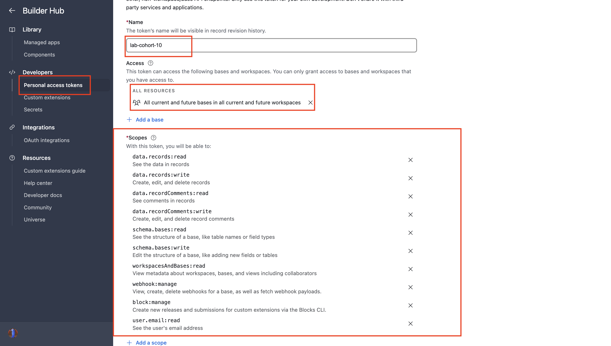

> Scopes control what the token is allowed to do. Adding all scopes ensures your automation tools can read, write, create, and delete records without hitting permission errors later.

---

## Step 10 — Copy and Save Your Token

1. Click **"Create token"**

2. Your token will appear on screen — it starts with `pat`
3. Click **"Copy"** to copy it to your clipboard
4. **Paste it somewhere safe** — a notes app or password manager — before clicking Done

> **This token is shown only once.** If you close this screen without copying it, you will need to delete it and create a new one.

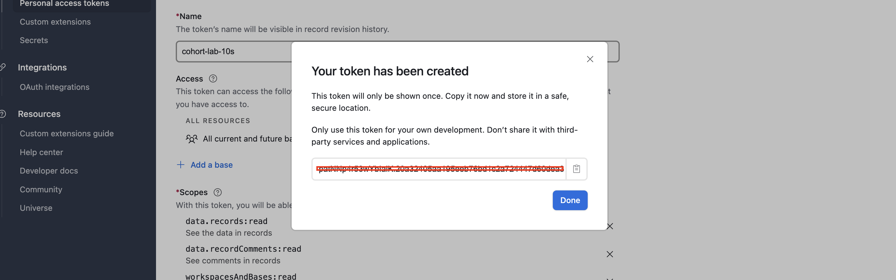

5. Click **"Done"**

---

## Important Notes

### Keep Your Token Safe

- Your Personal Access Token gives full access to your Airtable data — treat it like a password
- Never paste it into a public repository, share it in a message, or hard-code it into frontend code
- If you think it has been exposed, go back to **Builder Hub → Personal access tokens**, delete it, and create a new one
