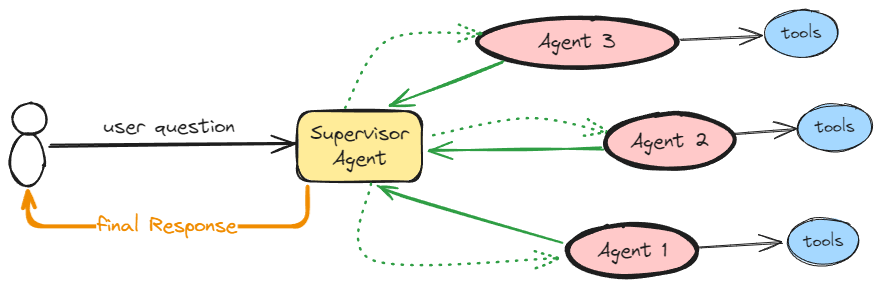
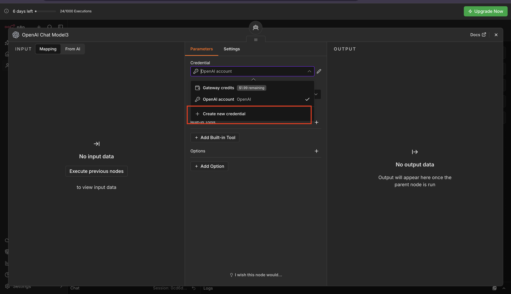
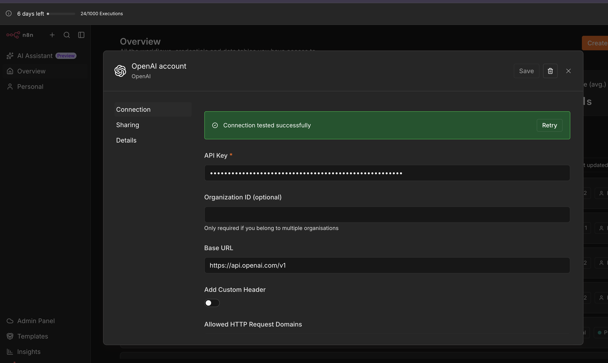
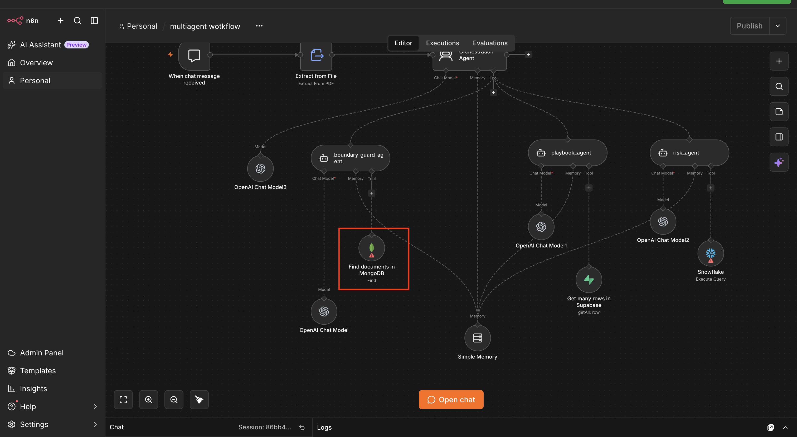
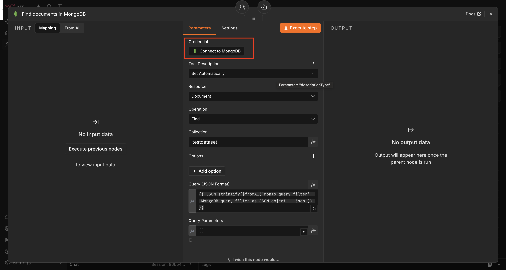
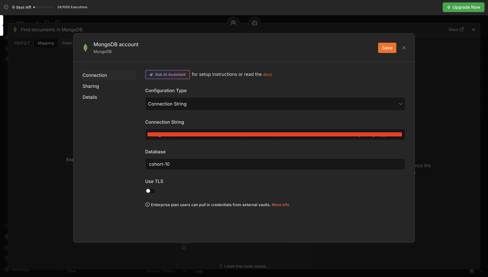
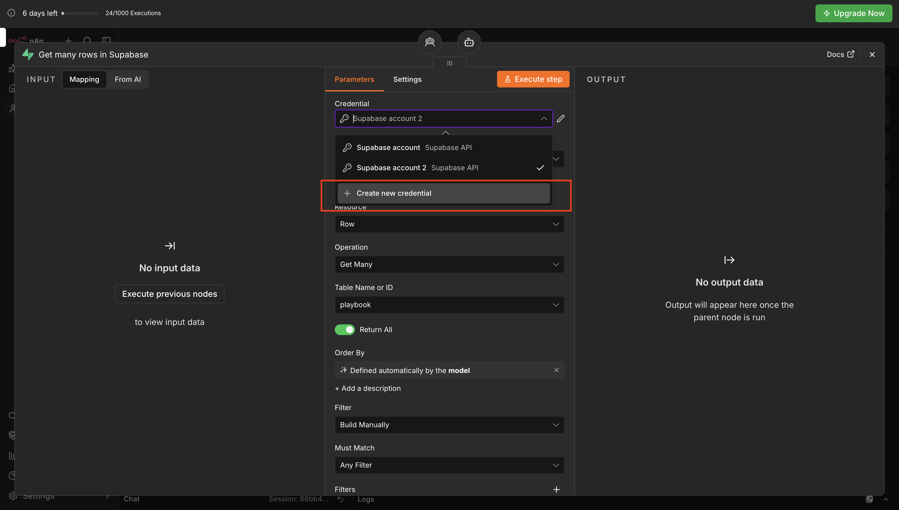
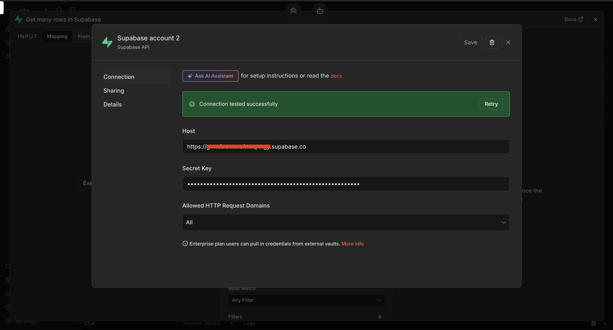
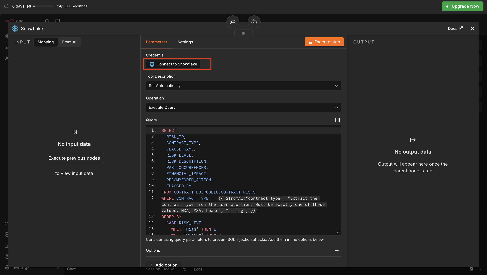
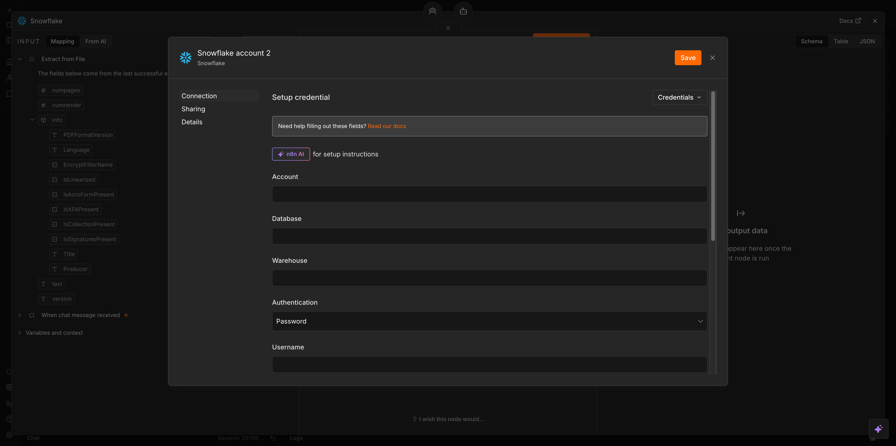

# Building a Multi-Agent Contract Assistant in n8n




## What You Will Build

By the end of this lab you will have a working **multi-agent AI system** that can:

- Accept a contract PDF from a user via chat
- Route every user message to the correct specialist agent automatically
- Handle off-topic questions politely using MongoDB data
- Answer process and approval questions using Supabase data
- Identify contract risks and red flags using Snowflake data
- Remember the entire conversation using a shared memory node

---

## Understanding Multi-Agent Architecture

Before you touch n8n, read this section carefully. The confusion most people hit in this lab comes from not understanding **which agent does what** before they start building.

### What Is a Multi-Agent System?

A single AI agent handles one job well. A **multi-agent system** is a group of specialised agents, each an expert in a narrow domain, coordinated by a central agent called the **Orchestrator**.

Think of it like a company:

| Role | Who They Are |
|---|---|
| User | Sends a message or question |
| Orchestration Agent | The manager — reads the question and decides which specialist to call |
| boundary_guard_agent | The receptionist — politely redirects off-topic questions |
| playbook_agent | The process expert — explains approval steps and procedures |
| risk_agent | The legal analyst — flags risky clauses and financial exposure |

### How the Flow Works

Every single message the user sends travels through this exact path:

```
User sends message + uploads contract PDF
          │
          ▼
 ┌─────────────────────┐
 │  PDF Extraction Node │  ← Pulls raw text out of the uploaded contract
 └─────────────────────┘
          │
          ▼
 ┌─────────────────────────────────────────────────┐
 │              Orchestration Agent                 │
 │  Reads: user message + full contract text        │
 │  Decides: which specialist agent to call         │
 └─────────────────────────────────────────────────┘
       │              │                │
       ▼              ▼                ▼
 boundary_guard   playbook_agent    risk_agent
    _agent
       │              │                │
       ▼              ▼                ▼
   MongoDB        Supabase          Snowflake
 (off-topic     (process steps    (risk records
  responses)    and approvals)    and red flags)
```

### Agent Responsibilities — Detailed

**Orchestration Agent**

This is the only agent the user ever "speaks to" directly. It receives the user's message and the full contract text together. Its only job is to read the intent of the message and decide which of the three specialist agents below it should handle the work. It does not answer questions itself — it delegates.

**boundary_guard_agent**

This agent is called by the Orchestration Agent whenever the user sends a message that has nothing to do with contracts — greetings, jokes, general knowledge, sports scores, etc. It queries MongoDB to find a pre-written polite response and a redirect message, then returns that to the user. It never makes up answers from its own knowledge.

**playbook_agent**

This agent is called when the user asks *how* something works — "What is the approval process for this NDA?", "Who needs to sign an MSA?", "What are the renewal steps for a Lease?". It queries the Supabase `playbook` table and returns only what is stored there. It never adds its own recommendations.

**risk_agent**

This agent is called when the user asks about danger, red flags, or risky terms in the contract — "Is this clause risky?", "Is uncapped liability dangerous?", "What are all the risks in this Lease?". It queries the Snowflake `CONTRACT_RISKS` table, filters by contract type, and returns risk records ordered by severity (High → Medium → Low). Like the others, it never answers from its own knowledge.

---

## Prerequisites

Complete these setup labs before starting. You will need credentials from each one.

| Setup Lab | What You Need From It |
|---|---|
| [MongoDB Setup](./setup/mongoDBSetup/Readme.md) | Your MongoDB connection string (the `mongodb+srv://...` URI from Step 16 of that lab) |
| [Supabase Setup](./setup/supabaseSetup/readme.md) | Your Supabase Project URL and Service Role Secret Key (from Steps 9–10 of that lab) |
| [Snowflake Setup](./setup/snowflakeSetup/Readme.md) | Your Snowflake account identifier, username, password, and warehouse name (from the config file in Step 23 of that lab) |

You will also need:

| Item | Download |
|---|---|
| **OpenAI API key** | From your OpenAI account dashboard |
| **Sample Contract PDF** | [Download here](https://pragyaallc-my.sharepoint.com/:b:/g/personal/sachin_parmar_legalgraph_ai/IQC2WQJhhIuyRq5JrVY13FwNAdwS4M5gB5w-qzBAm9V4mRQ?e=ga6WWO) |
| **n8n Workflow JSON** | [Download here](https://pragyaallc-my.sharepoint.com/:u:/g/personal/sachin_parmar_legalgraph_ai/IQBAgQZ67JvLQInPPuVaOOrQATSUgdVf5Rl3OiKFbJuChOk?e=VncRoY) |

> If you have not completed the three setup labs above, stop here. Each credential used in this lab was generated and saved during those labs. You cannot complete the wiring steps without them.

---

✅ if you want to build from scratch [build-from-scratch.md](./build-from-scratch.md)

---

## Two Ways to Build This

| | **Import the Workflow** | **Build from Scratch** |
|---|---|---|
| **Best for** | Getting up and running fast | Understanding every node and connection |
| **Time** | ~10 minutes | ~45 minutes |
| **What you do** | Import the pre-built JSON and connect your own credentials | Add every agent, tool, and memory node yourself |

Both paths produce the same working multi-agent system. The steps below cover the import path — for the node-by-node path, use the link above.

---

## Import the Workflow

### Step 1 — Create a New Workflow

Open n8n and click **"Create Workflow"** in the top right. You'll land on a blank canvas.

### Step 2 — Import the Starter File

Click the **three-dot menu (⋮)** at the top left, select **"Import from File"**, and upload the `n8n-workflow.json` file from the prerequisites.

Your canvas will populate with the Chat Trigger, Extract From File node, the Orchestration Agent, all three specialist agent tools (`boundary_guard_agent`, `playbook_agent`, `risk_agent`), their database tool nodes, and the shared Window Buffer Memory node — all already wired together.

> Credentials are never included in an exported workflow, for security reasons. You'll connect your own in the steps below — everything else (prompts, system messages, routing logic, node connections) arrives exactly as built.

### Step 3 — Verify the Connections

Every node should be linked with a visible line — Chat Trigger → Extract From File → Orchestration Agent → each specialist agent → its database tool, and the Window Buffer Memory node connected to the memory slot of all four agents. If anything looks disconnected, drag the small circle on the edge of that node to reconnect it.

---

### Step 4 — Connect Your OpenAI Credentials

There are **four** OpenAI Chat Model nodes in this workflow — one for the Orchestration Agent and one for each of the three specialist agents.

Click into each one, click **"Credential"** → **"Create New Credential"** (or select your existing one after the first), and paste your OpenAI API key. Pick a model such as `gpt-5-mini` for all four.





---

### Step 5 — Connect MongoDB to boundary_guard_agent

Click on the `boundary_guard_agent` node, then click its **MongoDB** tool node.



Click **"Connect to MongoDB"**.



In the credential panel, change the **Configuration Type** from `Value` to `Connection String` and paste your MongoDB connection string (the `mongodb+srv://...` URI you saved during the MongoDB Setup lab) and Confirm the **Database** field is set to `cohort-10`.



---

### Step 6 — Connect Supabase to playbook_agent

Click on the `playbook_agent` node, then click its **Supabase** tool node. Click **"Create Credential"**.



Enter your **Supabase Project URL** (the `https://xxx.supabase.co` URL from Step 10 of the Supabase Setup lab) and your **Service Role Key** (from Step 9 of the Supabase Setup lab).



---

### Step 7 — Connect Snowflake to risk_agent

Click on the `risk_agent` node, then click its **Snowflake** tool node. Click **"Connect to Snowflake"** and fill in the fields from your Snowflake config file (saved during the Snowflake Setup lab):

- **Account**: your account identifier (e.g. `abc12345.us-east-1`)
- **Username**: your Snowflake username
- **Password**: your Snowflake password
- **Warehouse**: `COMPUTE_WH`
- **Database**: `CONTRACT_DB`
- **Schema**: `PUBLIC`
- You may leave **Passphrase** and **Role** blank if they do not apply





---

### Step 8 — Test the Import

Click **"Open Chat"**, upload the sample contract PDF, and ask:

> *What is this contract about?*

If the Extract From File node errors on the binary field name, click it and set **"Input Binary Field"** to match the field shown in the left panel (e.g. `data0`) — the same fix described in the build-from-scratch guide.

---

## Final Workflow Checklist

Before testing, verify the following:

| Item | Done? |
|---|---|
| Chat Trigger node has "Allow File Uploads" enabled | |
| Extract From File node operation is set to "Extract from PDF" | |
| Extract From File Input Binary Field name matches the actual field (e.g. `data0`) | |
| Orchestration Agent has User (Message) referencing both chatInput and extracted text | |
| Orchestration Agent has system message pasted | |
| Orchestration Agent has an OpenAI Chat Model connected | |
| boundary_guard_agent has Description, User Message, System Message, MongoDB Tool, and OpenAI Chat Model | |
| playbook_agent has Description, User Message, System Message, Supabase Tool, and OpenAI Chat Model | |
| risk_agent has Description, User Message, System Message, Snowflake Tool, and OpenAI Chat Model | |
| Window Buffer Memory is connected to all four agents | |
| Window Buffer Memory Context Window Length is set to 100 | |

---

## Test Your Workflow

Open the chat and run these test messages in sequence to verify each agent is working:

**Test 1 — Off-topic (should route to boundary_guard_agent → MongoDB)**

> *Hello! How are you?*

Expected: A polite response from MongoDB redirecting you back to contract topics.

**Test 2 — Process question (should route to playbook_agent → Supabase)**

> *What is the approval process for an NDA?*

Expected: Step-by-step approval guidance pulled from your Supabase `playbook` table.

**Test 3 — Risk question (should route to risk_agent → Snowflake)**

> *What are the risks in this NDA?*

Expected: Risk records from your Snowflake `CONTRACT_RISKS` table, ordered High → Medium → Low.

**Test 4 — Contract-specific risk (requires uploaded PDF)**

Upload the sample contract first, then ask:

> *Is the liability cap in this contract risky?*

Expected: The Orchestration Agent reads the contract type from the PDF, passes it to risk_agent, which queries Snowflake for matching risk records.

**Test 5 — Specific clause risk lookup (should route to risk_agent → Snowflake)**

> *Is the governing law clause risky?*

Expected: risk_agent queries Snowflake `CONTRACT_RISKS` for the `Governing Law` clause. Based on the data loaded during Snowflake Setup, you should see a **Low** risk result for NDA contracts — governing law set to a foreign jurisdiction adds legal cost but is not a critical blocker. The response will include the financial impact estimate (`$10,000 to $30,000 if dispute arises`) and the recommended action (`Negotiate to home state jurisdiction`).

---

## Troubleshooting

**"Extract from PDF returns no data"**

Check that the Input Binary Field name in the Extract From File node matches the actual field name. Click on the node and look at the left panel input — it shows the exact field name (e.g. `data0`, `data1`).

**"Orchestration Agent always calls the same agent"**

Check that the system message was pasted correctly and that the three agent tools are properly connected to the Orchestration Agent's tool slot. Also verify that each tool node has its Description filled in — the Orchestration Agent uses descriptions to decide which tool to call.

**"MongoDB returns empty"**

Confirm your connection string is correct and that the database name is `cohort-9` and collection name is `testdataset`. Verify that the data was inserted correctly during the MongoDB Setup lab.

**"Supabase filter does not work"**

Make sure the `$fromAI` expression is pasted exactly as written, including the double curly braces. Also confirm that the `playbook` table exists and has data — run the SQL from the Supabase Setup lab if needed.

**"Snowflake query returns no results"**

Verify that `CONTRACT_TYPE` values in your Snowflake table are exactly `NDA`, `MSA`, or `Lease` (case-sensitive). Also confirm the warehouse `COMPUTE_WH` is running — Snowflake trial warehouses auto-suspend after inactivity.

**"Memory is not working across messages"**

Ensure the Window Buffer Memory node is connected to the memory input slot (not the tool slot or main input) of all four agent nodes.
