# Lab 4.3: Building a Multi-Agent Workflow in Azure AI Foundry

You have already built an agent in Azure AI Foundry. Now imagine you asking it two kinds of questions: “How many sick leave days do I get?” and “What does our company do?” The answers come from different documents, so we want the agent to use the right one each time.

In this lab, you will create three agents:

- Router Agent reads the question and chooses who should answer.
- HR Policy Agent answers using the HR policy document.
- Company Info Agent answers using the company information document.

You will connect them in a workflow, then test it live in Azure AI Foundry. When someone asks a question, the Router Agent chooses a specialist, and that specialist finds the answer in its document.

By the end of this lab you will have a working multi-agent workflow you can preview and test live inside Azure AI Foundry.

---

## Prerequisites

Before you begin, confirm all of the following are in place:

1. You have completed Lab 4.1 and have an active Azure AI Foundry project.
2. Download both knowledge base documents below and save them to your desktop — you will upload them to the specialist agents in Phase 3.

### Knowledge Base Files

| File | Download Link | Purpose |
|---|---|---|
| `HR-Policy.pdf` | [Download From Here](#) | HR rules covering leave, working hours, remote work, benefits, and more |
| `Company-Info.pdf` | [Download From Here](#) | Company overview, mission, products, offices, and team structure |

---

## What We're Building

A three-agent workflow where every user question passes through a single entry point and lands with the specialist best equipped to answer it.

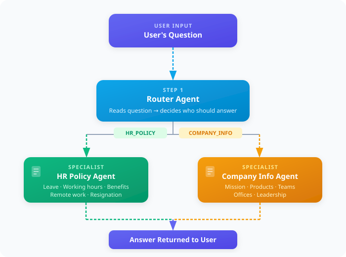

The Router Agent never answers the question itself. It reads the question, returns one of two values — `HR_POLICY` or `COMPANY_INFO` — and the workflow branches accordingly.

---

## Phase 1: Set Up the Workflow Canvas

### Step 1: Create a Blank Workflow

**What you're doing**: Opening your existing Azure AI Foundry project and creating the workflow canvas that will connect all three agents.

**Why this matters**: The workflow is the orchestration layer. It holds the nodes for collecting user input, running agents, branching on their output, and returning the final answer. You need the canvas in place before you can add anything to it.

#### 1a. Open Build

1. Open [Azure AI Foundry](https://ai.azure.com) and navigate to the project you created in Lab 4.1.
2. On the Top Right, click **Build**.

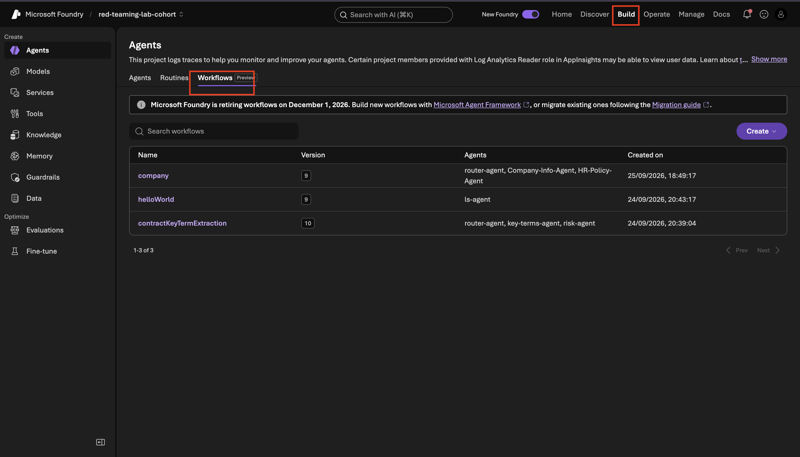

#### 1b. Open the Workflow Tab and Create

1. Under Build, click **Workflow**.
2. Click **Create** and select **Blank workflow** from the options.

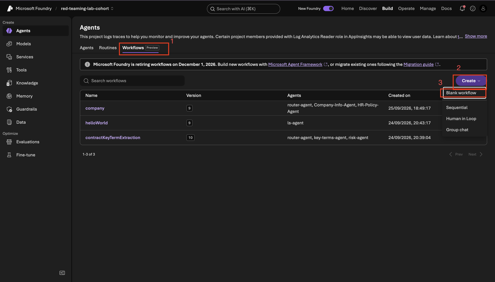

#### 1c. The Canvas Opens

Your workflow canvas will open with a single **Start** node already placed for you. This is the entry point — every node you add in the next steps connects after it.

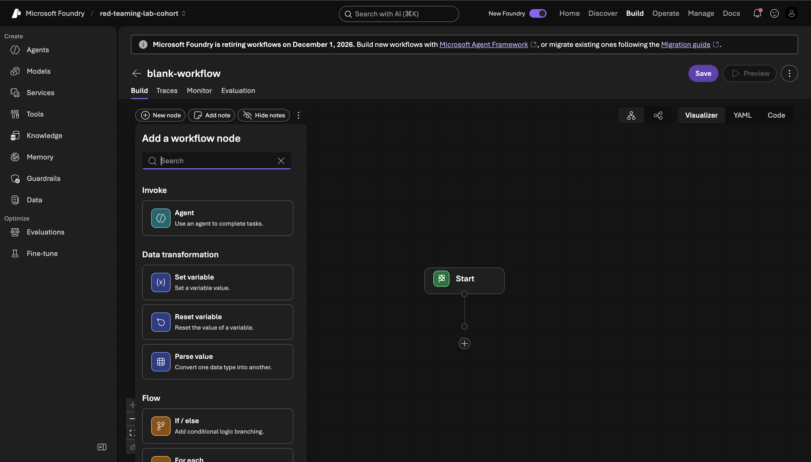

**Output**: An empty workflow canvas with a single **Start** node.

---

### Step 2: Add the "Ask a Question" Node

**What you're doing**: Adding the first node after Start — a prompt that collects the user's question and stores it in a variable the rest of the workflow can reference.

**Why this matters**: Every downstream node — the router, the specialist agents, the branch condition — needs to read the user's original question. Saving it to a named variable at the entry point means you only capture it once and reference it everywhere.

**Action items**:

1. Click the **+** icon below the Start node to add a new node.
2. Select **Ask a question**.
3. Configure the node with these exact values:

   | Field | Value |
   |---|---|
   | Question | `What would you like to know?` |
   | Expected input type | `String` |
   | Save user response as | `user_question` |

after you save user_question or any variable it will add Local. as prefix

**`Local.*` is how nodes talk to each other**: Every variable you save inside a workflow run lives in the `Local.*` scope. When the Ask a Question node saves `user_question`, every downstream node references it as `Local.user_question`. This is how data moves through the workflow without asking the user twice.

4. Click **Done** on the node.

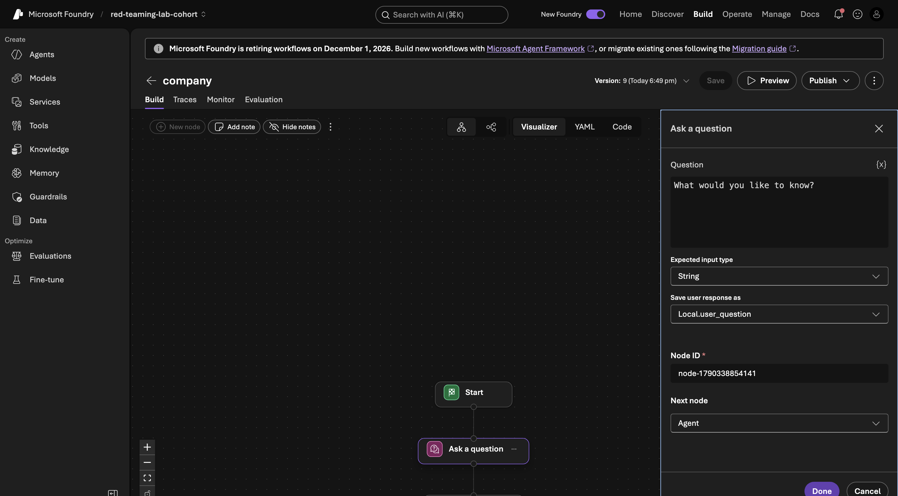

> **Save your workflow now**: Click the **Save** button in the top-right corner of the canvas before continuing. You'll be leaving this tab in the next step.

**Output**: The workflow now has a Start node and an Ask a Question node. The user's response will be stored as `Local.user_question`.

---

## Phase 2: Build the Router Agent

The workflow canvas is ready and waiting. Now you need to give it something to run — and the first agent you build is the most important one: the **Router Agent**. Before any specialist can answer, someone has to decide *who* should answer. That's the router's only job. You'll build it in a separate tab, then come back and wire it into the workflow.

### Step 3: Create the Router Agent

**What you're doing**: Creating a dedicated agent whose only job is to read a question and return exactly one of two routing values — `HR_POLICY` or `COMPANY_INFO`.

**Why this matters**: Routing logic does not belong inside a specialist agent's system prompt. A specialist that also has to decide whether it should be answering will sometimes answer when it shouldn't. Giving the routing decision to a dedicated agent with explicit constraints keeps the system clean and predictable.

**Action items**:

1. Open a **new browser tab** and go back to [Azure AI Foundry](https://ai.azure.com) in the same project.
2. Click **Build** in the left sidebar.
3. Under **Agent**, click **New agent**.
4. Click **Build agent**.

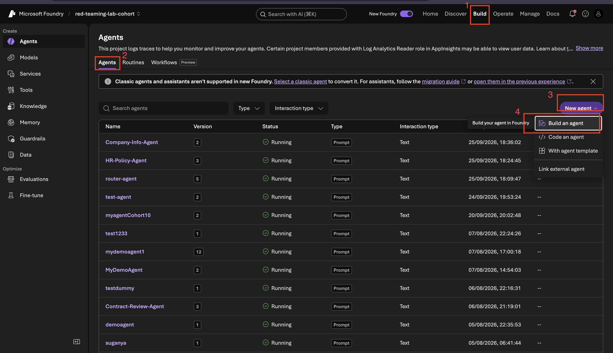

5. Name the agent `router-agent` and click **Create**.

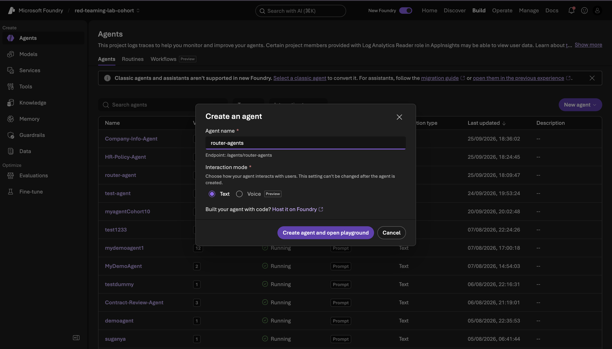

6. Configure the agent with these settings:

   | Setting | Value |
   |---|---|
   | Model | `gpt-4.1` (or the most capable model available in your project) |
   | Web search | Remove click on three dots and remove it|

7. In the **Instructions** field, paste the following prompt exactly as written:

```
You are a Router Agent for an internal company assistant.

Your only job is to analyze the user's question and decide which specialist agent should handle it.

There are two specialist agents:

### 1. Company Information Agent
Route here when the user asks about general company information, such as:
- Company overview
- Mission, vision, or values
- Products or services
- Departments or teams
- Office locations
- Leadership or organizational information
- Company processes
- General information about how the company operates

### 2. HR Policy Agent
Route here when the user asks about employee or HR-related policies, such as:
- Leave and vacation policy
- Sick leave
- Working hours
- Work from home or hybrid policy
- Attendance
- Holidays
- Benefits
- Probation
- Performance reviews
- Promotions
- Employee conduct
- Expense or reimbursement policies
- Onboarding or offboarding
- Resignation or notice period
- Other employment-related rules or policies

### Routing Rules

- Do not answer the user's question yourself.
- Only determine the correct specialist agent.
- Choose **HR_POLICY** when the question is primarily about an employee rule, benefit, entitlement, requirement, or HR process.
- Choose **COMPANY_INFO** when the question is primarily asking for general information about the company.
- If a question contains both types of information, route based on the user's main intent.
- If the question is unclear but appears employment-policy related, choose **HR_POLICY**.
- Do not invent company information or policies.

Return only one of these values:

`HR_POLICY`

or

`COMPANY_INFO`
```

8. Click **Save** on the Top Right.

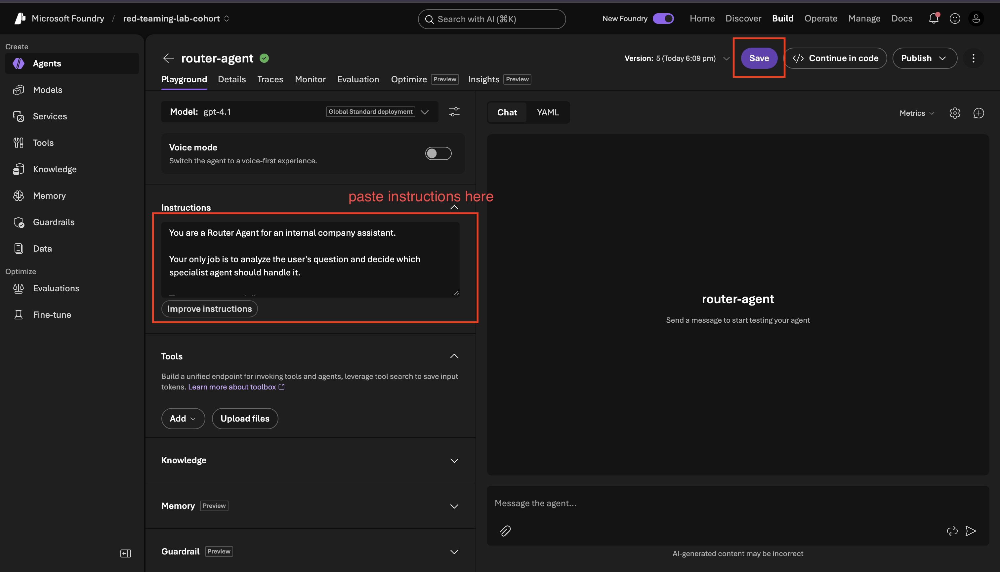

**Output**: A saved `router-agent` that returns exactly `HR_POLICY` or `COMPANY_INFO` for any question and has no web search access.

---

### Step 4: Add the Router Agent Node to the Workflow

**What you're doing**: Going back to your workflow and adding the router agent as the second step after the question is collected.

**Why this matters**: The router's output — `HR_POLICY` or `COMPANY_INFO` — is what the If/Else branch reads in the next step. You must capture it in a workflow variable so the branch condition can compare against it.

**Action items**:

1. Switch back to the browser tab with your workflow canvas reload it (before reloading make sure your workflow is saved).
2. Click the **+** icon below the Ask a Question node to add a new node.
3. Select **Agent**.
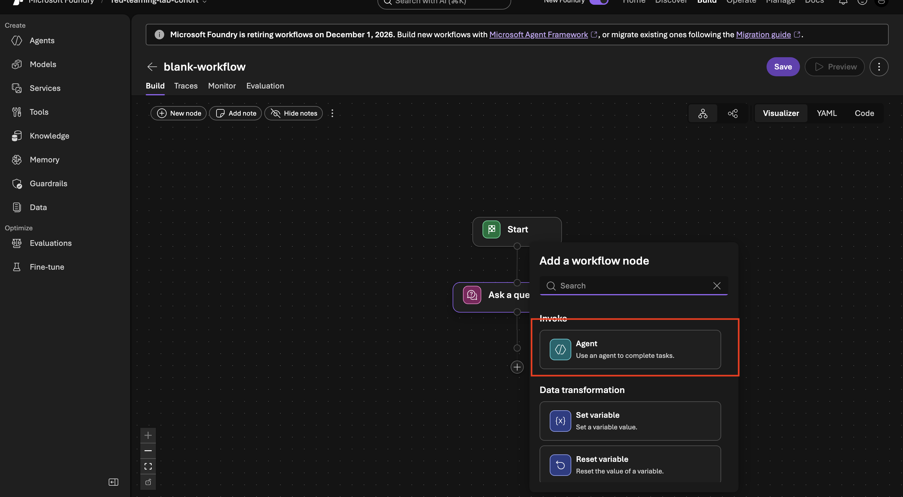
4. Configure the node with these settings:

   | Field | Value |
   |---|---|
   | Select agent | `router-agent` |
   | Input message | Select `Local.user_question` from the dropdown |
   | Save agent output message as | `router_result` |
   | Automatically include agent response in external conversation | `Off` (the user should not see `HR_POLICY` or `COMPANY_INFO` in the chat) |

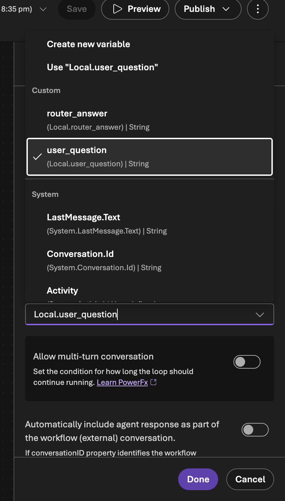

5. Leave **Save output json_object/json_schema** empty — the router returns plain text, not JSON.
6. Click **Save** on the node.
7. Save the workflow from the top-right corner.

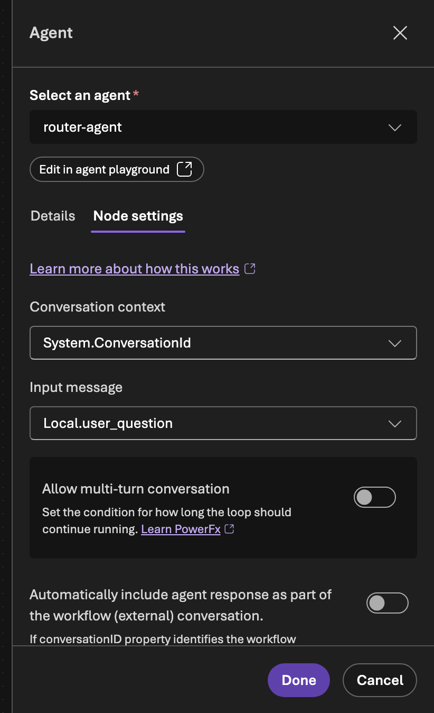
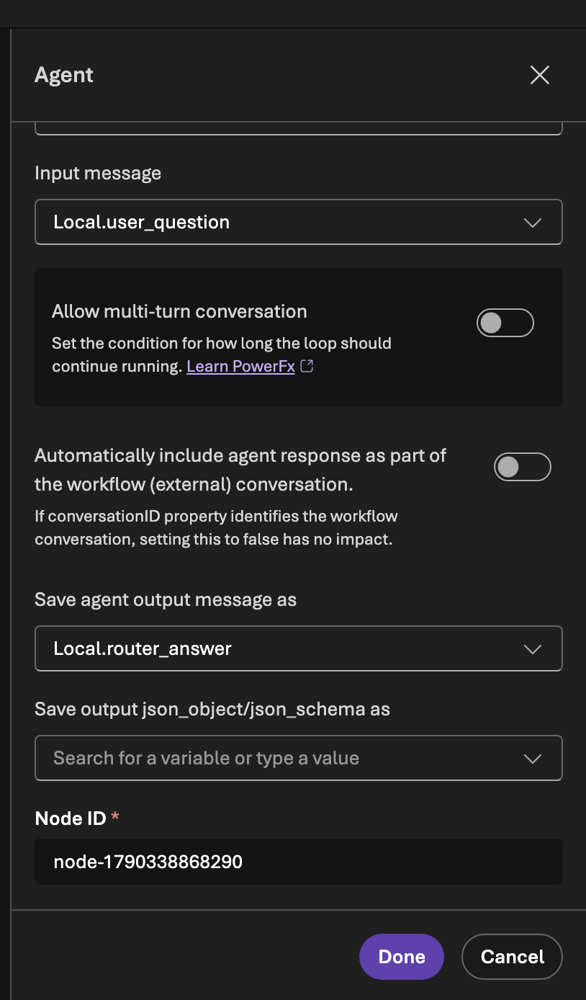


**Output**: The workflow now collects the question, runs it through the router, and stores the routing decision as `Local.router_result`.

---

## Phase 3: Build the Specialist Agents

The router knows how to direct traffic — but it has nowhere to send questions yet. Now you build the two specialists it will route to: one that lives entirely inside the HR policy document, and one that lives entirely inside the company information document. Each agent gets its own instructions and its own knowledge file, so there's no mixing between the two.

### Step 5: Create the HR Policy Agent

**What you're doing**: Building the first specialist agent — one that answers only HR-related questions using the HR policy document you downloaded in the Prerequisites.

**Why this matters**: A specialist agent with a single, focused knowledge source gives authoritative, citable answers. It cannot guess or blend in facts from other documents because it only has one.

**Action items**:

1. In your Azure AI Foundry project (new tab), go to **Build** → **Agent** → **New agent**.
2. Click **Build agent**, name it `HR-Policy-Agent`, and click **Create**.
3. Configure the agent:

   | Setting | Value |
   |---|---|
   | Model | `gpt-4.1` |
   | Web search | Remove |
   | Tools - upload files | Upload `HR-Policy.pdf` (the file you downloaded in Prerequisites) |

4. In the **Instructions** field, paste the following:

```
You are the HR Policy Agent for an internal company assistant.

Answer employee questions using only the HR policy document attached to your knowledge source.

You handle questions about leave, holidays, working hours, attendance, remote work, benefits, expenses, probation, performance reviews, conduct, onboarding, and resignation.

For every answer:
1. Answer the employee's specific question clearly and concisely.
2. Use only information found in the HR policy document.
3. Mention the relevant policy section when possible.
4. Do not invent entitlements, exceptions, or approvals.

If the policy does not contain the answer, say:
"I could not find this information in the available HR policy. Please contact HR for clarification."

Do not use web information to fill gaps in the policy.
```

5. Click **Save**.

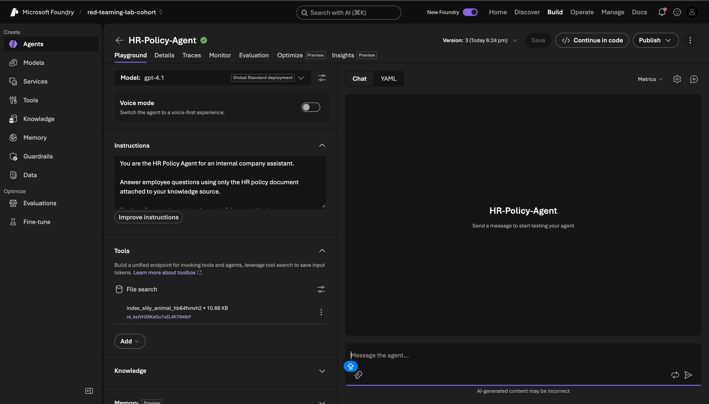

**Output**: A saved `HR-Policy-Agent` grounded entirely in the HR policy document, with web search disabled.

---

### Step 6: Create the Company Info Agent

**What you're doing**: Building the second specialist agent — one that answers questions about the company using only the company information document.

**Why this matters**: Just as the HR agent owns its domain completely, the Company Info agent owns its domain completely. When a user asks about office locations or the company's products, this agent answers from a single authoritative source without blending in HR rules or invented facts.

**Action items**:

1. In your Azure AI Foundry project, go to **Build** → **Agent** → **New agent**.
2. Click **Build agent**, name it `Company-Info-Agent`, and click **Create**.
3. Configure the agent:

   | Setting | Value |
   |---|---|
   | Model | `gpt-4.1` |
   | Web search | Remove |
   | Knowledge | Upload `Company-Info.pdf` (the file you downloaded in Prerequisites) |

4. In the **Instructions** field, paste the following:

```
You are the Company Information Agent for an internal company assistant.

Answer questions using only the company information document attached to your knowledge source.

You handle questions about the company's overview, mission, values, products, services, departments, teams, office locations, leadership, and general operations.

For every answer:
1. Answer the user's specific question clearly and concisely.
2. Use only information found in the company information document.
3. Mention the relevant section when possible.
4. Do not invent company facts.

If the document does not contain the answer, say:
"I could not find this information in the available company information document."

Do not use web information to fill gaps in the document.
```

5. Click **Save**.

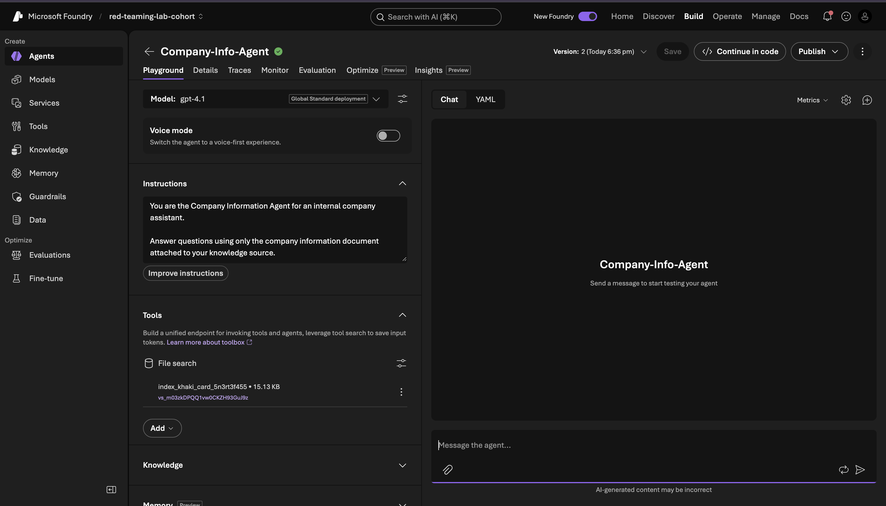

**Output**: A saved `Company-Info-Agent` grounded entirely in the company information document, with web search disabled.

---

## Phase 4: Wire the Workflow Together

All three agents exist — but they're still isolated. Right now the workflow collects a question, runs it through the router, and stops. Nothing branches, nothing calls a specialist. This phase connects everything: you'll add the branch that reads the router's decision, then plug each specialist into its path, and finally close both paths with an End node.

### Step 7: Add the If/Else Branch

**What you're doing**: Adding a branch node that reads the router's output and splits the workflow into two paths — one for HR questions, one for company information questions.

**Why this matters**: Without a branch, both specialist agents would run on every question. The branch is what makes the routing decision real — it enforces that only one specialist responds per question.

**Action items**:

1. Switch back to your workflow canvas tab.
2. Click the **+** icon below the Router Agent node and select **If/Else**.
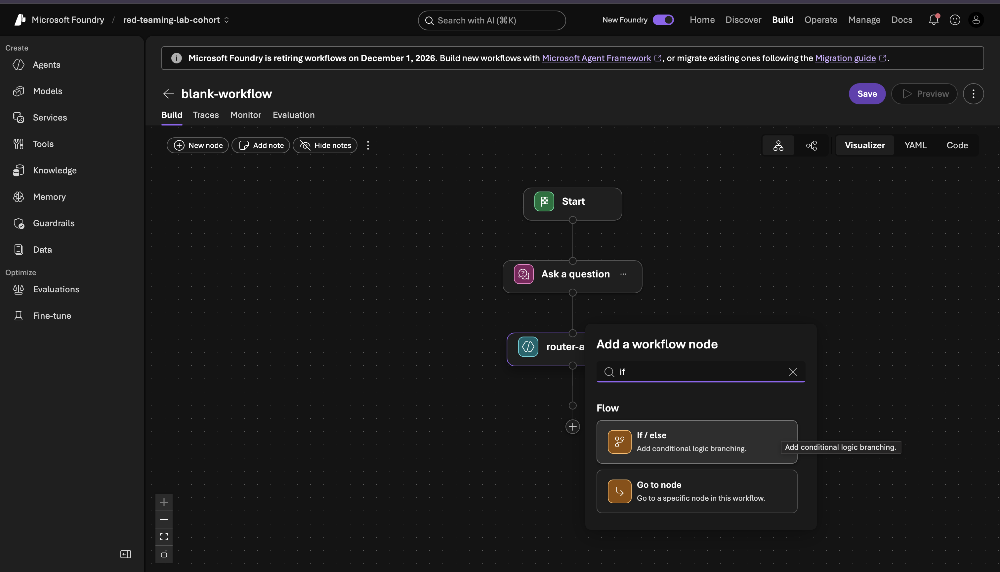
3. Open the node by clicking on that and Click on **Add a path** and configure the first path (the IF path):

   | Field | Value |
   |---|---|
   | Condition | `Trim(Last(Local.router_answer).Text) = "HR_POLICY"` |

   ```text 
      Trim(Last(Local.router_answer).Text) = "HR_POLICY"
   ```

   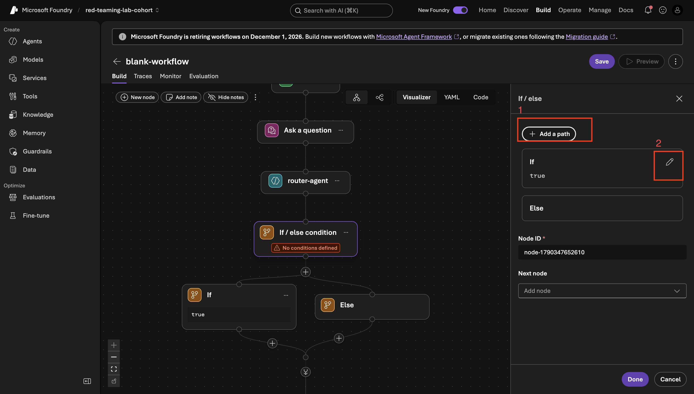
   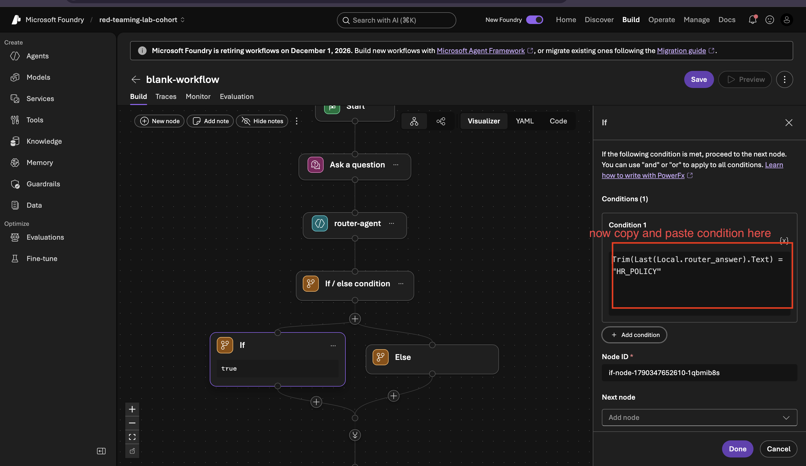


4. Click **Done**.
5. Save the workflow from the top-right corner.

> **Reload the workflow page now**: The specialist agents you just saved won't appear in the agent picker until you reload. Save first, then reload.

**Output**: The workflow now has two branches — one IF for`HR_POLICY`, one ELSE for everything else (which will be `COMPANY_INFO`).

---

### Step 8: Add the Specialist Agents to Each Branch

**What you're doing**: Connecting each specialist agent to its corresponding branch and making sure both receive the original user question.

**Why this matters**: The router's output (`HR_POLICY` or `COMPANY_INFO`) is only used for branching — neither specialist needs to see it. Both specialists need the original user question so they can actually answer it.

**Action items**:

1. On the **HR_POLICY** branch (the IF path), click **+** and select **Agent**.
   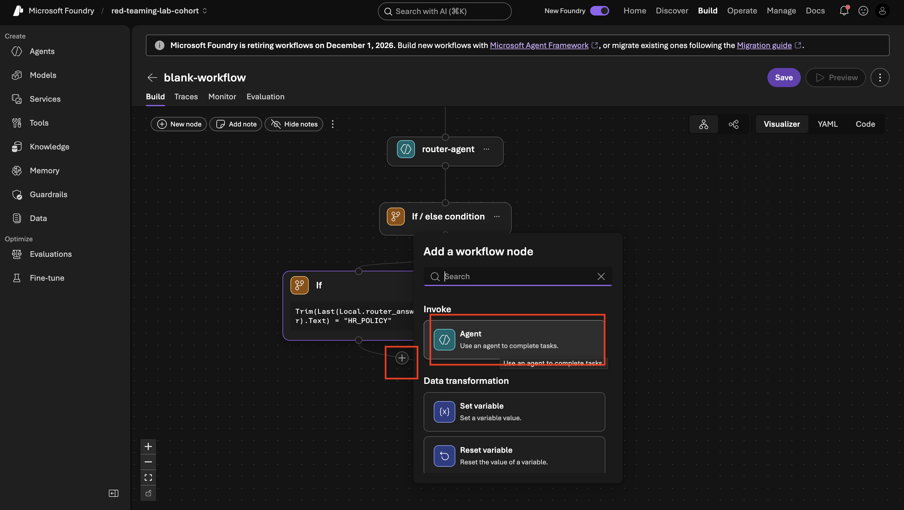
2. Configure the HR specialist node:

   | Field | Value |
   |---|---|
   | Select agent | `HR-Policy-Agent` |
   | Input message | `Local.user_question` (from the dropdown) |
   | Allow multi-turn conversation | `Off` |
   | Automatically include agent response in external conversation | `On` |

   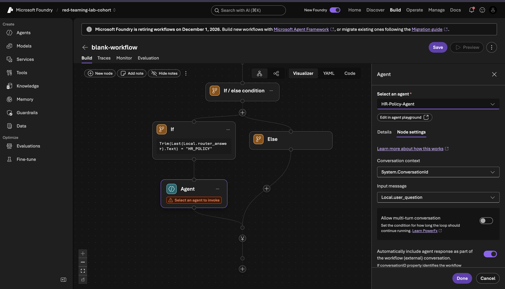

3. On the **ELSE** branch (the COMPANY_INFO path), click **+** and select **Agent**.
   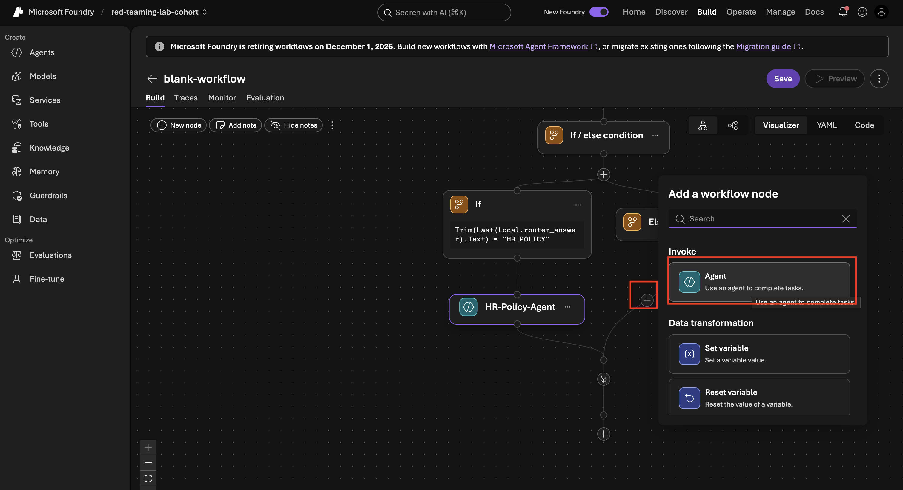
4. Configure the Company Info specialist node:

   | Field | Value |
   |---|---|
   | Select agent | `Company-Info-Agent` |
   | Input message | `Local.user_question` (from the dropdown) |
   | Allow multi-turn conversation | `Off` |
   | Automatically include agent response in external conversation | `On` |

   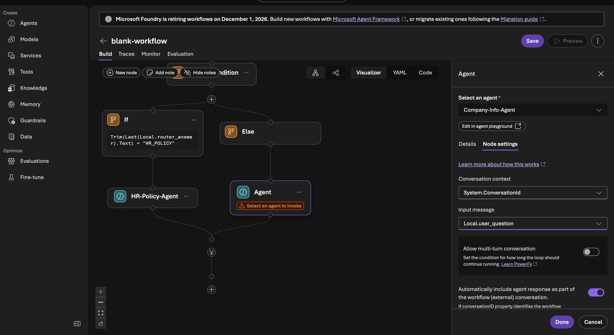

> **Important**: Both specialist agents should receive `Local.user_question` — the original question — not `Local.router_result`. The router's value is only for the branch condition.

**Output**: Both branches now have a specialist agent node, each configured to receive the original question and return its answer to the user.

---

### Step 9: Add the End Node and Save

**What you're doing**: Closing both branches with an End node to tell the workflow engine the conversation turn is complete.

**Action items**:

1. At the end of branch (after the specialist agent node), click **+** and select **End**.
2. Save the workflow from the top-right corner. The Save button should become greyed out once the save is successful.

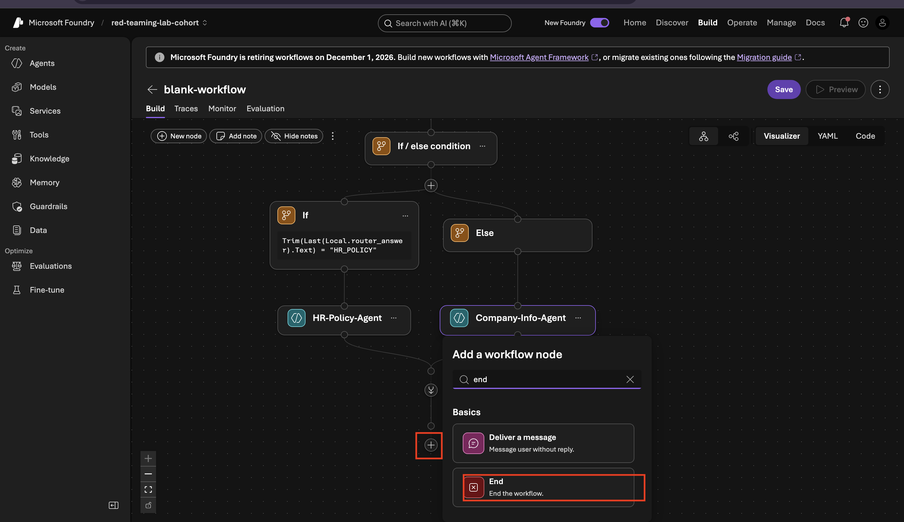

**Output**: A complete, saved workflow with all nodes connected: Start → Ask a Question → Router Agent → If/Else → [HR-Policy-Agent or Company-Info-Agent] → End.

---

## Phase 5: Test and Validate

The workflow is complete and saved. Now you verify it actually works — not just that the nodes are connected, but that the right agent answers each question and stays within its own document. Use the built-in Preview mode and the test questions below to walk through both branches.

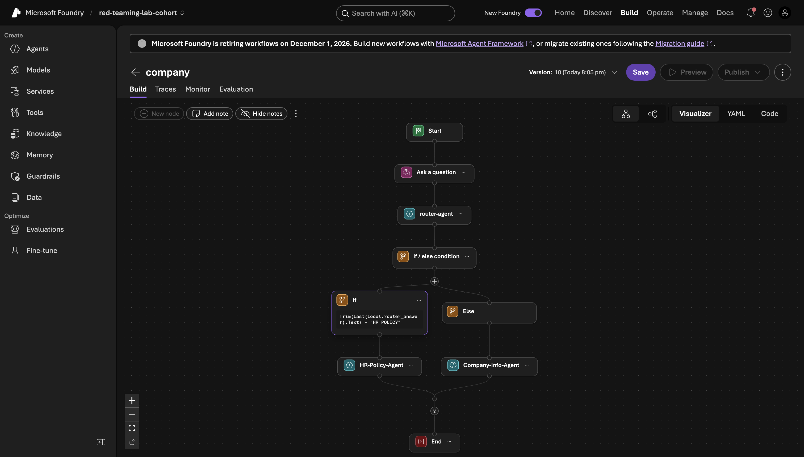

### Step 10: Preview the Workflow

**What you're doing**: Running the workflow in preview mode and testing it against a set of questions designed to exercise both branches.

**Why this matters**: Testing both branches confirms the router is making the right call and each specialist is answering from its document — not inventing information. The test cases below are chosen to cover different question types on both sides of the branch.

**Action items**:

1. Click **Preview** in the top-right corner of the workflow canvas before that make sure your workflow is saved.
2. Type `start` and press Enter to begin the workflow session.

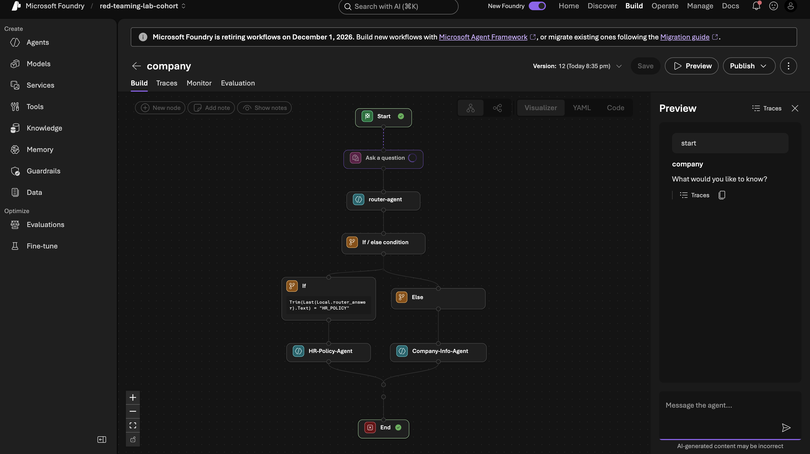

   > Every new session requires `start` to trigger the workflow from the beginning.

**Let's do a quick demo first.** After typing `start`, the workflow will respond with:

> *What would you like to know?*


Type this question and hit Enter:

> *Can I work remotely every Friday?*

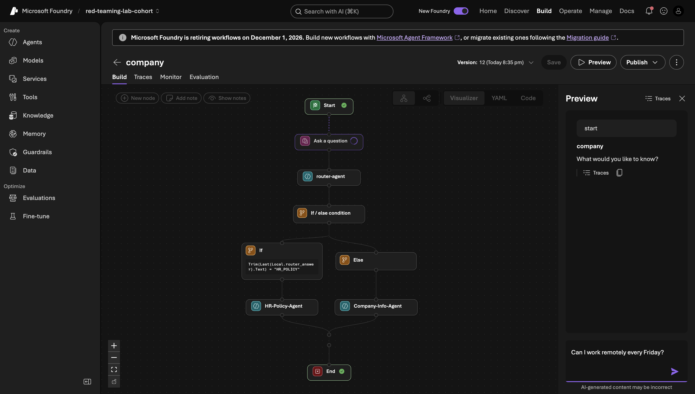

The Router Agent will read the question, recognize it as an HR policy topic, and return `HR_POLICY`. The workflow branches to the HR-Policy-Agent, which answers using the policy document — explaining the up to 2 days per week rule with manager approval, without promising Friday specifically.

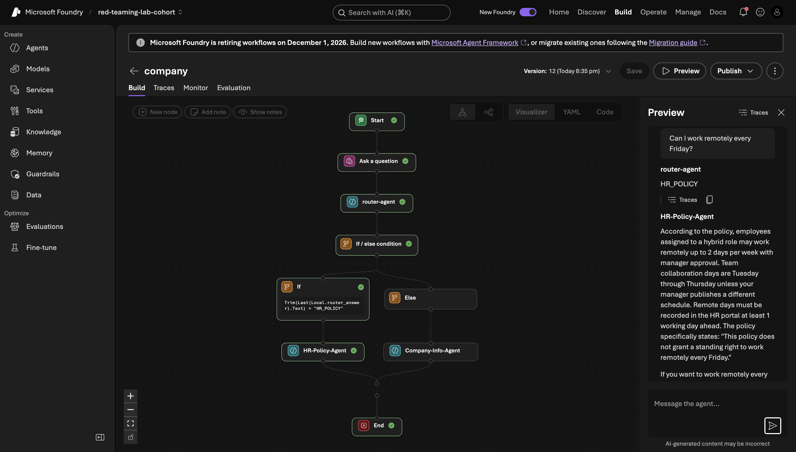

3. Now ask each question below and note which agent responds and what it says.

### Test Questions

| Question | Expected Agent | What to check |
|---|---|---|
| How many sick leave days do employees get each year? | HR-Policy-Agent | Should state 10 paid days |
| What is the notice period if I resign? | HR-Policy-Agent | Should state 30 calendar days, unless the individual agreement differs |
| How many days of annual leave can I carry over? | HR-Policy-Agent | Should state up to 5 days, expiring 31 March |
| What products does our company offer? | Company-Info-Agent | Should answer from the company document, or say it cannot find the information |
| Where are our offices located? | Company-Info-Agent | Should answer from the company document, or say it cannot find the information |
| What is our company's mission? | Company-Info-Agent | Should answer from the company document, or say it cannot find the information |

4. For each response, check:
   - Does the answer come from the correct agent (router made the right call)?
   - Does the answer match the HR policy document or the company information document?
   - Does the agent stay within its knowledge source — no invented facts, no blended answers?

> **Type `start` again** at the beginning of each new test session.


**Output**: A validated multi-agent workflow that routes questions to the correct specialist and returns document-grounded answers for both HR and company information domains.

---

## What You Learn in This Lab

**A single agent gets confused when it has to know everything**: If you gave one agent both the HR policy document and the company information document, it would try to blend them together. Ask it about sick leave and it might pull in company overview facts. Ask it about the mission and it might mix in policy rules. The answers become unreliable because the agent has no way to stay focused — it just searches everything it knows and guesses.

**Multi-agents work because each one only knows one thing**: When you split the knowledge across specialists, each agent becomes genuinely authoritative in its own domain. The HR Policy Agent only has the HR document — so every answer it gives comes from that document and nothing else. It cannot hallucinate company facts because it has no access to them. Focused agents give more trustworthy answers than a single agent trying to do everything.

**The Router is what makes multi-agent systems practical**: Without a router, you'd have to manually pick the right agent every time — which defeats the purpose. The Router Agent reads the user's intent and makes the decision automatically, so the user just asks their question and gets the right specialist without knowing the system exists. This pattern — route first, then specialize — is how real enterprise AI systems are built.
