# Lab 4.5: Adding Risk Intelligence and Conversation Memory to Your Contract Assistant

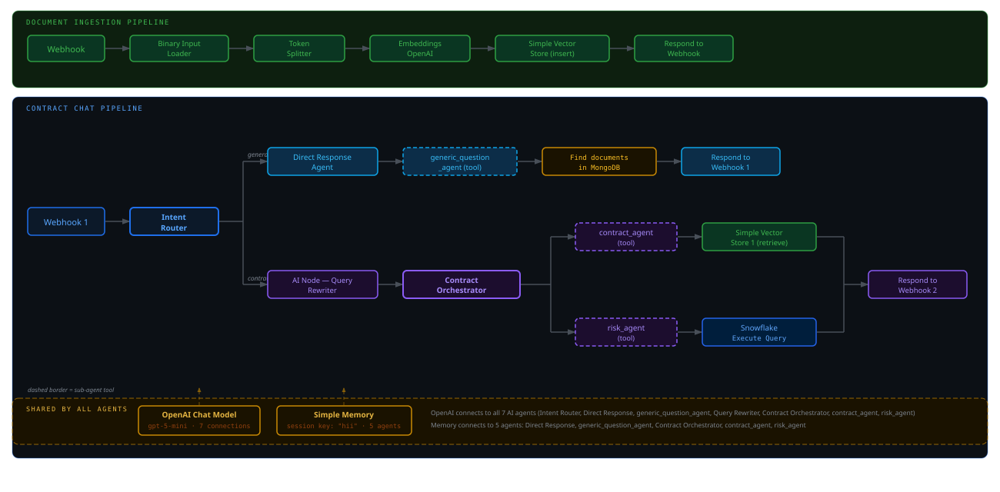

## Table of Contents

1. [What You Will Build in This Lab](#what-you-will-build-in-this-lab)
2. [Prerequisites](#prerequisites)
3. [Where We Are Starting From](#where-we-are-starting-from)
4. [Backing Off-Topic Replies With MongoDB](#backing-off-topic-replies-with-mongodb)
5. [Fixing the Query Writer Prompt](#fixing-the-query-writer-prompt)
6. [Splitting the RAG Agent Into an Orchestrator and Two Specialists](#splitting-the-rag-agent-into-an-orchestrator-and-two-specialists)
7. [Configuring contract_agent](#configuring-contract_agent)
8. [Wiring risk_agent to Snowflake](#wiring-risk_agent-to-snowflake)
9. [Connecting the OpenAI Chat Model to the New Agents](#connecting-the-openai-chat-model-to-the-new-agents)
10. [Giving Every Agent a Shared Memory](#giving-every-agent-a-shared-memory)
11. [Final Checklist](#final-checklist)
12. [Running the Tests](#running-the-tests)
13. [What You Learned in This Lab](#what-you-learned-in-this-lab)
14. [Troubleshooting](#troubleshooting)

---

## What This Lab Adds to Your Existing Workflow

The Agentic RAG workflow you built in Lab 2.3 answers questions from an uploaded contract. It classifies intent, rewrites queries, and retrieves relevant clauses from a vector store. That is a working contract Q&A system.

---

## What You Will Build in This Lab

| Capability | What changes |
|---|---|
| **Risk analysis** | A `risk_agent` backed by Snowflake answers questions like "Is this clause dangerous?" — the existing workflow can only tell you what a clause says, not whether it is a problem |
| **Controlled off-topic replies** | `generic_question_agent` fetches pre-written responses from MongoDB instead of the Direct Response Agent making something up each time |
| **Conversation memory** | A shared memory node means the system remembers what was said earlier — follow-up questions like "Is that risky?" actually work |
| **Specialist routing** | The single RAG agent is split into a `Contract Orchestrator` with two tools under it — `contract_agent` for factual retrieval and `risk_agent` for risk analysis |

---

## Prerequisites

Before starting, confirm all of the following are in place:

1. You have completed Lab 2.3 (Agentic RAG). Your n8n workflow has two Webhook nodes, an Intent Router, a Direct Response Agent, an AI Node — Query Rewriter, an AI Agent, two Vector Store nodes, and two Respond to Webhook nodes — all wired and working.
2. You have a **MongoDB Atlas** cluster with the `testdataset` collection loaded. If you have not set this up, complete the [MongoDB Setup lab](https://github.com/initmahesh/MLAI-community-labs/blob/main/Cohort-Labs/cohort-10/week-4/4.2-n8n-multiagent/setup/mongoDBSetup/Readme.md) first and save your connection string.
3. You have a **Snowflake** account with the `CONTRACT_DB.PUBLIC.CONTRACT_RISKS` table loaded. If you have not set this up, complete the [Snowflake Setup lab](https://github.com/initmahesh/MLAI-community-labs/blob/main/Cohort-Labs/cohort-10/week-4/4.2-n8n-multiagent/setup/snowflakeSetup/Readme.md) first and save your account identifier, username, password, and warehouse name.
4. You have your **OpenAI API key** — the same one used in Lab 2.3.

> If any of the above are missing, stop here and complete the relevant setup lab before continuing.

**Want to skip straight to testing?**

If you already have all the above set up and just want to see the finished workflow in action, download the completed workflow JSON here: [Agentic RAG Multiagent Workflow](https://drive.google.com/file/d/1wk9Mmm8Gmma5Dllt9WyfS-82LL3E25KX/view?usp=sharing)

Import it into n8n, add your credentials (OpenAI, MongoDB, Snowflake), and jump straight to [Running the Tests](#running-the-tests).

---

## Where We Are Starting From

This lab picks up from the Agentic RAG workflow you built in [Lab 2.3](https://github.com/initmahesh/MLAI-community-labs/blob/main/Cohort-Labs/cohort-10/week-2/2.3-n8n-agenticRAG/Readme.md). That workflow has two Webhook nodes, an Intent Router, a Direct Response Agent, an AI Node — Query Rewriter, an AI Agent node, two Vector Store nodes, and two Respond to Webhook nodes.

Every change below happens inside that workflow. Open it in n8n before continuing.

---

## Backing Off-Topic Replies With MongoDB

The Direct Response Agent handles messages that have nothing to do with contracts — things like "hello", "what is 2+2?", or "tell me a joke". Right now, the agent answers these by generating a response on its own using the LLM's knowledge. That means you have no control over what it says, and the wording changes every time.

In this section you will change how this works. Instead of letting the LLM generate a reply, you will connect it to a MongoDB collection that already has pre-written responses for different categories of off-topic messages. The agent will look up the right response and return it exactly. This gives you consistent, controlled output for anything that is not a contract question.

To do this, you will add a sub-agent called `generic_question_agent` inside the Direct Response Agent. The Direct Response Agent will stop generating answers and will instead always call `generic_question_agent`, which will query MongoDB and return the matching response.

### Step 1: Replace the Direct Response Agent System Message

**What you're doing:** The Direct Response Agent currently generates answers on its own. You are replacing its system prompt to make it a pass-through — it will always call `generic_question_agent` instead of answering directly. This is the first step in moving from generated replies to database-backed ones.

**Action items:**

1. Click on the **Direct Response Agent** node.

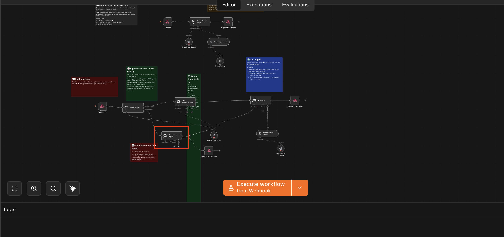

2. Find the **System Message** field under Options. Delete the existing content and paste:

```
You are the Direct Response Agent for a legal contract assistant.

YOUR ONLY JOB:
Call the attached `generic_question_agent` and return its response.

STRICT RULES:
- ALWAYS call `generic_question_agent`.
- Pass the user's original message unchanged.
- NEVER answer the user yourself.
- NEVER use your own knowledge.
- NEVER call MongoDB directly.
- NEVER generate, modify, summarize, or add to the agent's response.
- Return ONLY the response from `generic_question_agent`.
- If the agent returns no match or a fallback, return it exactly.
- If the agent fails, return a brief retrieval error. Do not invent an answer.

WORKFLOW:
1. Receive the user's message.
2. Call `generic_question_agent`.
3. Pass the original message.
4. Return the agent's response exactly.

USER MESSAGE:
{{ $json.body.message }}
```

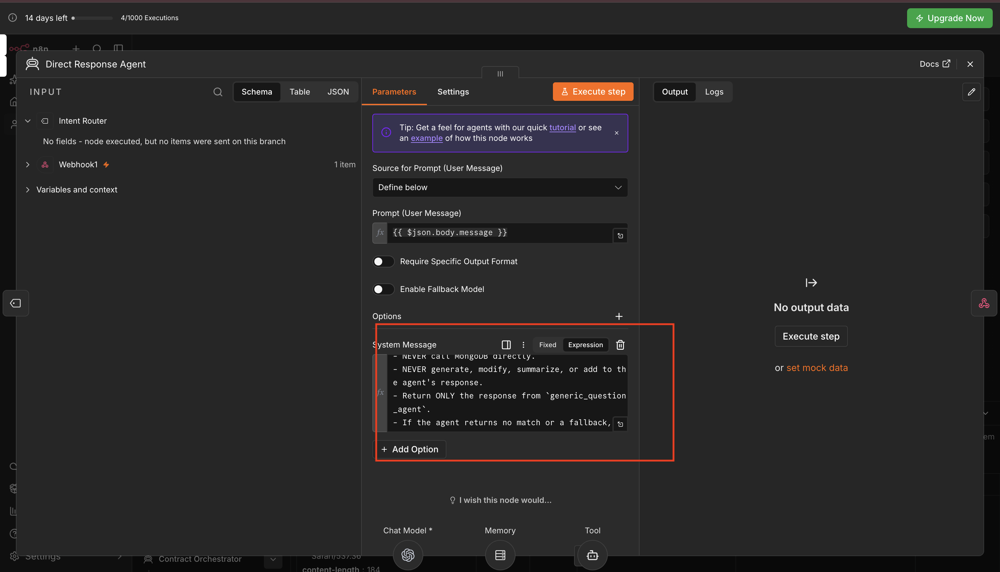

**Output:** The Direct Response Agent is now a pass-through that always calls `generic_question_agent`.

---

### Step 2: Add generic_question_agent as a Tool

**What you're doing:** In n8n, a sub-agent is added as a "tool" node attached to a parent agent. You are creating that tool node here and naming it `generic_question_agent`. Once it exists, the Direct Response Agent can call it as part of its workflow.

**Action items:**

1. Inside the **Direct Response Agent** node, click **Tool** to open the tool picker.
2. Search for `AI Agent` and select **AI Agent** (the tool version — it appears as an option alongside the regular agent).

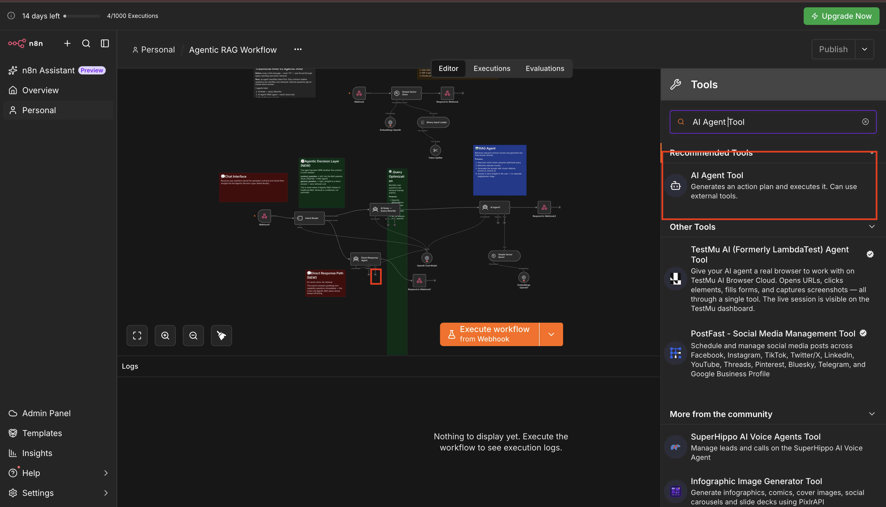

3. A new tool node appears connected to the Direct Response Agent. Click on it.
4. Change its name to `generic_question_agent`.

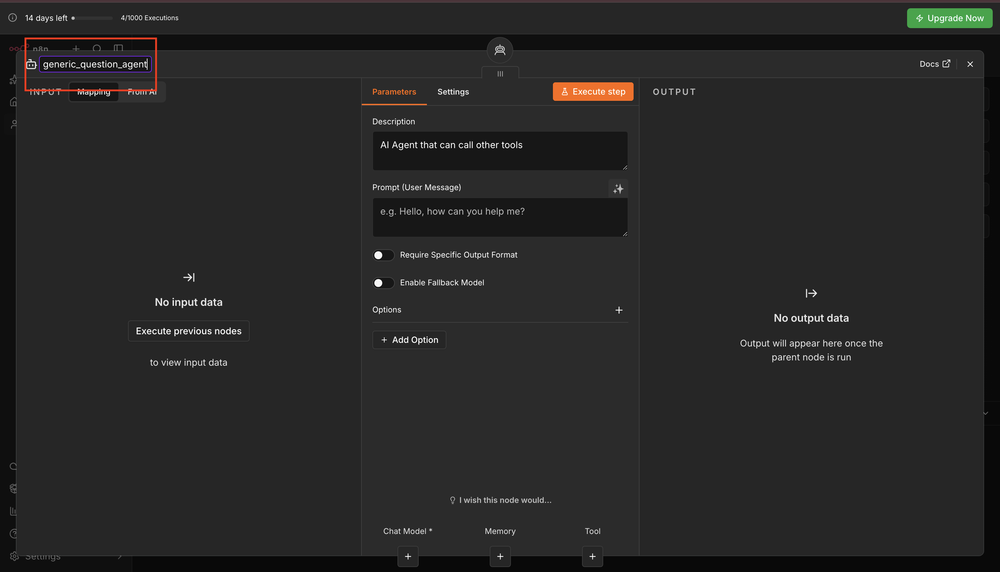

**Output:** `generic_question_agent` appears as a tool node connected to the Direct Response Agent.

---

### Step 3: Configure generic_question_agent

**What you're doing:** Every agent needs two things to work correctly — a description that tells the parent agent when to call it, and a system prompt that tells the agent what to do once it is called. You are setting both here. The description is what the Direct Response Agent reads to decide whether to route to `generic_question_agent`. The system prompt is what `generic_question_agent` itself follows when it runs.

**Action items:**

1. Inside the `generic_question_agent` node, find the **Description** field and paste:

```
Use this agent when the user sends a message that is NOT related to contracts at all. This includes greetings, general knowledge questions, small talk, off-topic requests, math questions, weather, news, sports, personal advice, or any random message.

This agent queries MongoDB and returns a pre-written polite response that redirects the user back to contract related topics.

Call this agent for messages like:
- Hi, Hello, Hey, Good morning
- What is the capital of Delhi?
- How are you?
- Tell me a joke
- What is 2+2?
- Who won the cricket match?
- What is the weather today?
- Thank you, Bye, Goodbye
- What is Python programming?
- Book me a flight
```

for **Prompt (User Message)** click on

```
  Defined automatically by the model 
```

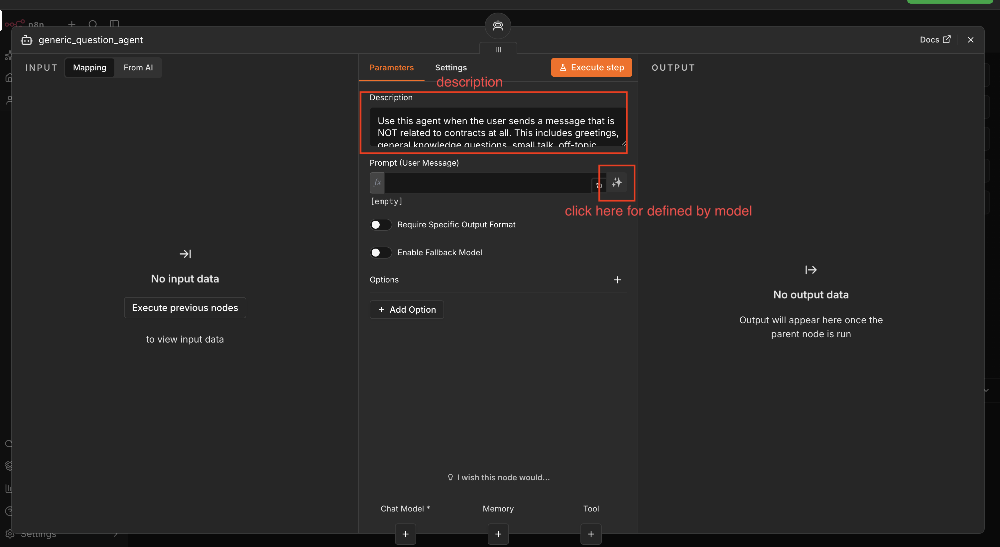

2. Click **Add Option** → **System Message** and paste:

```
You are generic_question_agent.

YOUR ONLY JOB:
Retrieve the appropriate response from MongoDB and return it.

STRICT RULES:
- ALWAYS call the MongoDB tool.
- Pass the user's message to the MongoDB tool.
- MongoDB is the ONLY source of truth.
- NEVER answer using your own knowledge.
- NEVER generate a response yourself.
- NEVER modify the MongoDB response.
- NEVER add text before or after the MongoDB response.
- NEVER explain the database result.
- Return ONLY the response retrieved from MongoDB.

PROCESS:
1. Receive the user's message.
2. Call the MongoDB tool.
3. Find the best matching document.
4. Return the response from that document exactly.

IF A MATCH IS FOUND:
Return only the matching MongoDB response.

IF NO MATCH IS FOUND:
Return exactly:
I am only able to assist with NDA, MSA, and Lease contract questions. Please ask me something related to your contract.
```

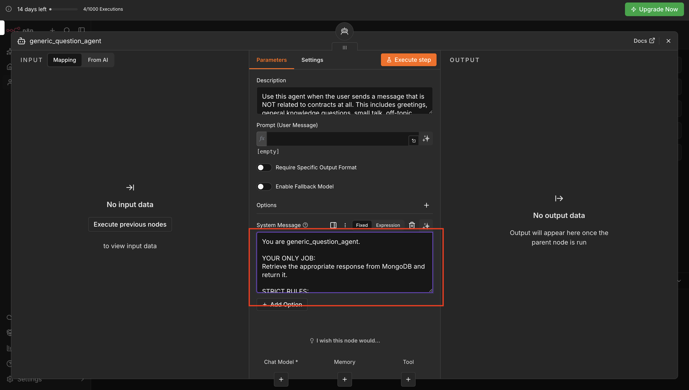

**Output:** `generic_question_agent` has its description and system prompt set.

---

### Step 4: Attach MongoDB to generic_question_agent

**What you're doing:** `generic_question_agent` needs a way to actually query your database. You connect a MongoDB tool node to it here, point it at your Atlas cluster, and configure the query field so the agent can search by message category. Once this is done, the agent has everything it needs: a system prompt telling it what to do, and a MongoDB connection to fetch the answer from.

**Action items:**

1. Inside the `generic_question_agent` node, click **Tool**.
2. Search for `MongoDB` and select the **MongoDB** tool. A new node appears.

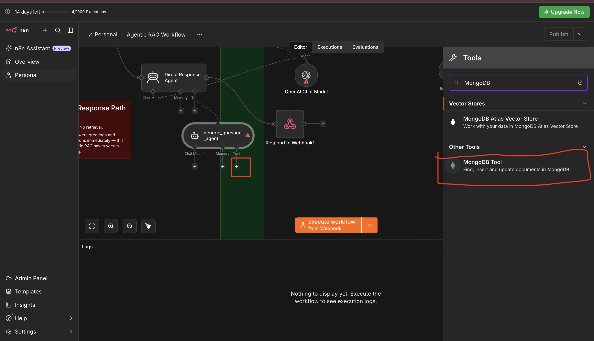

3. Click on the MongoDB tool node to open its settings.
4. Click **Create Credential**. In the credential panel, change **Configuration Type** from `Value` to `Connection String`.
5. Paste your MongoDB connection string — the `mongodb+srv://...` URI from the MongoDB Setup lab.
6. Set the **Database** field to `cohort-10` or the database name you created during mongodb setup and save the Credentials.
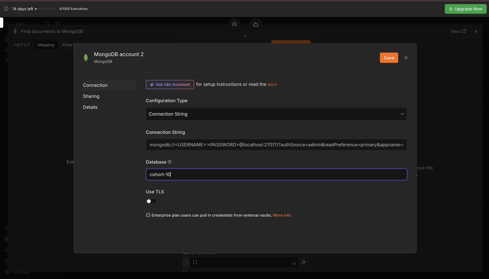

7. Now Set the **Collection** field to `testdataset` or the name you gave while inserting the json in mongoDB.
8. Set the **Operation** to `Find`.
9. In the **Query** field, paste:

```
{{ JSON.stringify($fromAI('mongo_query_filter', 'MongoDB query filter as JSON object', 'json')) }}
```

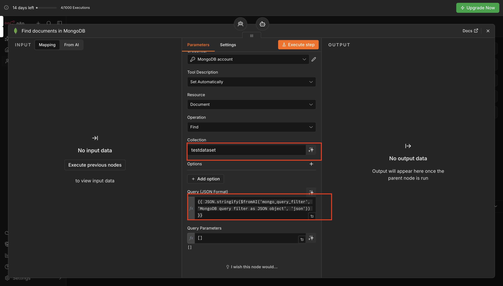

> When `generic_question_agent` identifies the type of off-topic message — a greeting, a math question, small talk — it builds a filter like `{"trigger_type": "greeting"}` and MongoDB returns the matching pre-written response. Nothing is hardcoded.

10. Still inside the `generic_question_agent` node, click **Chat Model**.
11. Select the existing **OpenAI Chat Model** node (the same one already used in your workflow — do not create a new one).

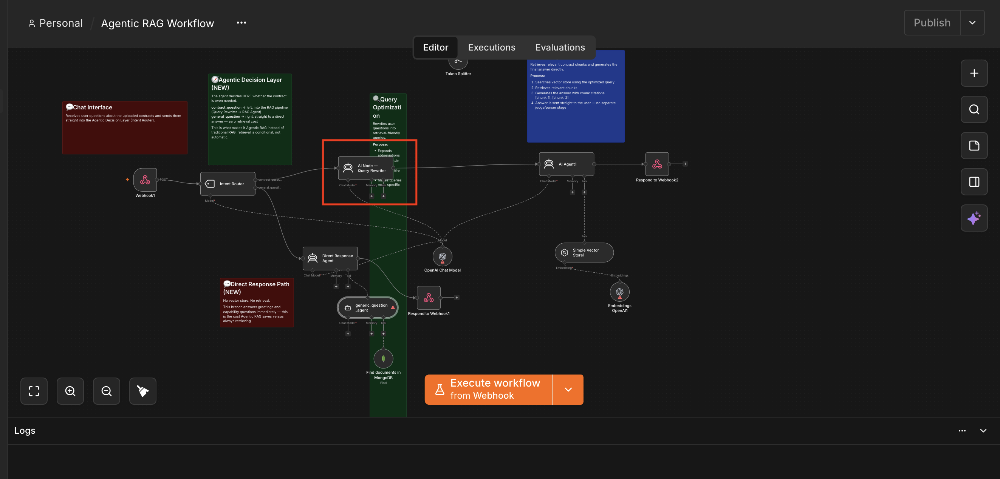

> Every AI Agent node in n8n needs a Chat Model to run. `generic_question_agent` is no different. You are connecting the shared OpenAI Chat Model here so it can process the user's message and decide what to query in MongoDB.

**Output:** `generic_question_agent` is fully configured — it has a system prompt, a MongoDB connection to fetch pre-written responses, and an OpenAI Chat Model to power its reasoning.

---

## Fixing the Query Writer Prompt

The AI Node — Query Rewriter runs before any contract question reaches the orchestrator. Its job is to clean up the user's question so it retrieves better results. The original prompt had a habit of expanding scope: "What are the risks?" would be rewritten as "What are the risks, liabilities, obligations, and responsibilities?" — four topics instead of one. When that wider rewrite reaches the orchestrator, it can pull the routing decision in the wrong direction. The fix is simple: preserve the intent, never add to it.

### Step 5: Replace the Query Rewriter System Prompt

**What you're doing:** Replacing the existing prompt with one that keeps the rewrite narrow and faithful to the original question.

**Action items:**

1. Click on the **AI Node — Query Rewriter** node.


2. Find the **System Message** field under Options. Delete the existing content and paste:

```
You are a query rewriting agent for a legal contract RAG system.

Your job is ONLY to make the user's question clearer for retrieval.

CRITICAL RULE:
NEVER add new requirements, intents, topics, or questions that the user did not ask.

Preserve the exact intent of the original question.

Examples:

Input:
What are the risks in this NDA?

Output:
What are the risks in this NDA?

DO NOT rewrite it as:
"What are the risks, liabilities, obligations, and responsibilities..."

Input:
What is the termination date?

Output:
What is the termination date in the contract?

Input:
Who are the parties?

Output:
Who are the parties in the contract?

Input:
Is the termination clause risky?

Output:
Is the termination clause risky in the contract?

RULES:

- Keep risk-only questions risk-only.
- Keep factual questions factual.
- Do not add obligations.
- Do not add liabilities.
- Do not add responsibilities.
- Do not add risk analysis unless the user asked for risk.
- Preserve NDA, MSA, or Lease if mentioned.
- Preserve important contract terminology.
- Fix spelling and grammar only when necessary.
- Output ONLY the rewritten question.
```

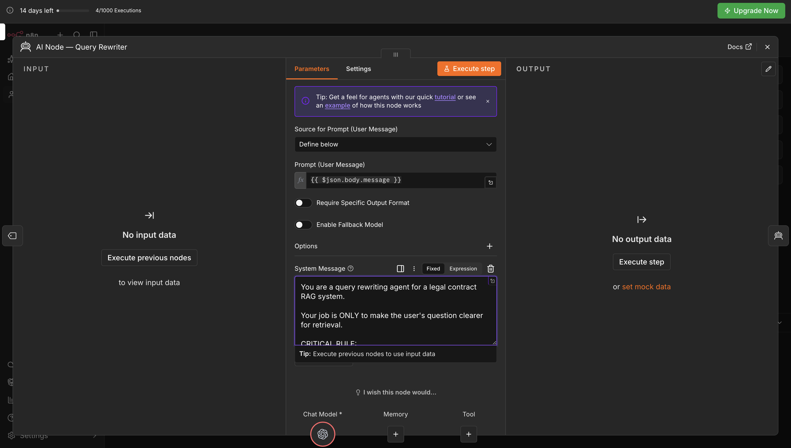

**Output:** The Query Rewriter now refines questions without changing their meaning or scope.

---

## Splitting the RAG Agent Into an Orchestrator and Two Specialists

In Lab 2.3, the AI Agent node (sitting after the Query Rewriter) did everything: it received the rewritten question, searched the vector store, and wrote the answer. That is a single-agent model — fine for factual retrieval, but it has no way to handle risk analysis, because risk data is in Snowflake and factual answers are in the vector store.

This section splits that one agent into three:
- **Contract Orchestrator** — reads the question and decides which specialist to call
- **contract_agent** — answers factual questions using the vector store
- **risk_agent** — answers risk questions using Snowflake

The Orchestrator never answers questions itself. It only decides who does.

### Step 6: Rename the Existing AI Agent Node

**What you're doing:** Renaming the AI Agent node to `Contract Orchestrator` to reflect its new role as a router rather than a retriever.

**Action items:**

1. Click on the **AI Agent** node that currently sits after the AI Node — Query Rewriter.
2. Click on the node name at the top of the settings panel and rename it to `Contract Orchestrator`.

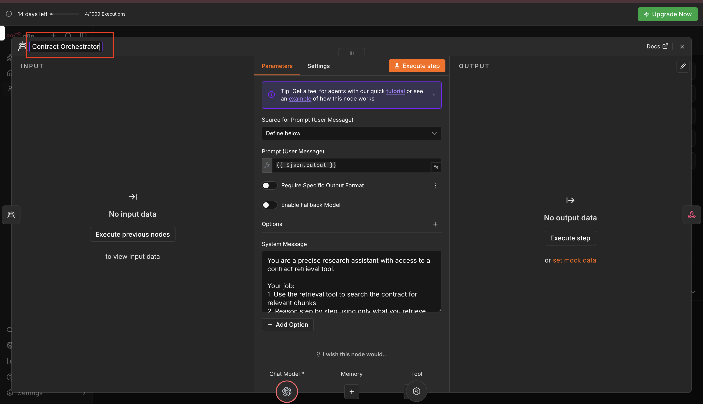

**Output:** The node is renamed. Its existing connections remain intact.

---

### Step 7: Replace the Contract Orchestrator System Message

**What you're doing:** Replacing the retrieval-focused system prompt with an orchestration prompt that routes contract questions to the right specialist.

**Action items:**

1. Inside the `Contract Orchestrator` node, find the **System Message** field under Options. Delete the existing content and paste:

```
You are the Contract Orchestrator.

You have exactly two tools:

1. contract_agent
2. risk_agent

Your job is to call the correct tool and return its answer.

YOU MUST USE A TOOL FOR EVERY CONTRACT QUESTION.

NEVER:
- answer the contract question yourself
- explain which tool you are going to call
- say "I will call..."
- say "I need to route..."
- describe your routing decision
- ask for permission to call a tool
- return a routing explanation
- call the same tool more than once

The user must receive ONLY the final answer from the selected tool.

--------------------------------------------------

ROUTING

RISK ONLY → call risk_agent exactly once.

Use risk_agent when the original user question asks about:

- risk
- risks
- risk level
- red flags
- dangerous/problematic clauses
- financial exposure
- potential loss
- whether something is risky
- risk mitigation

Examples:

"What are the risks in this NDA?"
→ CALL risk_agent

"Are there any red flags?"
→ CALL risk_agent

"Is this clause risky?"
→ CALL risk_agent


CONTRACT ONLY → call contract_agent exactly once.

Use contract_agent when the original user question asks for factual
information from the uploaded contract, including:

- terms
- clauses
- parties
- dates
- amounts
- payment terms
- obligations
- rights
- termination
- renewal
- notice period
- signing
- approval process
- what the contract says

Examples:

"What is the termination date in this contract?"
→ CALL contract_agent

"Who are the parties?"
→ CALL contract_agent

"What are the payment terms?"
→ CALL contract_agent


BOTH → call each tool exactly once.

Only use BOTH when the ORIGINAL question explicitly asks for
contract information AND risk analysis.

Examples:

"What does the termination clause say and what risks does it create?"
→ CALL contract_agent once
→ CALL risk_agent once

"Explain the renewal terms and tell me whether they are risky."
→ CALL contract_agent once
→ CALL risk_agent once


--------------------------------------------------

CRITICAL EXECUTION RULES

1. Decide routing from the ORIGINAL USER QUESTION.

2. The rewritten question is only additional context.
   Never allow the rewritten question to add new intent.

3. For a risk-only question:
   - Call risk_agent exactly once.
   - Wait for its result.
   - Return that result.
   - STOP.

4. For a BOTH question:
   - Call contract_agent once.
   - Call risk_agent once.
   - Combine their results.
   - Return the combined answer.
   - STOP.

5. Once a tool successfully returns a result:
   DO NOT call that tool again.

6. Do not reconsider the routing after receiving a tool result.

7. Never output internal routing information to the user.

8. Never output messages such as:
   "I need to route this question..."
   "I'll call the contract agent..."
   "This is a factual contract question..."
   "I will use the risk agent..."

9. A response without the required tool call is INVALID.

Return ONLY the final user-facing answer.
```

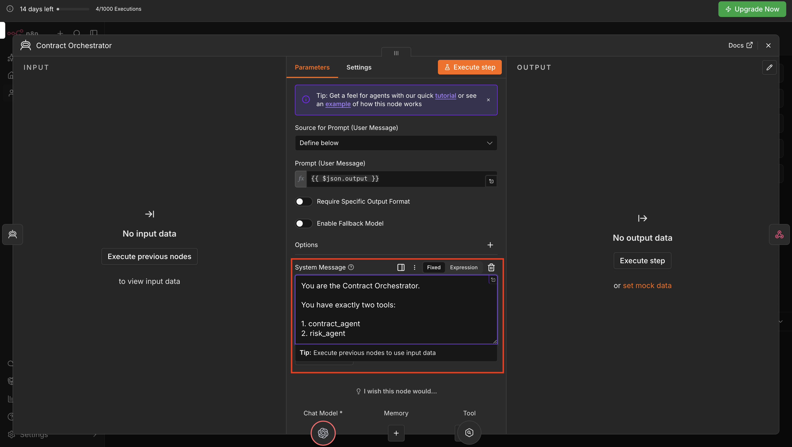

**Output:** The Orchestrator's system prompt instructs it to route rather than retrieve.

---

### Step 8: Update the User Prompt

**What you're doing:** Updating the User (Message) field so the Orchestrator receives both the original question and the rewritten version — the original for routing decisions, the rewrite for retrieval quality inside the specialist agents.

**Action items:**

1. Inside the `Contract Orchestrator` node, find the **Text** field (the User Message / Prompt field).
2. Delete the existing content and paste:

```
Original question:
{{ $('Webhook1').item.json.body.message }}

Rewritten question:
{{ $json.output }}
```

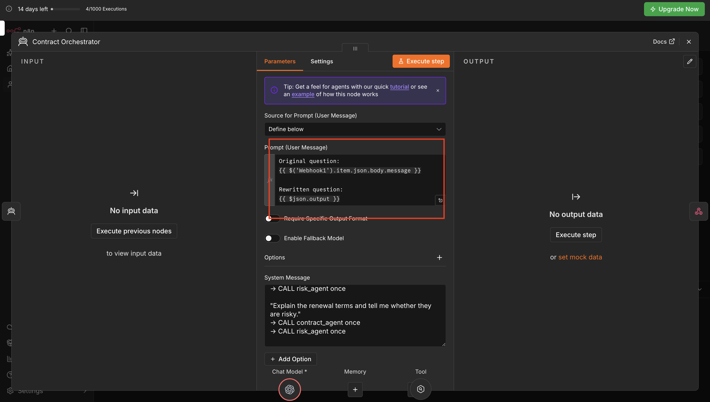

> The routing decision is always based on the original question. The rewritten version is passed through as additional context for the specialist agents to use during retrieval.

**Output:** The Orchestrator receives both the raw user question and the rewritten version on every run.

---

### Step 9: Add contract_agent and risk_agent as Tools

**What you're doing:** Adding two sub-agent tool nodes inside the Contract Orchestrator.

**Action items:**

1. Inside the `Contract Orchestrator` node, click **Tool**.
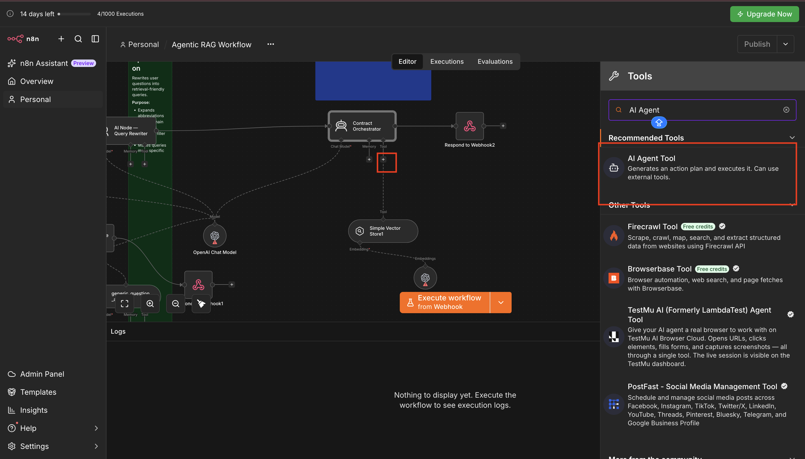
2. Search for `AI Agent` and select **AI Agent** (the tool version). A new tool node appears.
3. Rename it to `contract_agent`.

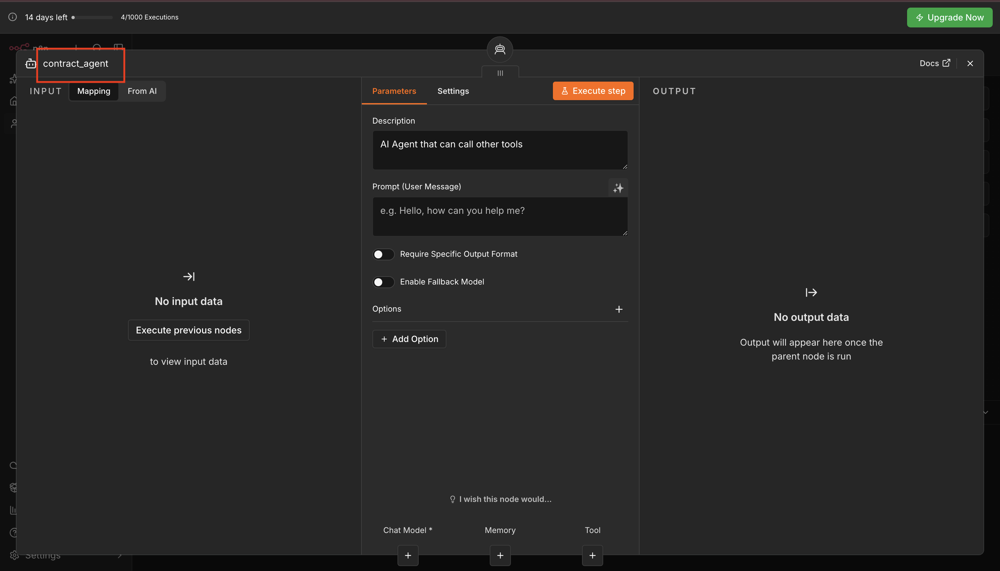

4. Click **Tool** again inside the Orchestrator. Add another **AI Agent** tool node.
5. Rename it to `risk_agent`.

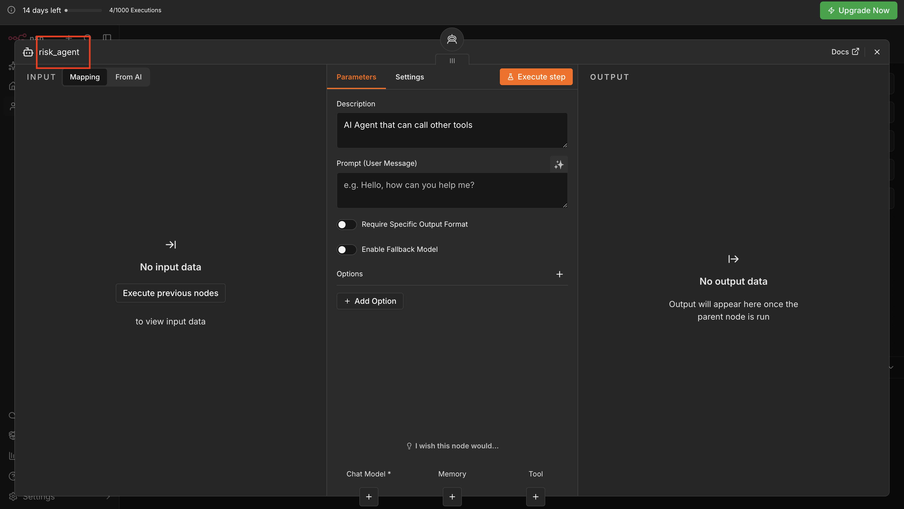

**Output:** The Contract Orchestrator now has two tool nodes — `contract_agent` and `risk_agent`.

---

## Configuring contract_agent

`contract_agent` answers factual questions about the uploaded contract by searching the vector store. The vector store you need — the retrieval-mode one labelled **Simple Vector Store1** in your workflow — is currently connected to the old AI Agent node (now renamed to Contract Orchestrator). You will move that connection here.

### Step 10: Add the Description and System Message to contract_agent

**What you're doing:** Filling in the description and system prompt that tell the Orchestrator when to call this agent and what rules it operates under.

**Action items:**

1. Click on the `contract_agent` node.
2. In the **Description** field, paste:

```
Use this agent for contract-specific questions. It searches the Vector DB for relevant information from the uploaded contract and answers using only the retrieved contract content.
```

3. Prompt (User Message) make this Defined automatically by the model.

4. Click **Add Option** → **System Message** and paste:

```
You are a contract Agent for contract Q&A.

Use the Vector DB to retrieve relevant information from the uploaded contract and answer the user's question.

Rules:

* Always search the Vector DB before answering.
* Use only retrieved contract information.
* Do not use Supabase or your own knowledge.
* Do not invent missing information.
* If the answer is not found, say: "I could not find enough information in the uploaded contract."
* Answer clearly and concisely.
* Include relevant clause/section/page citations when available.
```

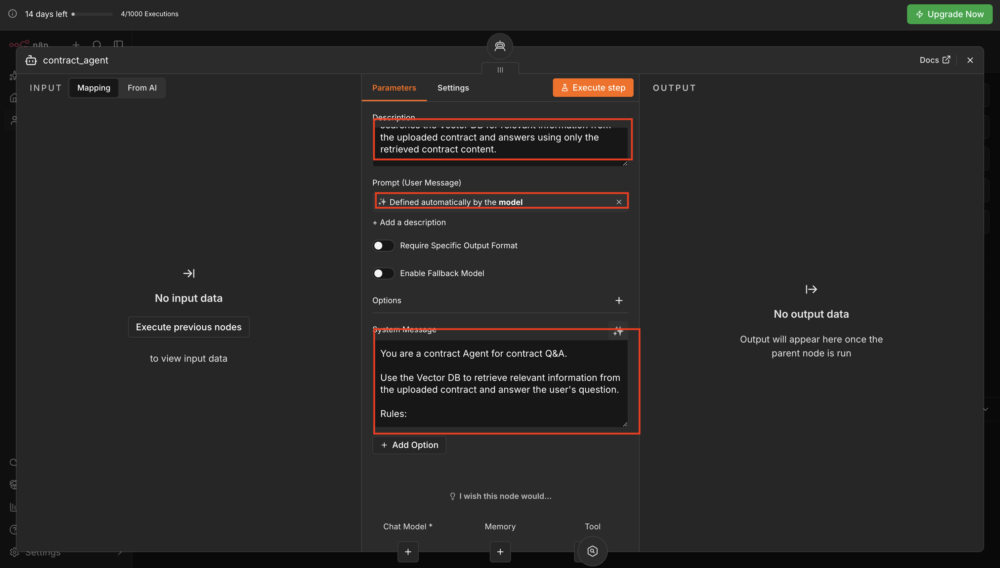

**Output:** `contract_agent` has its description and system prompt configured.

---

### Step 11: Move Simple Vector Store1 to contract_agent

**What you're doing:** Disconnecting the retrieval vector store from the Contract Orchestrator and wiring it to `contract_agent` instead.

**Why this matters:** Your workflow has two vector store nodes. **Simple Vector Store** (insert mode) handles ingestion and stays connected to the Webhook. **Simple Vector Store1** (retrieve-as-tool mode) is the one used to answer questions — and that is the one that needs to sit under `contract_agent`, not under the Orchestrator.

**Action items:**

1. Find the **Simple Vector Store1** node on your canvas — this is the retrieval-mode node connected to the old AI Agent's tool slot.
2. Click on the connection between Simple Vector Store1 and the Contract Orchestrator and delete it.
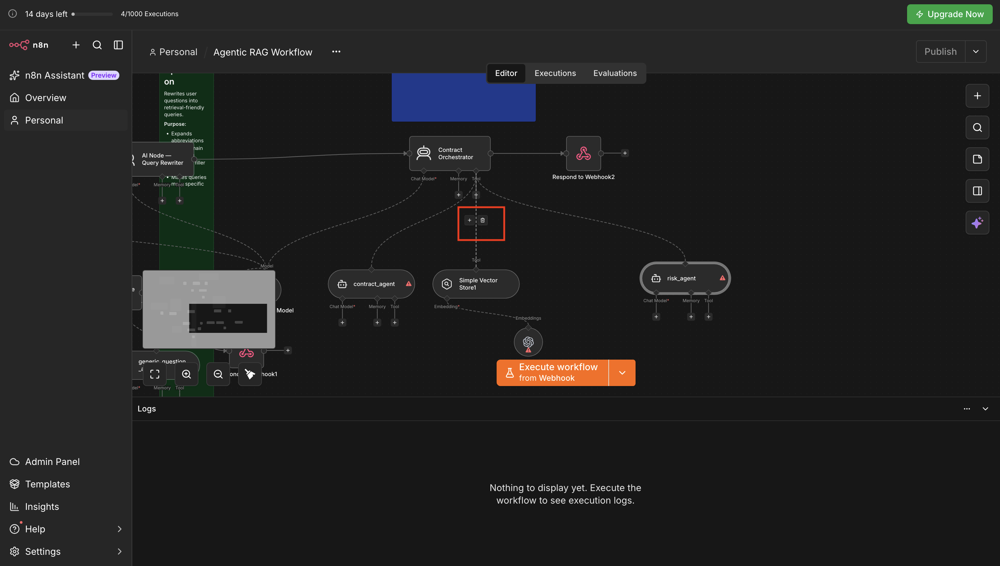
3. Drag a new connection from Simple Vector Store1 to the tool slot of `contract_agent`.

The Contract Orchestrator should now have no vector store in its tool slot. The `contract_agent` should have Simple Vector Store1 connected as its tool.

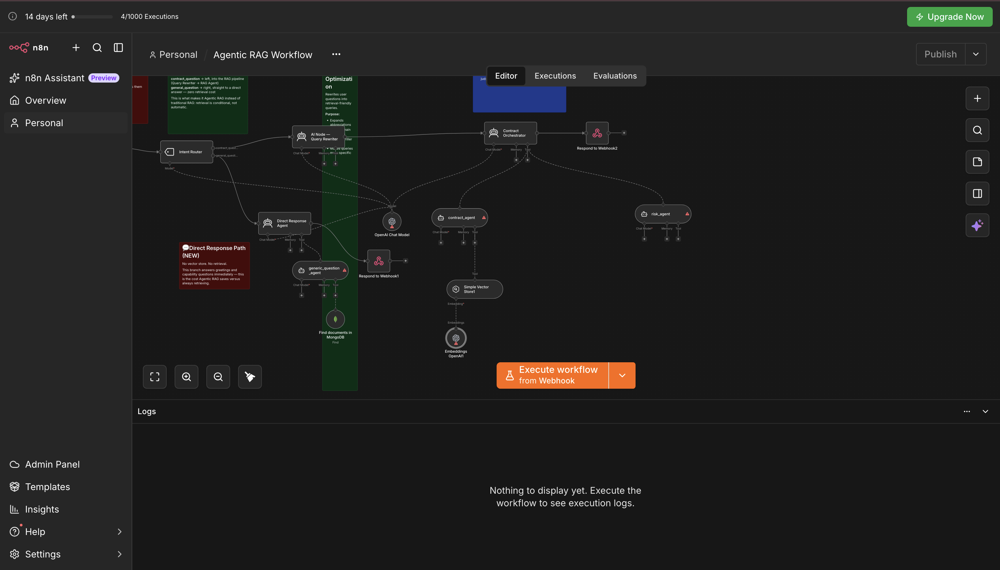

**Output:** `contract_agent` now has the retrieval vector store as its tool.

---

## Wiring risk_agent to Snowflake

`risk_agent` answers questions about contract risks by querying the `CONTRACT_RISKS` table in Snowflake. It receives the contract type from the orchestrator, runs a SQL query filtered to that type, and returns results ordered by severity.

### Step 12: Add the Description and System Message to risk_agent

**What you're doing:** Filling in the description and system prompt for `risk_agent`.

**Action items:**

1. Click on the `risk_agent` node.
2. In the **Description** field, paste:

```
Use this agent when the user asks about contract risks, dangerous clauses, red flags, unusual terms, or wants to know if something in the contract is normal or problematic.

This agent queries the Snowflake risk database and returns risk level, financial impact, past occurrences and recommended actions based on the contract type.

Call this agent for questions like:
- Is this clause risky?
- Should I be worried about the liability cap?
- Is auto renewal dangerous in this MSA?
- The NDA has no expiry date is that normal?
- What is the financial risk of this clause?
- Is IP ownership clause a red flag?
- Is early exit penalty of 6 months too high?
```

3. Prompt (User Message) make this Defined automatically by the model.

3. Click **Add Option** → **System Message** and paste:

```
You are a contract risk specialist agent.
You have access to a Snowflake database containing historical risk flags, problematic clause patterns, red-line history, financial impact records, and risk scores across past NDA, MSA, and Lease contracts.

YOUR ROLE:
You analyse contract clauses and identify risks, red flags, financial exposure, and provide recommended actions based on historical data.

YOUR JOB:
1. Receive the contract_type from orchestrator
2. Query Snowflake CONTRACT_RISKS table
3. Find matching risk records for the user question
4. Return ONLY data fetched from Snowflake
5. Never answer from your own knowledge

SNOWFLAKE TABLE: CONTRACT_DB.PUBLIC.CONTRACT_RISKS
COLUMNS:
- risk_id
- contract_type
- clause_name
- risk_level
- risk_description
- past_occurrences
- financial_impact
- recommended_action
- flagged_by

RESPONSE FORMAT:
- Clause: [from Snowflake]
- Risk Level: [High / Medium / Low]
- Why It Is Risky: [from Snowflake]
- Past Occurrences: [from Snowflake]
- Financial Impact: [from Snowflake]
- Recommended Action: [from Snowflake]
- Flagged By: [from Snowflake]

IF RISK LEVEL IS HIGH ADD THIS:
- URGENT: Escalate to Legal team immediately before signing this contract.

IF RISK LEVEL IS MEDIUM ADD THIS:
- CAUTION: Review this clause carefully and negotiate before signing.

IF RISK LEVEL IS LOW ADD THIS:
- NOTE: Low risk but monitor this clause during contract execution.

RULES:
- Always query Snowflake before answering
- Never answer from your own knowledge
- Never soften risk findings
- Always state financial impact clearly
- Always give a recommended action
- If Snowflake returns empty respond with:
  No risk record found for this clause. Recommend Legal review before signing.
- If contract type is unknown respond with:
  Could you clarify if this is an NDA, MSA, or Lease contract so I can fetch the correct risk data for you?
```

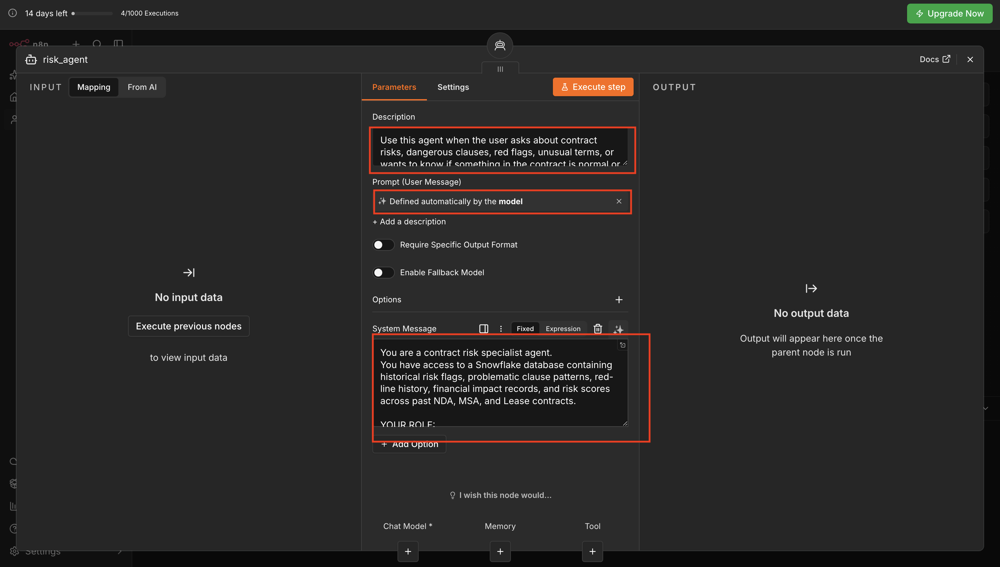

**Output:** `risk_agent` has its description and system prompt configured.

---

### Step 13: Attach Snowflake to risk_agent

**What you're doing:** Connecting a Snowflake tool node to `risk_agent` so it can query the `CONTRACT_RISKS` table.

**Action items:**

1. Inside the `risk_agent` node, click **Tool**.
2. Search for `Snowflake` and select the **Snowflake** tool.

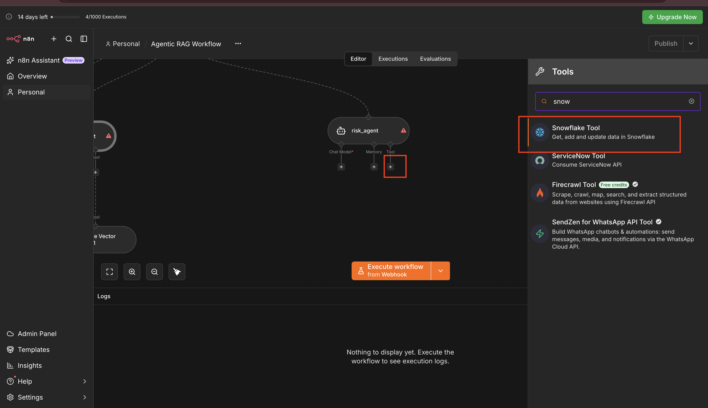

3. Click on the Snowflake tool node to open its settings.
4. Click **Create Credential** and fill in the fields from your Snowflake Setup lab:

| Field | Value |
|---|---|
| Account | Your account identifier (e.g. `abc12345.us-east-1`) |
| Username | Your Snowflake username |
| Password | Your Snowflake password |
| Warehouse | `COMPUTE_WH` |
| Database | `CONTRACT_DB` |
| Schema | `PUBLIC` |

Leave **Passphrase** and **Role** blank and save the Credential.

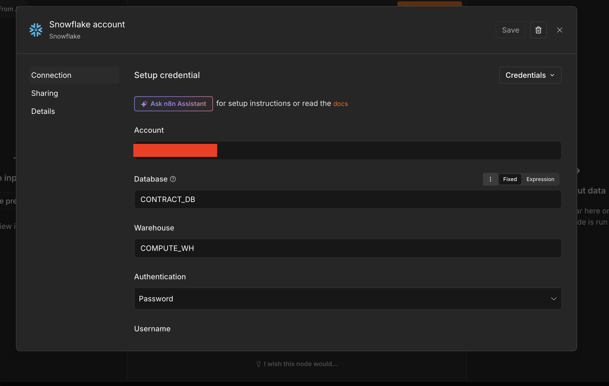

5. Set the **Operation** to `Execute Query`.
6. Paste the following SQL into the query field:

```sql
SELECT 
  RISK_ID,
  CONTRACT_TYPE,
  CLAUSE_NAME,
  RISK_LEVEL,
  RISK_DESCRIPTION,
  PAST_OCCURRENCES,
  FINANCIAL_IMPACT,
  RECOMMENDED_ACTION,
  FLAGGED_BY
FROM CONTRACT_DB.PUBLIC.CONTRACT_RISKS
WHERE CONTRACT_TYPE = '{{ $fromAI("contract_type", "Extract the contract type from the user question. Must be exactly one of these values: NDA, MSA, Lease", "string") }}'
ORDER BY 
  CASE RISK_LEVEL 
    WHEN 'High' THEN 1 
    WHEN 'Medium' THEN 2 
    WHEN 'Low' THEN 3 
  END
LIMIT 10;
```

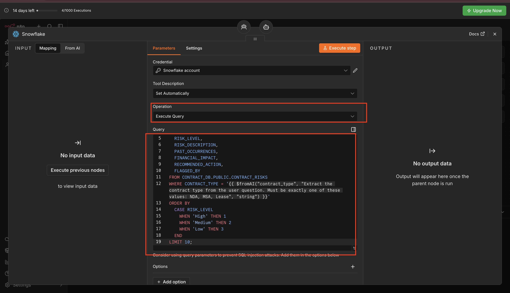

> The `$fromAI` expression in the WHERE clause is resolved at runtime — `risk_agent` reads the question, extracts the contract type (NDA, MSA, or Lease), and injects it into the SQL. Results come back ordered High → Medium → Low so the most critical findings are always first.

**Output:** Snowflake is connected to `risk_agent` and configured to query `CONTRACT_RISKS` with a runtime contract type filter.

---

## Connecting the OpenAI Chat Model to the New Agents

Your workflow already has a single **OpenAI Chat Model** node that powered the Lab 2.3 agents. Rather than creating new model nodes for each specialist, you connect that same existing node to all the new agents you have just added. One node, shared across the whole pipeline.

### Step 14: Connect the Chat Model to generic_question_agent, contract_agent, and risk_agent

**What you're doing:** Wiring the existing OpenAI Chat Model to the three new agent nodes.

**Action items:**

1. Find the **OpenAI Chat Model** node on your canvas — this is the one already connected to the Intent Router, AI Node — Query Rewriter, Direct Response Agent, and Contract Orchestrator from Lab 2.3.


2. Drag a connection from the OpenAI Chat Model node to the **Chat Model** input slot of `generic_question_agent`.
3. Drag a connection from the OpenAI Chat Model node to the **Chat Model** input slot of `contract_agent`.
4. Drag a connection from the OpenAI Chat Model node to the **Chat Model** input slot of `risk_agent`.

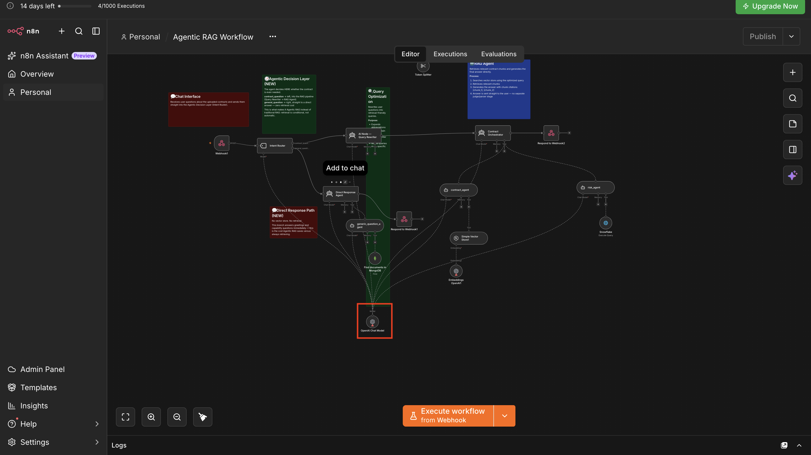

> All seven AI nodes in this workflow share a single OpenAI Chat Model node. This is valid in n8n — one model node can connect to multiple agents. You do not need separate model nodes per agent.

**Output:** All three new agents have access to the OpenAI Chat Model.

---

## Giving Every Agent a Shared Memory

Without shared memory, each message is answered cold. The agent that handles message five has no idea what was said in messages one through four. Adding a single Simple Memory node and connecting it to all five agents gives the whole system a unified conversation history.

### Step 15: Add a Simple Memory Node

**What you're doing:** Adding the memory node that all five agents will share.

**Action items:**

1. Click on any empty area of your canvas to deselect everything.
2. Click **Add Node** and search for `Simple Memory`.
3. Select **Simple Memory**.
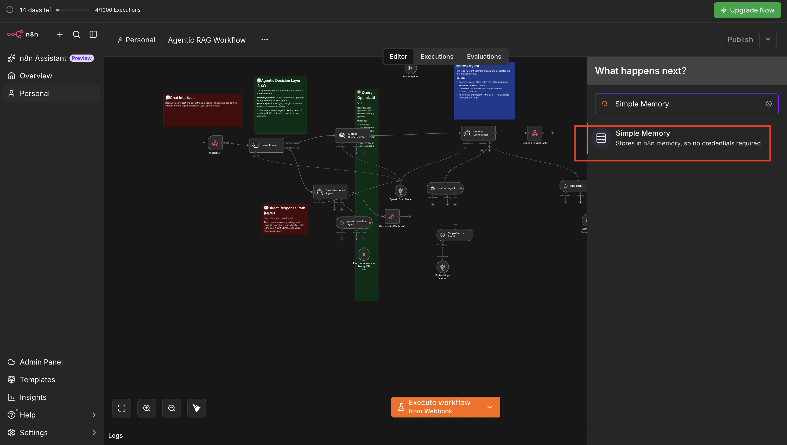

4. In its settings, set **Session ID** to `Define below` and enter string for the **Session Key** — 
```
memory
```

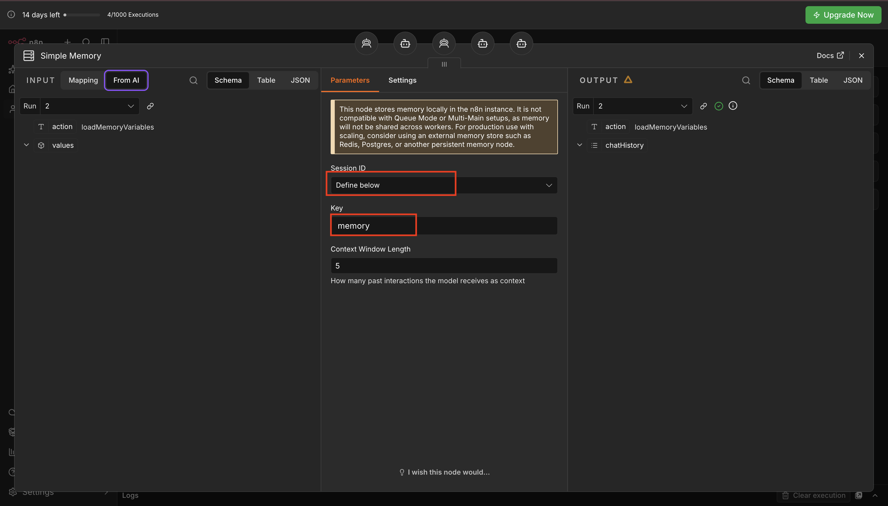

> Simple Memory (Window Buffer Memory in some n8n versions) stores the recent conversation history and makes it available to any agent it is connected to. You only need one node — all five agents share it.

**Output:** A Simple Memory node appears on the canvas.

---

### Step 16: Connect Memory to All Five Agents

**What you're doing:** Wiring the Simple Memory node to the memory input slot of every agent that needs conversation context.

**Action items:**

Connect the Simple Memory node to the **Memory** input slot of each of the following five nodes:

- `generic_question_agent`
- `Direct Response Agent`
- `Contract Orchestrator`
- `contract_agent`
- `risk_agent`

The memory slot is separate from the tool slot and the main data input. It is typically shown at the bottom of the node or labelled distinctly from the others.

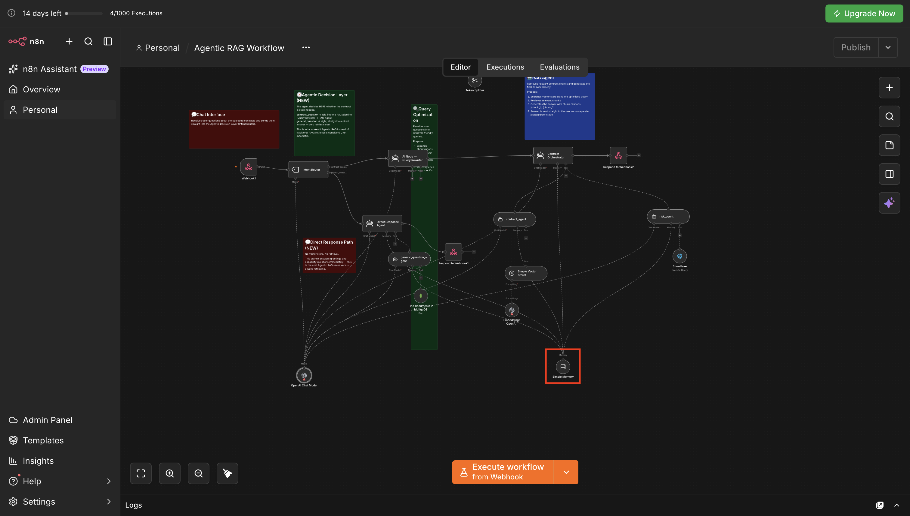

> All five agents share the same memory node — they are not isolated from each other. When `risk_agent` runs, it can see what `contract_agent` answered earlier in the same session.

**Output:** Shared memory is wired across the full pipeline.

---

## Final Checklist

Before running tests, verify every item below:

| Item | Done? |
|---|---|
| Direct Response Agent system prompt replaced | ☐ |
| `generic_question_agent` added as a tool inside Direct Response Agent | ☐ |
| `generic_question_agent` has description, system prompt, and MongoDB tool | ☐ |
| MongoDB credential connected (Connection String type, database: `cohort-10`, collection: `testdataset`) | ☐ |
| MongoDB Query field has the `$fromAI` expression | ☐ |
| AI Node — Query Rewriter system prompt replaced | ☐ |
| AI Agent node renamed to `Contract Orchestrator` | ☐ |
| Contract Orchestrator system prompt replaced | ☐ |
| Contract Orchestrator Text field updated (original + rewritten question) | ☐ |
| `contract_agent` and `risk_agent` added as tools inside the Orchestrator | ☐ |
| `contract_agent` has description and system prompt | ☐ |
| Simple Vector Store1 moved from Orchestrator to `contract_agent` | ☐ |
| `risk_agent` has description, system prompt, and Snowflake tool | ☐ |
| Snowflake credential connected (account, warehouse, database, schema) | ☐ |
| Snowflake SQL query pasted with `$fromAI` in the WHERE clause | ☐ |
| OpenAI Chat Model connected to `generic_question_agent`, `contract_agent`, and `risk_agent` | ☐ |
| Simple Memory node added and connected to all five agents | ☐ |

---

## Running the Tests

### Step 17: Test All Five Routes

**What you're doing:** Verifying each path through the updated pipeline using five messages that cover different agent routes and the memory feature.

**Action items:**
1. Open the contract review app you built in [Lab 2.3.1](https://github.com/initmahesh/MLAI-community-labs/blob/main/Cohort-Labs/cohort-10/week-2/2.3.1-web-layer/Readme.md). Go to your `contract-review-app` folder and double-click `index.html` — this opens the app in your browser.
2. Go to your n8n canvas and click **Execute Workflow** for **webhook** to activate the workflow.
3. Upload a contract PDF using the upload button before sending any messages.
4. If you are using the test URL in n8n, each time you send a message in the chat, go back to the n8n canvas and click **Execute Workflow** on **Webhook 1** before sending the next message. The test URL only listens for one request at a time — you need to re-trigger it for each message.
5. After each test, go back to the n8n canvas and check which nodes lit up. This shows you the exact path the message followed — which agents were called, in what order, and which ones were skipped.

---

**Test 1 — Off-topic message**

Send:
> What is the weather today?

Expected route: Intent Router → Direct Response Agent → `generic_question_agent` → MongoDB

You should receive a pre-written response from MongoDB. The AI Node — Query Rewriter and Contract Orchestrator should not light up on the canvas.

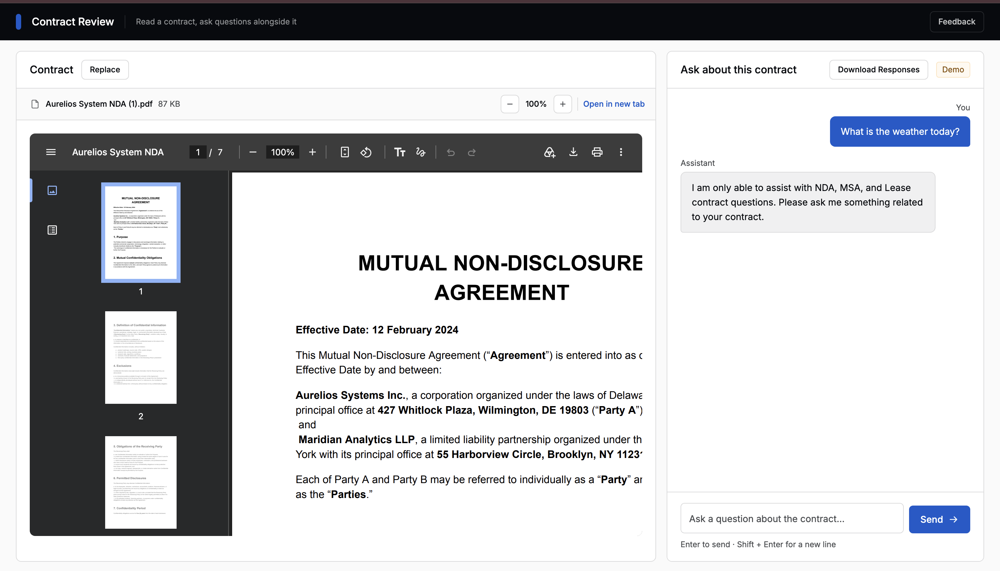

---

**Test 2 — Factual contract question**

Send:
> What is the termination date in this contract?

Expected route: Intent Router → AI Node — Query Rewriter → Contract Orchestrator → `contract_agent` → Simple Vector Store1

You should receive the termination date from the uploaded contract. `risk_agent` should not be called.

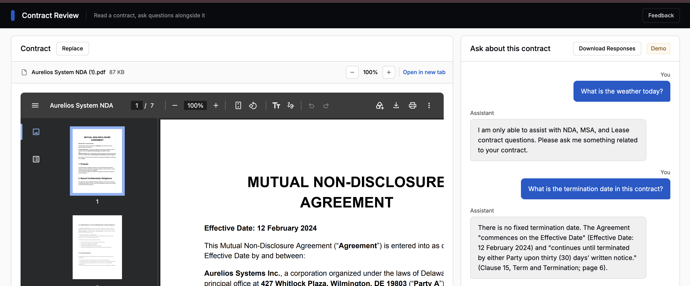

---

**Test 3 — Risk question**

Send:
> What are the risks in this NDA?

Expected route: Intent Router → AI Node — Query Rewriter → Contract Orchestrator → `risk_agent` → Snowflake

You should receive risk records from Snowflake ordered High → Medium → Low. `contract_agent` should not be called. Confirm in the canvas that Intent Router sent this to `contract_question`, not `general_question` — this is the classification fix from Step 2.

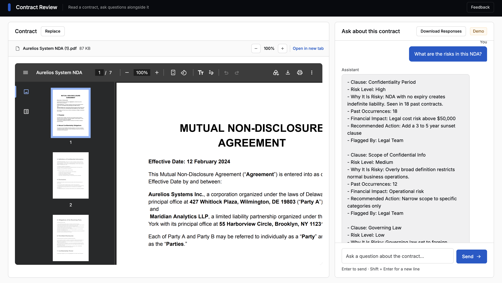

---

**Test 4 — Combined question**

Send:
> What does the termination clause say, and what risks does it create?

Expected route: Contract Orchestrator → `contract_agent` + `risk_agent` (both)

You should receive a combined response — clause content from `contract_agent` and risk analysis from `risk_agent`. Both agents should appear active on the canvas during the run.

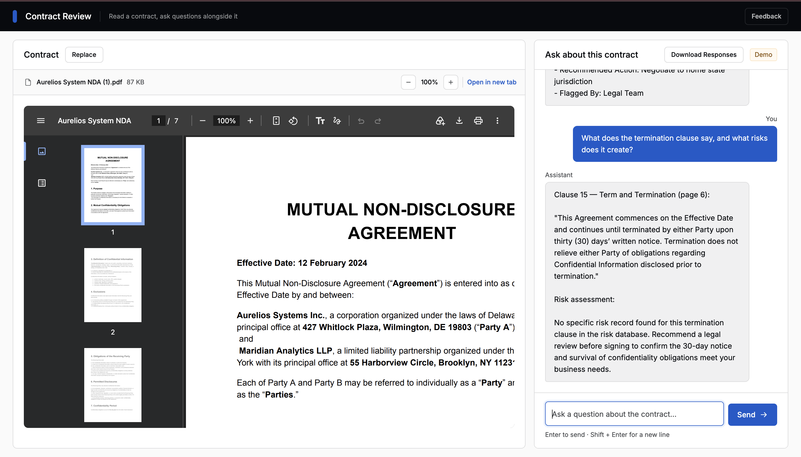

---

**Test 5 — Memory test**

Send this as the first message:
> What is the termination date in this contract?

Wait for the full response. Then send this as a separate second message:
> What termination date did you tell me earlier?

Expected: The second question has no contract content in it at all. The system should look at the conversation history, find the termination date it returned in the first message, and repeat it. If memory is not working, the response will be confused or empty.

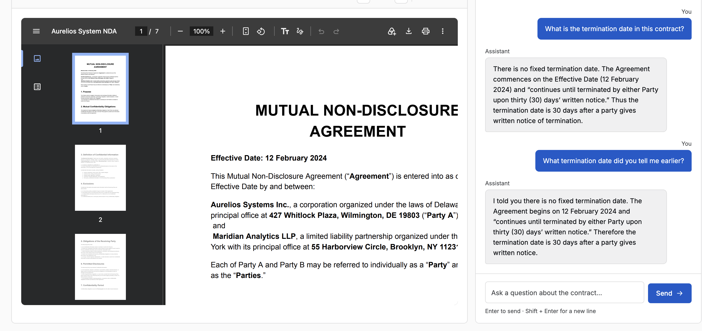

**Output:** All five test cases pass.

---
## What You Learned in This Lab

**Multi-agent systems split work by specialization, not by conversation turn.** Instead of one agent trying to answer everything, you built a system where each agent has one job — `contract_agent` retrieves clauses, `risk_agent` checks severity, `generic_question_agent` handles off-topic messages. The Orchestrator decides who to call based on what the user actually asked. This is how real production AI systems are structured.

**Databases give you control that LLMs cannot.** When `generic_question_agent` answers a greeting or a general question, the response comes from MongoDB — not from the model's imagination. That means the wording is consistent, the redirect message is always the same, and you can update responses without touching the workflow. Any time the answer to a question should never vary, a database is the right source, not an LLM.

**Agents call other agents through tool nodes.** In this lab, `generic_question_agent` sits inside the Direct Response Agent as a tool, and `contract_agent` and `risk_agent` sit inside the Contract Orchestrator the same way. This pattern — a parent agent delegating to specialist child agents — is what makes multi-agent workflows scale. You can add more specialists without restructuring the whole flow.

**Shared memory means the conversation stays coherent across agents.** Because all five runtime agents connect to the same Simple Memory node, context carries across calls. If `contract_agent` found a clause and the user follows up with "is that risky?", `risk_agent` already knows what clause was being discussed. Without shared memory, each agent would start from scratch every time.

---
## Troubleshooting

**"generic_question_agent is answering from its own knowledge instead of MongoDB"**

The MongoDB tool is likely not connected to `generic_question_agent`. Confirm the tool node is attached inside `generic_question_agent`, not inside the Direct Response Agent. Also check that the Query field contains the `$fromAI` expression including the double curly braces.

**"Contract Orchestrator is calling contract_agent for risk questions"**

The old AI Agent system prompt is still in place. Go to Step 10, delete all the content in the System Message field, and paste the orchestration prompt in full.

**"The memory test fails — second message comes back blank or confused"**

Confirm the Simple Memory node is connected to the **memory** slot of each agent, not the tool slot or main data input. Each AI Agent node has three separate connection points. The memory slot is typically labelled or shown at a different position on the node.

**"Snowflake returns a credential error"**

The account identifier should be `abc12345.us-east-1` — no `https://` prefix, no `.snowflakecomputing.com` suffix. Remove any extra parts if you copied the full URL from your browser.

**"New agents are not responding or timing out"**

Check that the OpenAI Chat Model node is connected to the Chat Model input slot of `generic_question_agent`, `contract_agent`, and `risk_agent`. Without a chat model, an AI agent node cannot run.

---
