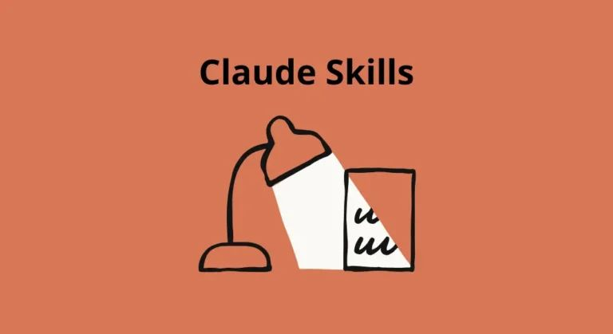
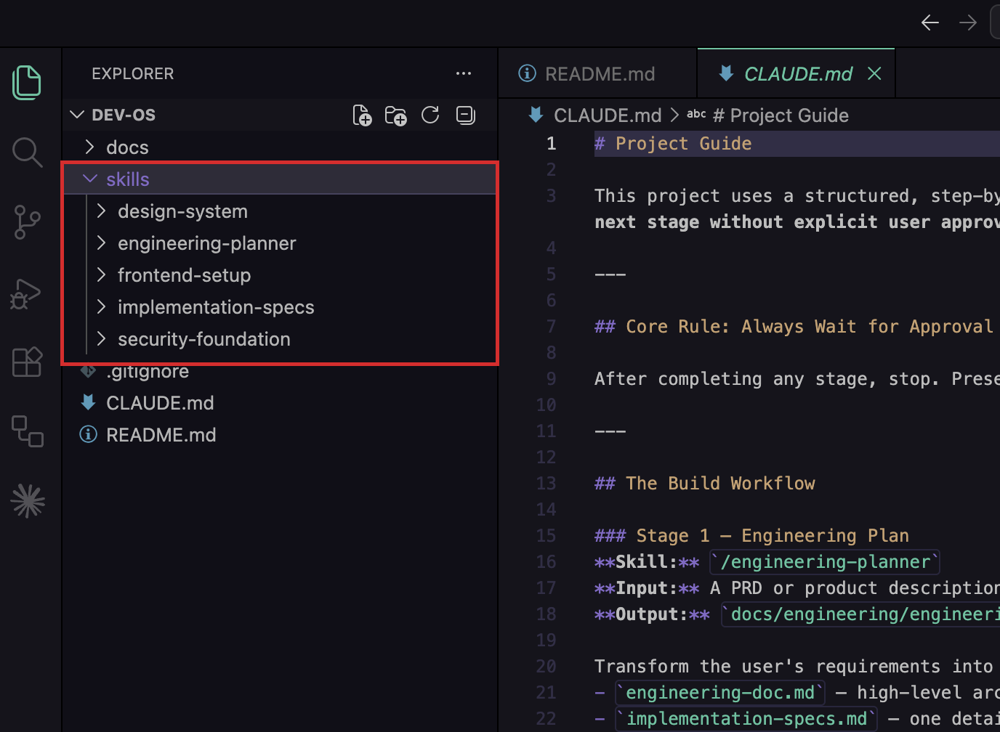
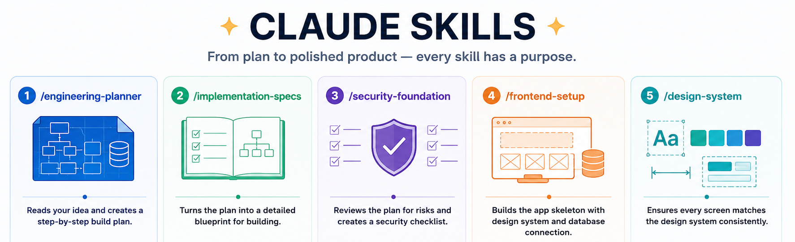
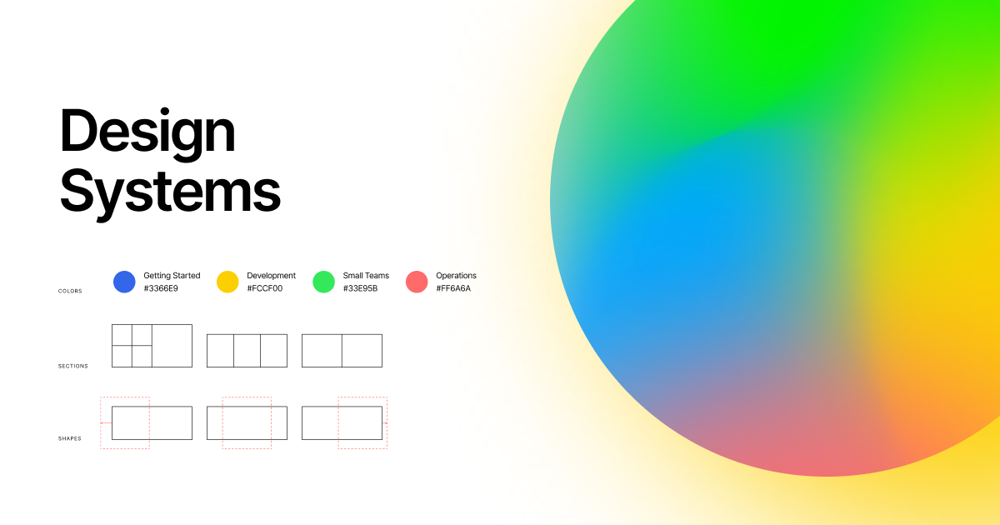
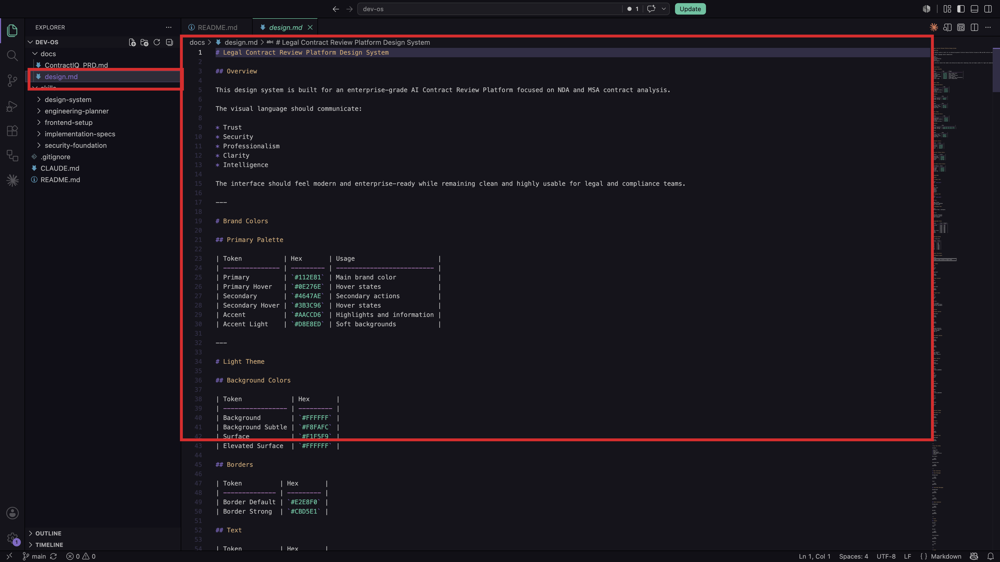

[← Back to Lab 1 Overview](../readme.md)

[← Lesson 1](../01-project-foundation/readme.md) | **Lesson 2** | [Lesson 3 →](../03-engineering-planning/readme.md)

---

# Lesson 2 — Skills and the Design System



---

## Skills and the Design System in This Lab

**Skills** are saved instruction sets (slash commands) and the **design system** is a visual contract — both live in the repo so Claude stays consistent across every session and every teammate.

---

## Where You Are in the Process

```
Idea
↓
Research
↓
PRD  ✓
↓
Engineering Document  ← (we get here in Lesson 3)
↓
Implementation Specs
↓
Build
↓
Deployment
↓
Iteration
```

Today you're not building anything yet. You're understanding the tools before you use them — so that when Lesson 3 starts, you know exactly what's happening and why.

---

## Step 1 — Open a Skill File and Read It

In VS Code, open the file at `skills/engineering-planner/SKILL.md`.



Read through it. You're not running anything yet — just reading the plain text inside.

---

Each `SKILL.md` defines what Claude does when you type that slash command — Purpose, Inputs, Instructions, and Output — so it runs the same way every time.

> **Learn more:** [The Complete Guide to Building Skills for Claude →](https://resources.anthropic.com/hubfs/The-Complete-Guide-to-Building-Skill-for-Claude.pdf)

---

## Step 2 — Walk Through the 5 Skills in Order



These five skills form a pipeline — the output of each one becomes the input to the next. Understanding that sequence is what makes the whole build make sense.

---

**`/engineering-planner`** — *Run in Lesson 3*

Reads the PRD and turns it into an organized build plan. It figures out which features are essential for launch, maps out all the data the product needs to store and how it connects, and breaks the build into stages so you can ship something working early.

Saves everything to `docs/engineering/` for the next skill to read.

---

**`/implementation-specs`** — *Run in Lab 2, Lesson 1*

Takes the engineering plan and turns it into a detailed blueprint — a room-by-room guide before construction begins. It breaks the build into clear sections, describes exactly what needs to be built in each section and in what order, and flags every place two features have to work together so nothing gets discovered by accident.

Saves everything to `specs/`.

---

**`/frontend-setup`** — *Run in Lab 2, Lesson 1*

Builds the empty shell of the application with the design system already baked in. It reads `docs/design.md` first so brand colors and fonts are built in from day one, creates the folder structure so every future file has a logical home, and sets up the connection to the database.

---

**`/design-system`** — *Used throughout Lab 2*

The skill you'll use most. Every time Claude builds a new screen, this skill makes sure it matches everything else. It reads `docs/design.md` at the start of every session — never works from memory — and uses named colors and spacing values from the design system rather than inventing new ones.

---

**`/security-foundation`** — *Run in Lab 3*

Reviews the plan for security issues before anything ships — like a safety inspector walking through blueprints before construction begins. It checks that private data can only be accessed by the person it belongs to, verifies that uploaded files are validated before being processed, and makes sure secret keys are stored safely.

---

Each skill depends on what the previous one produced — run them in order and each has exactly what it needs.

---

## Step 3 — Open the Design System File

Open `docs/design.md` in VS Code.



Scroll through it. You'll see colors defined by name, font choices, spacing scales, button shapes, animation rules, and component patterns — all written down before a single page of the app exists.



---

`docs/design.md` is Claude's single source of truth for colors, fonts, and spacing — it reads this file before building any screen in Lab 2 so everything stays visually consistent. The file is already in the repo; if you want to swap it for your own style: [How to Create Your Own Design System →](../00-resources/create-design-system.md)

> **Learn more:** [Design systems and Claude →](https://docs.anthropic.com/en/docs/claude-code)

---

## What's Next

All five skills are loaded. The design system is in place. But nothing has run yet.

`docs/engineering/` doesn't exist. There's no architecture plan, no database schema, no list of files to build. Without those documents, there's no foundation for the code that comes in Lab 2.

In Lesson 3, you'll run `/engineering-planner` for the first time — and watch it translate the PRD into a concrete technical blueprint in a single session. That document is what everything else is built from.

---

## Claude Concepts Covered in This Lesson

| Concept | Where it appeared | Learn more |
|---------|-------------------|------------|
| **Skills / slash commands** | **Step 1** — "When you type `/engineering-planner` into Claude Code, Claude finds the `SKILL.md` file inside that folder and follows its instructions exactly — every time, for every session, for every teammate who opens this project." | [Skills guide →](https://resources.anthropic.com/hubfs/The-Complete-Guide-to-Building-Skill-for-Claude.pdf) |
| **SKILL.md structure** | **Step 1** — "Purpose says what it does. Inputs say what it reads. Instructions say how it works. Output says what proof you have it finished." | [Skills guide →](https://resources.anthropic.com/hubfs/The-Complete-Guide-to-Building-Skill-for-Claude.pdf) |
| **Stage-gated pipeline** | **Step 2** — "Each skill depends on what the previous one produced. Skip a step or run them out of order and the later skill has nothing meaningful to read." | [Claude Code docs →](https://docs.anthropic.com/en/docs/claude-code) |
| **Design system as persistent visual context** | **Step 3** — "When Claude builds any screen in Lab 2, it reads this file first so every element matches everything else — without you having to describe your brand on every prompt." | [Claude Code docs →](https://docs.anthropic.com/en/docs/claude-code) |

---

[← Back to Lab 1 Overview](../readme.md)

[← Lesson 1](../01-project-foundation/readme.md) | **Lesson 2** | [Lesson 3 →](../03-engineering-planning/readme.md)