# Lab 5.2.1: Fine-Tuning Your Agent in Azure AI Foundry

## Your Agent Works — But Is It Actually Answering Well?

You built an AI agent in Week 4 and in Week 5 you connected it to your web application. People can open the app, upload a contract, and ask questions. That's a real, working product.

But here's an uncomfortable truth: **just because your agent responds doesn't mean it's responding well.** Right now, the only way you find out there's a problem is when a user tells you — which means by the time you know, someone has already had a bad experience.

What if you could catch and fix those problems before users ever see them?

That's exactly what this lab is about. You're going to see a real example of your agent behaving badly, understand why it happens, and then fix it permanently — not by patching the code or rewriting your prompts, but by teaching the model itself to behave differently. That process is called **fine-tuning**.

---

## The Problem: Your Agent is Doing Too Much

Consider a simple factual question asked against a contract:

> **How long does the Company have to pay an invoice?**

It's a one-sentence answer buried somewhere in the document. The expected response is something like: *"The Company has 30 days from the invoice date to make payment."*

Here's what the agent actually returns:

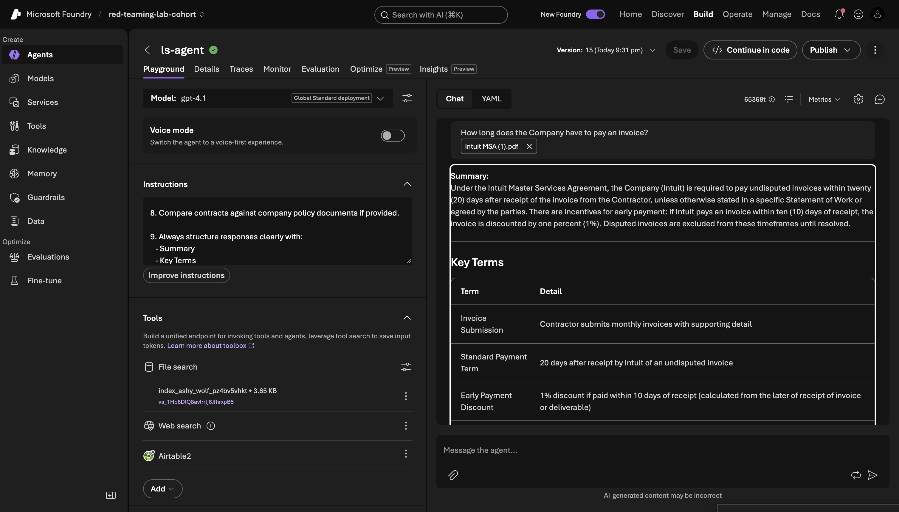

The response is several paragraphs long. It mentions payment terms, yes — but it also includes a risk analysis, a risk score out of 10, notes about what to watch out for, and general advice about contract negotiations. None of that was asked for.

**The agent isn't wrong — it's just doing way more than required.**

This happens because the base model (gpt-4.1) was trained to be helpful in a general sense. When it sees a legal contract and a question, its instinct is to give everything it knows about the topic. It doesn't know that for this use case, only the fact from the document is needed — not a full legal briefing.

---

## Why Rewriting the Prompt Won't Fully Fix It

You might be thinking: *"Can't I just tell the agent to be more concise in the system prompt?"*

You can try, and it helps a little. But the model keeps falling back into its old patterns — especially with complex questions, edge cases, or when users phrase things differently than expected. The root cause isn't the instruction; it's the model's deeply trained default behavior.

**Fine-tuning changes the default behavior itself.** Instead of fighting the model's instincts every time, you teach it new instincts. You show it dozens of examples of the exact pattern you want — question + contract → direct factual answer — and it learns to do that automatically, even without heavy prompting.

---

## What Fine-Tuning Actually Does

Think of it this way. The base gpt-4.1 model knows a lot — but without guidance, it tends to over-explain every answer and add commentary you didn't ask for.

Fine-tuning is the process of showing it examples. You go through case after case: "For this kind of question, this is the right kind of answer." After enough examples, the model internalizes the pattern. You don't need to spell it out every time.

In this lab, you'll:

1. **See the problem** — ask your current agent a simple contract question and observe the over-verbose response.
2. **Fine-tune the model** — upload training examples that show the model the right response pattern.
3. **Switch your agent to the fine-tuned model** — point your agent at the improved version.
4. **See the result** — ask the same question and compare the two responses side by side.

---

## Prerequisites

Before you start, make sure you have completed:

- **Week 4, Lab 4.1** — You should have an AI agent built inside Azure AI Foundry that can read contracts and answer questions.
- **Azure AI Foundry access** — You'll need to be inside your Foundry project. If you're not sure which one, open the same one you used in Week 4.
- **Sample contract downloaded** — [Download the sample contract here](https://drive.google.com/file/d/1kJpujNVGU7Bk8nu35s3BZCtAWo-gHiqb/view?usp=sharing). You'll upload this when testing.

---

## Phase 1: See the Problem First-Hand

### Step 1: Ask Your Agent a Simple Question

**What you're doing**: Running your existing agent against a simple factual contract question to see exactly how it responds today — before any changes.

**Why this matters**: You need to see the before state with your own eyes so the improvement is obvious when you come back to it after fine-tuning. Take a screenshot — you'll want to compare it later.

**Action items**:

1. Go to [Azure AI Foundry](https://ai.azure.com) and open your project and click on **Build** in navbar.

2. In the left sidebar, click **Agents**.

3. Open the contract-review agent you built in Week 4.

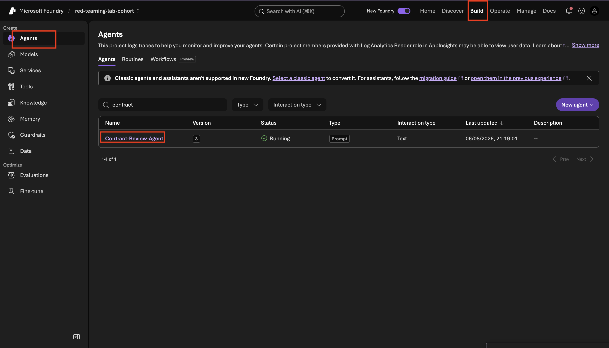

4. In the agent playground on the right, upload the sample contract using the file upload button.

5. Once the contract is uploaded, type this question in the chat box and press Enter:

> **How long does the Company have to pay an invoice?**

6. Read the full response carefully. Notice: how many paragraphs did it write? Did it mention risks? Did it give a score or recommendations?

**Output**: You've seen the problem first-hand. The response is technically accurate but far too verbose for a simple factual question. It includes risk analysis, recommendations, and scores that no one asked for.

---

## Phase 2: Fine-Tune the Model

Now that you've seen the problem — the agent returning a full legal briefing when a single sentence would do — the next step is to fix it. That's what fine-tuning is for.

### Step 2: Open the Fine-Tuning Section

**What you're doing**: Navigating to the fine-tuning feature inside Azure AI Foundry where you'll create the training job.

**Why this matters**: Fine-tuning is a separate workflow from building agents — it lives in its own section of Foundry. You need to find it before you can do anything else.

**Action items**:

1. In the left sidebar of your Azure AI Foundry project, scroll down until you see **Fine-tuning** and click it.

2. You'll see a screen listing any previous fine-tuning jobs (probably empty for now). Click the **Fine-tune** button in the top right corner.

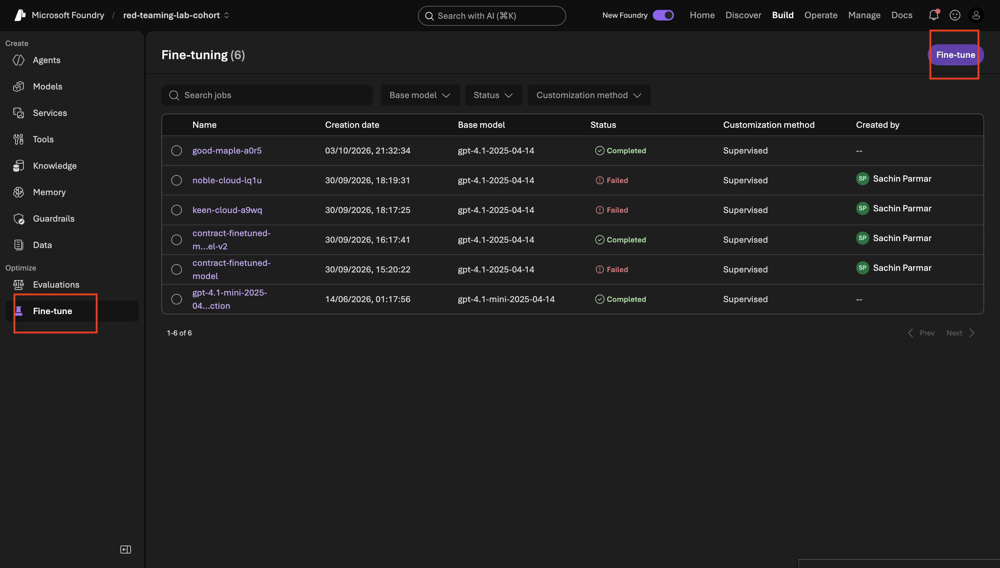

**Output**: A multi-step form opens. This is where you'll configure your training job.

---

### Step 3: Fill In the Basic Details

**What you're doing**: Setting the three core settings that define what kind of fine-tuning job this will be and which model you're training.

**Why this matters**: These three choices determine which model gets trained and how. They're set once at the start and can't be changed later without starting a new job, so it's worth understanding what each one means before clicking through.

**Action items**:

1. You'll see a form with three fields. Fill them in exactly as shown below:

| Setting | Value to Select | Why |
|---|---|---|
| **Customization method** | Supervised | You're training the model by showing it labeled examples — a question, a contract, and the correct answer. This is the standard, most reliable method for teaching a model a specific behavior. |
| **Model** | gpt-4.1 | This is the same model your current agent uses. You're making a fine-tuned version of it, so the two responses are directly comparable. |
| **Training type** | Data Zone | This runs the training on Microsoft's managed infrastructure, which handles the compute for you. You don't need to set up servers or worry about resources. |

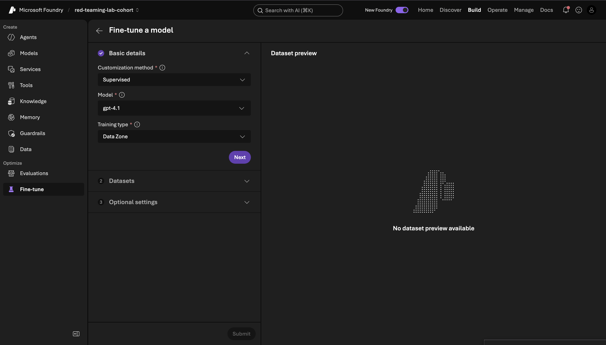

2. Once all three are filled in, click **Next**.

**Output**: Basic details confirmed. The form moves to the dataset upload step.

---

### Step 4: Upload Your Training and Validation Datasets

**What you're doing**: Giving the model the examples it will learn from — one set for training and one for checking its progress.

**Why this matters**: Fine-tuning is a learning process. The training dataset is the textbook — the model reads through it and adjusts its behavior to match the examples. The validation dataset is the practice test — the model checks itself against examples it hasn't seen, so you can tell whether it's genuinely learning or just memorizing.

**Action items**:

1. Download both dataset files from the links below and save them to your desktop:

| File | Download Link | Purpose |
|---|---|---|
| Training dataset | [Download training data](https://drive.google.com/drive/folders/1YNXAKMBqnQR3sWr_mPBhxPOW4oGj8zCl?usp=sharing) | The examples the model learns from — questions paired with the kind of direct, grounded answers you want |
| Validation dataset | [Download validation data](https://drive.google.com/drive/folders/1YNXAKMBqnQR3sWr_mPBhxPOW4oGj8zCl?usp=sharing) | A separate set of examples the model doesn't learn from but checks itself against — this tells you if training is working |

2. On the datasets screen, click **Upload** under **Training dataset** and select the training file you downloaded.

3. Click **Upload** under **Validation dataset** and select the validation file.

4. Wait for both files to show a green checkmark.

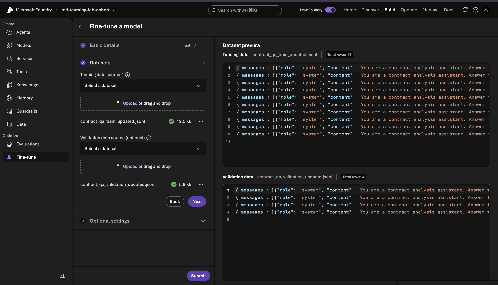

5. Click **Next**.

**Output**: Both datasets are uploaded. The model now has everything it needs to learn from.

---

### Step 5: Review the Optional Settings

**What you're doing**: Looking at the advanced training controls and leaving them at their defaults.

**Why this matters**: These settings control exactly how the training process runs — things like how many times the model goes through the data and how aggressively it updates itself. The defaults are carefully tuned for most use cases. Changing them without a specific reason often makes results worse, not better. Leave them as-is for your first run.

The form shows these settings:

| Setting | What It Does | Why Default Is Fine |
|---|---|---|
| **Display name** | A label for this fine-tuning job so you can find it later | Leave it auto-generated or you can change its name |
| **Seed** | A random starting point for the training process | Keeping it random ensures a fair, unbiased run |
| **Automatically deploy model after job completion** | Whether Foundry deploys the trained model as soon as training finishes | Leave off for now — you'll deploy manually in Phase 3 so you can review it first |
| **Hyperparameter tuning** | Whether Foundry experiments with different training settings automatically | Not needed for a first run — keep simple |
| **Batch size (1–256)** | How many training examples the model sees at once before updating | Default is tuned for stability; changing it can cause unstable training |
| **Number of epochs (1–100)** | How many times the model reads through the full training dataset | Too few and it doesn't learn enough; too many and it over-corrects. Default balances both. |
| **Learning rate multiplier (0.01–10.00)** | How big each update step is during training | Too high and the model overshoots; too low and it barely changes. Default is safe. |

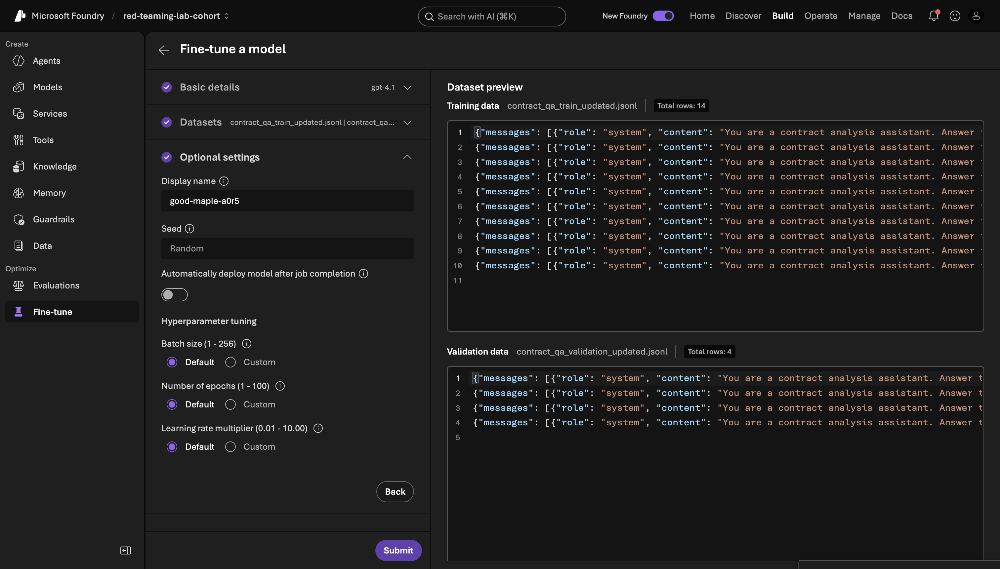

**Action items**:

1. Read through the settings — no changes needed.
2. Click **Submit**.

**Output**: Your fine-tuning job is submitted. Foundry now takes over.

---

### Step 6: Wait for Training to Complete

**What you're doing**: Monitoring the training job as it moves through its three stages.

**Why this matters**: Fine-tuning takes real time — this isn't instant. The model is running through your training data, adjusting itself, and checking its progress. You'll watch it move through three stages:

**Queued** → The job is waiting for compute resources to become available.

**Running** → Training is actively happening. The model is going through your examples and updating itself.

**Completed** → Training is done. Your fine-tuned model is ready to use.

**Action items**:

1. After submitting, you'll see your job appear in the fine-tuning list with the status **Queued**.

2. After a few minutes, the status changes to **Running**. This is where the actual learning happens — you can step away and come back.

3. When training finishes, the status updates to **Completed**. You'll see your new fine-tuned model listed here with its name and configuration details.

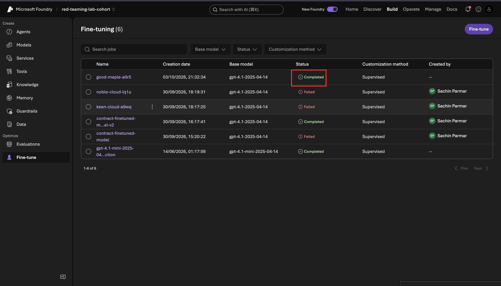

> **Note**: Fine-tuning takes longer than most operations in Foundry. Depending on the size of your dataset and current queue, it can take anywhere from 20 minutes to a couple of hours. Don't keep refreshing — step away and check back.

**Output**: Your fine-tuned model is ready. It has learned the response pattern from your training examples and is now a separate model deployment you can attach to your agent.

---

## Phase 3: Switch Your Agent to the Fine-Tuned Model

### Step 7: Open Your Agent

**What you're doing**: Going back to your existing agent to swap out the model it uses.

**Why this matters**: Your agent and your model are separate things. The agent is the configuration — the instructions, the tools, the behavior rules. The model is the brain that processes requests. Right now, your agent's brain is the base gpt-4.1. You're about to upgrade it to the fine-tuned version without touching anything else about your agent.

**Action items**:

1. In the left sidebar, click **Agents**.

2. Click on your contract-review agent to open it.

---

### Step 8: Select Your Fine-Tuned Model

**What you're doing**: Switching your agent from the base gpt-4.1 to the fine-tuned version you just trained.

**Action items**:

1. In the agent configuration panel, find the **Model** dropdown at the top.

2. Click the dropdown and select **Browse more models** at the bottom of the list.

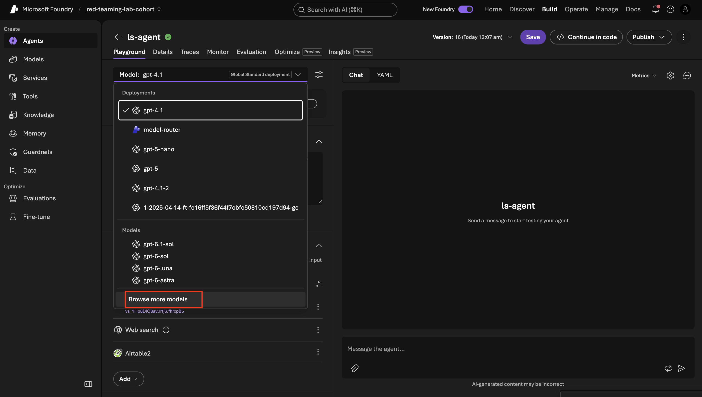

3. A model browser opens. Click the **Fine-tuned models** tab (it may say "My Models" or "Custom Models" depending on your Foundry version).

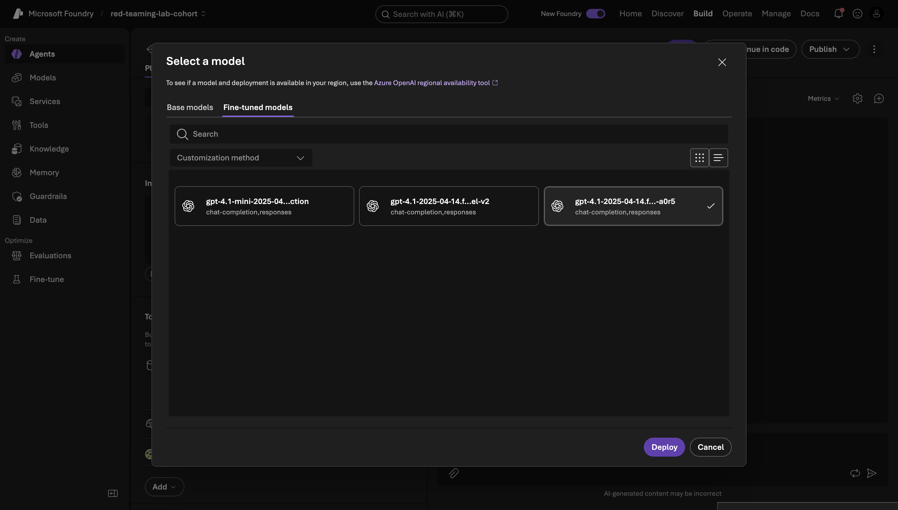

4. You'll see your fine-tuned model listed here. You can click on it to see its training date and configuration details in the list view.

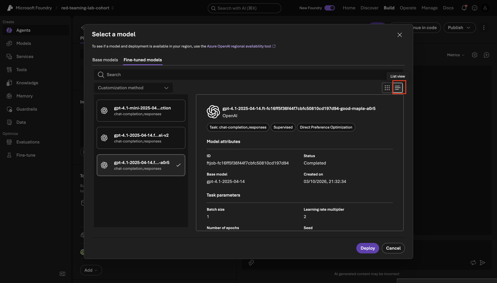

5. Click **Deploy** next to your fine-tuned model to make it available to your agent.

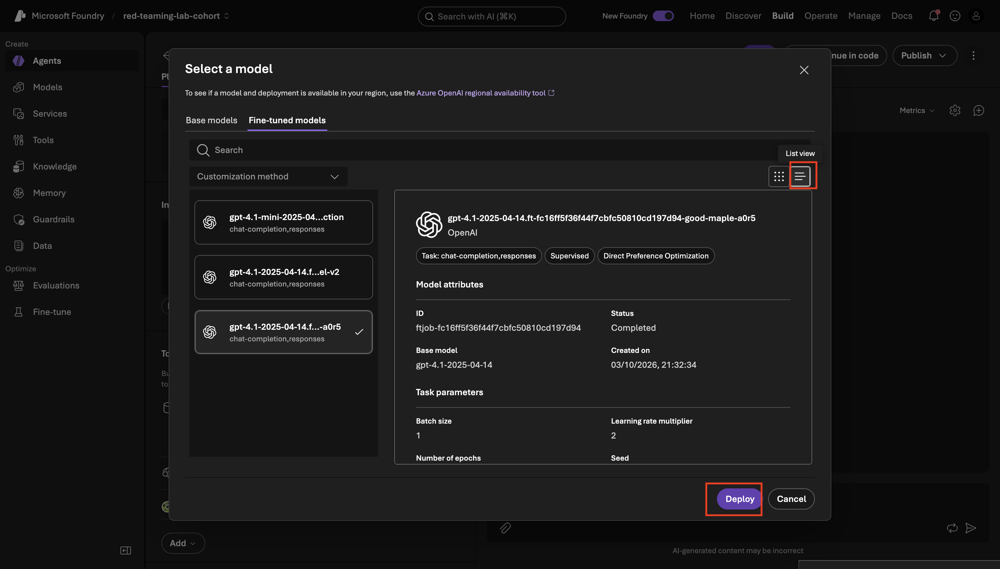

6. Once deployed, go back to your agent and open the model dropdown again. Your fine-tuned model now appears in the list. Select it.

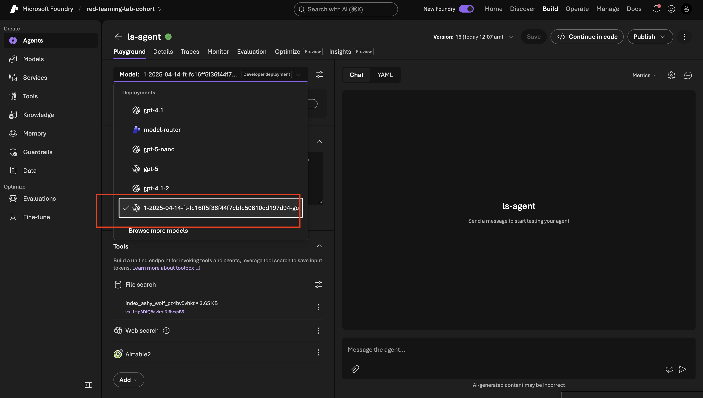

7. Save your agent settings.

**Output**: Your agent is now running on your fine-tuned model. Everything else about the agent — its instructions, its file search tools, its behavior — stays exactly the same. Only the underlying model has changed.

---

## Phase 4: See the Improvement

### Step 9: Ask the Same Question Again

**What you're doing**: Running the exact same test as Step 1 — same question, same contract — to see how the fine-tuned model responds differently.

**Why this matters**: This is the moment of truth. If fine-tuning worked, the response should be noticeably more focused: direct answer first, grounded in the document, no unsolicited risk scores or legal recommendations.

**Action items**:

1. In the agent playground, upload the same sample contract you used in Step 1.

2. Type the exact same question:

> **How long does the Company have to pay an invoice?**

3. Read the response carefully. Compare it to the screenshot you took in Step 1.

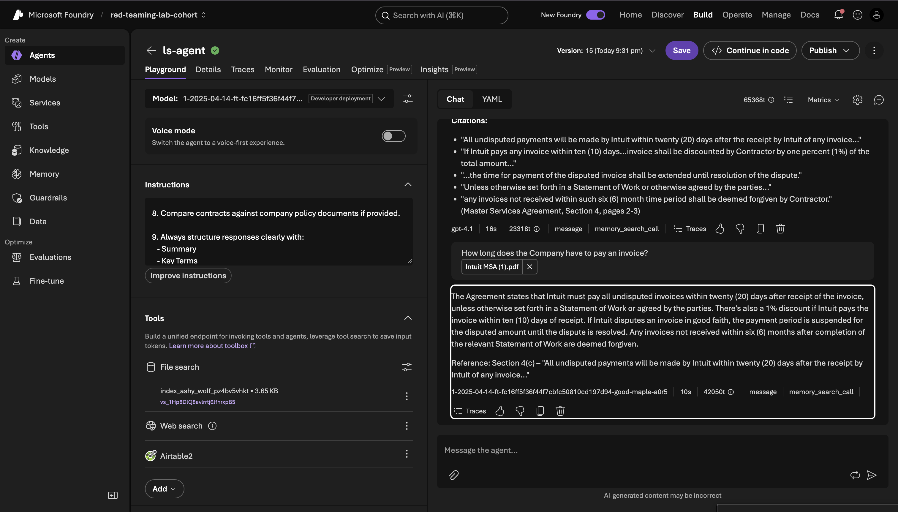

**Output**: The fine-tuned model answers the question directly — stating the payment term from the contract — without adding unsolicited risk analysis, recommendations, or scores. The response is shorter, more relevant, and matches what a user actually asked for.

---

## Before and After

| | Before Fine-Tuning | After Fine-Tuning |
|---|---|---|
| **Response length** | Multiple paragraphs | One to two sentences |
| **What it covers** | Payment terms + risk score + recommendations + legal advice | Payment terms from the contract |
| **Grounded in the document?** | Yes, but buried | Yes, front and center |
| **Unsolicited analysis?** | Yes | No |
| **Aligned with the question?** | Partially | Fully |

The agent didn't change. The instructions didn't change. The contract didn't change. Only the model changed — and that change ripples through every response the agent gives, for every question, automatically.

---

## What You Actually Built

You didn't just make one answer shorter. You changed how the model handles an entire class of questions. Every time someone asks a direct factual question about a contract, your fine-tuned model will now default to giving a direct factual answer — not a legal brief.

That's the difference between patching symptoms and fixing root causes.
