# Lesson 1 — Planning & Architecture

---

Most people who start building with Claude make the same mistake.

They open Claude Code, type *"build me an app"*, and start generating files. Something appears. It looks real. They keep going.

Three hours later the backend doesn't match the frontend. There's a feature in the UI that has no API. The database schema was made up on the fly. The code technically exists — it just doesn't hold together.

The problem wasn't Claude. The problem was that nobody told Claude what it was actually building — before it started building.

---

## The Problem You Are Solving

Picture a founder at a 20-person SaaS company. A potential enterprise client sends over a 30-page Master Service Agreement. She needs to sign it by end of week. She has no in-house lawyer, so she either spends 90 minutes reading every clause herself — or pays $400 for legal time to get a summary she barely understands.

She does this ten times a month.

You are building **ContractIQ** — a web app where a user uploads a contract PDF and within 30 seconds sees a structured breakdown of every clause that matters: what it says, where it appears in the document, and how confident the AI is in its reading. If something looks off, the user can click through to the exact sentence it came from. And when they have a specific question, they can ask it in plain English and get an answer grounded in the actual document.

The tool doesn't replace a lawyer. It gives people enough understanding to know when they need one.

---

## What You'll Produce

No application code gets written in this lesson. What you *will* produce is more important: the documents that make every future prompt coherent.

By the end of this lesson you'll have:

- A forked and cloned copy of the starter project on your machine
- A clear understanding of what every file in the project does
- `docs/engineering/hld-doc.md` — the high-level architecture plan
- `docs/specs/` — the file-by-file implementation blueprint

These two documents are what the rest of the build runs on.

---

## Where You Are in the Process

Every well-built product follows a lifecycle. Here's the one you're working through:

```
Idea
↓
Research
↓
PRD (Product Requirements)
↓
Engineering Document      ← YOU ARE HERE
↓
Implementation Specs
↓
Build
↓
Deployment
↓
Iteration
```

Right now you're at the top — before a single line of application code exists. Today's job is to build the foundation those future steps depend on.

---

## Step 1 — Fork the Starter Repository

A starter repository has already been set up with the project structure, configuration files, and workflow rules you will need throughout this course. Your first move is to make your own copy of it.

Go to this URL in your browser: [https://github.com/sachin0034-tech/dev-os](https://github.com/sachin0034-tech/dev-os)

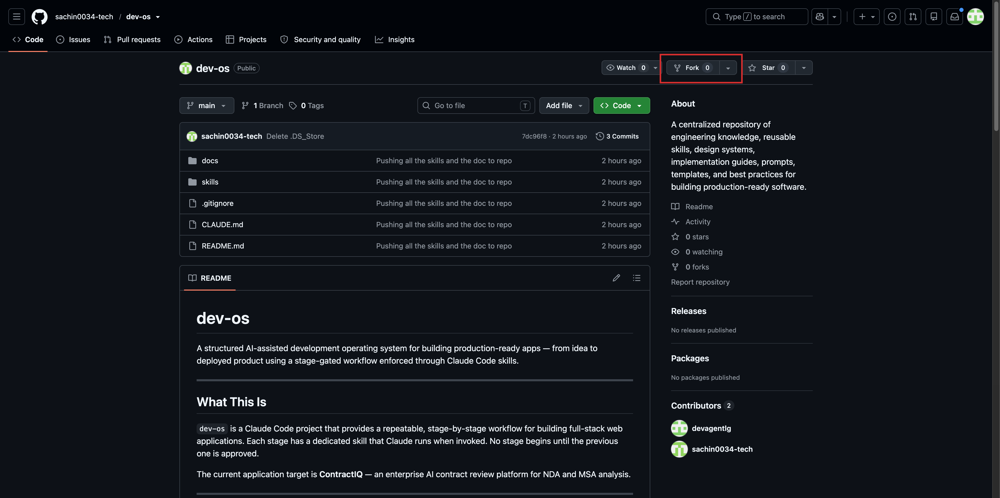

In the top-right corner of the page, click the **Fork** button. GitHub will ask you where to fork it — select your own account and click **Create fork**.

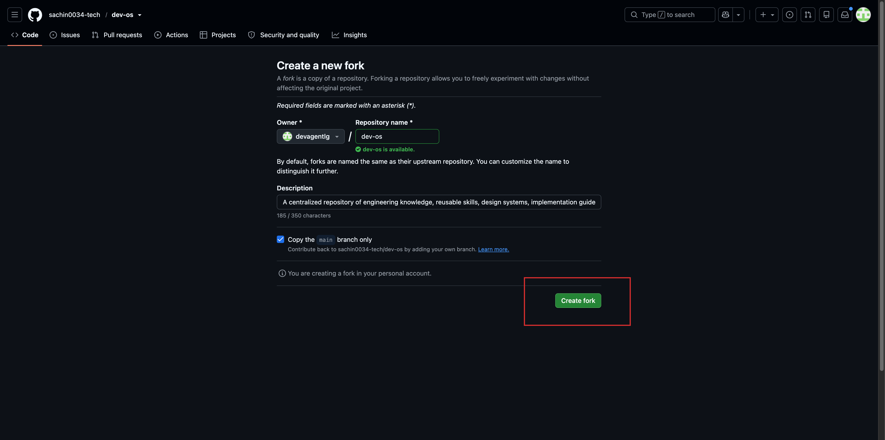

---

**What is a fork?**

A fork is your own copy of someone else's GitHub repository — same files, same structure, but now under your account so you can commit changes without touching the original.

> **Learn more:** [GitHub forks →](https://docs.github.com/en/pull-requests/how-tos/work-with-forks/fork-a-repo)

---

## Step 2 — Clone Your Fork to Your Computer

The fork exists on GitHub, but it's still in the cloud. To work with it, you need it on your local machine.

Click the green **Code** button on your fork's page, make sure **HTTPS** is selected, and copy the URL shown.

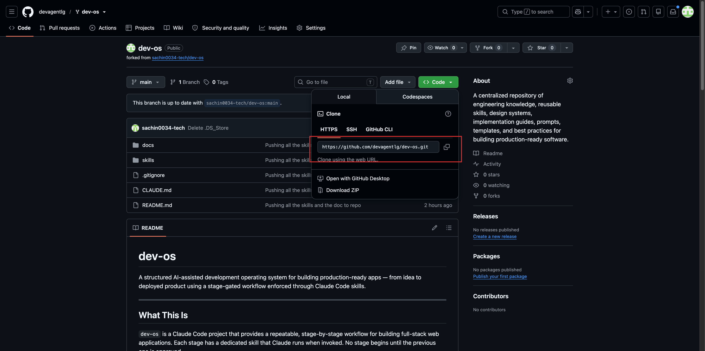

Open your terminal and run:

```bash
git clone <paste the URL you copied here>
```

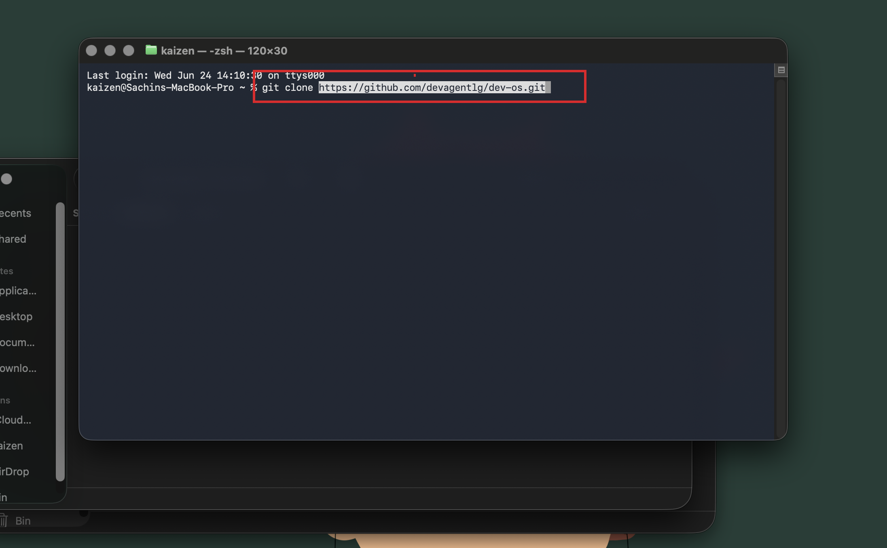

**What is git clone?**
`git clone` downloads a remote repository from GitHub onto your machine as a local folder you can open, edit, and build from.

> **Learn more:** [Git cloning →](https://docs.github.com/en/repositories/creating-and-managing-repositories/cloning-a-repository)

---

## Step 3 — Open the Project in Claude Code

Open **Claude Code Desktop**. Select the `dev-os` folder that was just created by the clone command.

click on three dots on the top select Files [that will show only when you start chat so write hii in your current session]

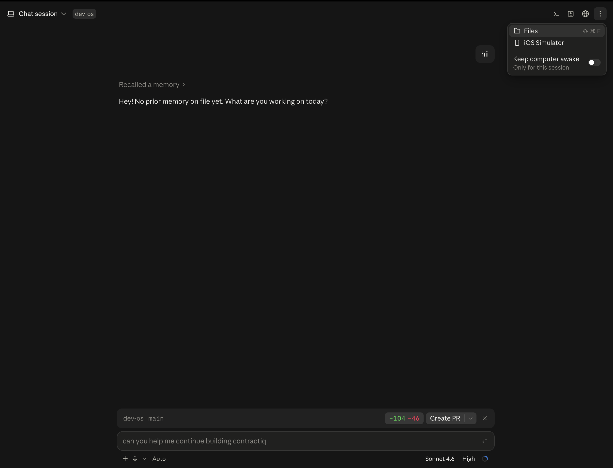

You will see the file tree:

```
dev-os/
├── CLAUDE.md
├── docs/
│   ├── design.md
│   └── ContractIQ_PRD.md
└── skills/
    ├── engineering-planner/
    │   └── SKILL.md
    ├── implementation-specs/
    │   └── SKILL.md
    ├── security-foundation/
    │   └── SKILL.md
    ├── frontend-setup/
    │   └── SKILL.md
    └── design-system/
        └── SKILL.md
```

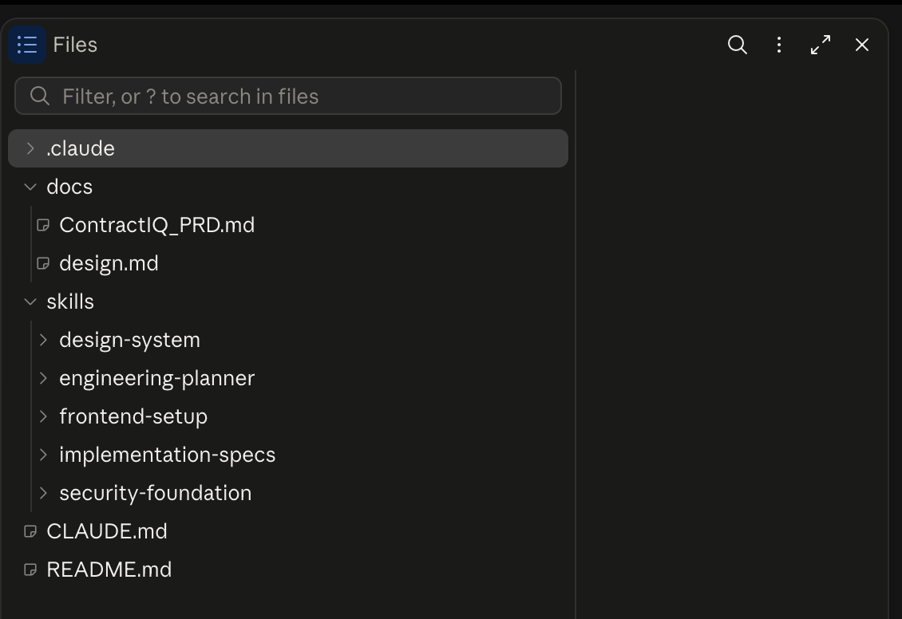

This project is not just organised for you. It's organised for Claude. Every file here is something Claude reads before it acts.

---

## Understanding the Project Structure

| File / Folder | What it is | Why it exists |
|---|---|---|
| `CLAUDE.md` | The project constitution | Loaded automatically at the start of every Claude Code session. Tells Claude what stage of development you're in, which rules apply, and what it's allowed to do — so you never have to re-explain decisions from previous sessions. |
| `docs/ContractIQ_PRD.md` | Product Requirements Document | Defines the problem, the users, the features, and the success criteria. Every technical decision in this course traces back to something written here. |
| `docs/design.md` | Visual contract | The colours, typography, spacing, and component patterns every screen must follow. Claude references this whenever it builds UI so the product looks consistent without you describing the visual style on every prompt. |
| `skills/engineering-planner/SKILL.md` | Planning skill | Tells Claude exactly how to read a PRD and turn it into an architecture document. Run once at the start of the project. |
| `skills/implementation-specs/SKILL.md` | Spec-writing skill | Takes the architecture plan and breaks it into file-by-file build instructions Claude follows when writing code. |
| `skills/security-foundation/SKILL.md` | Security audit skill | Reviews the planned code for vulnerabilities before anything ships. |
| `skills/frontend-setup/SKILL.md` | Frontend scaffold skill | Sets up the application with the design system already baked in. |
| `skills/design-system/SKILL.md` | UI enforcement skill | Applies `design.md` rules at the component level throughout all UI work. |

---

## How Real Engineering Teams Set Up Projects

The best engineering teams don't start by writing code. They start by writing rules.

A **Tech Lead** documents architecture decisions — what was chosen, what was rejected, and why. An **Engineering Manager** sets coding conventions so every engineer writes in the same style. A **Product Manager** maintains the PRD so every technical choice can be traced back to a user problem.

These documents aren't process for its own sake. They're what lets a team of ten people build in the same direction without a meeting every time a new decision comes up.

What you've just set up — `CLAUDE.md`, the PRD, the design system, the skills — is the AI-native version of exactly that. The rules are written. The context is permanent. Every session starts informed instead of blank.

---

## The Problem With Jumping Straight to Code

Here's what happens when developers skip planning.

They paste the PRD into Claude and say *"build the frontend."* Claude builds something. Then *"now add authentication."* Claude adds it — but it doesn't quite match the database shape from the first prompt. Then *"now add the upload feature."* Claude builds it — but it assumes a file structure that conflicts with step one.

Each prompt produces working code in isolation. Together, they don't hold together.

The root cause is always the same: there was no shared plan. Every prompt started from scratch and made its own assumptions about how the pieces connect.

An engineering plan answers the structural questions once — data models, API design, build order, feature dependencies — so every prompt that follows works from the same foundation.

---

## Step 4 — Start a Claude Code Session Pointed at dev-os

Open **Claude Code** and make sure the session is pointing to the `dev-os` folder you just cloned. You should see the file tree with `CLAUDE.md`, `docs/`, and `skills/` on the left.

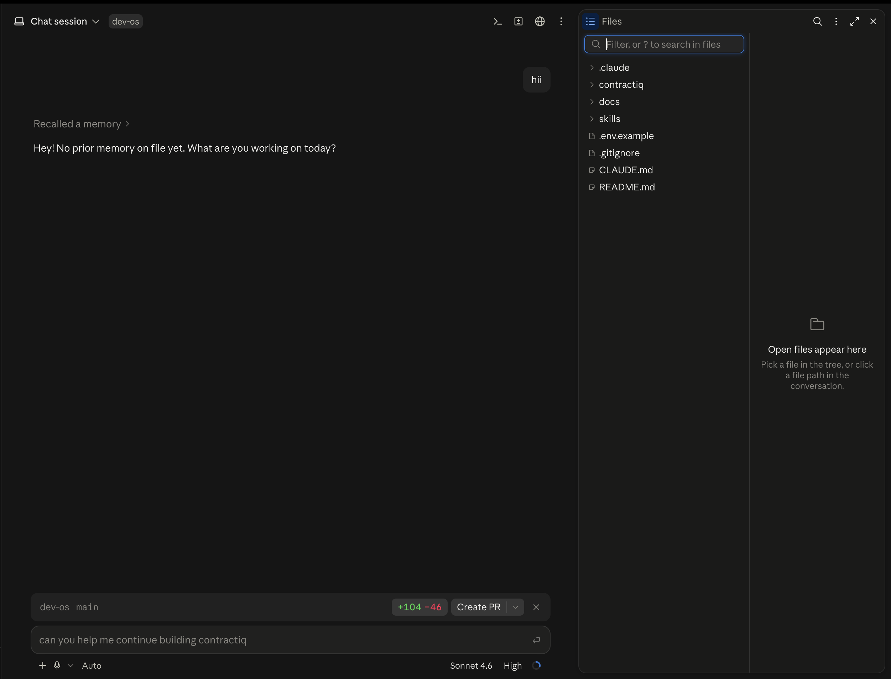

---

## Step 5 — Generate the High-Level Design (HLD)

Copy and paste this prompt into Claude Code:

```
/plan Create an end-to-end engineering document based on the provided @docs/ContractIQ_PRD.md. Your task is to meticulously extract all features and specifications from the PRD and translate them into detailed engineering design elements. Use the @skills/engineering-planner/SKILL.md for creating the doc.
```

**What does this prompt do?** It tells Claude to read the PRD and engineering-planner skill, then produce a full architecture plan — the system components, data models, API contracts, and build sequence — before writing a single file.

**What is `/plan`?**
`/plan` activates Plan Mode in Claude Code. In Plan Mode, Claude reads everything, thinks through the full problem, and shows you a structured plan — but creates no files and changes nothing until you approve. You see the complete plan first and decide whether to proceed or revise.

> **Note:** You can use `@` followed by any file path to reference a file directly in your prompt. Claude reads it in full before generating any output. For example: `@docs/ContractIQ_PRD.md` or `@skills/engineering-planner/SKILL.md`. You can chain as many `@` references as you need in a single prompt.

---

Claude will ask for permission to proceed. Click **Allow**.

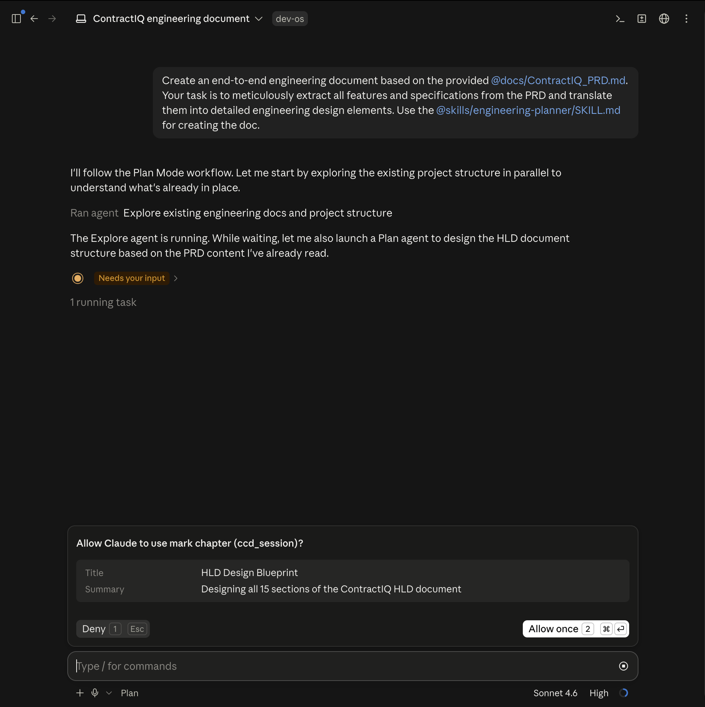

Claude will then show you the proposed plan. Click **Open Plan** to review it, then click **Accept and Auto Mode**.

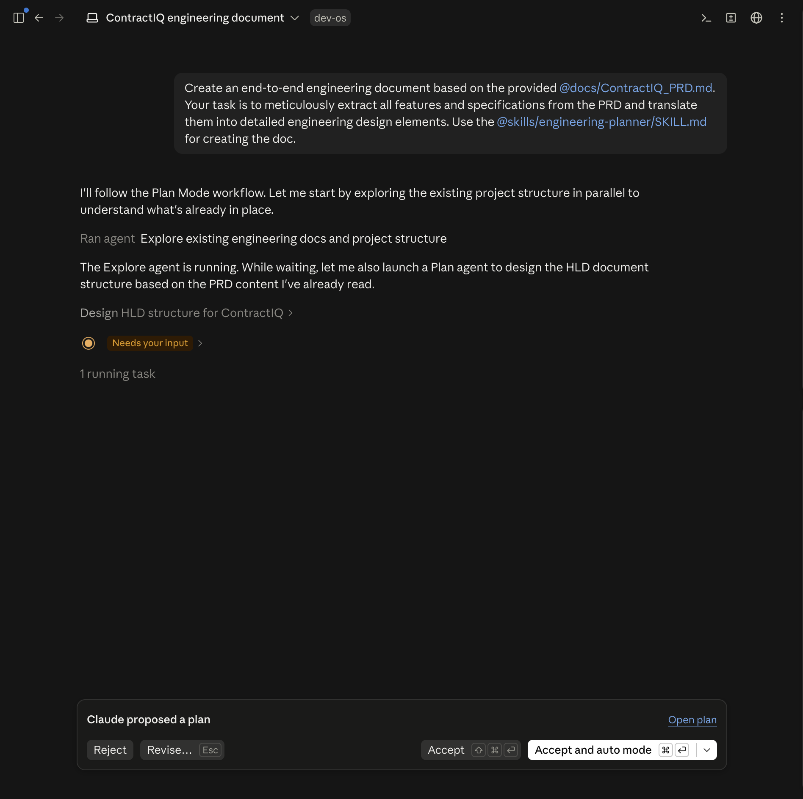

Claude will now generate the engineering document. This can take a few minutes — let it finish without interrupting.

---

### Output

Once complete, you will find a new file at:

```
docs/
└── engineering/
    └── engineering-doc.md
```

This is your **High-Level Design document** — the architectural blueprint for the entire application.

---

## HLD vs LLD — What's the Difference?

| | HLD — High-Level Design | LLD — Low-Level Design |
|---|---|---|
| **What it is** | The big picture: system components, data models, API contracts, and how everything connects | The detailed instructions: exact files, functions, routes, and edge cases for each individual feature |
| **Who reads it** | Anyone who needs to understand the system's structure | Claude — it reads this when it writes the actual code |
| **Scope** | Whole application | One feature at a time |

The HLD tells you *what* gets built. The LLD tells Claude *how* to build each piece of it.

---

## Step 6 — Generate the Implementation Specs (LLD)

With the HLD in place, run this prompt to generate the implementation specs:

```
Use the @skills/implementation-specs/SKILL.md skill and my engineering document to create a comprehensive implementation specification for my app. Ensure the spec covers all features, workflows, technical requirements, APIs, database changes, frontend and backend implementation details, edge cases, and acceptance criteria.
```

Claude will read the HLD and produce a detailed spec for every feature.

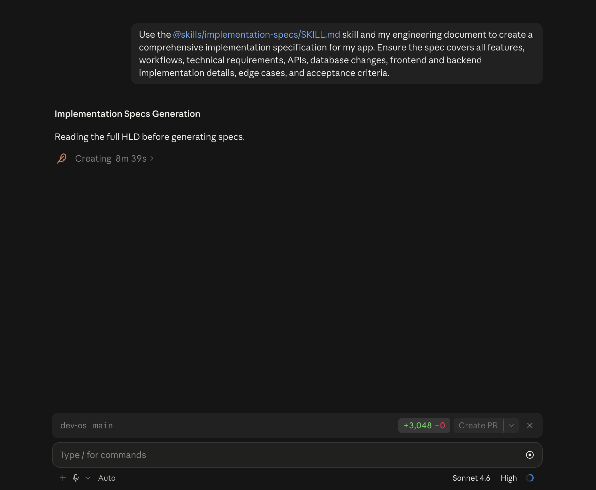

---

### What Are Implementation Specs?

Each spec covers one feature end to end:

- The exact files to create or modify
- The functions and components to write
- The API routes to wire up
- The database changes required
- The edge cases to handle
- The acceptance criteria that confirm it's working

This is the document Claude reads when it actually writes code. Without it, Claude makes assumptions. Those assumptions create mismatches. Those mismatches surface as bugs three features later that are very hard to trace back.

---

### Output

Once complete, your folder structure will look like this:

```
docs/
└── specs/
    ├── 01-auth.md
    ├── 02-contract-upload.md
    ├── 03-ai-analysis.md
    ├── 04-dashboard.md
    └── …
```

One file per feature. Each one is a self-contained build instruction that the next lesson will execute.

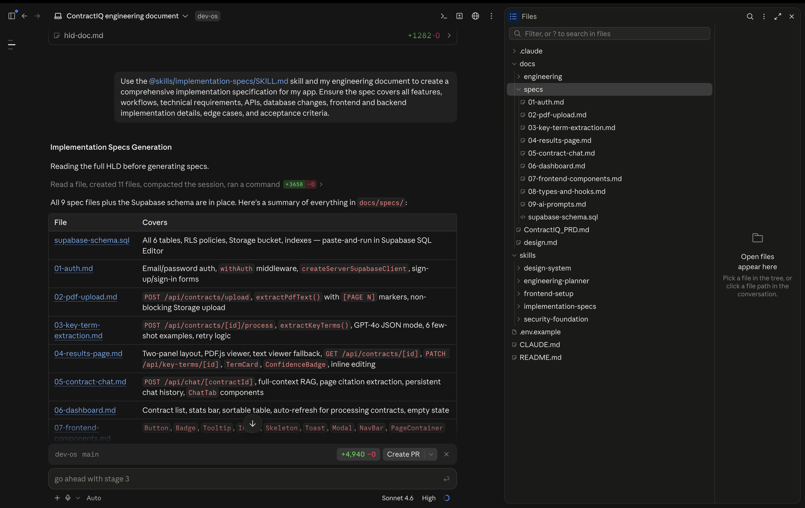

---

## What You Accomplished

You now have:

- A forked and cloned copy of `dev-os` on your machine
- A clear understanding of every file in the project structure and why it exists
- `docs/engineering/hld-doc.md` — the full architecture plan
- `docs/specs/` — the file-by-file build blueprint for every feature

The planning is done. The next lesson is where the application actually gets built — and because this foundation exists, Claude will be executing a plan rather than improvising one.

---

[Lesson 2 — Building & Deploying →](../02-building-the-application-lesson/README.md)
