[← Lesson 1 — Planning & Architecture](../01-planning-and-architecture-lesson/README.md) | [Lesson 3 — Security & Deployment →](../03-security-and-deployment-part/README.md)

---

# Lesson 2 — Building the Application

---

You finished Lesson 1 with two documents in place — a high-level architecture plan and a full set of implementation specs. You know what ContractIQ does, how the data connects, and exactly what order things should be built.

Now you actually build it.

Here's where you are in the full lifecycle:

```
Idea
↓
Research
↓
PRD  ✓
↓
Engineering Document  ✓
↓
Implementation Specs  ✓
↓
Build the Application  ← YOU ARE HERE
↓
Deployment
↓
Iteration
```

By the end of this lesson you'll have a live database, a running Next.js application, and the core features of ContractIQ working in your browser.

---

## Before You Write a Line of Code — Set Up the Database

Every action in ContractIQ involves storing something. A user creates an account. They upload a contract. Claude analyzes it. They ask follow-up questions. They come back a week later and pick up where they left off.

If you build the UI first and add the database later, you'll spend hours rewriting components that assumed the wrong data shape. The database goes first — always.

---

### SQL or NoSQL?

Databases come in two broad families.

**Relational (SQL)** stores data in tables with rows and columns and strict rules about how tables connect. It's the right choice when records relate to each other — a user *has many* contracts, a contract *has many* analyses.

**Non-relational (NoSQL)** stores data as flexible documents. It fits unstructured or variable-shape data, like real-time event streams.

ContractIQ has structured, relational data. SQL it is.

---

### Why Supabase?

Setting up raw Postgres, authentication, file storage, and API access from scratch takes weeks. Supabase gives you all of it in one place:

- **Authentication** — sign-up, login, and session management, built in
- **Row Level Security (RLS)** — database-level rules so each user can only see their own rows
- **Storage** — a place to keep the actual PDF files
- **Auto-generated APIs** — your tables are immediately available as REST endpoints the app calls directly

The engineering document from Lesson 1 already contains the full schema — every table, column, type, and access rule. Later in this lesson you'll run that schema in Supabase and the entire structure comes to life.

> **Learn more:** [Supabase documentation →](https://supabase.com/docs)

---

## Step 1 — Create Your Supabase Account

Open your browser and go to [https://supabase.com/](https://supabase.com/). Click **"Start your project"**.

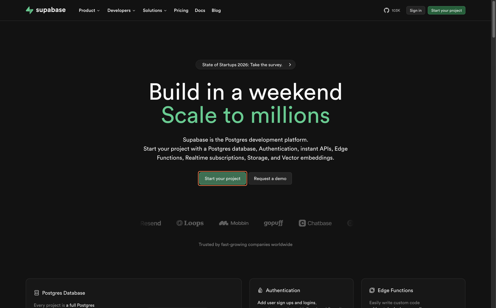

Sign up with **GitHub** (recommended — fastest) or with your email address.

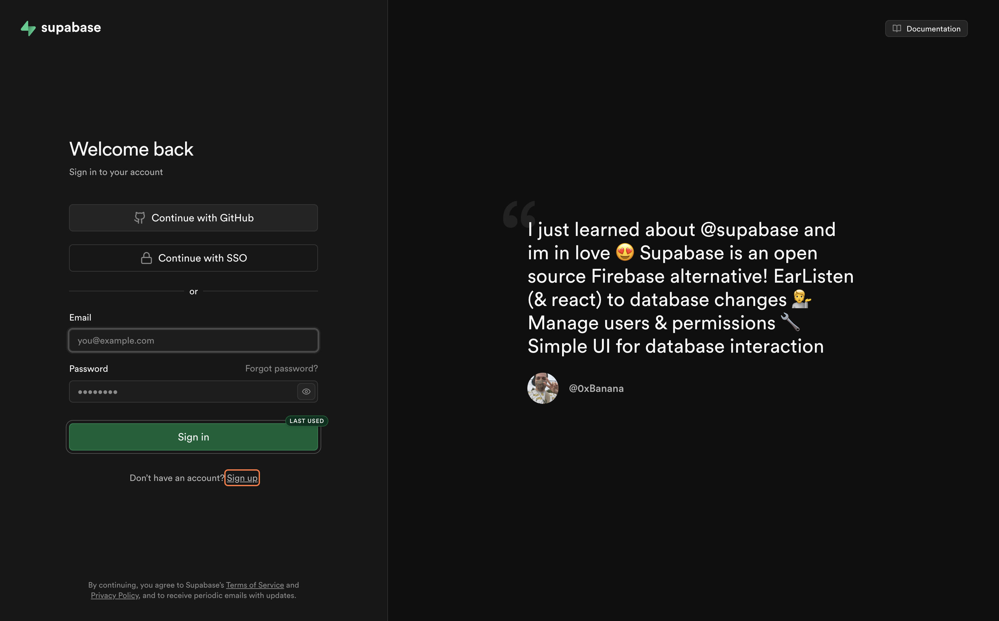

---

## Step 2 — Create an Organization

After signing in, Supabase will prompt you to create an organization:

1. Enter a name (your name or team name works fine)
2. Select the **Free** plan
3. Click **"Create organization"**

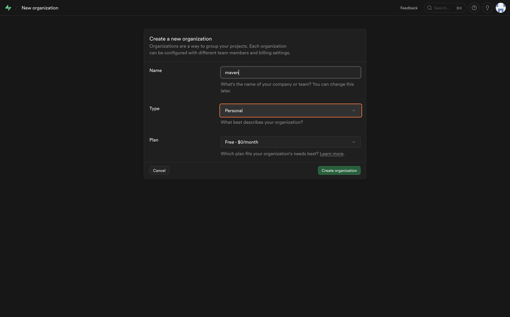

---

## Step 3 — Create a New Project

Inside your organization, click **"New project"** and fill in the details:

1. Enter a **Project Name** — something like `contractIQ-db`
2. Set a strong **Database Password** — save this somewhere safe
3. Choose the **Region** closest to you
4. Click **"Create new project"**

Supabase will take 1–2 minutes to provision your database. Wait for it to finish before moving on.

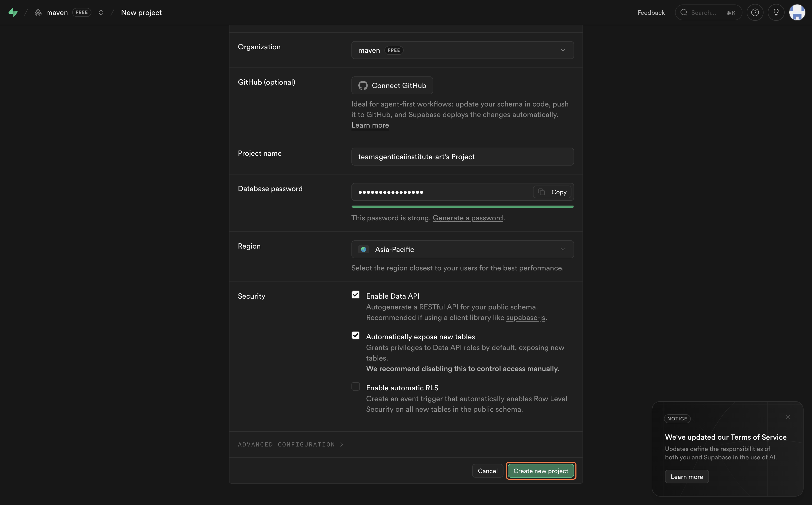

---

## Step 4 — Copy Your Credentials

You need three values from Supabase. Here is where to find each one.

**Project URL**

Go to your project overview — the URL is shown at the top. It looks like `https://xyzxyzxyz.supabase.co`.

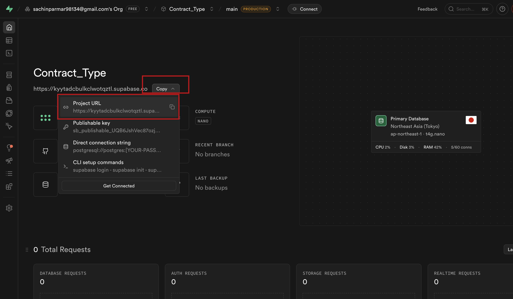

**Anon Key (public)**

1. Click **Project Settings** in the left sidebar
2. Click **API**
3. Scroll to **Project API keys** and copy the value next to **`anon public`**

**Service Role Key (secret)**

On the same **API** settings page, find **Legacy API keys** and copy the value next to **`service_role`**.

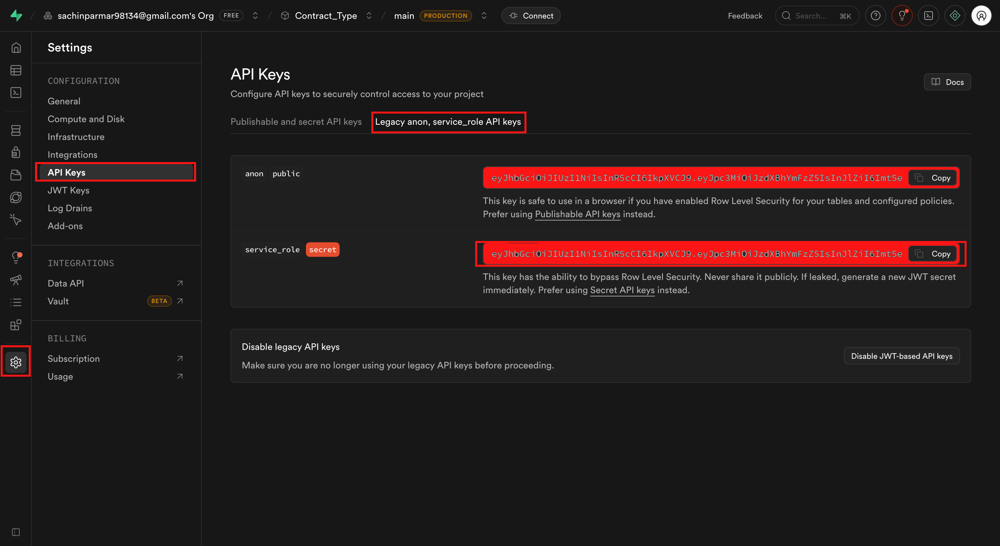

---

Here's the difference between these two keys, in plain terms.

The **anon key** is safe to use in your frontend — it identifies your project but only gives access to rows the user is allowed to see. Think of it as a lobby pass.

The **service role key** bypasses all access rules. Full, unrestricted access to everything in your database. Powerful for server-side operations — dangerous if it leaks. It must never appear in your frontend code or be committed to GitHub.

> Keep these three values somewhere handy — you'll need them in the next step.

---

## Step 5 — Set Up the Frontend

Open **Claude Code** with your `dev-os` folder, then copy and paste this prompt:

```
Use @skills/frontend-setup/SKILL.md to set up the frontend foundation for this project.
```

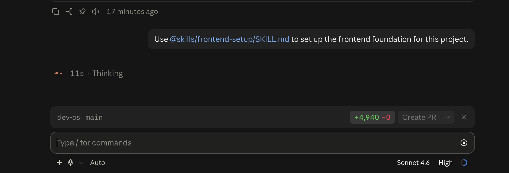

Claude will ask: **"Where would you like to set up the ContractIQ Next.js project?"**

Choose **Create a new folder**.

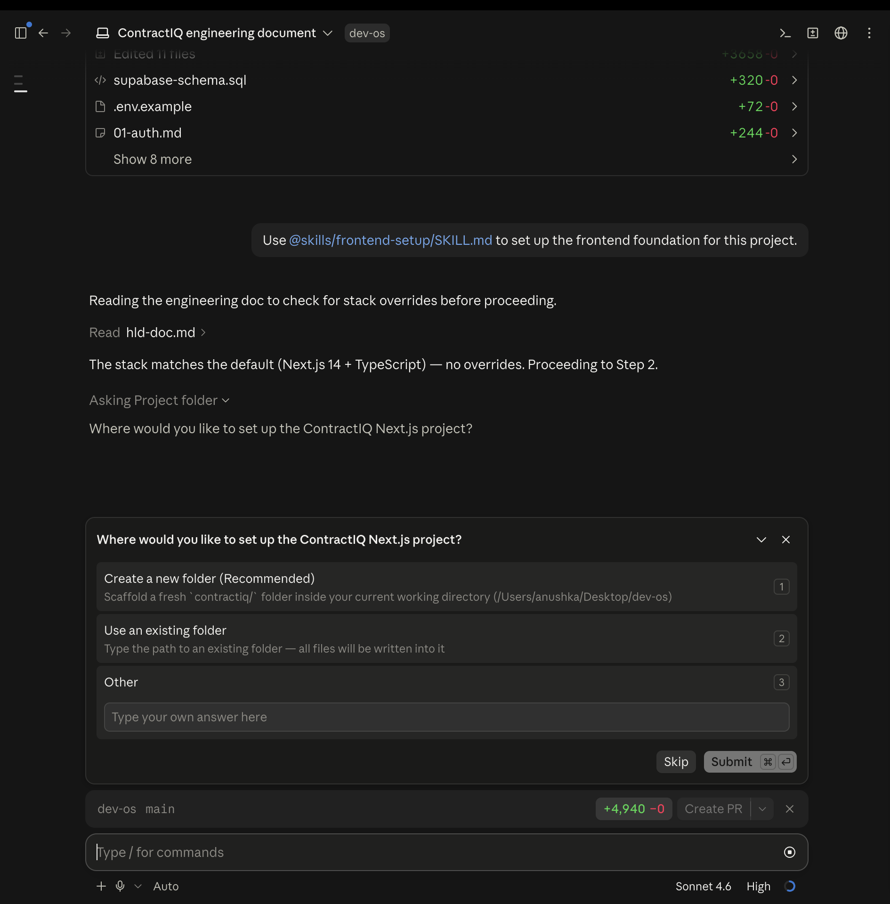

When the skill finishes, your project will have a complete Next.js 14 structure with your design system already baked into Tailwind:

```
contractiq/
├── app/
│   ├── (auth)/
│   │   ├── login/
│   │   └── signup/
│   ├── (dashboard)/
│   │   └── dashboard/
│   └── layout.tsx
├── components/
│   ├── ui/
│   └── shared/
├── lib/
│   ├── supabase/
│   └── utils/
├── types/
├── styles/
├── public/
├── .env.local.example
├── next.config.ts
├── tailwind.config.ts
└── package.json
```

This is the skeleton of the building — every floor, every room — before any of the logic goes in.

---

## Step 6 — Add Your Credentials

Inside your `contractiq` folder, find the file named `.env.local.example` and rename it to `.env.local`.

You can do this manually, or ask Claude:

```
Rename .env.local.example to .env.local and fill in the Supabase and OpenAI credentials.
```

Either way, open `.env.local` and make sure it looks like this — with your real values in place:

```
NEXT_PUBLIC_SUPABASE_URL=https://xyzxyzxyz.supabase.co
NEXT_PUBLIC_SUPABASE_ANON_KEY=your-anon-key-here
SUPABASE_SERVICE_ROLE_KEY=your-service-role-key-here
OPEN_API_KEY=sk-ant-...
```

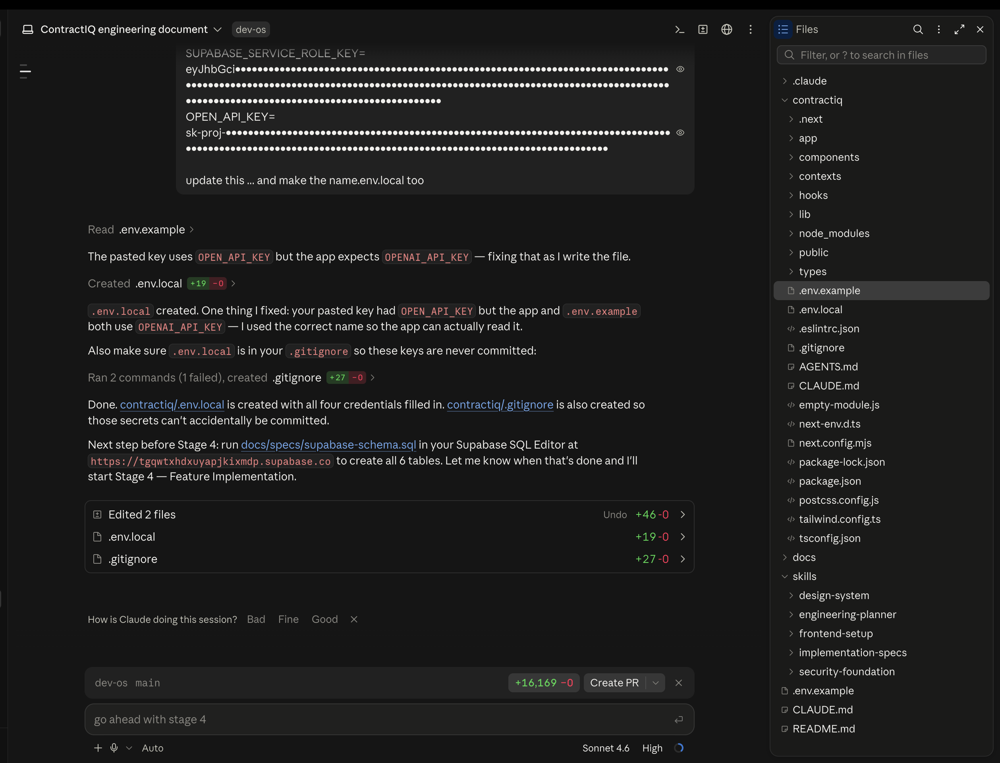

**Why does `NEXT_PUBLIC_` exist?**

In Next.js, environment variables are server-side by default — they never reach the browser. Prefixing a variable with `NEXT_PUBLIC_` is the way you explicitly opt it into the browser. The Supabase URL and anon key need to be readable by frontend components, so they get the prefix. The service role key must never reach the browser, so it has no prefix — Next.js keeps it server-side automatically.

---

## Step 7 — Implement the Application

You now have everything Claude needs to build correctly:

- A structured folder to build into
- An HLD describing the full architecture
- Spec files from Lesson 1 describing every feature, file by file

This is the moment the plan becomes code. Copy and paste this prompt:

```
Based on the engineering doc and all of my specs files, start implementing the application.

Before writing any code:
- Read and understand the Engineering Document.
- Read and understand all feature specifications.
- Identify dependencies between features.
- Create an implementation plan and execution order.

Implementation Rules:
- Follow the architecture defined in the Engineering Document.
- Follow the design system defined in docs/design-system.md.
- Follow all folder structure and naming conventions.
- Use TypeScript throughout the application.
- Create reusable and maintainable components.
- Write production-ready code only.
- Do not leave TODO comments or placeholder implementations.
- Implement proper loading, error, and empty states.
- Implement validation and security requirements defined in the specs.
- Keep code modular and scalable.
```

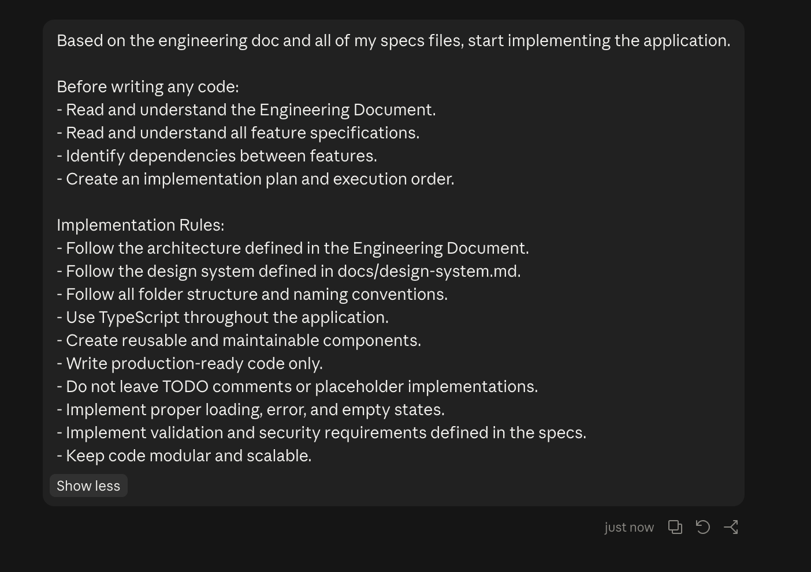

---

**Why does this prompt tell Claude to read the documents before writing any code?**

Because the order matters.

If Claude starts writing a component before it understands the full data model, it makes assumptions. Those assumptions create mismatches. Those mismatches surface three files later as errors that are hard to trace back to their source.

Reading the engineering documents and specs first gives Claude the complete picture — every feature, every dependency, every file that needs to exist before another one can reference it. It builds in the correct order. Nothing references something that doesn't exist yet.

This prompt takes the most time. Claude may ask clarifying questions before it begins — answer them fully. Do not interrupt mid-implementation unless something is clearly wrong.

---

## Step 8 — Run the Development Server

Once Claude finishes, open a new terminal in Claude Code and run:

```bash
cd contractiq
npm run dev
```

Click the local URL that appears in the terminal, or open `http://localhost:3000` in your browser.

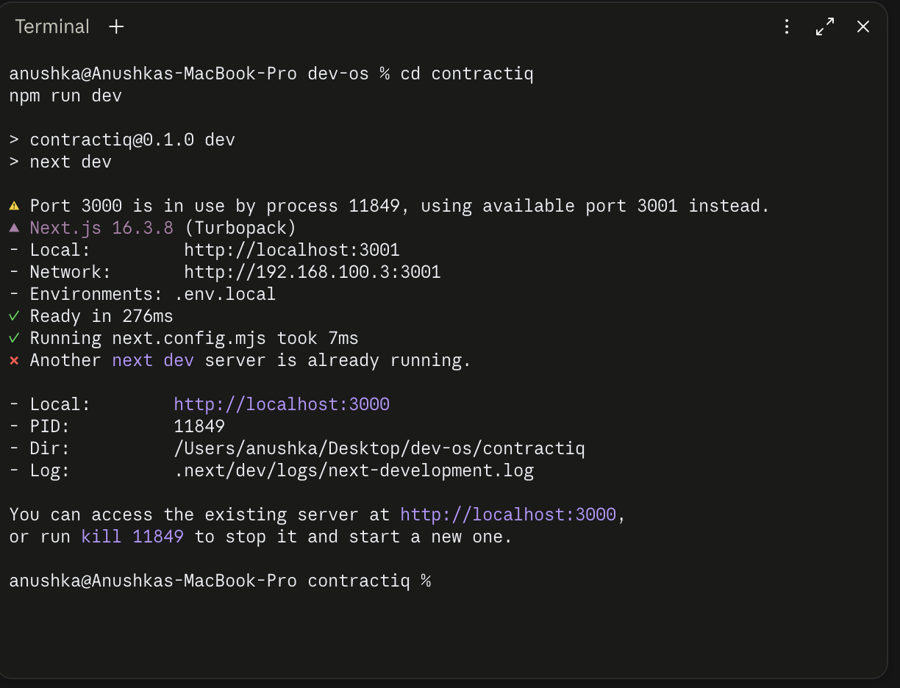

---

## Step 9 — Load the Schema into Supabase

The application code now exists — but the database is still empty. No tables. Nothing to store anything in.

Inside your `docs/specs/` folder, find the file `supabase-schema.sql`. Open it, select all the content, and copy it.

Now go to your Supabase project:

1. Click **SQL Editor** in the left sidebar
2. Paste the copied SQL into the editor
3. Click **Run** (or press `Cmd+Enter` / `Ctrl+Enter`)

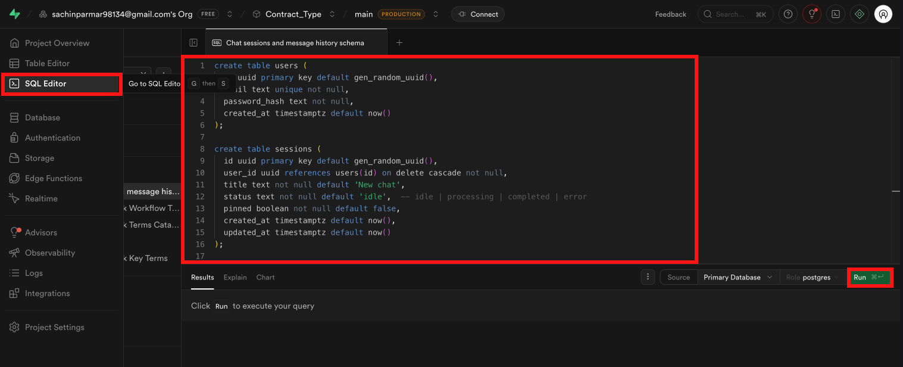

Supabase will execute every statement. When it finishes, click **Table Editor** in the left sidebar — you'll see all your tables created and ready.

If you see an error, read the message — it usually names the exact line that failed. Paste the error back into the Claude Code terminal and it will fix it.

---

## Step 10 — Test the Application Locally

Before pushing anything to production, test the full flow locally. Local testing lets you catch and fix issues in an environment where mistakes have no consequences — no real users, no live data, nothing that can break for anyone else.

Go back to `http://localhost:3000` and walk through these checks:

| Check | What to Look For |
|---|---|
| Home page loads | No blank screen, no console errors |
| Sign up works | Create a test account; confirm the user appears in Supabase **Authentication > Users** |
| Log in works | Sign in with the test account |
| Dashboard loads | Authenticated route renders correctly |
| Core feature works | Upload a file and trigger the main feature |
| Database writes | Check the relevant table in Supabase **Table Editor** to confirm data was saved |

If anything fails, open the browser dev console (`F12`) and read the error. Most issues at this stage come from a missing environment variable or a column name mismatch between the schema and the application code. Paste the error into the Claude Code terminal with the relevant file path and it will fix it.

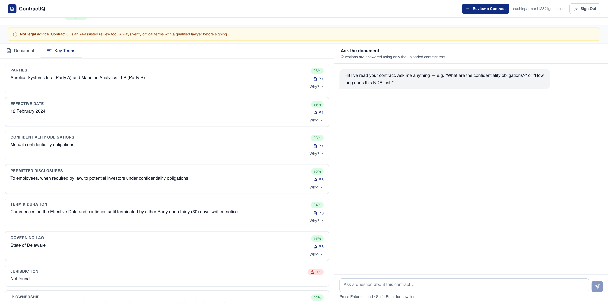

---

## What You Accomplished

You started this lesson with a plan. You're ending it with:

- A live Supabase database with every table, relationship, and access rule in place
- A complete Next.js 14 application with your design system baked in
- A running application you can open in a browser and use end to end

The build is no longer a document. It's a product.

---

[← Lesson 1 — Planning & Architecture](../01-planning-and-architecture-lesson/README.md) | [Lesson 3 — Security & Deployment →](../03-security-and-deployment-part/README.md)
