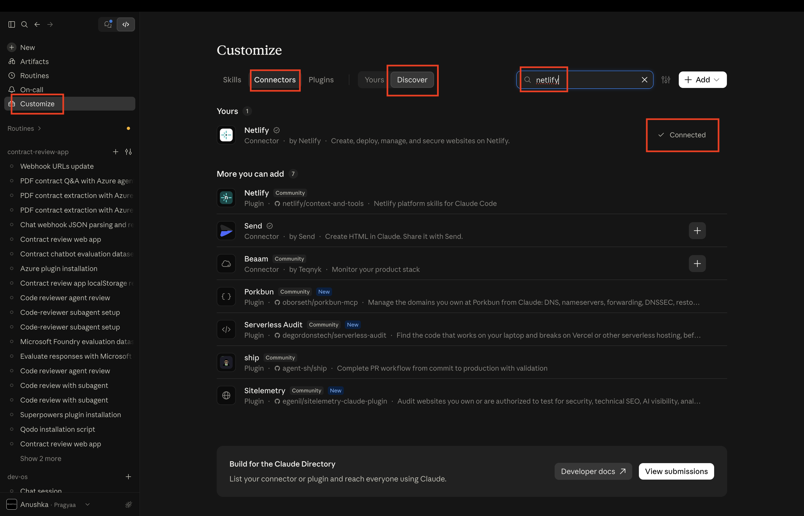
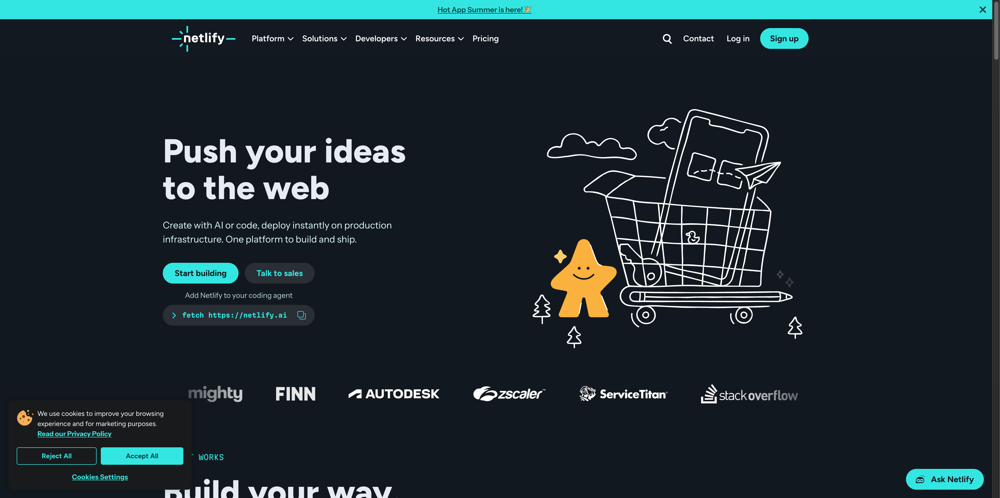
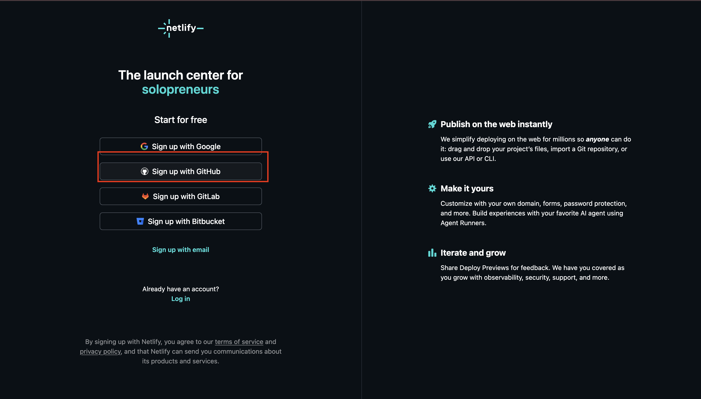
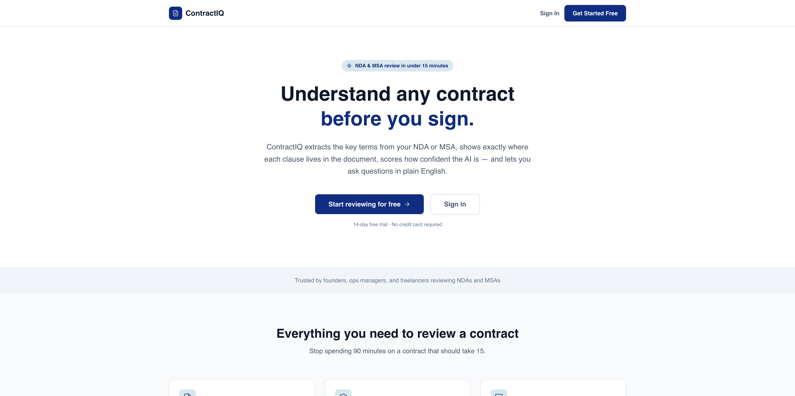
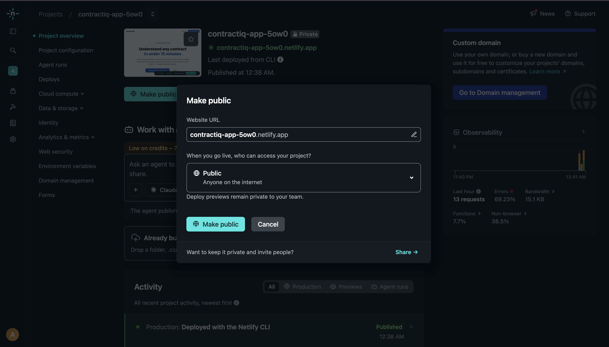
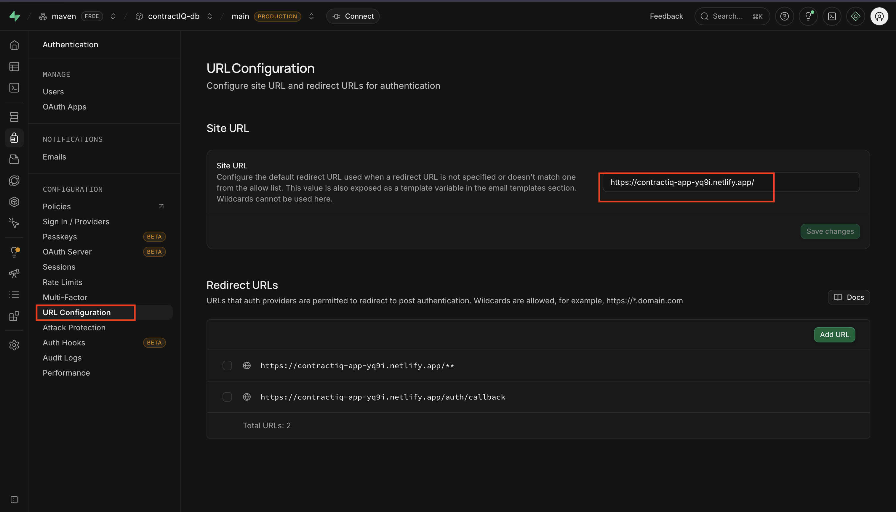
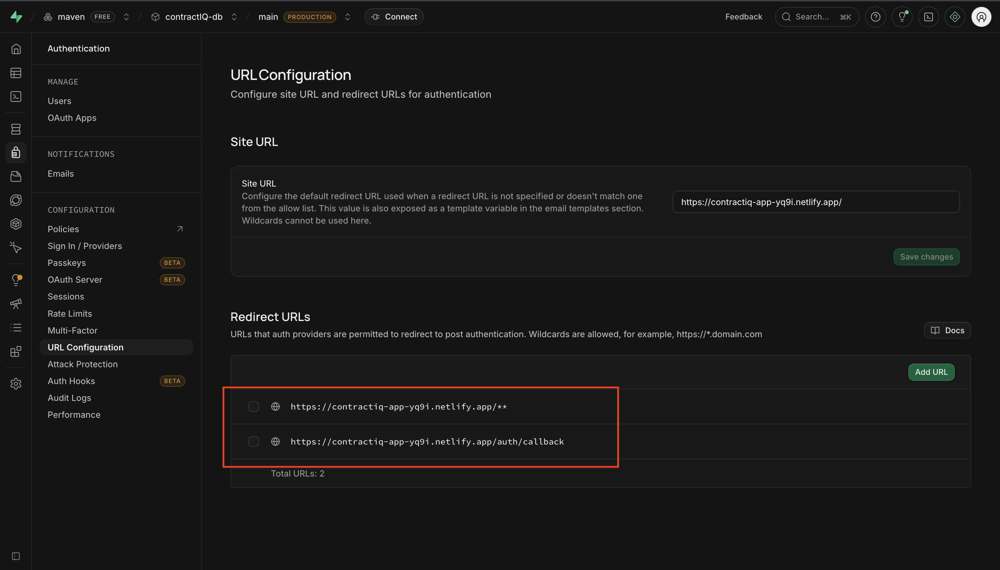

[← Lesson 1 — Security Foundation](../01-security-foundation-lesson/readme.md) | [← Back to Part 3 Overview](../readme.md)

---

# Lesson 2 — Deployment

---

Think about what you've built.

A user can sign up, upload a contract, get an AI-powered analysis back in seconds, ask follow-up questions in plain English, and come back the next day to find everything exactly where they left it.

It works perfectly.

On your machine.

The moment you close your laptop, it disappears. Nobody else can reach it. That URL — `http://localhost:3000` — only resolves on your computer. The moment someone else tries to open it, they get nothing.

This lesson changes that. By the end, ContractIQ will be live on a public URL — and every time you push new code, it will redeploy automatically without you touching anything.

---

## Where You Are in the Process

```
Idea
↓
Research
↓
PRD  ✓
↓
Engineering Document  ✓
↓
Implementation Specs  ✓
↓
Build  ✓
↓
Security Foundation  ✓
↓
Deployment  ← YOU ARE HERE
↓
Iteration
```

---

## Part 1 — Connect Netlify to Claude Code

Before deploying, you need to connect Netlify as a connector inside Claude Code. This is what lets Claude talk directly to Netlify — setting environment variables, triggering builds, and confirming the production URL — all from a single prompt.

---

**Step 1 — Open Connectors**

In Claude Code, click the **Customization** icon on the left sidebar.



Click **Connectors** to open the connectors panel.

---

**Step 2 — Find Netlify**

Switch to the **Discover** tab. Search for **Netlify**.


Click on the Netlify connector card, then click **Connect**.

---

**Step 3 — Set Up Your Netlify Account**

If you don't already have a Netlify account, you'll be prompted to create one. Sign up using **GitHub** — this links Netlify directly to your repositories so it can deploy from them.

Once your Netlify account is set up, connect it to the GitHub account where you forked the `dev-os` repo.

---

**Step 4 — Authorize Claude**

Follow the prompts to authorize Claude Code to access your Netlify account. Once done, the Netlify connector will appear as **Connected** in your connectors panel.





---

## Part 2 — Push Your Code to GitHub

Netlify deploys by reading your GitHub repository. Before Claude can trigger a deployment, your code needs to be there.

Open your **desktop terminal** (not the Claude Code terminal) and navigate to your `dev-os` directory:

```bash
cd path/to/dev-os
```

---

### Step 5 — Set Up `.gitignore`

Your `.env.local` file contains your secret API keys — it must never reach GitHub. Make sure it's listed in `.gitignore` at the root of the `dev-os` directory.

Open (or create) `.gitignore` with nano:

```bash
nano .gitignore
```

Add these two lines — replace `contractiq` with the actual name of the folder where your `.env` credentials are saved:

```
contractiq/.env.local
contractiq/node_modules
```

Save and exit:
- Press `Ctrl + X`
- Press `Y` to confirm
- Press `Enter`

Verify the file looks right:

```bash
cat .gitignore
```

---

### Step 6 — Stage, Commit, and Push

```bash
git add .
git commit -m "Build full-stack AI contract review app with Supabase"
git push origin main
```

> If your default branch is called `master` instead of `main`, use `git push origin master`.

When it finishes, open your forked repo on GitHub and refresh — your new files will be there.

---

## Part 3 — Deploy with Claude

Now let Claude handle the deployment. Copy and paste this prompt into Claude Code:

```
Before deployment, run the app locally using npm run dev and make sure it starts without errors. Then run npm run build and fix any build issues without changing the existing app logic. Once both work successfully, deploy the app to my already connected Netlify site using the Netlify connector and verify the production URL.
```

Claude will:
- Run `npm run dev` to confirm the app starts cleanly
- Run `npm run build` and fix any build errors it finds
- Deploy to your connected Netlify site using the connector
- Set your environment variables on Netlify automatically
- Return your live production URL

When Claude finishes, you'll get a URL like:

```
https://your-app-name.netlify.app
```

Click it. Your app is live.



---

## Part 4 — Make Your Site Public

By default, Netlify projects are private — only you can see them in your dashboard. Before you share the link, make the site publicly accessible.

1. Open your **Netlify dashboard**
2. Click into your project overview
3. On the project overview page, click **Make public**



Now anyone with the link can open it.

---

## Part 5 — Update Supabase URLs

Your Supabase project still thinks your app lives on `localhost`. When a user signs up or logs in on the live site, Supabase handles the authentication redirect — and it needs to know the correct production URL to redirect them back to. Without this update, auth flows will break on the live site even though they worked locally.

---

### Step 9 — Open URL Configuration in Supabase

1. Open your Supabase project dashboard and select `contractIQ-db`
2. Click **Authentication** in the left sidebar
3. Navigate to **URL Configuration**

---

### Step 10 — Update the Site URL

Replace the existing value in **Site URL** with your Netlify app URL:

```
https://your-app-name.netlify.app
```



---

### Step 11 — Add Redirect URLs

Under **Redirect URLs**, click **Add URL** and add both of the following:

```
https://your-app-name.netlify.app/**
https://your-app-name.netlify.app/auth/callback
```



Click **Save**.

---

## Troubleshooting

If something breaks after deployment, open a terminal in Claude Code and run the app locally first:

```bash
npm run dev
```

Check it at `http://localhost:3000`. If you see an error, paste it directly into the Claude Code terminal and ask it to fix the issue. Once Claude applies the fix, redeploy using the same prompt from Part 3.

---

**Check your environment variables in Netlify first**

Most post-deployment issues come from a missing or incorrect environment variable. Before trying anything else, verify all four keys are present in Netlify.

1. Open your **Netlify dashboard** and click into your project
2. Go to **Project configuration** → **Environment variables**
3. Confirm these four variables are listed:

   ```
   NEXT_PUBLIC_SUPABASE_URL
   NEXT_PUBLIC_SUPABASE_ANON_KEY
   SUPABASE_SERVICE_ROLE_KEY
   OPEN_API_KEY
   ```

4. If any are missing, click **Add variable**, enter the key name, and paste the value from your local `.env.local` file
5. After adding any missing variables, trigger a redeploy from the **Deploys** tab

---

**Build failed — error in the Netlify build log**

```
My Netlify deploy failed with this error: [paste the full error from the build log]. Fix it so the build succeeds.
```

---

**App deploys but shows a blank page or crashes**

```
My app deploys successfully on Netlify but when I open the URL I see a blank page or crash. The browser console shows: [paste the error]. The app works fine locally. Diagnose what is different about the production environment and fix it.
```

---

**Authentication redirects are going to localhost after login**

```
After logging in on the live Netlify site, the app redirects to localhost:3000 instead of the production URL. Check the Supabase URL Configuration and confirm the Site URL and Redirect URLs are set correctly for https://my-app.netlify.app.
```

---

**A feature works locally but breaks on the live site**

```
This feature works perfectly locally but is broken on the live Netlify site: [describe the feature]. The error shown in the browser console is: [paste the error]. Diagnose what is different between the local and production environments and fix it.
```

---

## You Shipped It

Take a moment to think about what just happened.

You started with a problem — a founder spending 90 minutes reading a 30-page contract she didn't fully understand. You turned that into a product: an AI-powered contract review tool with real authentication, a live database, and now a public URL anyone in the world can open.

The app is live.

---

[← Lesson 1 — Security Foundation](../01-security-foundation-lesson/readme.md) | [← Back to Part 3 Overview](../readme.md)
