# Lab 1.1: Build Your First AI Agent in n8n

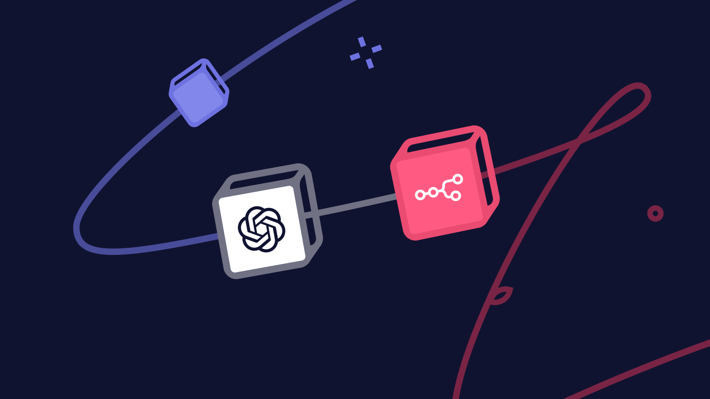

## The Problem

A teammate sends you a 40-page document and asks, *"When does this renew?"* The answer is in there — but finding it means scrolling, searching, and skimming for twenty minutes. Every document, every time.

---

## Build an Agent That Finds the Answer for You

Build a **Document Q&A Agent**: upload a document, ask a question, and get a short answer that points to the exact part of the document it came from. If the answer isn't there, the agent says so instead of guessing.

You'll build it in **n8n**, where you connect blocks on a screen instead of writing code:

**Question + file → turn the file into text → AI writes the answer → answer comes back**

Here's what your finished agent will look like — just four blocks:

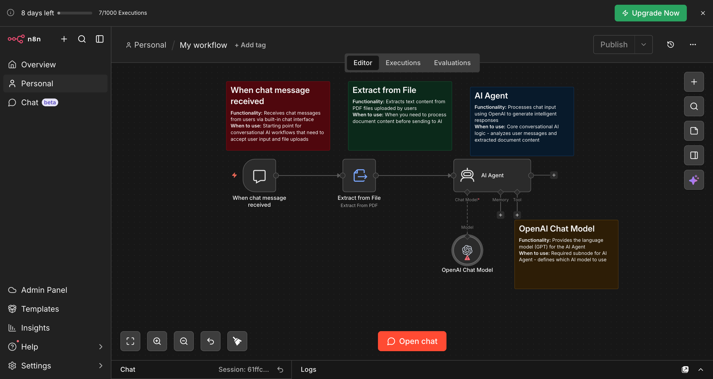

By the end of this lab, you'll have a working agent, know how to write the instructions that control it, and give it a web address other apps can use.

---

## Table of Contents

- [Prerequisites](#prerequisites)
- [Two Ways to Build This](#two-ways-to-build-this)
- [Import the Workflow](#import-the-workflow)
- [Test Your Agent](#test-your-agent)
- [Let Other Apps Talk to Your Agent](#let-other-apps-talk-to-your-agent)
- [Troubleshooting Steps](#-troubleshooting-steps)

---

## Prerequisites

✅ An **n8n account** — sign up free at n8n.io. The cloud version works fine. [Follow this setup guide](../../../Cohort%209/week%200%20%20-%20foundation/n8n-loginSetup/Doc.md) to create your account.

✅ An **OpenAI API key** — this is what lets n8n use OpenAI's AI. Go to platform.openai.com, create an account, and generate a key under **API Keys**. [Watch this video](https://youtu.be/J3y1dOpz9R4?si=fBqIP0TTShbH_6-n) for a walkthrough.

✅ The **ready-made workflow file** — [download n8n-workflow.json](https://pragyaallc-my.sharepoint.com/:u:/g/personal/sachin_parmar_legalgraph_ai/IQCxwBn3DSxjTrx2_WxRoFTeAQ1ni4W0bV2cKybboqYJYC8?e=JQfaYk)

✅ The **sample document** — [download the sample contract](https://pragyaallc-my.sharepoint.com/:b:/g/personal/sachin_parmar_legalgraph_ai/IQC2WQJhhIuyRq5JrVY13FwNAdwS4M5gB5w-qzBAm9V4mRQ?e=XyvLU4) (a made-up vendor agreement prepared for this lab)

> ✓ Tip. n8n gives you a small amount of free OpenAI credit to start. It won't last through all the labs. Add $5 of credit to your OpenAI account now so you don't run out mid-session.

---

## Two Ways to Build This

| | **Import the Workflow** | **Build from Scratch** |
|---|---|---|
| **Best for** | Getting up and running fast | Understanding what every block does |
| **Time** | ~5 minutes | ~25 minutes |
| **What you do** | Import a ready-made file and add your key | Add and connect each block yourself |

Both give you the same working agent. If this is your first time, **build from scratch** — adding each block yourself is how it really sinks in.

👉 **[Build from Scratch →](./build-from-scratch.md)** — then come back here to [Test Your Agent](#test-your-agent).

---

## Import the Workflow

**Step 1. Create a new workflow.**

Open n8n and click **"Create Workflow"** in the top right. You'll land on a blank canvas.

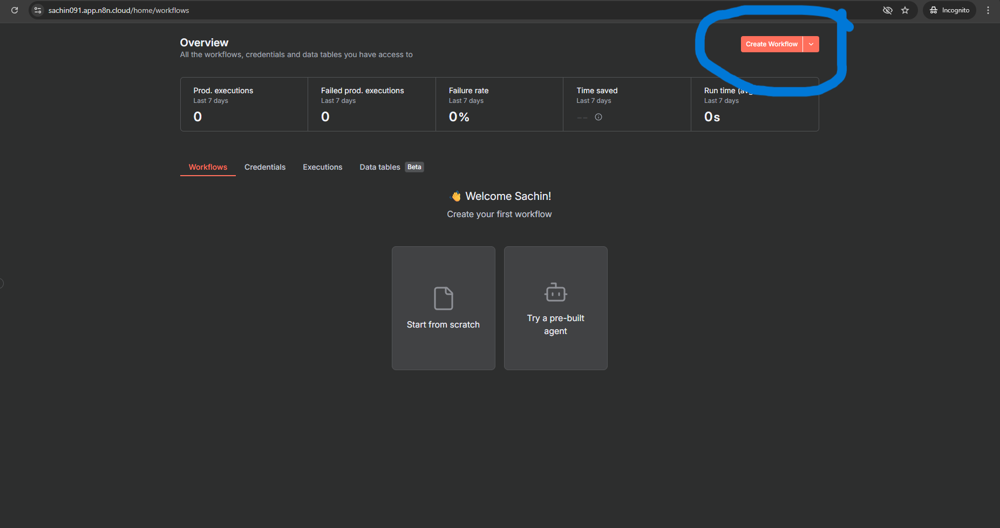

**Step 2. Import the ready-made file.**

Click the **three-dot menu (⋮)** at the top, select **"Import from File"**, and upload `n8n-workflow.json`. Your canvas fills up with all the blocks, already connected.

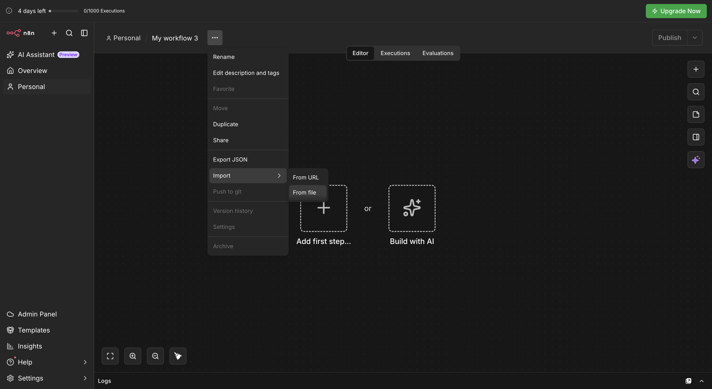

**Step 3. Check the connections.**

Every block should be joined by a line. If one isn't, drag from the small circle on its right edge to the next block.


> ✓ Tip. If your agent ever stops responding, check the connections first. One missing line stops the whole workflow without any warning.

**Step 4. Add your OpenAI key.**

Click the **"OpenAI Chat Model"** block. Click **"Credential"** → **"Create New Credential"** → paste your API key → **Save**.


> ★ Your API key is linked to your OpenAI billing. Treat it like a password — never share it or paste it anywhere public.

---

## Test Your Agent

Click **"Open Chat"**, upload the sample document, and try these one at a time:

*"What is this document about?"*

*"What are the key terms I should know before signing?"*

*"What happens if either side wants to end the agreement early?"*

*"Does this renew automatically?"*

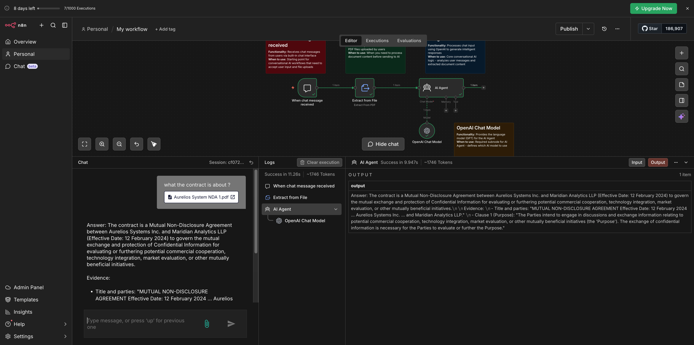

Notice how every answer follows the same format and points to the exact section it came from. That's not luck — it's your System Message at work.

### Now try to break it 🤔

Ask something that's *not* in the document:

*"What's the CEO's phone number?"*

The agent should reply: *"This information is not mentioned in the document."*

> **Why doesn't it make things up?** Because you gave it two things: the full document, and a rule to answer only from it. Keeping an AI tied to a specific source like this is called **grounding**. It's one of the most important ways to make AI answers trustworthy.

### Change the instructions, see what changes

Open the **AI Agent** block, swap your System Message for the **Weak** version from [Build from Scratch, Part 4](./build-from-scratch.md#part-4-tell-the-agent-how-to-behave), and ask the same questions again. Then switch back to the **Strong** version.

Same model, same document, same questions — very different answers. That's how much the instructions matter.

---

## Let Other Apps Talk to Your Agent

Right now, the only way to reach your agent is through n8n's built-in chat window. That's fine for testing — but in Lab 1.2 you'll build your own app, and it needs a way to send a document and a question to this agent.

The fix is a **Webhook**.

Think of a webhook like a doorbell. Your app rings it, the agent opens the door, takes the document and question, works out an answer, and hands it back.

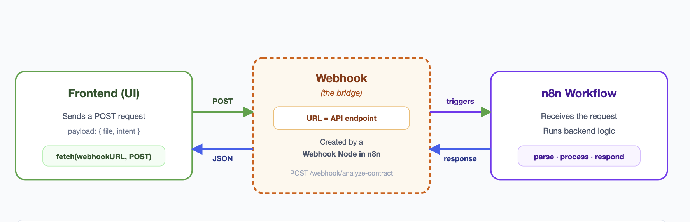

> Your workflow is saved in n8n's cloud, not on your computer. Close the browser, come back days later — everything is exactly where you left it.

### Step 1: Remove the chat window trigger

Click the **"When Chat Message Received"** block and press **Delete**. It only listens to n8n's own chat window — your app can't reach it.

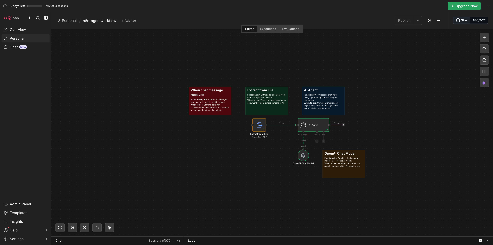

> Don't worry — you're only removing the starting point. You'll replace it next.

### Step 2: Add the Webhook pair

Webhooks come as a pair:

| Block | What it does |
|---|---|
| **Webhook** | Receives the document and question from your app |
| **Respond to Webhook** | Sends the agent's answer back to your app |

Click **(+)**, search for **"Webhook"**, and add it. Then search for **"Respond to Webhook"** and add that too.

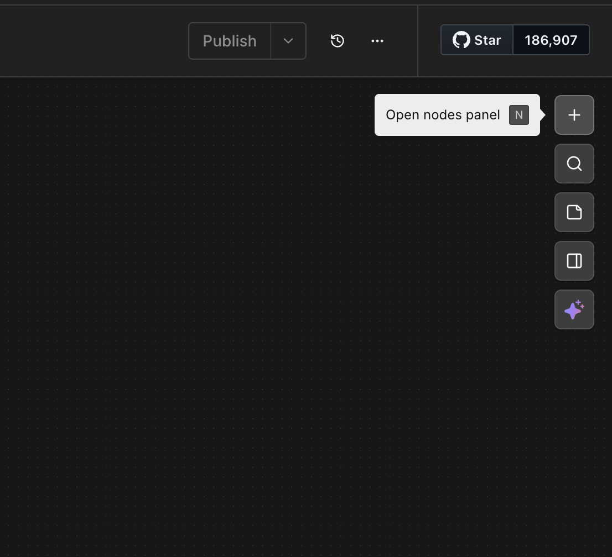

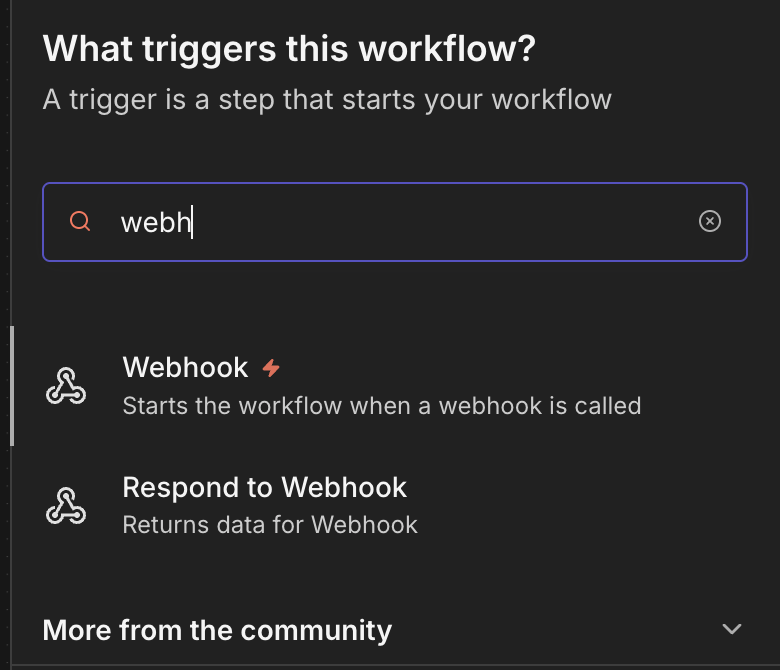

### Step 3: Connect the Webhook to Extract From File

Drag a line from the **Webhook** to **Extract From File** — the same spot where the chat trigger used to be.

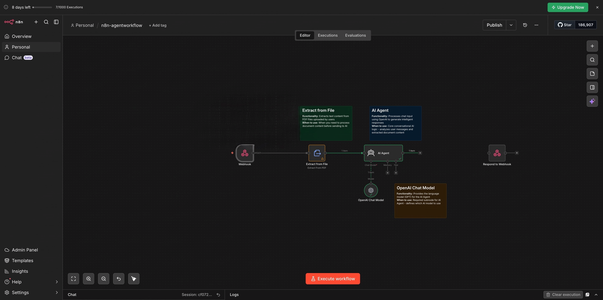

### Step 4: Set up the Webhook

Click the **Webhook** block and make these four changes:

1. **HTTP Method → POST.** This means "I'm sending you something" rather than "I'm asking you for something." Like dropping a letter in a mailbox instead of checking it.
2. **Respond → "Using 'Respond to Webhook' node".** This tells n8n to wait for the agent to finish before replying. Otherwise your app gets an empty reply instantly.
3. **Add Option → Field Name for Binary Data.** This labels the uploaded document so the next block knows where to find it.
4. **Add Option → Allowed Origins (CORS) → `*`.** By default, browsers block a web page from sending data to a different website. This setting says "it's okay, let my app reach this address."

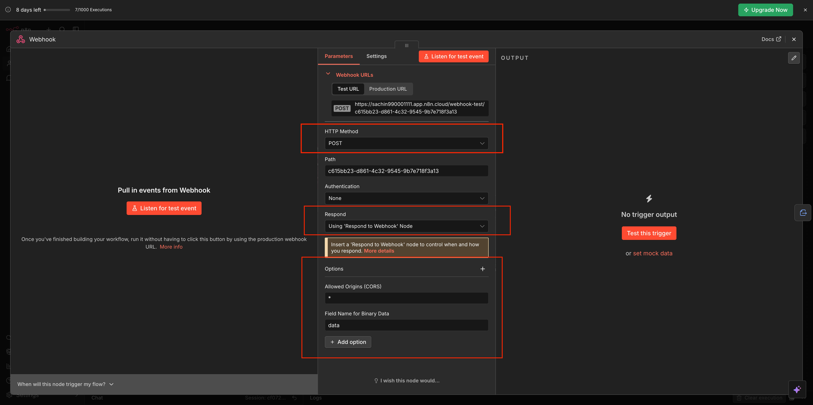

> If your app ever stops getting answers and n8n shows no activity, setting 4 is almost always the reason.

Once saved, you'll see your agent's web address. It looks like this:

```
https://your-instance.app.n8n.cloud/webhook-test/your-unique-id
```

Copy it and keep it handy — you'll need it in Lab 1.2.


### Step 5: Connect the AI Agent to Respond to Webhook

**Respond to Webhook** is the reply — if the Webhook is the doorbell, this is you handing the answer back to whoever rang it.

Drag a line from **AI Agent** to **Respond to Webhook**. Your workflow now reads:

**Webhook → Extract From File → AI Agent → Respond to Webhook**


Check every line before you move on. One missing connection and nothing comes back.

🎉 **Your agent now has its own web address. Any app can send it a document and a question, and get an answer back.**

---

## What You Learned

- **Every agent starts with a trigger.** It decides *when* the agent wakes up. You started with a chat window, then swapped it for a webhook so any app can reach it.
- **AI needs things in a form it can read.** A file isn't text until something opens it up. Preparing the input is a step you'll see in almost every agent.
- **The AI Agent is the coordinator, the model is the brain.** Keeping them separate means you can swap the model anytime.
- **The System Message is where your product decisions live.** Role, rules, tone, format — all in plain text. Same model, different instructions, completely different product.
- **Grounding makes answers trustworthy.** Give the AI the source and tell it to stay inside it.

---

## 🔧 Troubleshooting Steps

Check here before asking for help.

---

**OpenAI credits exhausted**

Your agent stops responding with an error like `429 - You exceeded your current quota` or `insufficient_quota`. This means your OpenAI account has no remaining credits.

Fix: go to **platform.openai.com → Billing → Add payment method** and add $5 of credits. Your API key stays the same — just retry in n8n once billing is active.

> ✓ Tip. n8n gives you a small OpenAI credit when you start. It's enough for a few test runs but won't last through all the labs. Add credits now and you won't have to think about it mid-session.

---

**"model_not_found" or "You do not have access to this model"**

Your OpenAI account can't use that model yet. Go to **platform.openai.com → Settings → Limits** to see which models you can use. If `gpt-5-mini` is blocked, pick `gpt-4.1-mini` instead.

---

**The agent doesn't respond at all**

Check that every block is connected with a line. One broken connection stops the whole workflow without any warning.

---

## What's Next

You built an agent on a visual canvas. In Lab 1.2, you'll build a real app with **Claude Code** and connect it to this agent using the web address you just copied.

Save this workflow — you'll come back to it.

[Go to Lab 1.2: Build and Connect Your Prototype with Claude Code →](../1.2%20-%20claude-prototype/readme.md)