# Build the Agent from Scratch

In this path, you add each block yourself, connect it, and see what it does before moving on. By the end, you'll know not just *how* the agent works, but *why* it's built this way.

Open n8n, click **"Create Workflow"**, and let's go.

---

## Table of Contents

- [Part 1: Give Your Agent a Front Door](#part-1-give-your-agent-a-front-door)
- [Part 2: Help the AI Read the File](#part-2-help-the-ai-read-the-file)
- [Part 3: Add the Brain](#part-3-add-the-brain)
- [Part 4: Tell the Agent How to Behave](#part-4-tell-the-agent-how-to-behave)
- [Part 5: Connect the AI Model](#part-5-connect-the-ai-model)

---

## Part 1: Give Your Agent a Front Door

Your agent needs a way to know *when* to start working. Without that, it just sits there. In n8n, the thing that says "start now" is called a **Trigger**.

Since people will talk to this agent through a chat window, you'll use a **Chat Trigger** — it wakes the agent up every time someone sends a message.

1. Click **"Add Node"** on the canvas.

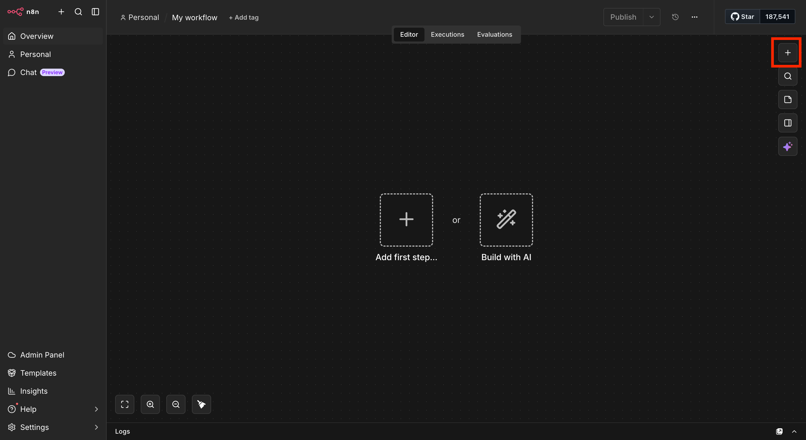

2. Search for **Chat Trigger** and select it.

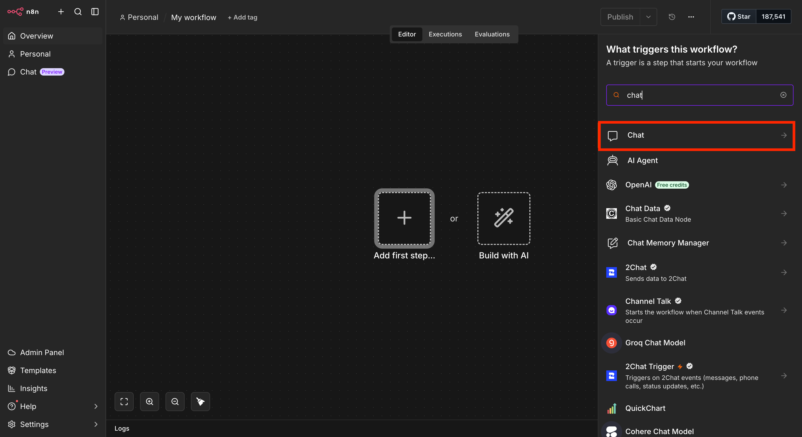

3. Choose **"On a new chat message"** as the event.

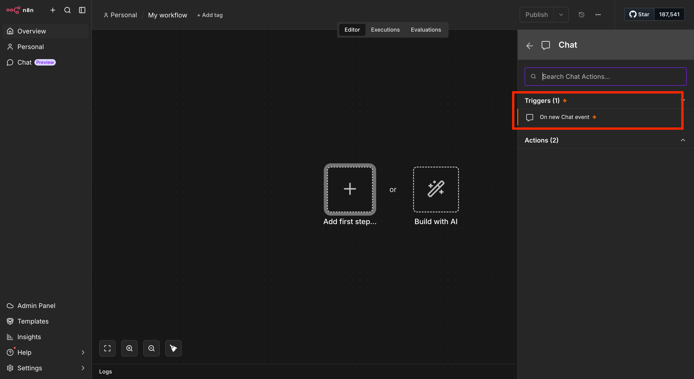

> Triggers can listen for lots of things — a new email, a form submission, a set time every morning. The trigger you pick decides *when* your agent gets to work.

4. Right now the chat only accepts text, but you want people to upload a document too. Inside the Chat Trigger, click **"Add Field"** and turn on **"Allow File Upload"**.

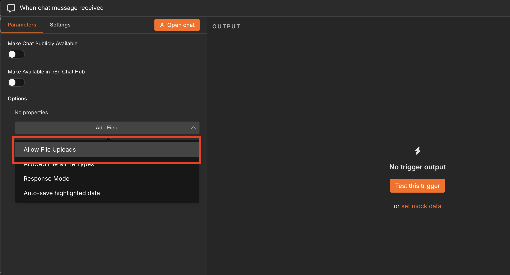

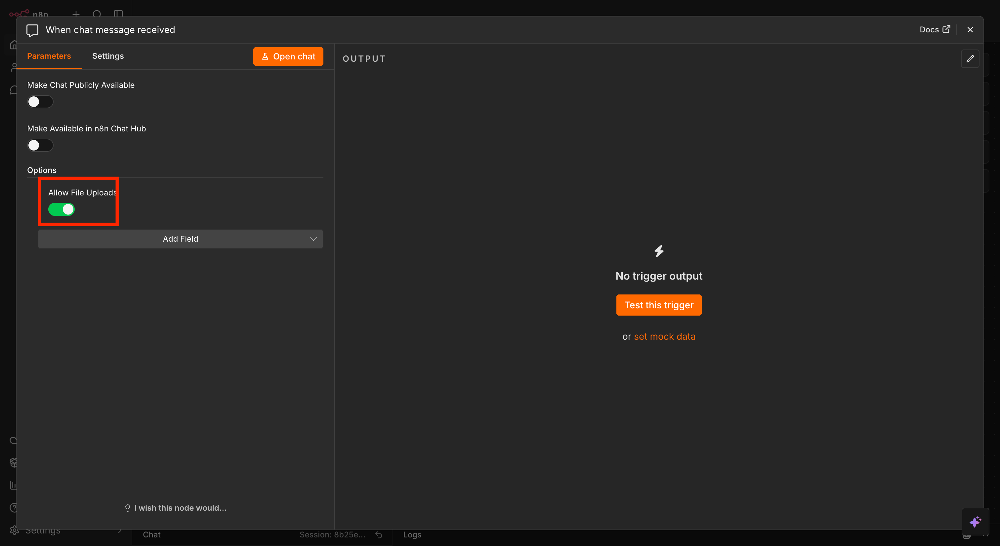

5. Let's make sure it works. Click **"Open Chat"** at the bottom of the canvas, upload the sample document, and type any question.

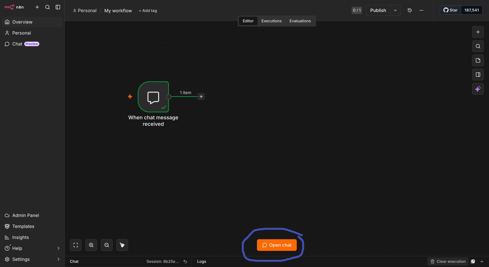

6. Click the Chat Trigger block. You'll see what it received: your question, and the file.

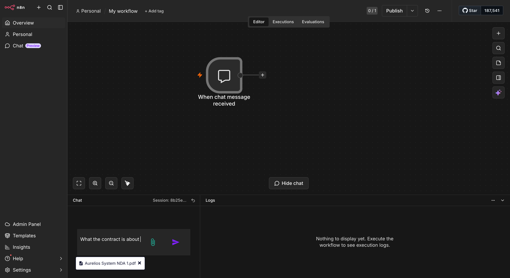

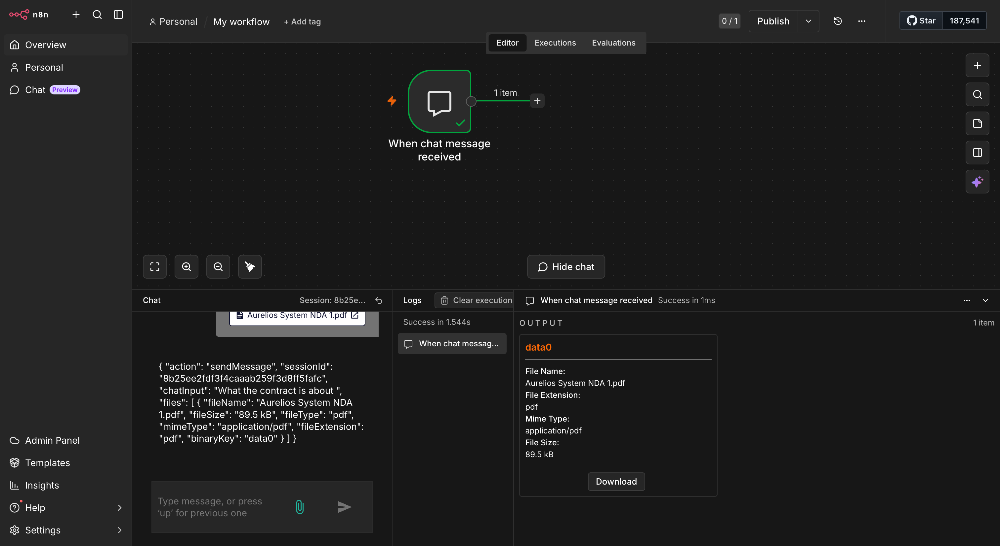

Notice something? Your question shows up as readable words. The file doesn't — it shows up as a block of data, not text.

That's a problem. The AI can only read words. It can't open a file on its own.

---

## Part 2: Help the AI Read the File

Think of the uploaded file as a sealed envelope. The Chat Trigger hands you the envelope — but the AI needs the letter inside. The **Extract From File** block opens the envelope and pulls out the text.

1. Click **"Add Node"**, search for **Extract From File**, and choose **"Extract from PDF"**.

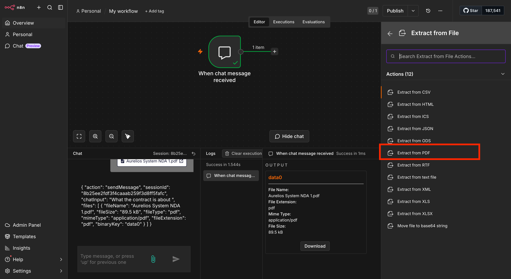

2. Inside its settings, find **"Input Binary Field"** and type `data0`.

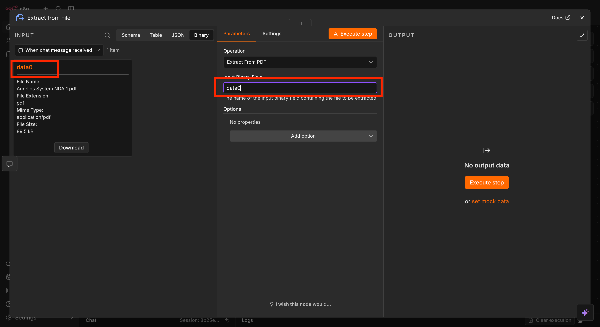

> `data0` is simply the name n8n gives the first file someone uploads. You're telling this block *which* file to open. A second file would be `data1`, and so on.

3. Test it. Open the chat again, upload the document, and send a question. Then click the Extract From File block.

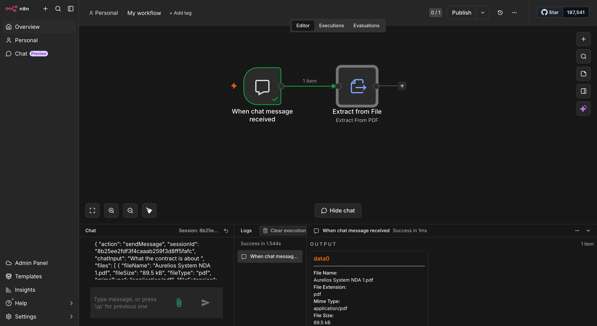

You should see the full text of the document — every section, every paragraph — as readable words.

> ✓ See text? You're good to continue. See an error? Check that the field says exactly `data0` and that you uploaded a PDF.

---

## Part 3: Add the Brain

You now have the question *and* the document text. Next, you need something that reads both and writes an answer. That's the **AI Agent** block.

The AI Agent is like a project coordinator. It doesn't do the thinking itself — it gathers everything (the question, the document, your instructions) into one package and hands it to the AI model to answer.

1. Click **"Add Node"**, search for **Agent**, and select it. Connect it to the Extract From File block.

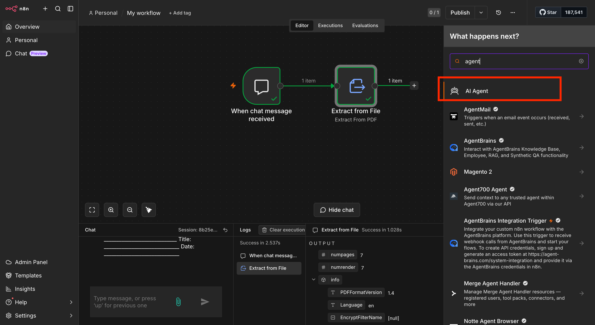

2. Inside the Agent settings, set **"Source for Prompt (User Message)"** to **"Define Below"**.

3. Click **"Add Option"** and add a **System Message** field.

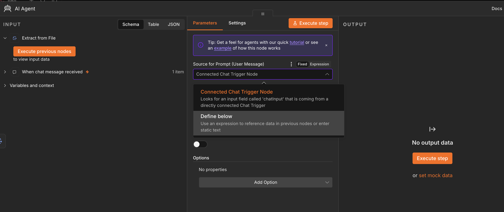

You now have two boxes to fill in. Before you do, here's the difference between them — it's the most important idea in this lab:

| | **System Message** | **User Message** |
|---|---|---|
| **What it is** | The agent's standing instructions — its role, rules, and how to answer | The question someone asks |
| **Who writes it** | You, the person building the agent | The person using the agent |
| **How often it changes** | Rarely — it stays the same for every conversation | Every time someone asks something new |
| **Example** | "Only answer from the document. Always show where you found the answer." | "When does this agreement renew?" |
| **Think of it as** | The job description you give a new hire | The task you give them on a given day |

4. In the **User Message** box, paste this:

```
User Query: {{ $('Chat Trigger').item.json.chatInput }}

File Context: {{ $('Extract From File').item.json.text }}
```

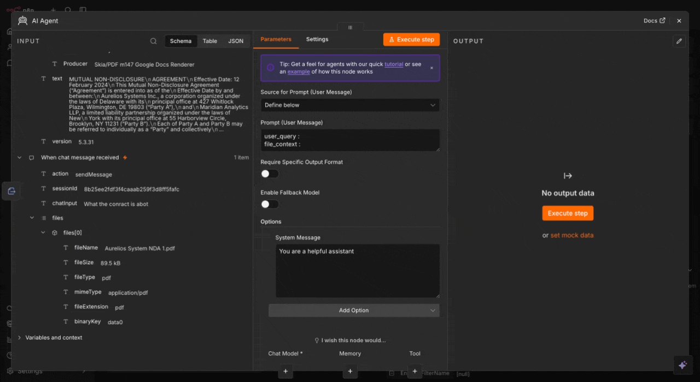

> **What does this do?** The parts inside `{{ }}` are placeholders. n8n fills them in automatically each time. The first one pulls in what the person typed. The second pulls in the document text. So the AI always sees the question and the full document side by side.

---

## Part 4: Tell the Agent How to Behave

Imagine starting a new job and nobody tells you your role, your responsibilities, or the rules. You'd guess. Sometimes you'd guess right. Sometimes you'd confidently get it wrong.

An AI without clear instructions does the same thing. It will happily answer a question even when the answer isn't in the document — and it will sound sure about it.

For a document assistant, that's the worst outcome. A made-up renewal date or an invented clause is worse than no answer at all. The **System Message** is how you prevent that. It's plain text, no code — and it's the single biggest lever you have over how your agent behaves.

### See the difference good instructions make

| | **Weak** | **Better** | **Strong** |
|---|---|---|---|
| **Instructions** | `You are a document assistant. Answer questions about the document.` | `You are a document assistant. Only answer using the document provided. If the answer isn't there, say so.` | The full Role / Instructions / Guardrails / Response Format below |
| **What happens** | Answers confidently even when the answer isn't in the document. No consistent format. | Stops guessing — but answers vary in length and style, and it may wander into opinions when the wording is unclear. | Every answer follows the same format, every tricky case has a planned response, and the agent stays inside the document. |
| **What's missing** | Role, rules, format, what to do when stuck | Format, tone, what to do when wording is unclear | Nothing — this is what you'll paste |

### Write the System Message

In the **System Message** box, paste this:

```
Role
You are an AI Document Assistant.

Instructions
1. Always use the document content provided before answering.
2. Search for the relevant sections based on the user's question.
3. Use only the most relevant content from the document.
4. If more than one section matches, use the most relevant one.
5. Answer directly and briefly. Do not explain how you found the answer.
6. If the answer is not in the document, say: "This information is not mentioned in the document."

Guardrails
1. Never make assumptions.
2. Never give legal, financial, or professional advice.
3. Never answer without checking the document first.
4. If the wording in the document is unclear, say: "This may need review by an expert."
5. Never say things like "I searched the document", "Based on my analysis", or "I extracted..."

Response Format
Answer: [Direct answer]
Evidence: [The exact section or sentence from the document]
```

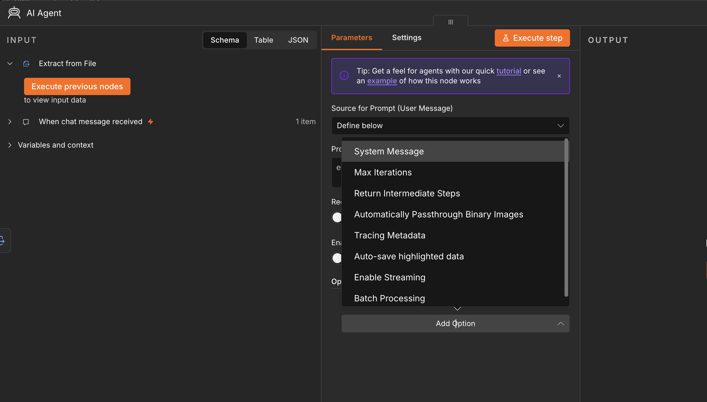

> **Use this shape for every agent you build.** The document is just today's example. Whether you're building a support assistant, a meeting-notes summarizer, or an HR policy helper, strong instructions always have the same four parts: **who the agent is**, **what it should do**, **what it must never do**, and **what its answers should look like.**

---

## Part 5: Connect the AI Model

The AI Agent knows how to organize the work. Now it needs an AI model to actually read and answer. You'll use one from OpenAI.

1. Click **"Add Node"**, search for **Language Model**, and choose **"OpenAI Chat Model"**. Attach it to the bottom of the AI Agent block (where it says **Chat Model**).

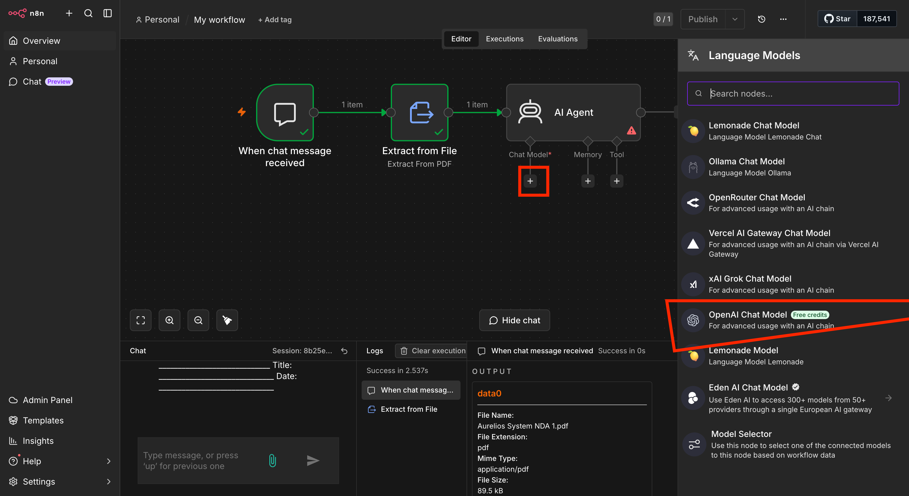

> **Why is the model a separate block?** So you can swap it. Today it's OpenAI. Tomorrow you could plug in a different AI provider without changing anything else. Like changing the battery in a device instead of buying a new device.

2. Open the **Model** dropdown and select **`gpt-5-mini`**.

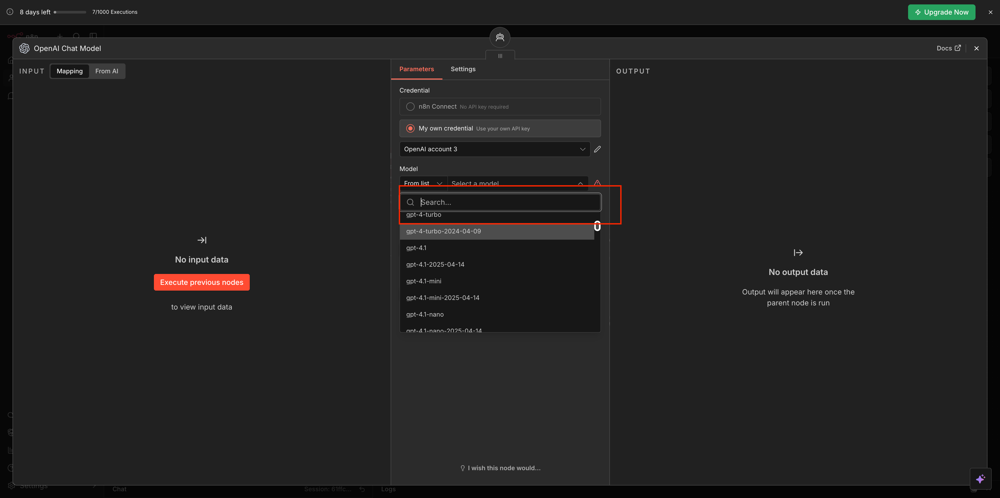

| Model | Good for | Cost |
|---|---|---|
| **gpt-5-mini** | Answering questions about a document — this lab | Low |
| **gpt-4.1-mini** | Use this if gpt-5-mini isn't available on your account | Lower |
| **gpt-4.1-nano** | Simple documents when cost matters most | Lowest |

> Picking a model is always a trade-off between how smart it is, how fast it is, and how much it costs. This agent has a narrow job — find the right part and answer — so a smaller, cheaper model does it well.

3. Add your OpenAI key: click **"Credential"** → **"Create New Credential"** → paste your API key → **Save**.


> ★ **Copy your API key somewhere safe before you paste it here.** Once saved in n8n, you can't view it again. If you lose it, you'll need to create a new one at platform.openai.com.

> ★ Your API key is linked to your OpenAI billing. Treat it like a password — never share it or paste it anywhere public.

Your agent is built. Your canvas should look like this:


Head back to the main lab to test it: [Test Your Agent →](./README.md#test-your-agent)

---

[← Back to Lab 1.1](./README.md)
