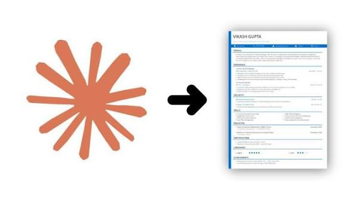
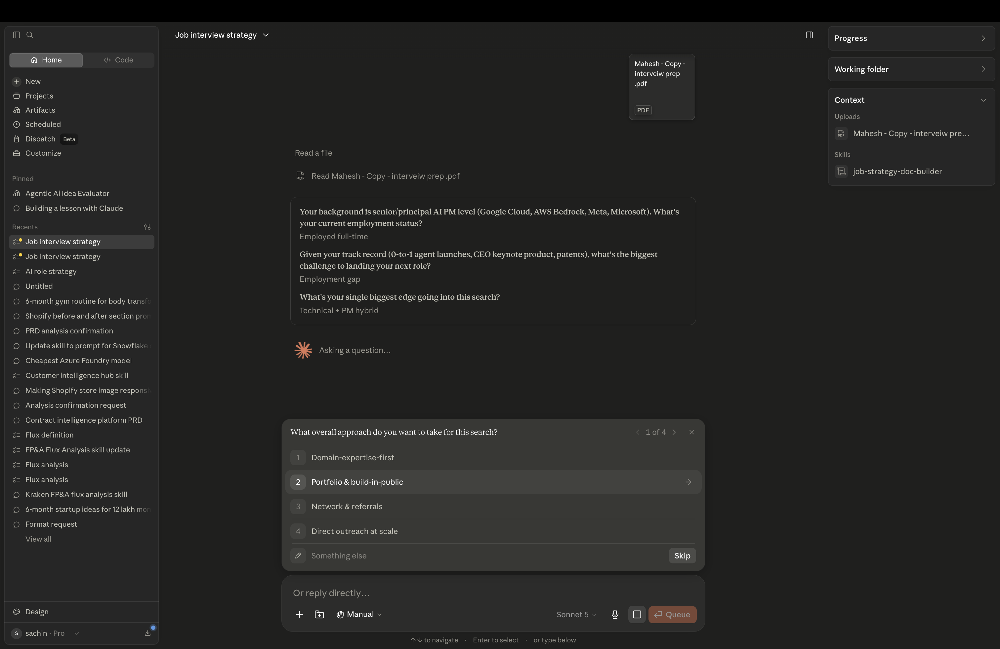
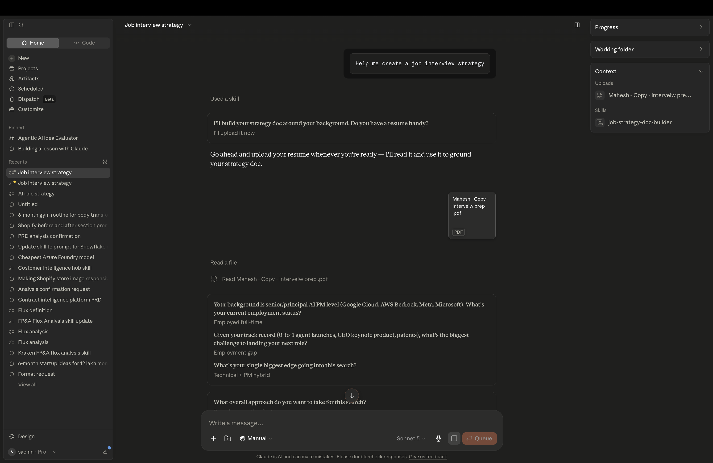
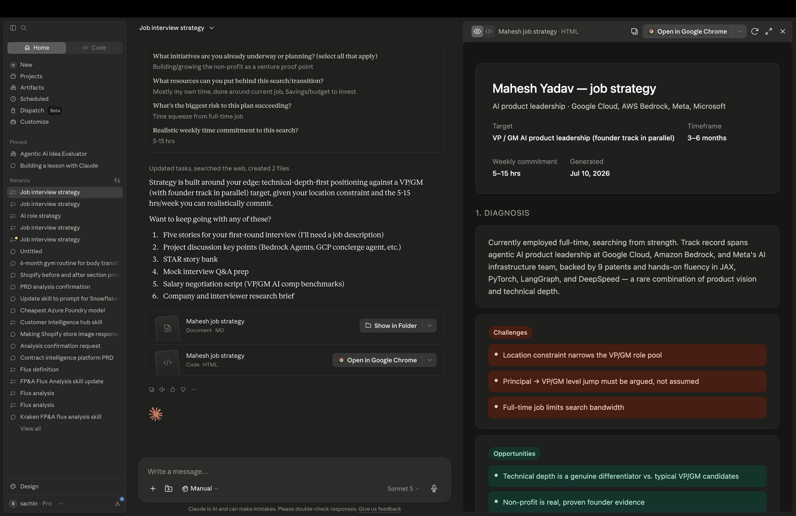

# Lab 01 — Create a Job Interview Strategy with Claude

> **Workshop:** Interview Bootcamp
> **Level:** Beginner
> **Time:** ~30 minutes

---



---

## What You Will Build

Most people walk into interviews hoping for the best. After this lab, you will walk in with a **plan**.

By the end of this session you will have a personalized **Job Interview Strategy document** — built in collaboration with Claude. It covers your personal pitch, a ready-to-use STAR story bank, sharp talking points for your key projects, and a checklist for the day of the interview.

No more blank-page anxiety. Just a clear, structured strategy you can actually use.

---

## Why This Approach Works

A strong interview is not about memorizing answers — it is about telling your story in a way that resonates. The problem is that most people never take the time to structure their experience before they walk into the room.

Claude acts as your thinking partner here. It asks you the right questions, pulls out the strongest parts of your background, and organizes everything into a format you can review, edit, and practice from. One focused session can do what weeks of scattered prep usually cannot.

---

## Before You Start

You will need three things:

**1. Download the Interview Strategy Skill**
This is the custom Claude skill that powers the whole lab.
[Download the Skill here](https://pragyaallc-my.sharepoint.com/:t:/g/personal/sachin_parmar_legalgraph_ai/IQCiGJn1B-xzR680r6_KQ04oAYB1LFFxc0NbdvGrGW-T6OM?e=QgbQOw)

**2. Install the Skill in Claude**
New to adding skills? Follow this quick guide:
[How to add a skill to Claude](https://github.com/sachin0034-tech/MLAI-community-labs/tree/main/Cohort-Labs/Cohort%209/week%200%20%20-%20foundation/how-to-add-skills-to-claude)

**3. Have your resume ready**
A plain text paste or PDF works. The more detail you share, the better the output.

---

## Step-by-Step Guide

### Step 1 — Open the Claude Desktop App

Launch Claude and make sure you are in a fresh conversation. Check that the skill indicator is active — you should see the Interview Strategy skill listed.

---

### Step 2 — Confirm the Skill is Loaded

Type `/skills` in the chat or check the toolbar. If the skill is not showing, revisit the install guide linked above before continuing.

---

### Step 3 — Kick Things Off

### Note : Add your resume as context

Start the session with this prompt:

```
Help me create a job interview strategy
```

Claude will confirm the skill is running and begin the intake conversation.



---

### Step 4 — Answer Claude's Questions

This is the most important step. Claude will guide you through a short intake — think of it as a quick coaching session before the real work begins. Expect questions like:

- What role and company type are you targeting? (startup, enterprise, FAANG, etc.)
- Can you share your resume or a summary of your experience?
- What are your 2–3 strongest projects or moments from your career?
- What interview format are you preparing for? (behavioral, technical, case, or a mix)

**Tip:** Do not rush this part. The richer your answers, the sharper the strategy document Claude produces.



---

### Step 5 — Review Your Strategy Document

Once the intake wraps up, Claude generates your `strategy.md` file. Here is what is inside:

| Section | What You Get |
|---|---|
| Role Positioning | Your personal pitch and value proposition tailored to the target role |
| STAR Story Bank | 5 structured behavioral stories (Situation, Task, Action, Result) |
| Project Discussion Points | Clear, confident talking points for your top 2–3 projects |
| Common Questions + Answers | Draft answers to the questions that almost always come up |
| First-Round Checklist | A practical checklist to run through the morning of your interview |

Read through it carefully. Ask Claude to sharpen anything that does not sound like you.



---

### Step 6 — Go Deeper

The strategy doc is your foundation — now build on it. Here are a few ways to keep the momentum going in the same session:

**Add more STAR stories:**
```
Generate 5 more STAR stories focused on my leadership and conflict resolution experiences
```

**Prep a specific project for a non-technical audience:**
```
Help me explain my recommendation engine project to a non-technical hiring manager
```

**Run a mock interview round:**
```
Ask me 5 behavioral interview questions one at a time and give me feedback on each answer
```

---

## What You Walk Away With

- A structured interview strategy document in Markdown — yours to edit and reuse
- A STAR story bank you can update before every interview
- Confident talking points for your key projects
- A first-round prep checklist so nothing slips through on the day

---

## What's Next

| Lab | Topic |
|---|---|
| Lab 02 | Tailor your strategy for a specific job description |
| Lab 03 | Mock interview simulation with real-time Claude feedback |
