# Claude → AWS OTel Pipeline: Complete Beginner's Setup Guide

**Account used while building this guide:** 174683182856 ("Muktida Pandey") · **Region:** `eu-north-1` (Stockholm) · **Org:** Pragyaa (Claude Team/Enterprise)

## Who this is for

This guide assumes you have **never used AWS before** and have **never touched Claude Code admin settings before**. Every single click is spelled out. Every screenshot shows you the *actual* screen you should be looking at — and for every screen where you're about to create something, you'll see it **twice**: once completely blank/empty (so you know you're in the right place before you've touched anything), and once filled in with the real values you should type (so you can check your work character by character).

If you've never opened the AWS Console before, that's fine — Part A, Step 0 below walks you through logging in and finding your way around before anything else happens.

Set aside **2–3 hours** the first time you do this. It is not technically hard, but there are ~20 small resources to create in a specific order, and AWS's console has a lot of unfamiliar buttons if this is your first time in it. Go slowly, check every screenshot against your own screen before clicking "next" or "create," and you will not need to redo anything.

## What you're building

Claude Code (the coding assistant your developers run on their laptops) can optionally send anonymous usage data — which tools got used, how many tokens got spent, which skills ran — to a destination you control. By default it sends nothing anywhere. This guide turns that on and builds a small pipeline so that data ends up somewhere you can query it and build dashboards from it.

Here is the path the data takes, left to right:

```
Developer's laptop (Claude Code)
        │  sends data over the internet (OTLP protocol, protected by a secret token)
        ▼
A small always-on program in AWS called a "collector"
        │  (runs on a service called ECS Fargate — think of it as a tiny always-on computer AWS manages for you)
        ▼
CloudWatch (AWS's logging service) — two destinations at once:
        │
        ├──▶ Log group "/claude-code/metrics-logs"  ──▶  a small program (Lambda) ──▶  S3 (file storage) ──▶  Glue + Athena (so you can run SQL queries)
        │
        └──▶ Log group "/claude-code/metrics" (a special format AWS turns into graphable numbers automatically)
```

You will build every box in that diagram, one at a time, in the order they appear in this guide. By the end, you'll be able to run a SQL query in Athena and get back real numbers about how your team is using Claude Code.

## Prerequisites — check these before you start

- **An AWS account** with permission to create resources (S3, IAM, ECS, Lambda, CloudWatch, Glue, Athena, EC2 security groups). If you're using a company AWS account, ask whoever manages it to confirm you have "Administrator" or equivalent access, or you'll hit permission errors partway through.
- **This guide assumes your AWS account cannot create load balancers or attach a fixed IP address** (common on sandboxed/training/free-tier accounts — Step A0 shows how to check). A more heavily provisioned account can still follow every step here; it just won't need the workarounds this guide is built around.
- **A Claude Team or Enterprise plan, with admin access** — meaning your account has the little settings/gear icon and an "Admin settings" area (`claude.ai/admin-settings`). If you can't see that, ask whoever administers your org's Claude workspace to either do Part B for you, or grant you admin access first.
- **No coding or command-line experience required.** Every step in Part A and Part B is done by clicking around in a web browser. Part C (day-to-day operation) mentions one command-line example for testing, which is optional.

---

# Part A — Building the AWS pipeline, completely from scratch

## A0. Log in to the AWS Console and find your way around

If you already know how to log in to AWS and navigate to different services, skip to A1.

1. Go to `https://console.aws.amazon.com` in your browser and sign in with the credentials your AWS administrator gave you.
2. Once logged in, you'll see the AWS Console home page. In the very top-right corner, there is a **region dropdown** (it might say "N. Virginia" or another city name). **Click it and pick the same region for every single step in this guide** — mixing regions is the single most common beginner mistake, because a resource you created in one region is completely invisible from another. This guide uses **Europe (Stockholm) — `eu-north-1`**, but you can pick any region as long as you use the *same one* everywhere.
3. To get to any AWS service (like "S3" or "IAM"), click the **search bar** at the top of the page and type the service's name, then click it in the dropdown that appears. You'll do this repeatedly throughout this guide — each numbered step below tells you exactly which service to search for.

Keep the AWS Console open in one browser tab for all of Part A. You'll open a second tab for Claude's admin settings later, in Part B.

---

## A1. Create the S3 bucket (your data's permanent home)

S3 is AWS's file storage service. Think of a "bucket" as a top-level folder that lives in the cloud. This is where your flattened, query-ready telemetry data will land.

**Step 1 — Go to the S3 bucket list.** Search for "S3" in the AWS Console search bar and click into it. You'll land on a page listing all your buckets (probably empty, if this is a fresh account). Click the orange **Create bucket** button in the top-right.

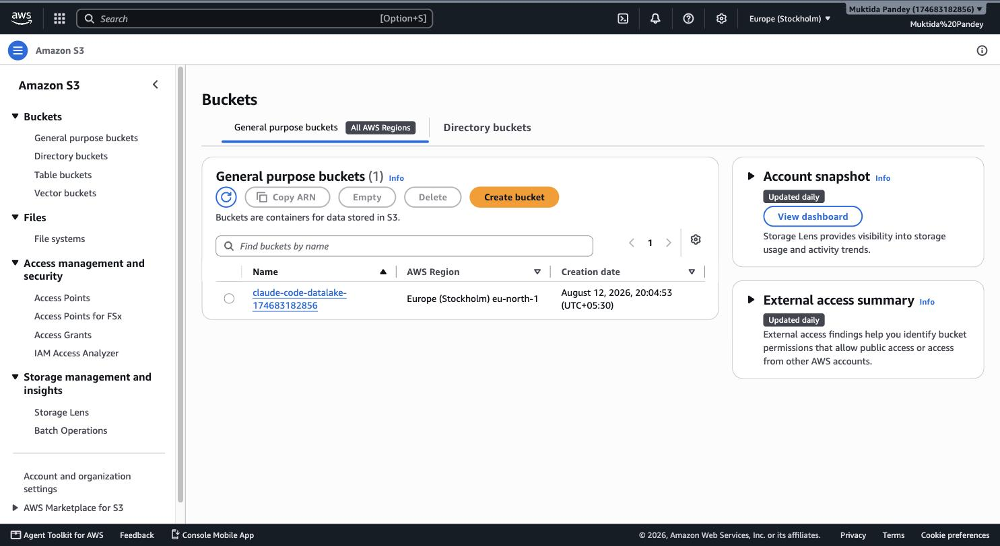

**Step 2 — The blank creation form.** You'll now see a form titled "Create bucket" with an empty "Bucket name" field and a bunch of options below it, all left at their defaults. This is what a brand-new, untouched form looks like — compare it to your own screen to make sure you're in the right place.

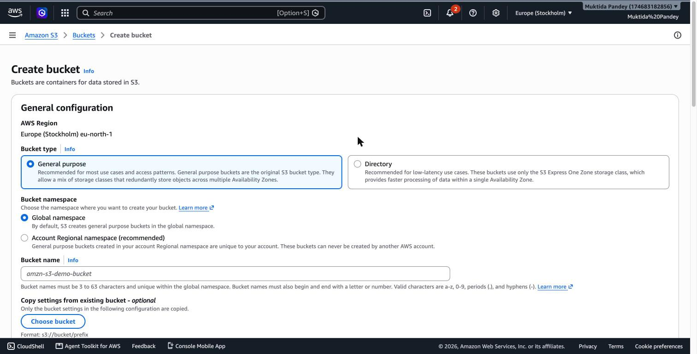

**Step 3 — Type the bucket name.** Click into the "Bucket name" field and type a name in the pattern `claude-code-datalake-<your-account-id>`. Your account ID is the 12-digit number shown in the top-right corner of the console next to your username. Bucket names must be globally unique across *all* of AWS (not just your account), which is why appending your account ID is a reliable way to avoid a "name already taken" error.

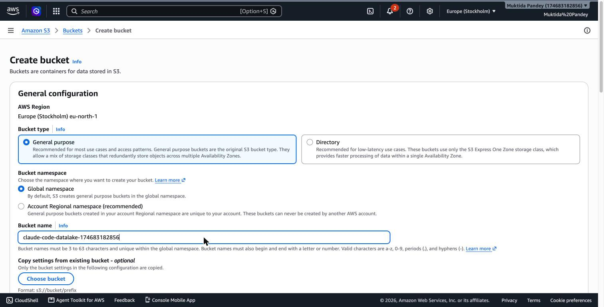

**Step 4 — Leave everything else at its default and scroll down to confirm.** Scroll down through "Object Ownership," "Block Public Access," "Bucket Versioning," and "Default encryption" — leave every one of these exactly as AWS pre-filled it. None of them need to change for this pipeline.

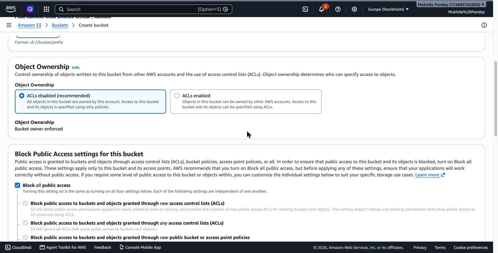

**Step 5 — Click Create bucket** at the very bottom of the page (not shown — it's the same orange button style as Step 1, now at the bottom of the form).

You're done with A1. You don't need to create any folders inside the bucket — a Lambda function you'll build in A9 will automatically create a `flattened/year=YYYY/month=MM/day=DD/` folder structure the first time real data arrives.

---

## A2. Create two IAM roles (permission slips for AWS to use on your behalf)

This is usually the step beginners find most confusing, so slow down here. **IAM** stands for Identity and Access Management — it's where you define "who is allowed to do what" in your AWS account. A **role** is a reusable permission slip that an AWS service (rather than a human) can pick up and use.

You need **two separate roles** for the container you'll run in A5–A6. Do not merge them into one — they serve different purposes:

- **The task execution role** (`claude-otel-collector-exec-role`) — this is the permission slip AWS itself uses to *start* your container: pulling the container image, writing its startup logs, and reading the secret token you'll create in A3. Think of it as "the permissions AWS's own machinery needs to launch your container."
- **The task role** (`claude-otel-collector-task-role`) — this is the permission slip the program *running inside* the container uses once it's up, to call AWS APIs on its own (in this case, writing to CloudWatch Logs). Think of it as "the permissions your own program needs while it's running."

### A2a. Create the task role first

**Step 1 — Go to the IAM roles list.** Search for "IAM" in the console, click "Roles" in the left sidebar. Click the orange **Create role** button.

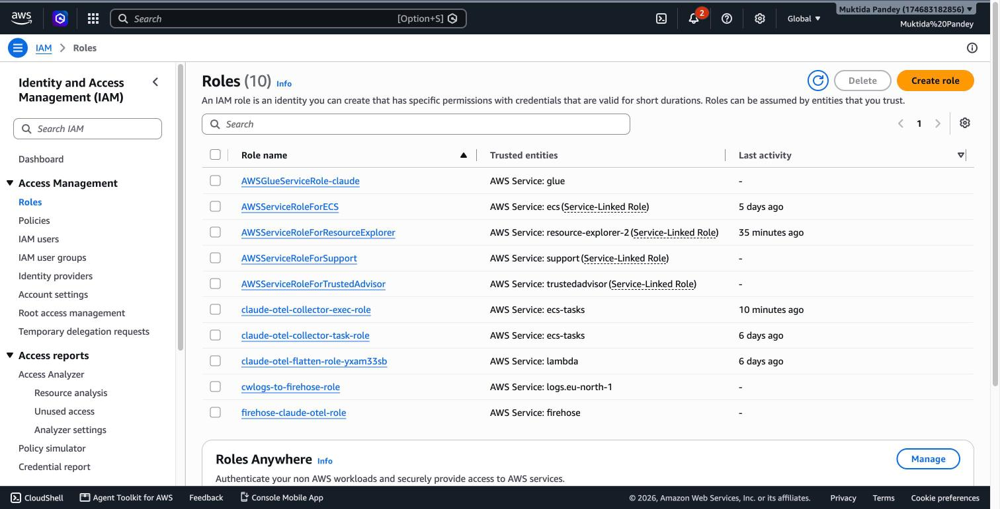

**Step 2 — Choose the trusted entity type (this is the blank starting screen).** You'll see a page asking "Trusted entity type." This determines *who* is allowed to use this role. Nothing is selected yet on a blank page — leave "AWS service" selected (it's the default) and look for the "Use case" search box below it.

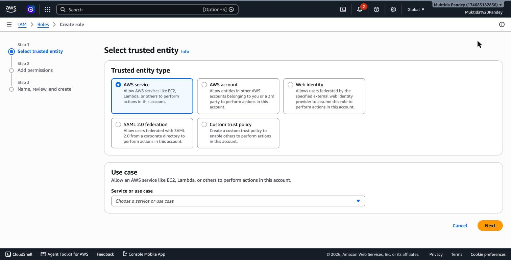

**Step 3 — Search for "Elastic Container Service".** Type it into the "Use case" search box. AWS will filter the list of use cases down as you type.

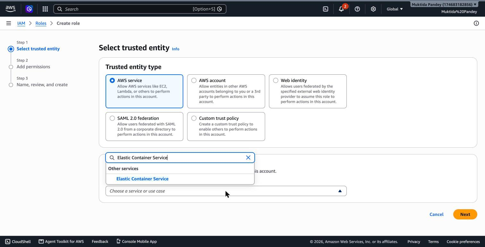

**Step 4 — Select "Elastic Container Service Task".** Under the Elastic Container Service group, you'll see two very similarly-named options. **You want the one labeled "Elastic Container Service Task"** (not "Elastic Container Service" and not "Elastic Container Service Task Execution Role" if that separate option appears too — for this first role specifically, pick "Elastic Container Service Task"). Click its radio button, then click **Next**.

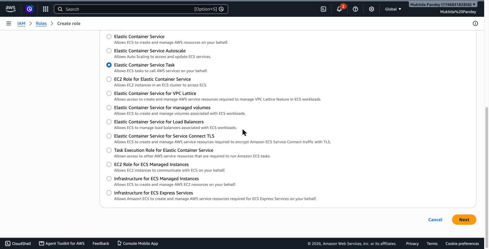

**Step 5 — Choose how to add permissions.** You'll land on a page asking whether to attach an existing AWS-managed policy or write your own. For this role, you're going to write a small custom policy rather than pick one off the shelf, because this role needs a very specific, narrow set of CloudWatch Logs permissions. Look for a "Create inline policy" or similar link/button on this page (AWS's exact wording here shifts between console versions — if you see a plain policy-search list instead, look for a small link near the top like "Create policy" that opens a fresh tab).

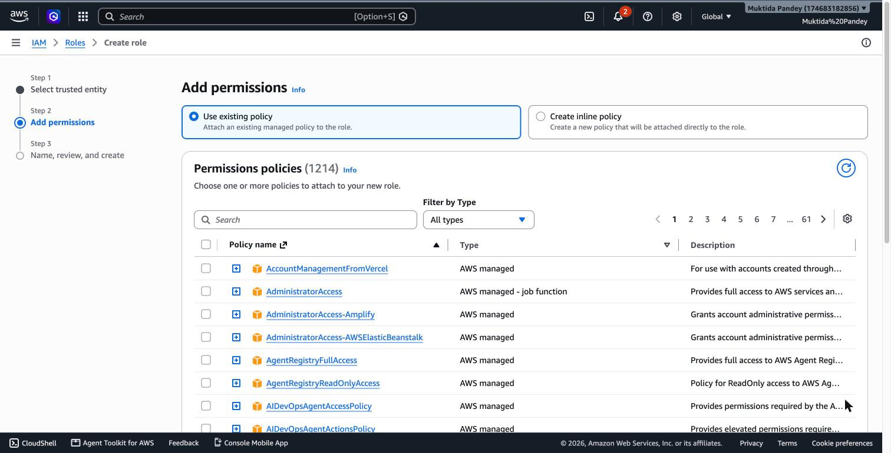

**Step 6 — The blank JSON policy editor.** Once you open the inline/custom policy editor and switch it to the **JSON** tab (there's usually a "Visual" / "JSON" toggle near the top of the editor), you'll see a mostly-empty JSON skeleton like `{"Version": "2012-10-17", "Statement": []}`.

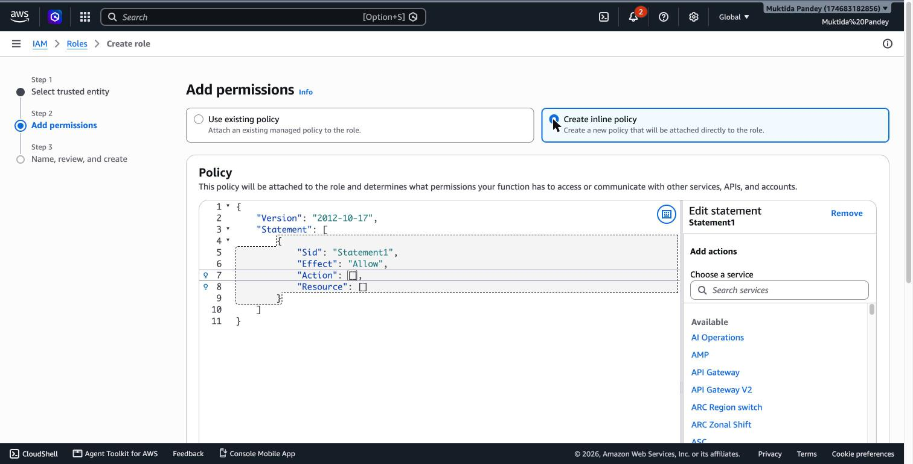

**Step 7 — Replace it with this exact JSON**, then take a screenshot of your own to compare against the one below once you've pasted it in:

```json
{
  "Version": "2012-10-17",
  "Statement": [
    {
      "Effect": "Allow",
      "Action": [
        "logs:CreateLogGroup",
        "logs:CreateLogStream",
        "logs:PutLogEvents",
        "logs:DescribeLogGroups",
        "logs:DescribeLogStreams"
      ],
      "Resource": "*"
    }
  ]
}
```

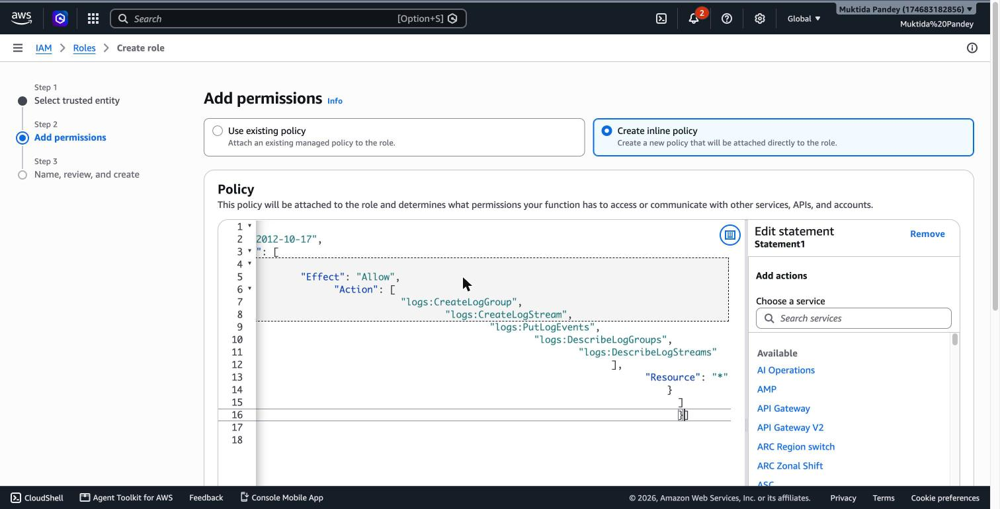

This single policy is enough for *both* the plain-logs pipeline and the metrics pipeline you'll wire up later — the metrics exporter you'll configure in A5 also just writes to CloudWatch Logs under the hood (in a special format CloudWatch auto-converts into graphable metrics), so you do not need any additional `cloudwatch:PutMetricData` permission anywhere.

**Step 8 — Name and review.** Continue through the wizard (naming the inline policy something like `otel-collector-cloudwatch-logs-write`), then on the final "Name, review, and create" page, name the **role itself** `claude-otel-collector-task-role`, scroll down to confirm the trusted entity and permissions look right, and click **Create role**.

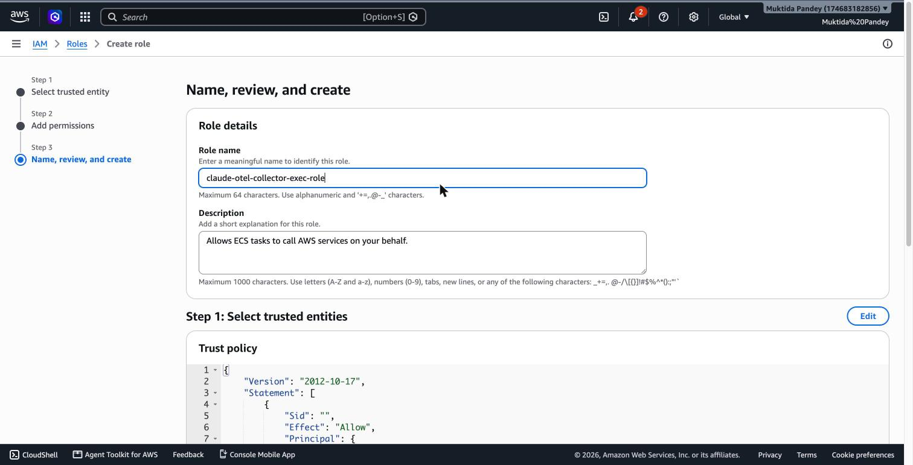

### A2b. Create the task execution role

Repeat the same "Create role" flow (back to the same list from Step 1 above), but this time:

**Step 1 — Choose the trusted entity.** Same as before — "AWS service," search "Elastic Container Service" — but this time select whichever option is specifically about **executing** tasks (commonly labeled "Elastic Container Service Task" is reused here too in some console versions with a task-execution-specific managed policy offered next; if your console shows a distinct "Elastic Container Service Task Execution" use case, pick that one instead).

**Step 2 — Attach an existing AWS-managed policy this time**, rather than writing your own. On the permissions page, use the search box to find **`AmazonECSTaskExecutionRolePolicy`** and check its box.

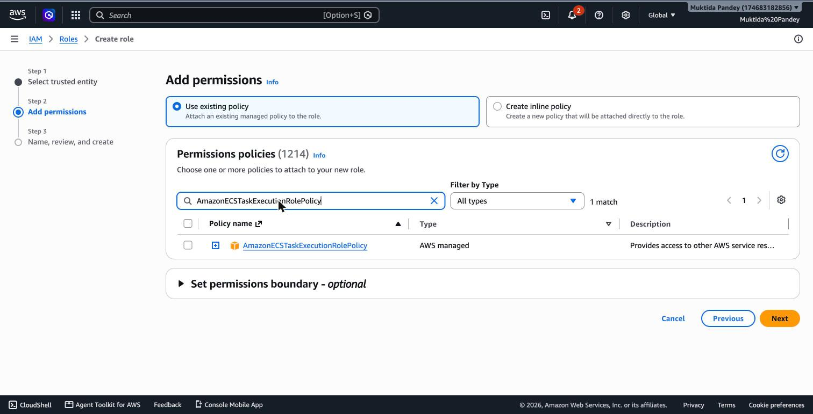

**Step 3 — Name it `claude-otel-collector-exec-role`** on the final review page and click **Create role**.

**Step 4 — Come back and add one more permission after A3.** This role also needs to read the secret token you're about to create in the next step, so once you've completed A3 and have the parameter's ARN in hand, come back to this role and attach a small additional inline policy granting `ssm:GetParameters` on that specific parameter's ARN (not on `*` — scope it down to just this one secret). If you'd rather not context-switch, you can also just remember to do this before you try to launch the container in A5/A6 — the container will fail to start with a permissions error if you forget, and the error message will name exactly this missing permission.

---

## A3. Store your secret token in SSM Parameter Store

Since your collector will be reachable from the public internet (more on why in A4), you need a secret password — a "bearer token" — that only requests carrying the right value will be accepted. **SSM Parameter Store** is AWS's built-in secret-storage service; you'll create one entry here to hold that token securely.

**Step 1 — Go to the Parameter Store list.** Search "Systems Manager" in the console, then find "Parameter Store" in its left sidebar. Click **Create parameter**.

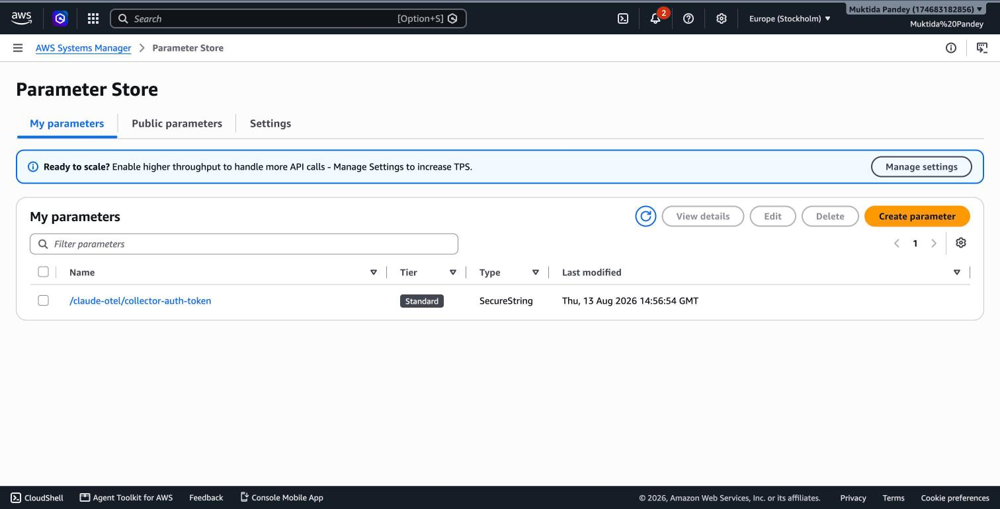

**Step 2 — The blank creation form.** You'll see empty "Name" and "Description" fields, and a "Tier" choice (Standard is pre-selected and is what you want — it's free and sufficient here).

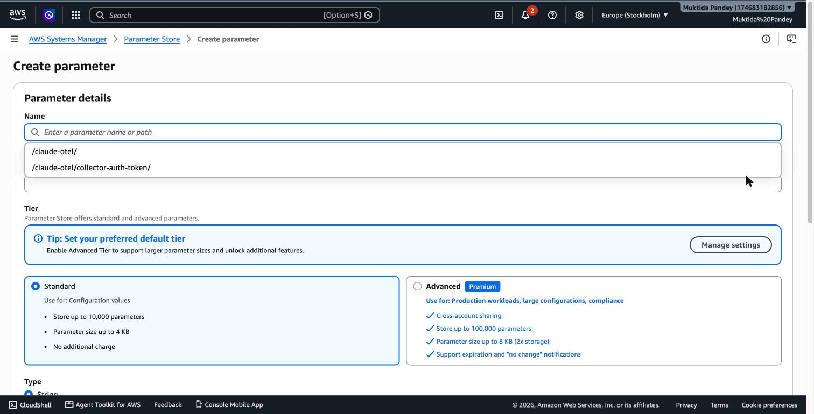

**Step 3 — Name it and choose the Type.** Type the name exactly as `/claude-otel/collector-auth-token` (the leading slash matters — SSM uses slashes to organize parameters into a folder-like hierarchy). Below the name field, you'll see a "Type" choice with three radio buttons: String, StringList, and SecureString.

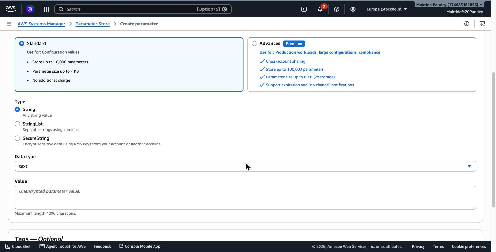

**Step 4 — Select SecureString, not String.** This is the one choice in this step that really matters: **SecureString** encrypts the value at rest and hides it from casual browsing in the console (you have to explicitly click "Show" later to reveal it). Selecting it reveals a KMS key choice below (leave it on the default AWS-managed key) and an empty "Value" box.

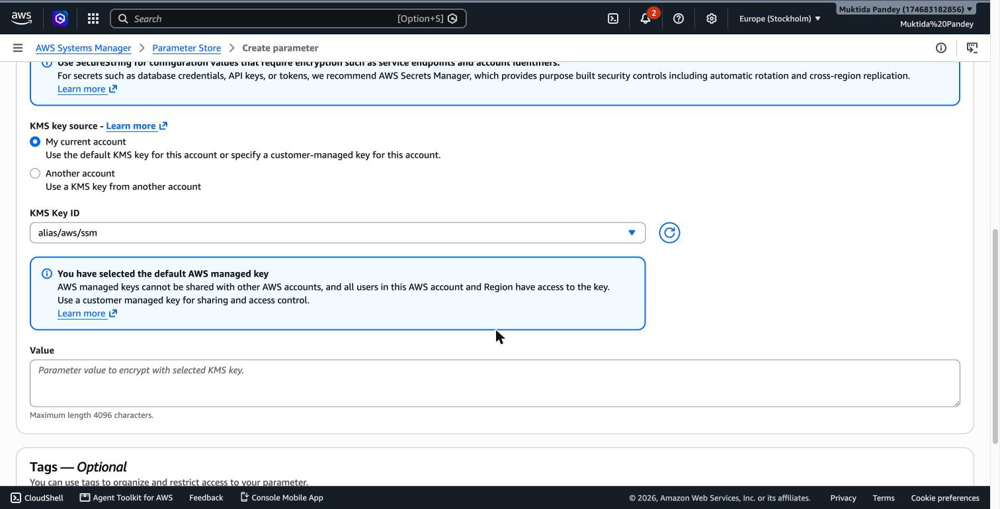

**Step 5 — Generate and paste in a strong random token.** Do not type something guessable like "password123." A good approach: use any UUID generator (searching "UUID generator" in your browser gives you several free ones), or if you're on a Mac/Linux machine, open a terminal and run `uuidgen`. Paste the result into the Value box.

**Step 6 — Click Create parameter** at the bottom of the page.

**A rule to follow for the rest of this guide and beyond:** never paste this token's actual value into a document, a chat message, a Slack post, or a screenshot. Every place later in this guide that needs to reference it (A5's container config, B1's Claude admin settings) will tell you to type in "your token" or "the current SSM value" — never a literal example value that might get copy-pasted verbatim by mistake. If you ever suspect this token has leaked, come back here, edit the parameter with a new random value, then see Part C, section C3 for how to safely roll it out everywhere that uses it.

---

## A4. Create the security group (the pipeline's firewall rule)

A **security group** is AWS's name for a firewall rule set attached to a resource — in this case, the container you'll launch in A5–A6. Right now, with nothing created yet, your container has no security group of its own, so you need to make one before you can attach it later.

**Step 1 — Go to the Security Groups list.** Search "EC2" in the console (security groups live under the EC2 service even though you're not creating any EC2 servers), then find "Security Groups" in the left sidebar under "Network & Security." Click **Create security group**.

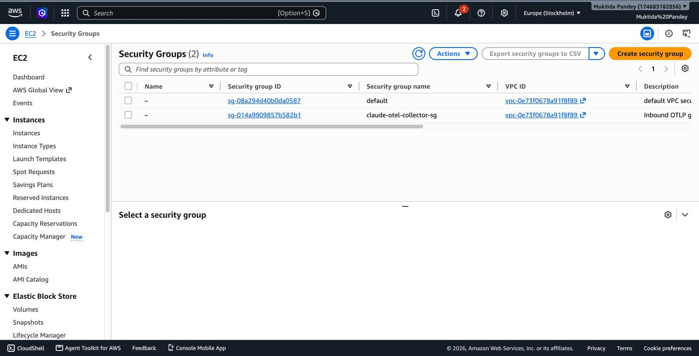

**Step 2 — The blank form.** You'll see empty "Security group name" and "Description" fields (AWS shows grayed-out placeholder example text like "security group for..." inside these boxes — that's just a hint, not real content, and it disappears the moment you start typing).

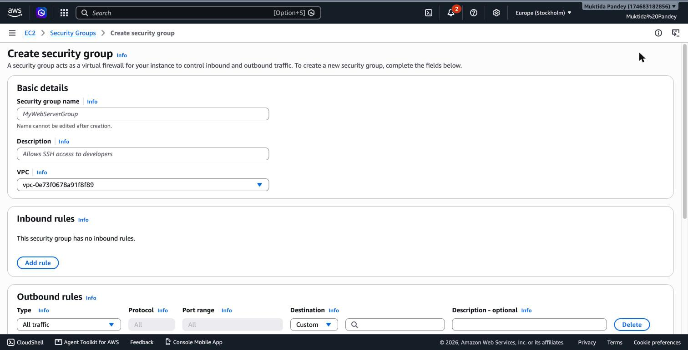

**Step 3 — Fill in the details and add two inbound rules.**

- Name: `claude-otel-collector-sg`
- Description: "Inbound OTLP grpc/http for Claude Code collector"
- VPC: leave it on your account's default VPC (you don't need to create a custom network for this)
- Scroll down to "Inbound rules" and click **Add rule** twice, to create exactly these two rules:
  - Type: **Custom TCP**, Port range: `4317`, Source: `0.0.0.0/0` (this means "anywhere on the internet" — see the warning below)
  - Type: **Custom TCP**, Port range: `4318`, Source: `0.0.0.0/0`
- Leave "Outbound rules" completely untouched — the default "allow all outbound traffic" rule is what lets your collector reach CloudWatch's API.

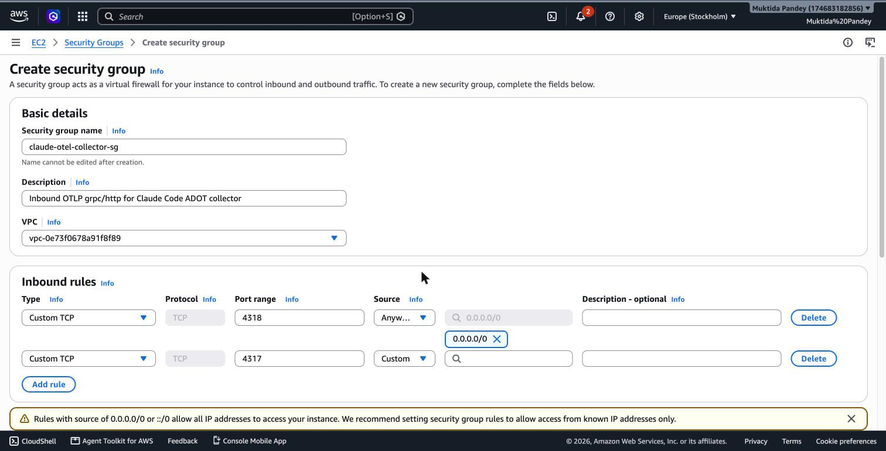

Notice AWS itself shows a warning banner about rules open to `0.0.0.0/0` — that's expected here and is not a mistake on your part. **This is deliberately open to the entire internet on both ports.** That's only an acceptable trade-off because every single request will be required to carry the correct bearer token (the one from A3) at the application layer, which you'll configure into the collector itself in A5. If your AWS account is able to create load balancers and attach a fixed IP address (many production accounts can — see the prerequisites section), you have the option later of putting a load balancer in front of this and restricting the security group to a narrower source range instead of relying on the token alone; that's a more advanced variation not covered step-by-step in this guide.

**Step 4 — Click Create security group** at the bottom of the page.

---

## A5. Write the collector's configuration and create the ECS task definition

This is the most detail-heavy step in the whole guide — it's where you tell AWS exactly what program to run, with what settings. Take it slowly.

First, a quick vocabulary check, since ECS has a lot of specific terms: a **task definition** is a *blueprint* — it describes what container image to run, how much CPU/memory to give it, what environment variables to set, and what permissions (roles) to attach. Creating a task definition does not start anything running yet — it just registers the blueprint. You'll use that blueprint to actually launch a running container in A6.

### A5a. The collector's config file

The "collector" is a small, widely-used open-source program that receives telemetry data and forwards it elsewhere — in this case, to CloudWatch. It needs a configuration file (in YAML format) that tells it exactly how to do that. You don't need to understand YAML deeply to use this — just copy it exactly as shown, substituting nothing (the one placeholder, `${env:OTEL_AUTH_TOKEN}`, is filled in automatically from an environment variable you'll set later in this same step — leave it exactly as written):

```yaml
extensions:
  bearertokenauth:
    scheme: "Bearer"
    tokens:
      - "${env:OTEL_AUTH_TOKEN}"

receivers:
  otlp:
    protocols:
      grpc:
        endpoint: 0.0.0.0:4317
        auth:
          authenticator: bearertokenauth
      http:
        endpoint: 0.0.0.0:4318
        auth:
          authenticator: bearertokenauth

processors:
  memory_limiter:
    check_interval: 1s
    limit_mib: 2000
  batch:
    timeout: 30s
    send_batch_size: 10000

exporters:
  awscloudwatchlogs:
    region: eu-north-1
    log_group_name: "/claude-code/metrics-logs"
    log_stream_name: "{TaskId}"
  awsemf:
    region: eu-north-1
    log_group_name: "/claude-code/metrics"
    log_stream_name: "{TaskId}"
    namespace: "ClaudeCode"
    dimension_rollup_option: "NoDimensionRollup"

service:
  extensions: [bearertokenauth]
  pipelines:
    logs:
      receivers: [otlp]
      processors: [memory_limiter, batch]
      exporters: [awscloudwatchlogs]
    metrics:
      receivers: [otlp]
      processors: [memory_limiter, batch]
      exporters: [awsemf]
```

If your region is not `eu-north-1`, change the two `region:` lines to match whatever region you picked in A0.

⚠️ **Two easy-to-miss details that will break this pipeline if skipped, learned the hard way while building it:**

1. **`memory_limiter.check_interval` is required, not optional**, on the container image this guide uses (see below). Leave it out and the collector refuses to start at all, with an error like `'check_interval' must be greater than zero`.
2. **The `metrics` pipeline at the bottom is easy to forget if you're only thinking about "logs."** Claude Code's cost and token-usage numbers travel as *metrics*, not as log lines. If you only configure the `logs` pipeline and skip `metrics`, the collector will silently accept and throw away all of your cost/token data — no error anywhere, it just never arrives in CloudWatch. If later on you only ever see session-start/session-end type events and never any dollar or token numbers, this missing pipeline is almost certainly why. This is exactly why the config block above includes it already — don't delete it.

### A5b. Create the task definition

**Step 1 — Go to the Task definitions list.** Search "ECS" (Elastic Container Service) in the console, click "Task definitions" in the left sidebar. Click **Create new task definition** → **Create new task definition** (there may be a "with JSON" alternative in the dropdown — use the plain form-based option for this walkthrough).

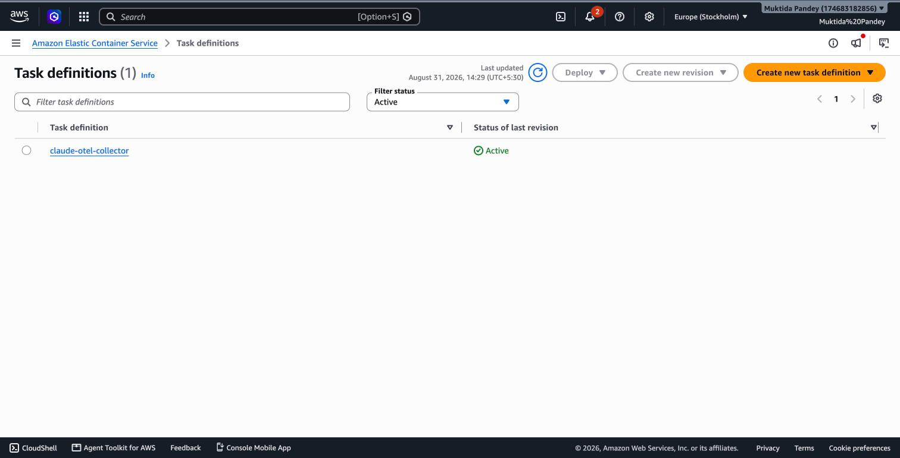

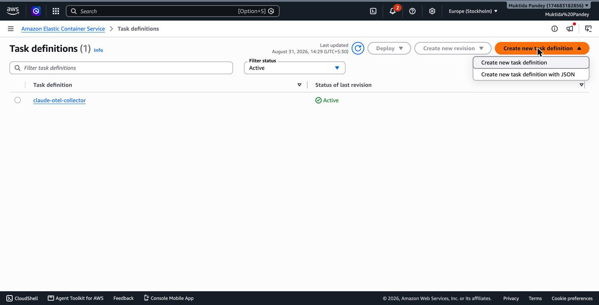

**Step 2 — The blank top-of-form: family name and infrastructure requirements.** At the very top you'll type a "Task definition family" name — use `claude-otel-collector`. Just below that, "Infrastructure requirements" lets you choose the launch type; make sure **AWS Fargate** is selected (it usually is by default), and Operating system/Architecture is **Linux/X86_64**.

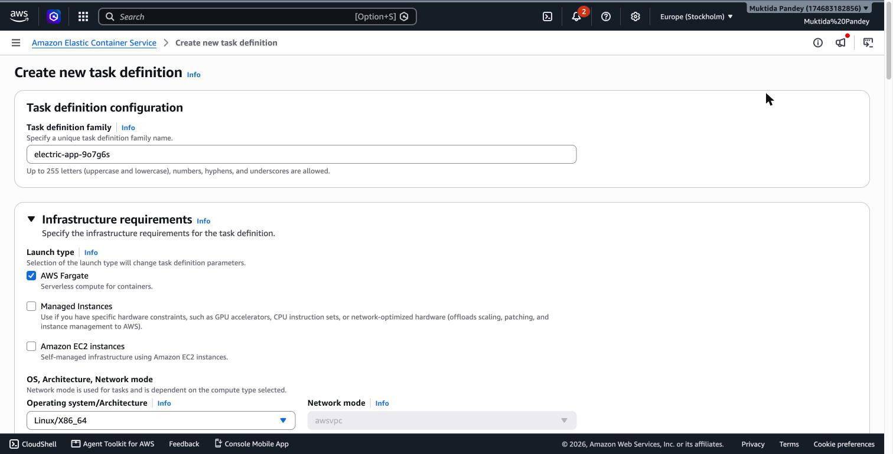

**Step 3 — Task size and roles, both still blank.** Scrolling down, you'll reach "Task size" (choose 1 vCPU and 3 GB memory — plenty for this workload) and, below that, "Task roles," with two empty dropdowns you haven't touched yet.

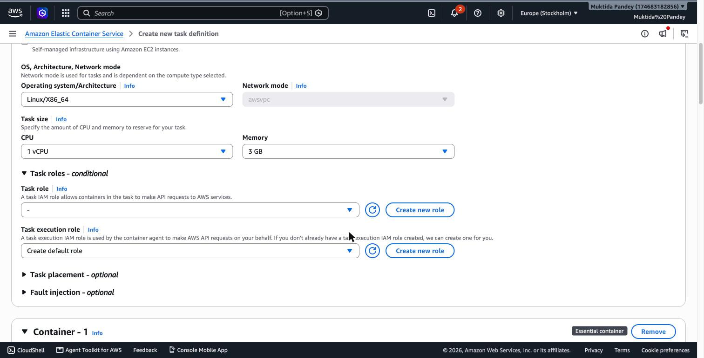

**Step 4 — Pick the Task role.** Click the first dropdown (labeled "Task role") and select **`claude-otel-collector-task-role`** — the one you created in A2a.

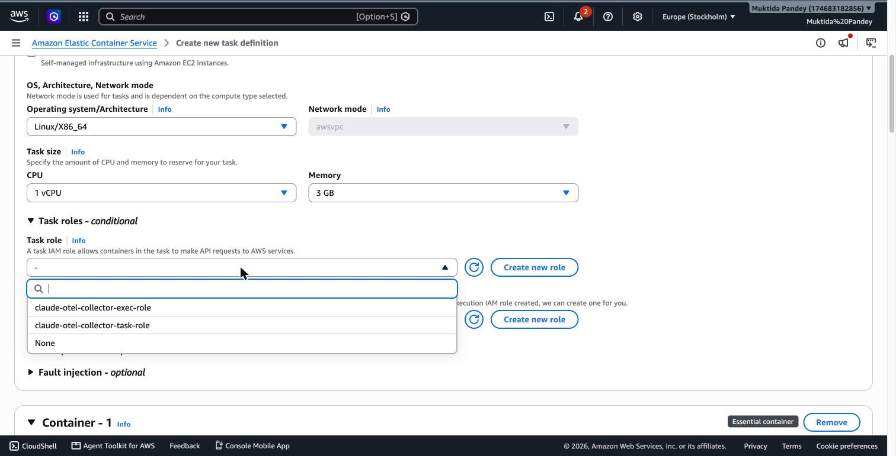

**Step 5 — Pick the Task execution role.** Click the second dropdown ("Task execution role") and select **`claude-otel-collector-exec-role`** — the one you created in A2b.

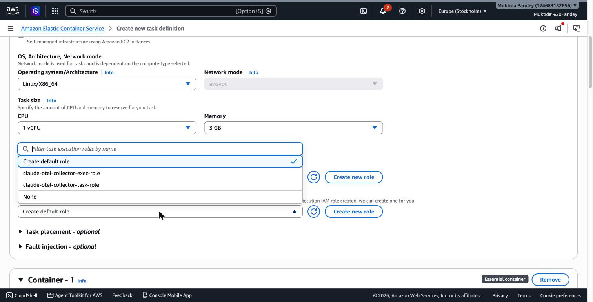

**Step 6 — The blank Container section.** Scroll down to "Container - 1" — you'll see empty "Name" and "Image URI" fields, and below them a "Port mappings" area with one blank row.

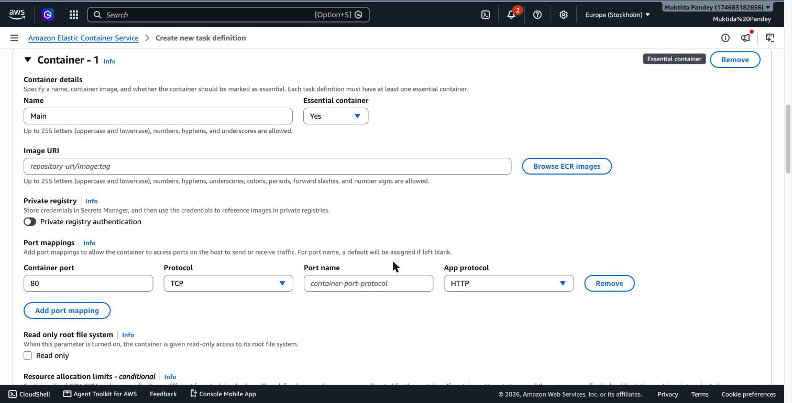

**Step 7 — Fill in the container name, image, and both ports.**

- Container name: `adot-collector`
- Image URI: `otel/opentelemetry-collector-contrib:latest`
- **This exact image matters.** Use the community "contrib" build shown above, **not** `public.ecr.aws/aws-observability/aws-otel-collector` (AWS's own "ADOT" image). ADOT's build does not include the `bearertokenauth` extension this config relies on — using it here will fail to start. The "contrib" image supports it, along with the `awscloudwatchlogs` and `awsemf` exporters used in the config above.
- Port mappings: add two rows —
  - Container port `4317`, Protocol TCP, Port name `otlp-grpc`
  - Container port `4318`, Protocol TCP, Port name `otlp-http`, App protocol HTTP

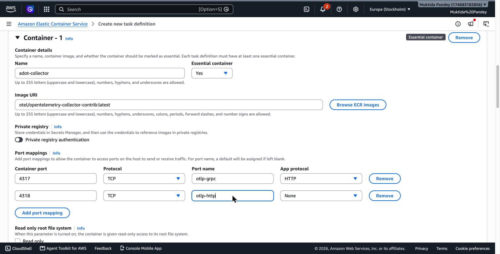

**Step 8 — Set the command override.** Still within the container's settings, find "Command override" (sometimes tucked under an "Environment variables" or "Deployment" sub-section depending on console layout) and set it to:

```
--config=env:AOT_CONFIG_CONTENT
```

This tells the collector program to read its entire configuration from an environment variable (which you'll set next) instead of expecting a config file mounted from disk — this sidesteps needing to set up shared file storage just to hand the collector its settings.

**Step 9 — The blank Environment variables section.** Scroll to "Environment variables" — you'll see an empty list with just an "Add environment variable" link/button.

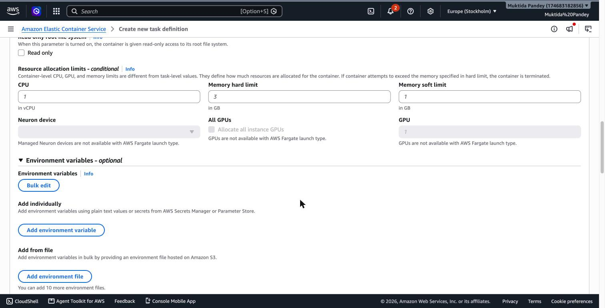

**Step 10 — Add the first row (the config itself).** Click "Add environment variable." A new blank row appears with a Key field, a "Value type" dropdown (Value vs. ValueFrom), and a Value field.

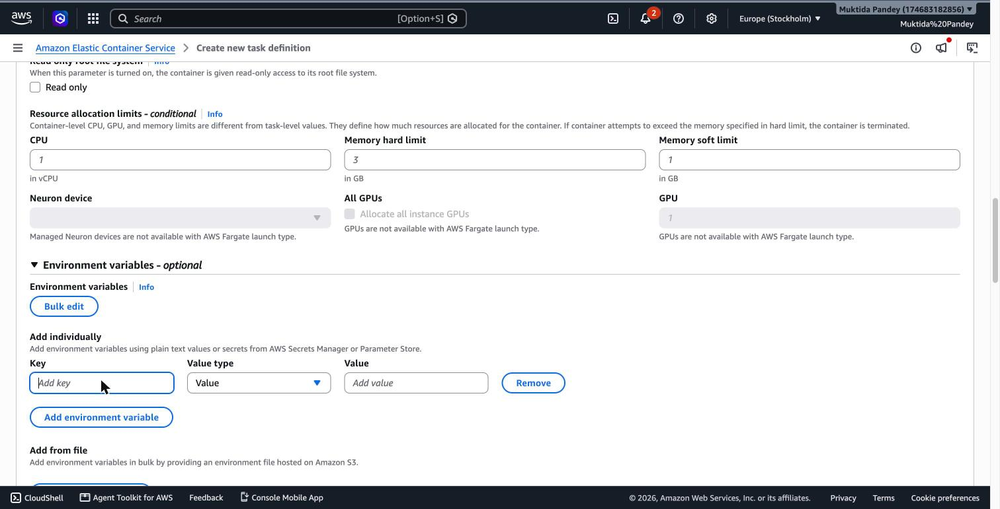

- Key: `AOT_CONFIG_CONTENT`
- Value type: leave it on **Value** (plain text, not a secret)
- Value: paste the **entire YAML config block from A5a** into this box — yes, the whole multi-line thing, line breaks and all. The console's text box accepts multi-line paste for this field.

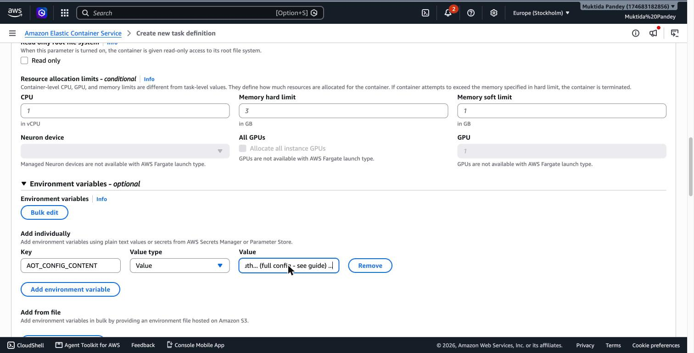

⚠️ **Do not type this by hand character-by-character or hit Enter mid-typing to "format" it** — paste the whole block in one action. If you're automating this or scripting keystrokes, watch out for stray Enter/newline keystrokes accidentally landing on a nearby button rather than inside the text box — that can submit the form prematurely with an incomplete config. If that happens to you, don't panic: check whether the task definition it created is actually in use by anything (a freshly-created revision that no running service points to is harmless), and if not, open it and use **Actions → Deregister** to mark that broken revision inactive, then start this step over.

**Step 11 — Add the second row (the secret token), using ValueFrom this time.** Click "Add environment variable" again for a second blank row.

- Key: `OTEL_AUTH_TOKEN`
- Value type: this time, click the dropdown and change it from "Value" to **ValueFrom**.

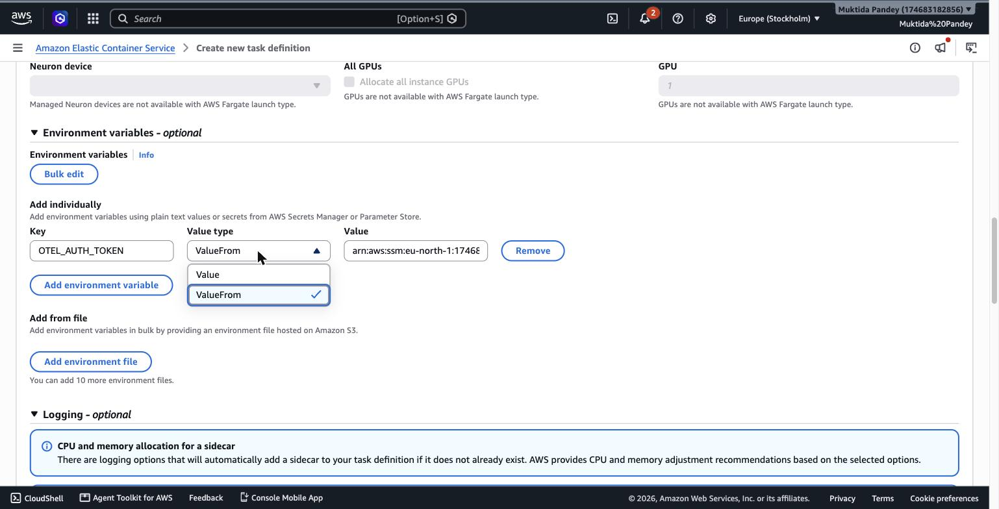

- Value: with ValueFrom selected, paste in the **ARN** of the SSM parameter you created in A3. It looks like `arn:aws:ssm:eu-north-1:<your-account-id>:parameter/claude-otel/collector-auth-token` (find the exact ARN by going back to the Parameter Store list from A3, clicking your parameter, and copying its ARN from the details panel — don't type it from memory, one wrong character here means the container can't find its secret).

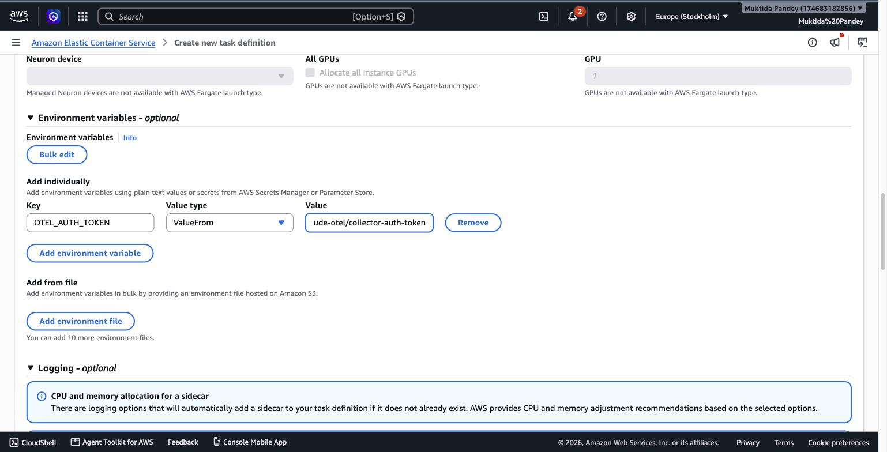

Using **ValueFrom** here (rather than pasting the actual token value into a plain "Value" field) means the real secret never appears in this task definition's own JSON in plain text — ECS fetches it fresh from SSM at container startup instead.

**Step 12 — Logging, auto-filled by AWS.** Scroll further down to "Logging" — AWS auto-suggests a log configuration for you based on the container name, pre-filling fields like the log group name and stream prefix.

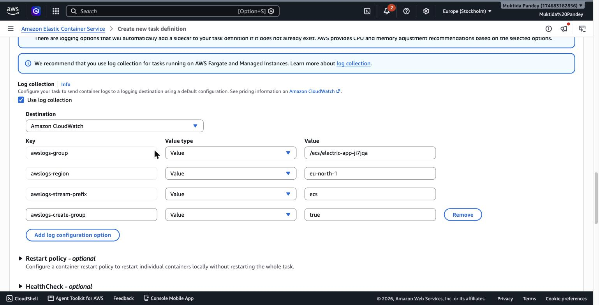

**Step 13 — Correct the log group name if needed, then move on.** Check the auto-filled "awslogs-group" value — it should read `/ecs/claude-otel-collector`. If AWS auto-generated something different (e.g. based on a different family name you typed), correct it to exactly `/ecs/claude-otel-collector` so the rest of this guide's references to it line up. Leave "auto-create group" enabled and the stream prefix as its default (`ecs`).

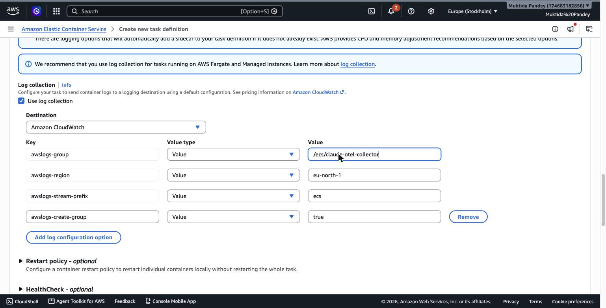

**Step 14 — Scroll to the very bottom and click Create.** You don't need to touch anything else on this page — Volumes, Tags, and any other optional sections can stay empty.

You've now registered your task definition. Nothing is running yet — that happens next in A6.

---

## A6. Create the ECS cluster and launch the service

An ECS **cluster** is just a logical grouping — a named "home" for your running containers. A **service** is what actually keeps a container running continuously (and restarts it automatically if it crashes). You need one cluster and one service.

### A6a. Create the cluster

**Step 1 — Go to the Clusters list.** In ECS's left sidebar, click "Clusters." Click **Create cluster**.

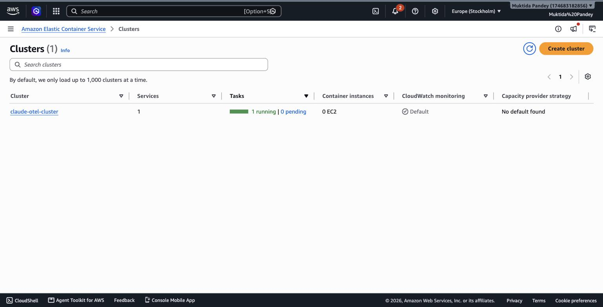

**Step 2 — The blank form.** You'll see an empty "Cluster name" field with a random placeholder example name shown in gray, and "AWS Fargate (serverless)" pre-selected as the infrastructure option (this is what you want — leave it checked).

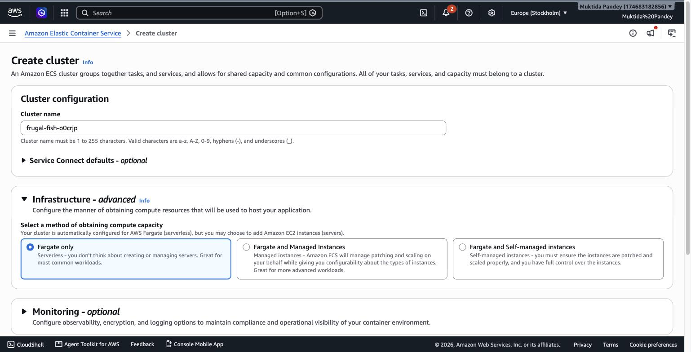

**Step 3 — Name it and create.** Clear the placeholder and type `claude-otel-cluster`.

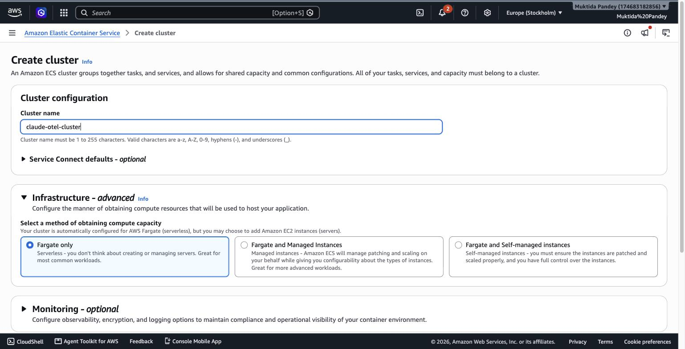

Click **Create** at the bottom. Cluster creation is quick — you'll land back on a cluster detail page within a few seconds.

### A6b. Create the service inside that cluster

The quickest path into the "Create service" wizard is from the task definition itself: go back to **Task definitions → `claude-otel-collector`**, open its latest revision, and use the **Deploy** dropdown button → **Create service**.

**Step 1 — Service details, filled in.** The wizard pre-fills the task definition family and revision for you (since you launched it from there). Type a service name of `claude-otel-collector-service`, and make sure the "Existing cluster" dropdown has your `claude-otel-cluster` selected.

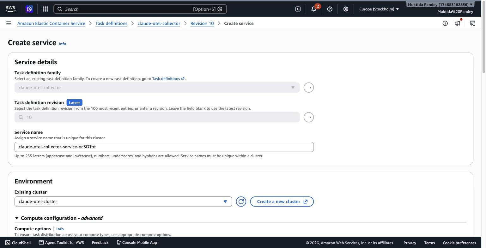

**Step 2 — Compute configuration.** Leave "Capacity provider strategy" selected with **FARGATE** and Base `0` / Weight `1` — these are sensible defaults for a single always-on task and don't need adjusting.

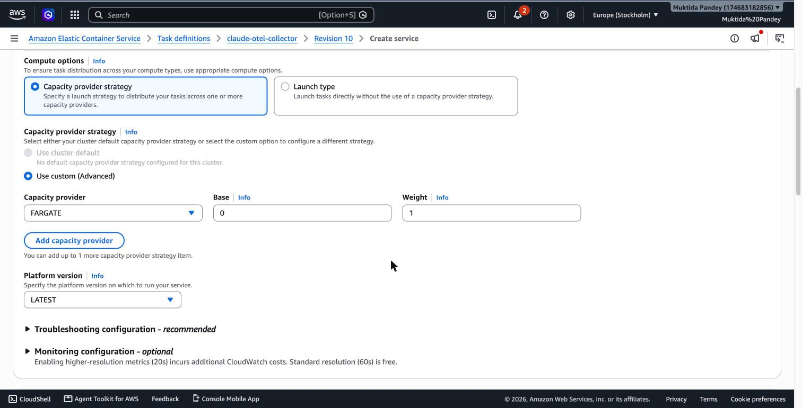

**Step 3 — Deployment configuration.** Leave "Service" as the scheduling strategy, and set **Desired tasks to `1`** — a single running copy is enough for internal usage telemetry. Leave "Availability Zone rebalancing," health check grace period, and the collapsed "Deployment options" sections at their defaults.

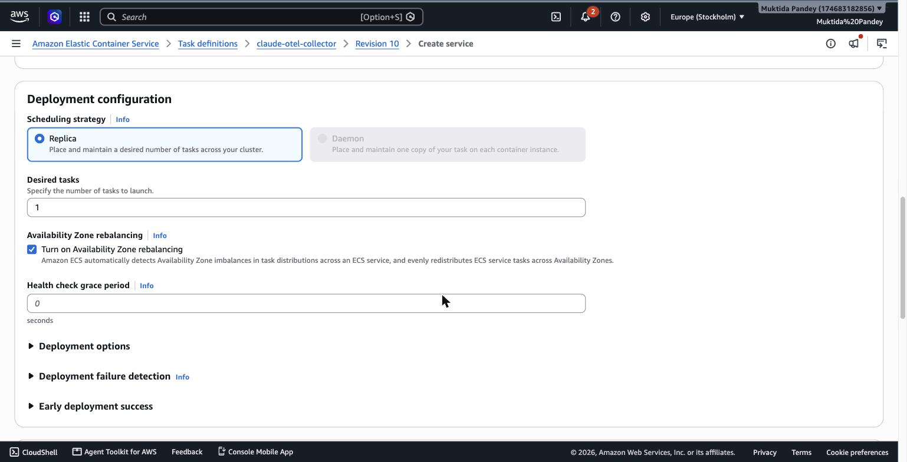

**Step 4 — Expand the Networking section (this is the most important part of this whole step).** Scroll further down and click to expand the collapsed **"Networking"** section — by default it may be collapsed and easy to skip past. Once expanded, you'll see the VPC and Subnets fields already pre-filled with your account's default VPC and its subnets.

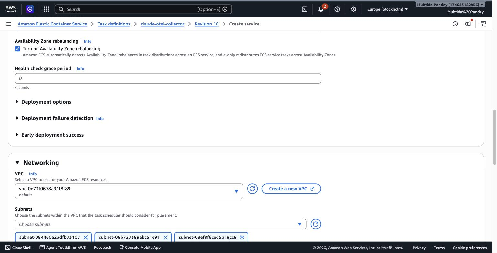

**Step 5 — Scroll down within Networking to Security group and Public IP.** By default, AWS pre-selects your account's generic "default" security group here — **this is not the one you want**.

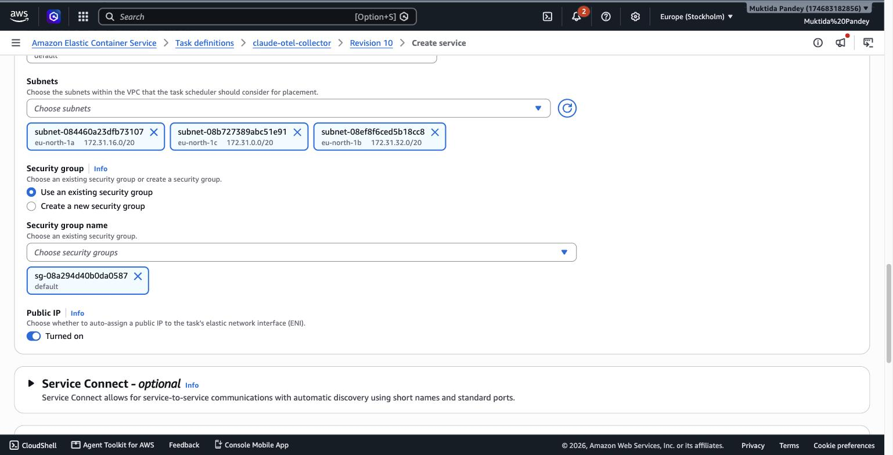

**Step 6 — Swap in your own security group.** Click the small "X" on the pre-selected "default" security group tag to remove it, then click into the "Security group name" dropdown and select **`claude-otel-collector-sg`** — the one you created in A4.

**Step 7 — Confirm Public IP is turned ON.** Just below the security group field, there's a "Public IP" toggle. **This must be switched on.** Without a load balancer or a fixed IP address (which, per the prerequisites, this guide assumes your account cannot create), this toggle is the *only* way your container gets an internet-reachable address at all. If you accidentally leave this off, your collector will start successfully but nothing outside AWS will ever be able to reach it, and every test in A7 will time out.


**Step 8 — Leave "Load balancing" untouched and scroll to the bottom.** You do not need a load balancer for this design — leave that whole section collapsed and at its default ("no load balancer"). Scroll all the way down and click the orange **Create** button.

Creating a service takes a minute or two — ECS needs to actually launch the container, pull the image, and pass its health checks. You can watch progress on the cluster's "Tasks" tab (covered next, in A7).

---

## A7. Verify the collector is actually reachable

**Step 1 — Find the running task's public IP.** Go to **ECS → Clusters → `claude-otel-cluster` → Services → `claude-otel-collector-service` → Tasks tab**, click the one running task listed there, and look for its **Networking** section — it will show a **Public IP** address (a normal-looking IP like `13.51.250.76`).

⚠️ **Write this IP down, but expect it to change again soon.** Because this design has no fixed/Elastic IP, this address will change every time the task restarts — a deploy, a crash, or any AWS-side scaling event. Part C explains the one place you need to update it when that happens (spoiler: just one field, in Claude's admin settings — no developer machine needs to change anything).

**Step 2 — Test it with a real request.** If you have access to a terminal on any machine with internet access (this step is optional if you're not comfortable with a command line — you can instead just wait until Part B is done and check whether real data arrives), run:

```bash
curl -i http://<public-ip>:4318/v1/logs \
  -H "Content-Type: application/json" \
  -H "Authorization: Bearer <your-ssm-token>" \
  -d '{"resourceLogs":[]}'
```

Replace `<public-ip>` with the address from Step 1 and `<your-ssm-token>` with the actual value you generated back in A3 (this is a case where typing the literal secret is fine — it's a one-off local terminal command on your own machine, not something you're saving into a document or screenshot).

- **No `Authorization` header at all** → you should get back a rejection like `{"code":16,"message":"missing or empty authorization header: Authorization"}`. Getting this specific error is actually good news — it confirms your bearer-token security is correctly wired up and rejecting unauthenticated requests.
- **Correct header** → you should get `200 OK` with a body like `{"partialSuccess":{}}` — this means your whole pipeline, from the internet all the way to the collector, is accepting data correctly.
- **Connection refused or a timeout** → go back and double check: (a) the security group from A4 has both inbound rules, and (b) "Public IP: Turned on" actually took effect in A6b Step 7 — it's easy to accidentally leave this off.

---

## A8. Confirm the CloudWatch log groups appear

You do not need to manually create any CloudWatch log groups for the collector's own output — the `awscloudwatchlogs` and `awsemf` exporters in your collector config (A5a) create them automatically the first time they successfully write data, using the `logs:CreateLogGroup` permission you attached to the task role back in A2a.

After a successful test request in A7, search "CloudWatch" in the console, go to **Logs → Log groups**, and confirm you now see:

- `/claude-code/metrics-logs` — the plain-text logs pipeline
- `/claude-code/metrics` — the EMF-formatted metrics pipeline
- `/ecs/claude-otel-collector` — the collector container's own startup/diagnostic output (useful if something isn't working and you need to see why)

If you don't see the first two yet, that's expected until either your A7 test request succeeded, or real Claude Code traffic starts arriving after you finish Part B.

---

## A9. Build and deploy the flattening Lambda

This next piece is a small custom program (a **Lambda function** — AWS's name for a small piece of code that runs on demand, without you managing a server) that listens for new entries in `/claude-code/metrics-logs`, reshapes ("flattens") each one into a simple structure, and writes it out to your S3 bucket from A1 as a JSON file — this is what makes the data queryable with SQL later, in A11–A12.

**Step 1 — Go to the Lambda functions list.** Search "Lambda" in the console. Click **Create function**.

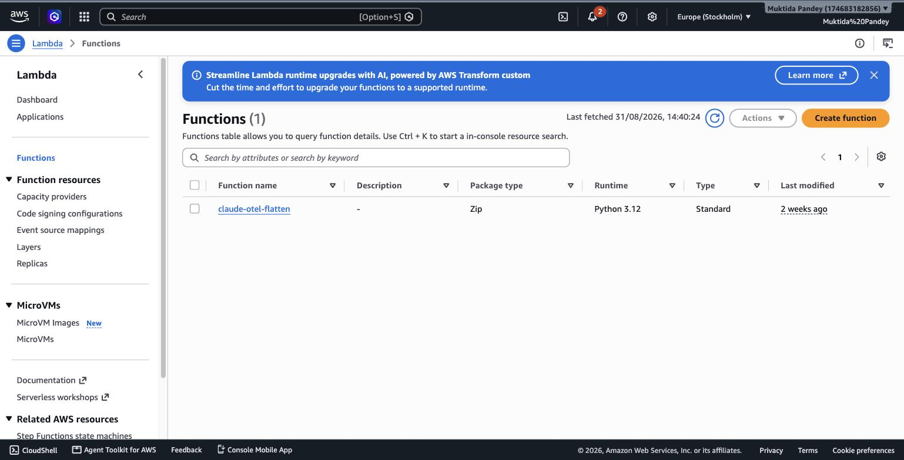

**Step 2 — The blank Create function form.** "Author from scratch" is pre-selected (leave it), and you'll see empty "Function name" and a "Runtime" dropdown defaulted to a Node.js version.

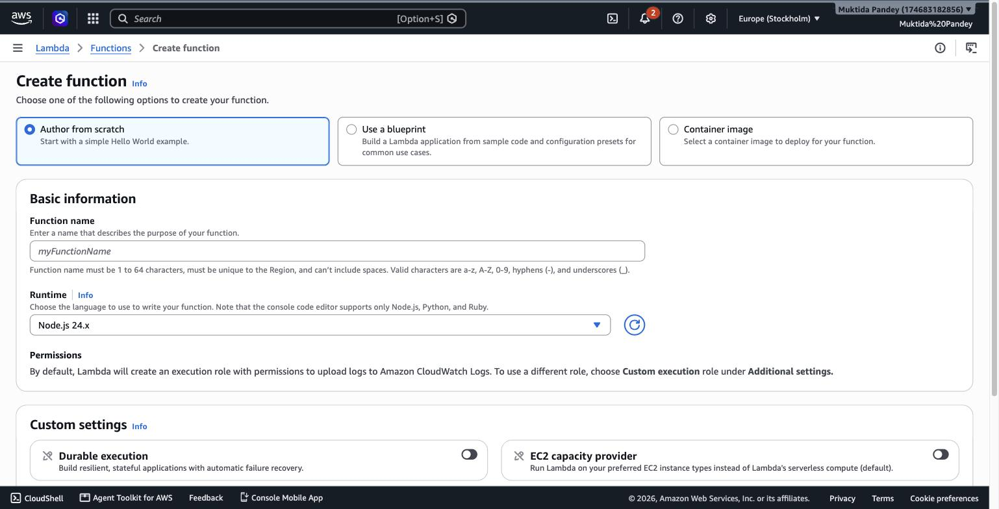

**Step 3 — Name it and pick the Python runtime.** Type `claude-otel-flatten` as the function name. Click the Runtime dropdown and choose a **Python 3.12 or newer** version from the list (any recent Python 3 version works — this guide's screenshot shows Python 3.14 selected as an example of what the filled-in dropdown looks like; pick whichever recent Python 3.x version is available to you).

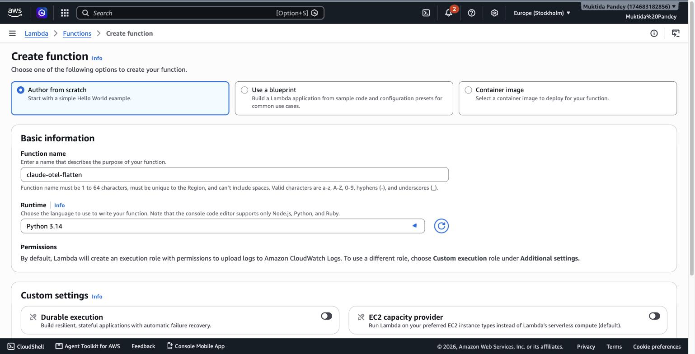

**Step 4 — Leave Permissions on its default and scroll to Create.** The "Permissions" box tells you Lambda will auto-create a basic execution role for you with CloudWatch Logs write access — that's fine as a starting point (you'll widen it in Step 5 below). Scroll down past "Custom settings" (leave both toggles off) and click the orange **Create function** button.

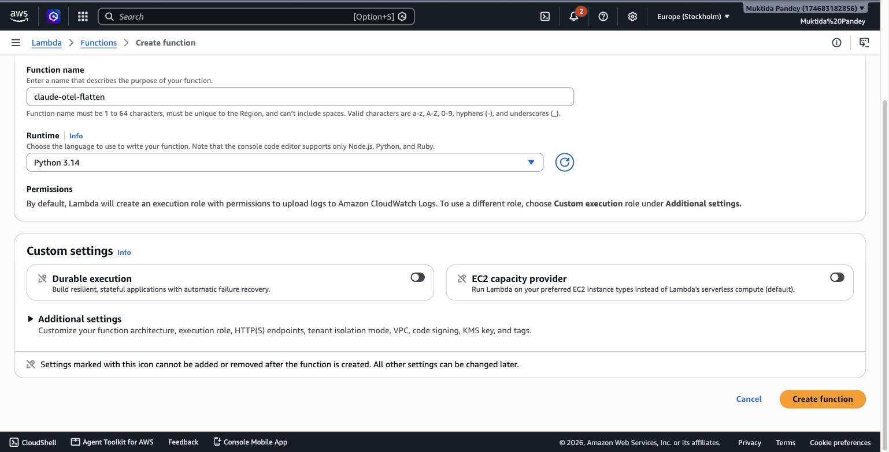

**Step 5 — Widen the auto-created execution role.** Once the function exists, go to its **Configuration → Permissions** tab, click through to the execution role Lambda created for you, and attach an additional inline policy (same idea as A2a) granting `s3:PutObject` on your bucket from A1 (e.g. resource `arn:aws:s3:::claude-code-datalake-<your-account-id>/*`). The CloudWatch Logs write access it already has by default is enough for the function's own diagnostic logging; the subscription-filter trigger you'll wire up in A10 handles read access to the source log group automatically, without needing anything added here.

**Step 6 — Write the function's code.** This is the one part of this guide that involves writing actual code rather than clicking through a form. Paste the following logic into the code editor (or, per the gotcha below, write it in a local file and upload it as a .zip — often much easier than AWS's in-browser editor):

The core logic needs to: (1) decode the gzipped, base64-encoded CloudWatch Logs payload that arrives as the Lambda's input event; (2) for each log entry, parse its JSON body and read its `attributes`; (3) handle **two different possible shapes** that `attributes` can arrive in:

```python
def flatten_attributes(attrs):
    """attrs may arrive as either:
       (a) the raw OTLP list shape: [{"key": "...", "value": {"stringValue": "..."}}]
       (b) a flat dict, as actually written by the awscloudwatchlogs exporter on
           the contrib collector: {"cost_usd": "0.01", "event.name": "...", ...}
       Handle both.
    """
    if isinstance(attrs, list):
        flat = {}
        for item in attrs:
            key = item.get("key")
            value = item.get("value", {})
            flat[key] = next(iter(value.values()), None)
        return flat
    return attrs or {}
```

⚠️ **This shape mismatch is a real bug, not a hypothetical one — it will crash every single invocation if you skip it.** The exporter running on the "contrib" collector image writes the flat-dict shape (b) shown above, not the standard OTLP list shape (a) that most generic online examples assume. Skip this and you'll see `AttributeError: 'str' object has no attribute 'get'` in the Lambda's CloudWatch logs on every run.

Then, when pulling out the skill name for each record, check the dotted key first:

```python
skill_name = (
    attrs.get("skill.name")           # <- the actual key the exporter writes (with a dot)
    or attrs.get("skill_name")
    or attrs.get("skill")
    or attrs.get("tool.parameters.skill")
)
```

⚠️ **The dotted key `skill.name` is the one that's actually present in real data.** If you only check `skill_name`/`skill`/`tool.parameters.skill` (a very natural first guess), you'll silently write `null` into every row's skill name, even though the real value was there all along under a different-looking key. This same "check the dotted-key variant first" logic applies to other fields too (`event.name`, `user.email`, `cost_usd`) — if a field always comes back empty, check for a dotted version of the key before assuming the data isn't there.

Finally, write each flattened record as a JSON line into your S3 bucket, under a path like `flattened/year=<Y>/month=<M>/day=<D>/<random-id>.json` — this date-based folder structure ("partitioning") is what lets Athena later treat the whole thing as a single queryable table while still being able to skip over irrelevant days efficiently.

⚠️ **A tip on actually editing this code, since the in-browser editor can be frustrating for beginners:** Lambda's built-in code editor lives inside a special embedded frame in your browser that can sometimes be slow to respond to clicks and doesn't always let you expand/collapse code sections smoothly. A more reliable path: click the **Download** button and choose **"Download function code .zip"** to get the current code onto your own computer, edit it there in any plain text editor, re-compress it into a .zip, then use the **Update** button's dropdown and choose **"Update from a .zip file"** to upload your edited version back.

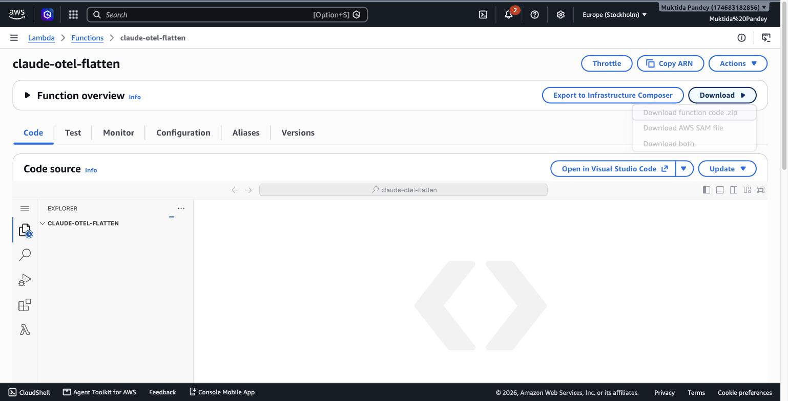

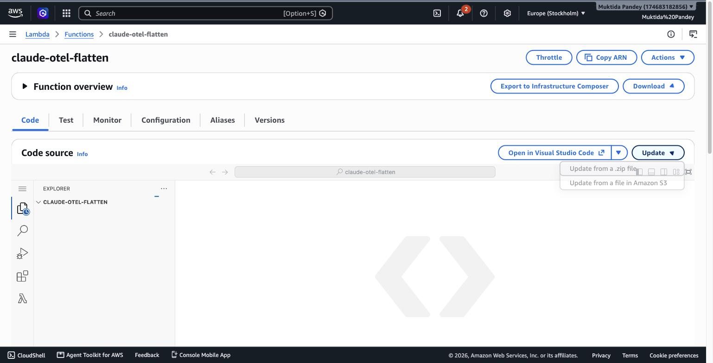

After any redeploy this way, download the .zip again immediately and check its contents match what you meant to upload — it's a quick sanity check that saves you from debugging a stale deploy later.

You can check the function's basic settings any time under **Configuration → General configuration**:

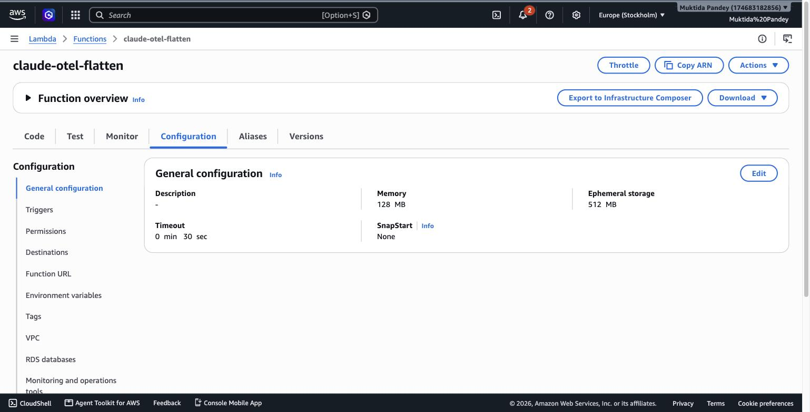

Once A10 below is wired up, the function's **Configuration → Triggers** tab will show the CloudWatch Logs subscription connecting to it, like this:

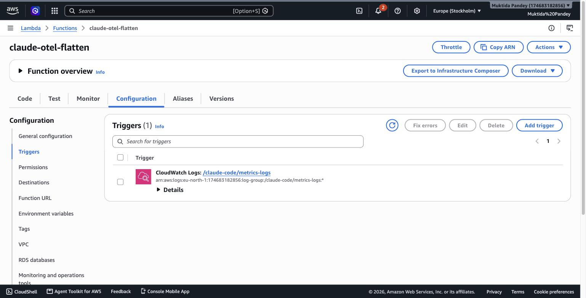

---

## A10. Connect CloudWatch to the Lambda with a subscription filter

Right now, your Lambda exists but nothing is actually calling it. A **subscription filter** is the piece that says "every time a new log line lands in this specific log group, immediately call this specific Lambda function with it." You attach it to the log group side, not the Lambda side.

**Step 1 — Go to the Log groups list and open `/claude-code/metrics-logs`.** Search "CloudWatch" → Logs → Log groups. You'll see a short list of log groups (the ones auto-created back in A8, plus your Lambda's own `/aws/lambda/claude-otel-flatten` group).

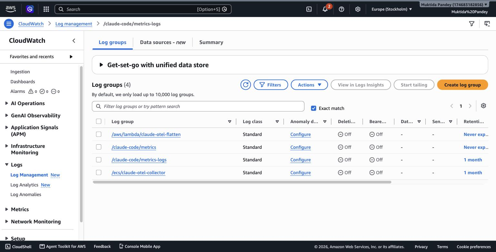

Click into **`/claude-code/metrics-logs`** specifically (not any of the others) — you'll land on its detail page, defaulted to the "Log streams" tab.

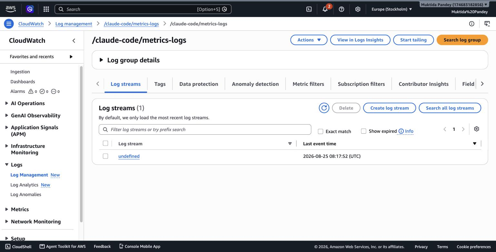

**Step 2 — Click the "Subscription filters" tab**, near the middle of the row of tabs at the top of the page. If you haven't created one yet, you'll see an empty list with a **Create** dropdown button.

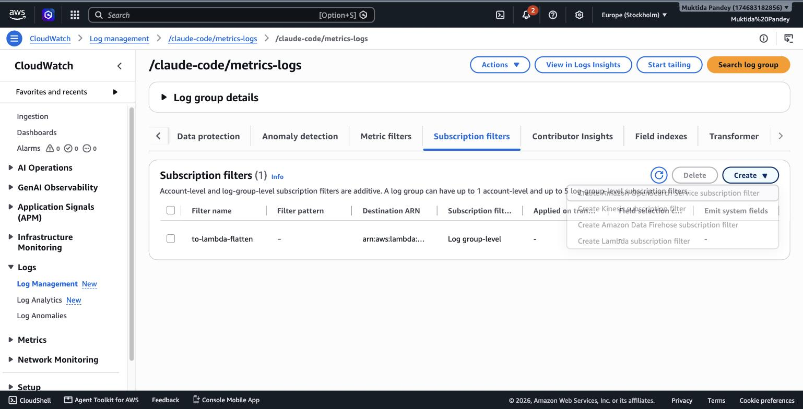

**Step 3 — Click Create, then "Create Lambda subscription filter"** from the dropdown that appears.

**Step 4 — The blank creation form.** You'll land on a page titled "Create Lambda subscription filter," with an empty "Lambda function" dropdown at the top.

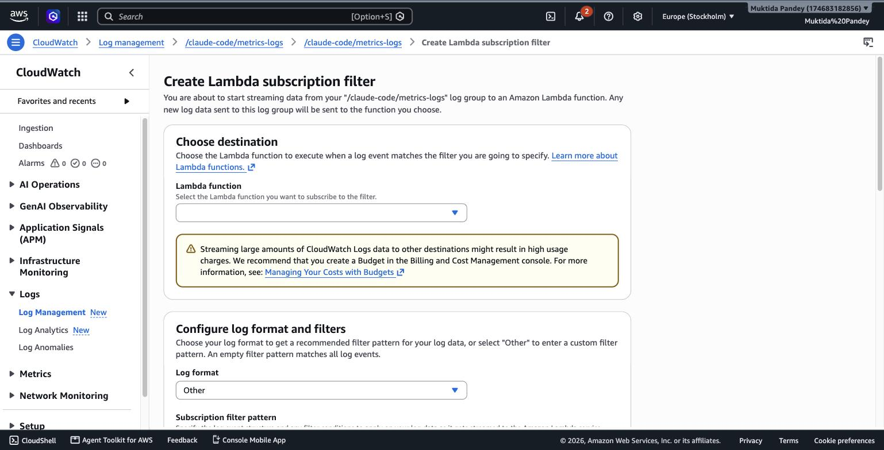

**Step 5 — Select your function.** Click the dropdown and choose **`claude-otel-flatten`** — the function you built in A9.

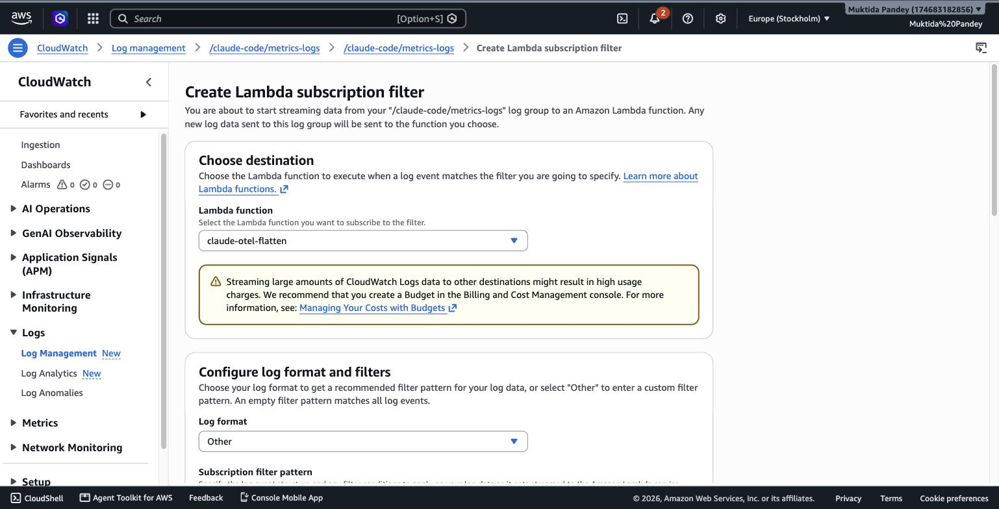

**Step 6 — Leave the filter pattern blank and name the filter.** Under "Configure log format and filters," you can leave "Log format" as "Other" and the "Subscription filter pattern" box empty — an empty pattern matches every single log event, which is what you want (you're not trying to pre-filter anything at this stage). Scroll down and type a name for the filter itself, e.g. `to-lambda-flatten`.

**Step 7 — Scroll to the bottom and click "Start streaming."**

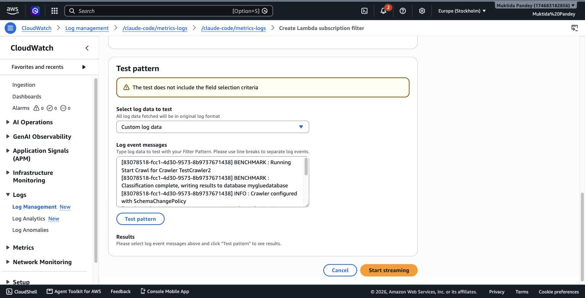

AWS automatically grants the Lambda a resource-based permission allowing specifically this log group to invoke it — you don't need to configure any additional IAM permission for this connection to work.

---

## A11. Create the Glue database (so Athena knows your data exists)

**AWS Glue** maintains a catalog of table definitions — essentially, metadata that tells Athena "here is a folder of JSON files in S3, and here's what columns/structure to expect inside them." You need one database (a named grouping of tables) here.

**Step 1 — Go to the Glue Databases list.** Search "Glue" in the console, click "Databases" in the left sidebar (under "Data Catalog"). Click **Add database**.

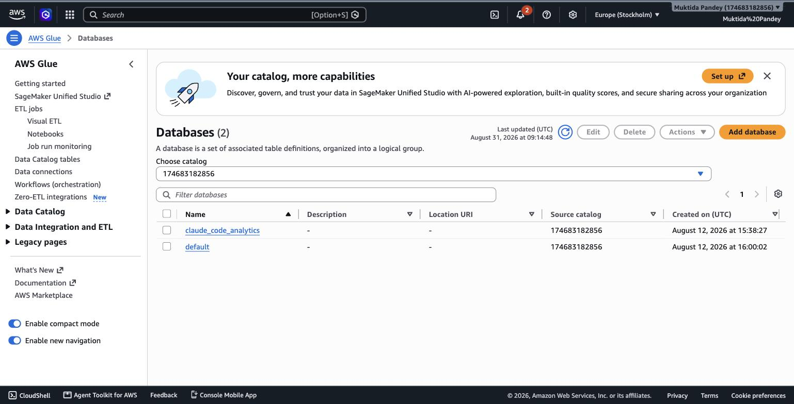

**Step 2 — The blank form.** "Glue Database" is pre-selected as the type (leave it), with an empty "Name" field below.

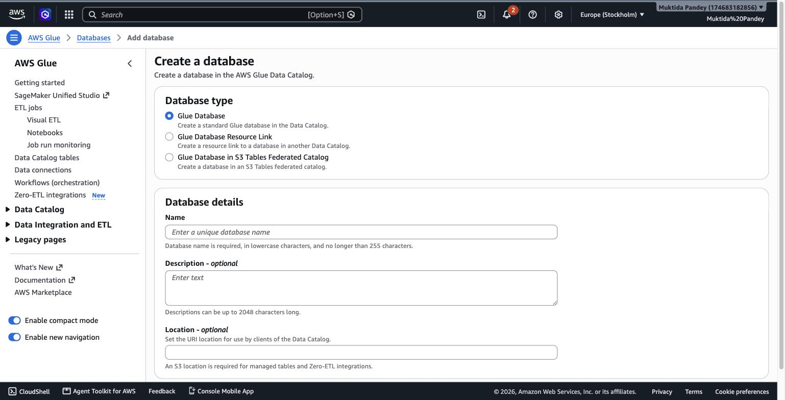

**Step 3 — Name it and create.** Type `claude_code_analytics` (lowercase, underscores — Glue database names can't contain uppercase letters or hyphens).

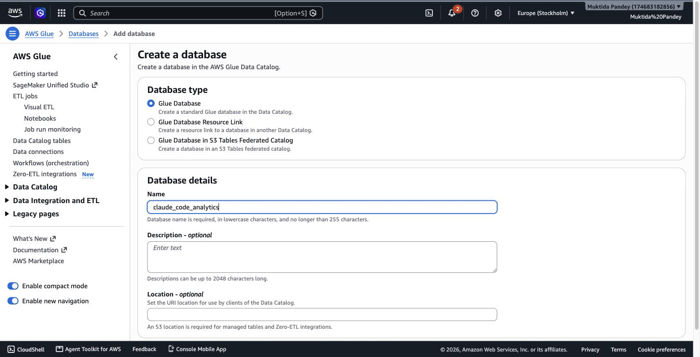

Leave "Description" and "Location" empty, and click **Create database** at the bottom.

**Step 4 — Add a table for your flattened data.** There are two ways to do this, and either works:

- **The automated way — a Glue Crawler.** A crawler is a tool that points at your S3 folder, inspects the actual files sitting there, and figures out the table's structure (and its `year=/month=/day=` partitions) for you. Search "Glue" → "Crawlers" in the left sidebar — if you have none yet, you'll see an empty list.

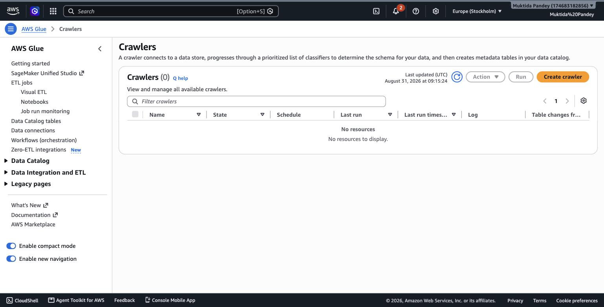

  Clicking **Create crawler** opens a 5-step wizard (name it, point it at `s3://claude-code-datalake-<your-account-id>/flattened/`, choose an IAM role, choose the target database `claude_code_analytics`, then review and create).

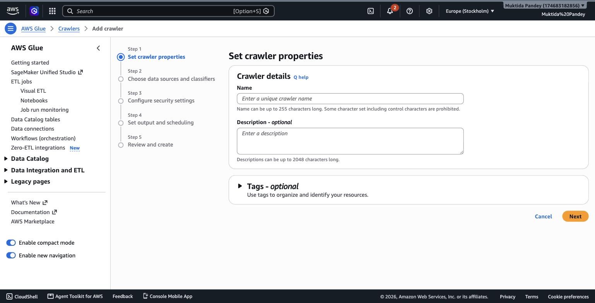

  Run the crawler once you have at least one real flattened file sitting in S3 (either from a real Claude Code session once Part B is live, or from any test data), so it has something to actually infer a schema from.

- **The manual way — define the table's schema yourself**, if you'd rather pin down the exact column types explicitly rather than let a crawler guess them (this avoids a rare but annoying crawler surprise, like a numeric-looking text column getting typed as a number and then failing the first time a genuinely non-numeric value shows up).

Either approach produces the same end result: a table named `flattened` inside the `claude_code_analytics` database, which Athena can query directly in the next step.

⚠️ New date-based partitions (as new `year=/month=/day=` folders appear over time) don't show up in Athena automatically if you defined the table manually. Run `MSCK REPAIR TABLE claude_code_analytics.flattened;` in Athena periodically (or re-run the crawler on a schedule, e.g. daily) to pick up new days as they accumulate.

---

## A12. Run your first query in Athena

**Amazon Athena** lets you run standard SQL queries directly against files sitting in S3, using the table definitions Glue just created — no database server to manage.

**Step 1 — Go to the Athena query editor.** Search "Athena" in the console. You'll land on the Query editor. **The very first time you ever open Athena in a fresh account**, it will prompt you to set a "query result location" before it lets you run anything — this is simply an S3 path where Athena stores each query's raw output. If you're prompted, point it at any path in the bucket from A1, such as `s3://claude-code-datalake-<your-account-id>/athena-results/`.

If you ever need to check or change this setting later (not just on first use), go to the **Query settings** tab and look at "Query result encryption" — it shows the currently configured path.

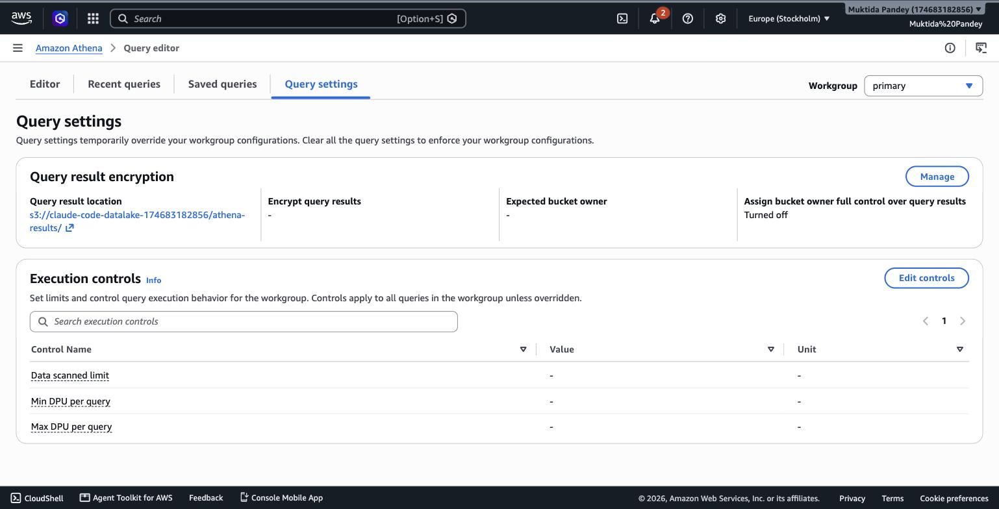

Clicking **Manage** next to it opens the same dialog a first-time user sees when setting this up initially:

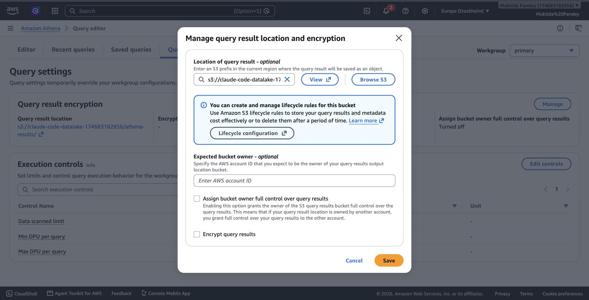

**Step 2 — Select your database.** Back in the Editor tab, in the "Data" panel on the left, make sure "Data source" is `AwsDataCatalog`, then use the "Database" dropdown to select **`claude_code_analytics`** — the one you created in A11. Once selected, you should see your `flattened` table appear underneath in the "Tables" list.

**Step 3 — Type and run a sample query.** In the main query box, type:

```sql
SELECT
  COUNT(*) AS total_events,
  COUNT(DISTINCT session_id) AS unique_sessions,
  SUM(TRY_CAST(tokens AS DOUBLE)) AS total_tokens
FROM claude_code_analytics.flattened;
```

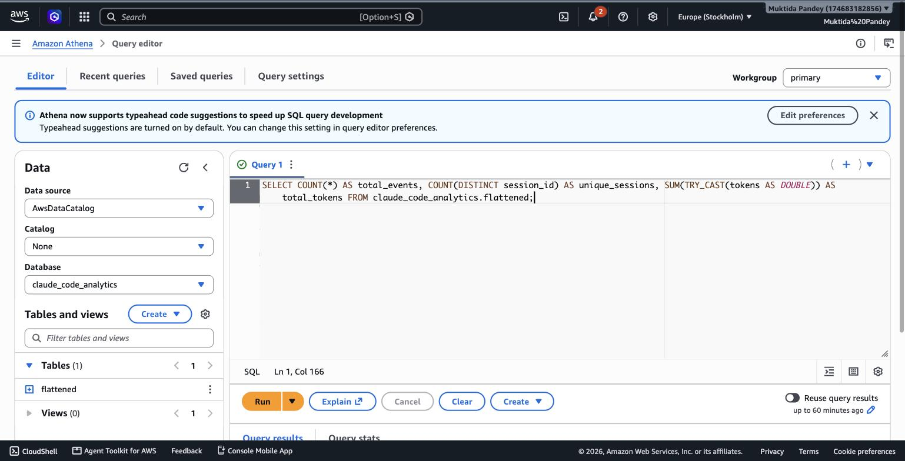

Click the orange **Run** button. Within a second or two, you should see a "Completed" banner and a results table underneath with your actual numbers.

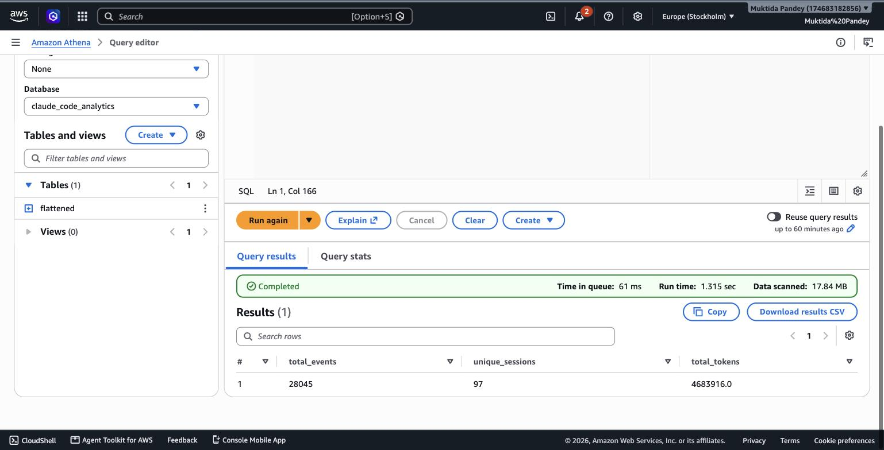

If `total_events` comes back as `0`, that just means no real data has flowed through the pipeline yet — that's expected until Part B (below) is finished and at least one developer has run Claude Code with telemetry turned on.

**A privacy note on writing your own queries:** the `flattened` table can include per-user fields like an email address, depending on exactly which attributes your organization's Claude Code sessions emit. Be thoughtful about which columns you select and who you share query results with — the same care you'd apply to any other internal usage data.

---

# Part B — Turning on telemetry in Claude Code

Everything in Part A builds the receiving pipeline. Nothing flows into it until Claude Code itself is told to send data, and told exactly where. This part turns that on for your whole organization at once, centrally, rather than asking every individual developer to configure their own laptop.

## B1. Push your organization's Managed settings

**Step 1 — Open Claude's admin settings.** In a browser, go to `claude.ai`, log in with an account that has organization admin access, and open the **Admin settings** area (usually reachable from a settings/gear icon, or directly at `claude.ai/admin-settings`).

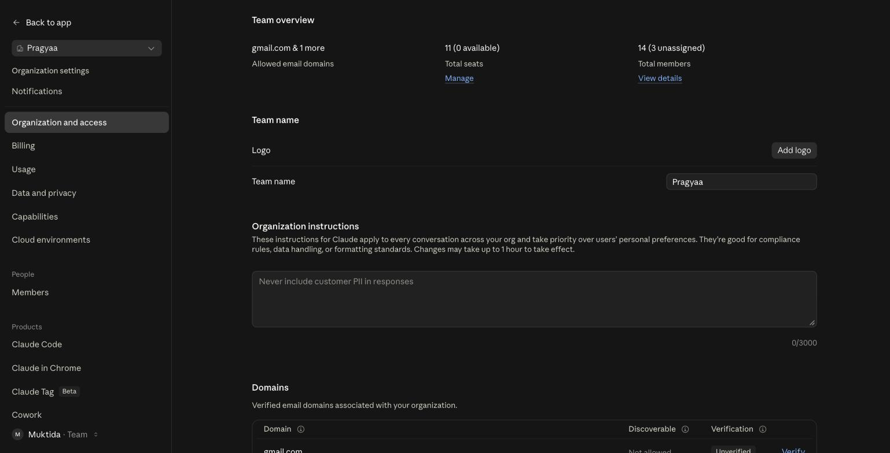

**Step 2 — Go to Claude Code → Managed settings.** In the left sidebar, under "Products," click **Claude Code**. Near the top of that page, you'll see a "Managed settings" panel with a description explaining that these settings override every individual user's and project's own settings, org-wide. Click the **Manage** button next to it.

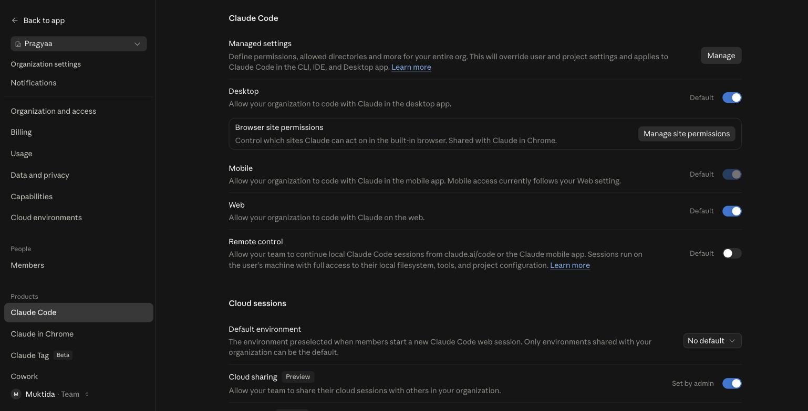

**Step 3 — The Managed settings dialog.** This opens a code editor showing your organization's current `settings.json` (if one already exists) or an empty one if this is the first time anyone has configured it. The screenshot below shows what a populated one looks like, with the real secret value blacked out — never leave your own actual token value visible in anything you screenshot or share:

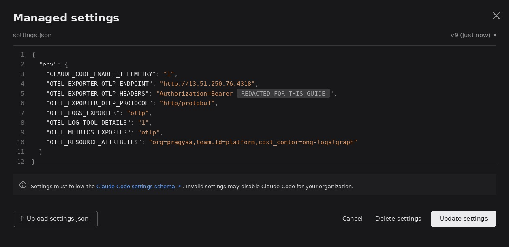

**Step 4 — Prepare your settings as a local file, then upload it rather than typing directly.** Rather than typing directly into the in-browser code editor (which can occasionally be unresponsive to paste actions), write the following into a plain text file on your own computer named `settings.json`:

```json
{
  "env": {
    "CLAUDE_CODE_ENABLE_TELEMETRY": "1",
    "OTEL_EXPORTER_OTLP_ENDPOINT": "http://<collector-public-ip>:4318",
    "OTEL_EXPORTER_OTLP_HEADERS": "Authorization=Bearer <your-ssm-token>",
    "OTEL_EXPORTER_OTLP_PROTOCOL": "http/protobuf",
    "OTEL_LOGS_EXPORTER": "otlp",
    "OTEL_LOG_TOOL_DETAILS": "1",
    "OTEL_METRICS_EXPORTER": "otlp",
    "OTEL_RESOURCE_ATTRIBUTES": "org=<your-org-name>,team.id=<your-team-id>,cost_center=<your-cost-center>"
  }
}
```

Fill in the placeholders:

- `<collector-public-ip>` — the current public IP address of your running ECS task, from A7. Remember this changes on restarts — Part C explains exactly what to do when it does.
- `<your-ssm-token>` — the actual secret value you generated back in A3. This is the one place in this entire guide where the literal token needs to appear, because Claude Code needs the real value to authenticate. Once it's typed into this one file for this one upload, don't paste it anywhere else.
- The three values in `OTEL_RESOURCE_ATTRIBUTES` are free-text labels of your own choosing, used later to filter/group your usage data (e.g. by team or cost center) — set them to whatever makes sense for your organization, or remove that whole line if you don't need this level of tagging yet.

**Step 5 — Click "Upload settings.json"** in the dialog and select the file you just wrote. Then click **Update settings**.

`OTEL_LOG_TOOL_DETAILS=1` deserves a special mention: this is the one setting that unlocks *per-skill* granularity in your data. Without it, you only get session-level totals — no record of which specific skill or tool was used for a given chunk of cost/tokens. With it on, you get a dedicated event every time a skill activates, which is what makes "cost of running skill X" answerable at all later.

⚠️ **Never set any of the `OTEL_*_EXPORTER` variables to the literal text `"none"`**, even though it might seem like the obvious way to turn one signal off. Doing so causes Claude Code's telemetry startup to throw an error and **abort initialization for logs, metrics, and traces all together** — not just the one you meant to disable. If you want a particular signal off, **remove that key from the file entirely** rather than setting it to `"none"`.

## B2. Verify it's actually working from a developer's machine

**Step 1 — Run a debug session.** On any developer's machine, running `claude --debug` and then sending any prompt (or running any skill) writes a detailed log file to `~/.claude/debug/<session-id>.txt`. This is the single most reliable way to see exactly what Claude Code's own telemetry setup is doing, independent of whether the actual chat request succeeds or fails.

**Step 2 — Check CloudWatch for the new data.** Back in the AWS Console, open `/claude-code/metrics-logs` and `/claude-code/metrics` (via CloudWatch Logs Insights, or the plain console search within the log group) and look for entries tagged with that developer's email address or a fresh `session.id`.

**Step 3 — If nothing shows up, check the client side before assuming AWS is broken.** In practice, every telemetry gap encountered while building this pipeline turned out to be something on the developer's own machine, not the collector or AWS side. See the checklist below.

## B3. What per-skill data actually looks like once this is working

Once `OTEL_LOG_TOOL_DETAILS=1` is live and a real skill run happens, you should start seeing:

- A dedicated `claude_code.skill_activated` event carrying a precise skill identifier (e.g. `skill.name: "anthropic-skills:coding-hacks"`), plus related fields like `skill.source`, `plugin.name`, and `marketplace.name`.
- Related tool-decision and tool-result events sharing the same `session.id`/`prompt.id`, so you can correlate a specific skill run to what happened during it.
- Individual API request log events carrying real per-request `cost_usd`, `input_tokens`, `output_tokens`, and `duration_ms`.
- Metric records (in the EMF format) for token and cost usage, with `skill.name` available as a dimension you can group by.

⚠️ One nuance worth knowing up front: the precision of `skill.name` differs by event type. The dedicated skill-activation event carries the exact, specific skill slug. The cost/token metric records, by contrast, sometimes tag `skill.name` with a coarser generic category rather than the specific skill name. If you need "exact cost of running skill X," the reliable approach is correlating the specific skill-activation event to nearby cost/token records via their shared `session.id` and `prompt.id`, rather than trusting `skill.name` alone on the metric records.

## B4. A troubleshooting checklist for "no telemetry showing up"

Work through these in order on any machine that reports nothing, even though your org-wide Managed settings are correctly pushed:

1. **A developer's own local settings file can silently override your organization's Managed settings**, for at least the metrics exporter setting. Check whether that specific machine has its own `~/.claude/settings.json` with conflicting values.
2. **Check for the literal string `"none"`** anywhere in that local file for any `OTEL_*_EXPORTER` key — see the warning in B1.
3. **Third-party Claude Code plugins can silently redirect telemetry elsewhere.** Some plugins write their own `OTEL_EXPORTER_OTLP_ENDPOINT`/`OTEL_EXPORTER_OTLP_HEADERS` pointing at a completely different, third-party analytics destination. If usage data seems to be going somewhere other than your own collector, check what plugins are installed on that machine and what environment variables they write.
4. **Check the shell's own exported environment variables, not just config files.** Run `env | grep -i otel` in a fresh terminal window on the affected machine. Environment variables exported from shell startup files (like `.zshrc` or, especially, `.zshenv`, which reloads on *every single* new terminal) can silently override everything else, even after you think you've cleaned up the config files themselves.

## B5. Also configure OTel monitoring for Cowork (if your organization uses Cowork)

Everything in B1–B4 above turns on telemetry for **Claude Code** specifically. **Cowork** — the file/task automation product in the same Claude admin console — has its own, completely separate telemetry screen, with its own fields. If your organization only uses Claude Code and not Cowork, skip this section entirely. If you use both, repeat this step so both products' usage data ends up in the same pipeline.

**Step 1 — Go to Admin settings → Products → Cowork.** In the same left sidebar you used for B1 (`claude.ai/admin-settings/...`), scroll down the "Products" list past Claude Code, Claude in Chrome, and Claude Tag, and click **Cowork**.

**Step 2 — Scroll down past "Security" to the "Monitoring" section.** The Security section above it (Remote control, Require trusted devices) controls who can remotely drive Cowork on a teammate's own computer — it's unrelated to telemetry, so leave it as you find it. Keep scrolling until you reach a section titled **"Monitoring"**, which explains that Cowork reuses Claude Code's own OTel events schema via the Claude Agent SDK — meaning the same collector you already built in Part A can receive Cowork's data too, with no changes needed on the AWS side.

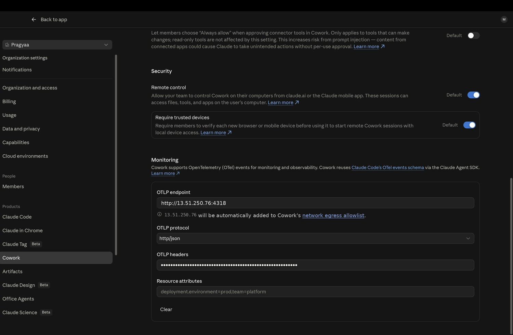

**Step 3 — Fill in the four fields**, using the same values you already used for Claude Code in B1:

- **OTLP endpoint** — the same collector address, e.g. `http://<collector-public-ip>:4318`.
- **OTLP protocol** — a dropdown (e.g. `http/json`); pick whichever matches the `OTEL_EXPORTER_OTLP_PROTOCOL` value you set in B1, for consistency.
- **OTLP headers** — the same `Authorization=Bearer <your-ssm-token>` value you used in B1. Note that this field automatically masks what you type as dots the moment you enter it — a nice built-in safeguard that Claude Code's own Managed settings JSON editor (B1) doesn't have, since that one shows the raw value in plain text until you redact it yourself.
- **Resource attributes** — free-text `key=value` pairs, comma-separated (no surrounding quotes needed here, unlike the JSON string format in B1) — e.g. `org=<your-org-name>,team=<your-team-id>`.

**Step 4 — Note the automatic egress allowlist message.** Under the OTLP endpoint field, Cowork tells you it will automatically add that host to Cowork's own network egress allowlist once you save — this is Cowork's sandboxed runtime confirming it's now permitted to make outbound calls to your collector. You don't need to configure this allowlist separately anywhere else.

**Step 5 — Save.** Depending on your console version, these fields either save automatically as you move between them, or there's a save/confirm action further down the page — look for a confirmation message before navigating away.

---

# Part C — Operating this pipeline day to day

## C1. The collector's public IP changes on every restart

Because this design has no fixed IP address (see the prerequisites at the top of this guide), expect the collector's public IP to change any time its task restarts — a deploy, a crash, or a routine AWS-side scaling event. **Whenever the collector seems unreachable, always check the current IP first**, the same way you did in A7: ECS → `claude-otel-cluster` → `claude-otel-collector-service` → Tasks tab → the running task → Networking.

Then update the **one place** that needs to change: go back to `claude.ai/admin-settings/claude-code` → Managed settings → Manage, update the `OTEL_EXPORTER_OTLP_ENDPOINT` value to the new IP, and click Update settings. No developer machine needs any change at all — that centralization is the entire reason this is configured via org-wide Managed settings rather than a per-laptop file.

If this becomes a recurring annoyance, two paths forward exist for more advanced users: (a) ask AWS Support whether the account's Elastic IP restriction can be lifted, which would let you attach a genuinely fixed address; or (b) build a small automated watcher (an EventBridge rule reacting to "ECS Task State Change," triggering a Lambda that pushes the new IP somewhere your team checks). Both are optional and outside the scope of this guide's step-by-step instructions.

## C2. Make sure your organization's telemetry is actually pointed where you think it is

It's worth periodically re-checking the live value in Managed settings (B1) against your actual intent — especially in a larger organization where more than one person might have admin access. If a third-party plugin or a well-meaning teammate ever points the org-wide endpoint somewhere other than your own pipeline (deliberately, to use a different analytics vendor, or accidentally), your AWS side won't show any errors — it will simply and silently receive nothing. If "the dashboard isn't updating," check this setting before assuming anything in Part A is broken.

## C3. Rotating the bearer token

1. Go back to SSM Parameter Store (A3), edit the parameter, and set a new random value.
2. Go to your ECS service and choose **Update service**, checking the **"Force new deployment"** option. Secrets are only read once, at container startup — the currently-running task will keep using the old token in memory until it's restarted this way.
3. Update the `OTEL_EXPORTER_OTLP_HEADERS` value in Claude's Managed settings (B1) to the new token.
4. Since step 2 also assigns a brand-new public IP (per C1), update the endpoint in that same Managed settings edit at the same time, rather than as two separate trips.

## C4. If you later want TLS (encrypted transport) instead of just a bearer token

This design uses plain, unencrypted HTTP/gRPC, relying on the bearer token as the only protection. If your AWS account's restrictions on load balancers/fixed IPs ever get lifted, or you want encryption regardless, two options avoid asking every developer to manually trust a certificate:

- Get the account restriction lifted through AWS Support, then use a standard ACM certificate with a load balancer's TLS listener in front of the collector.
- Use an API Gateway HTTP API with a private integration into the ECS service, which gives you an AWS-managed, publicly-trusted HTTPS address without needing a load balancer or a fixed IP at all.

A self-signed certificate installed directly on the collector was tried during the original build of this pipeline and does technically work, but requires every single developer to manually trust a certificate file and maintain a hosts-file entry pinning a hostname to the ever-changing IP — real friction even for a small team, and worse as the team grows. Not recommended unless neither option above is available to you.

## C5. Known limitations to be aware of

- Depending on how you built your Glue table (A11), some numeric columns may not be populated on every row if your organization's Claude Code version or configuration doesn't emit that particular field on every event type. Cross-check against CloudWatch Logs Insights queries directly against `/claude-code/metrics` if a column in Athena looks unexpectedly empty.
- If you experiment with a load balancer or an Elastic IP before settling on this no-load-balancer design (as commonly happens while first exploring an account's restrictions), remember to clean up any unused target groups or unassociated Elastic IPs afterward — both can otherwise linger unnoticed and, in the case of an unassociated Elastic IP, may incur a small ongoing cost.
- Consider removing any temporary debug-level exporters or verbose logging you add to the collector config (A5a) while troubleshooting, once your pipeline is confirmed stable — leaving them on indefinitely adds unnecessary CloudWatch Logs volume and cost.

---

# Part D — Let Claude query this data directly and build dashboards for your team

Everything above gets your usage data flowing into AWS and queryable in Athena. This last part is the payoff: instead of writing SQL by hand every time someone asks "how's the team doing this month," you can connect Claude directly to AWS and just ask, in plain English, for the numbers — or for a shareable dashboard.

## D1. Add the AWS MCP connector to your Claude workspace

"MCP" (Model Context Protocol) is the standard way Claude connects to outside tools and data sources. Anthropic publishes a verified **AWS MCP** connector that gives Claude secure, scoped access to AWS services — including CloudWatch and Athena — so it can query your pipeline's data directly instead of you doing it by hand in the console every time.

**Step 1 — Open Connectors.** From any Claude chat, open your account menu → **Customize** → **Connectors** (Connectors used to live directly under Settings; it has since moved under Customize).

**Step 2 — Click Add → Browse connectors.** Clicking the **Add** dropdown at the top-right of the Connectors page gives you two options: **Browse connectors** (Anthropic's directory of ready-made connectors) and **Add custom connector** (for pointing at your own private MCP server URL). For AWS MCP, use **Browse connectors**.

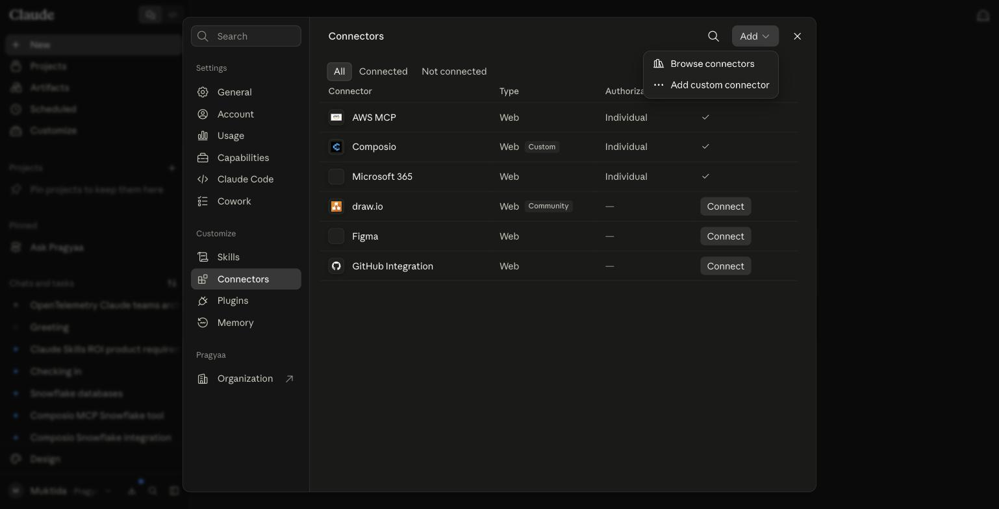

**Step 3 — Search "AWS" and find "AWS MCP."** Type "AWS" into the directory's search box. You'll see several AWS-related listings — look specifically for the one named **AWS MCP**, described as "Give agents secure access to AWS via MCP," with a small checkmark badge next to its name indicating it's an Anthropic-verified connector (not a third-party community one — several other AWS-adjacent entries in the same search results are community-built, which is fine too, but this guide's later steps assume the verified one).

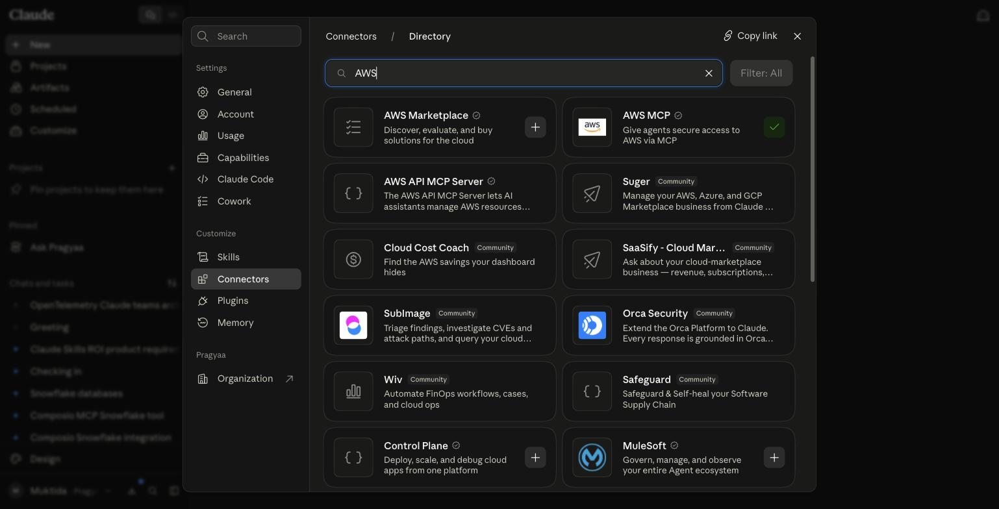

**Step 4 — Click the "+" to add it, and complete the authorization it asks for.** You'll be walked through granting it access to your AWS account — exactly what that screen asks for depends on how your organization has AWS MCP configured (a cross-account role, temporary credentials, or an SSO-style login are all common patterns). If you're not sure what to grant, check with whoever administers your AWS account, and where you're offered a choice, grant only the read access this pipeline actually needs (CloudWatch Logs, Athena, Glue, S3 read on your data lake bucket) rather than broad account-wide access.

**Step 5 — Confirm it shows as connected.** Back on the main Connectors list, AWS MCP should now show a checkmark under "Status," the same way any other connected integration does:

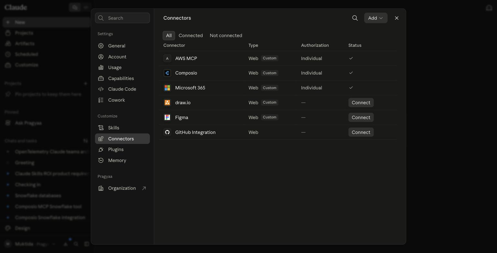

## D2. Ask Claude to fetch data or build a dashboard

Once connected, you don't need to write any SQL yourself. In a normal chat message, just ask for what you want, for example:

> "Using the AWS MCP connector, pull the last 30 days of Claude Code usage from the `claude_code_analytics.flattened` Athena table (or CloudWatch Logs Insights against `/claude-code/metrics`, whichever has the fresher numbers) and build me a dashboard I can share with my team."

Because a request like that fits the shape of something worth keeping and revisiting, Claude will typically build the result as a persisted, shareable dashboard rather than just answering inline in the chat — meaning you (and your team) can come back to it later, and ask Claude to refresh it with current numbers whenever you like, rather than re-asking from scratch each time.

If your organization already has a purpose-built skill for this exact dashboard (ask whoever set up this pipeline whether one exists), invoking it by name is usually faster and more consistent than a from-scratch prompt — a dedicated skill already knows exactly which log groups, tables, and columns to query and how to lay the dashboard out, where a generic prompt has to figure that out fresh each time.

---

## Appendix: bug log — real issues hit while building this pipeline

A condensed reference in case you hit the same class of issue:

| # | Symptom | Root cause | Fix |
|---|---|---|---|
| 1 | Collector won't start at all | `memory_limiter.check_interval` left unset in the collector config | Always set `check_interval` explicitly (A5a) |
| 2 | Only session-start/session-end events land, never any cost/token data | No `metrics` pipeline configured in the collector — metrics were silently accepted and dropped | Add the `awsemf` exporter and `metrics` pipeline (A5a) |
| 3 | Lambda crashes on every single invocation: `AttributeError: 'str' object has no attribute 'get'` | `attributes` arrives as a flat dictionary, not the OTLP list shape a naive implementation assumes | Handle both possible shapes in `flatten_attributes()` (A9) |
| 4 | Flattened rows have a null skill name despite the raw event clearly having one | Code checked `skill_name`/`skill`/`tool.parameters.skill` but missed the actual dotted key `skill.name` | Check `attrs.get("skill.name")` first (A9) |
| 5 | Telemetry silently disabled or misdirected on one specific developer's machine | A local settings file overriding org-wide Managed settings; an `OTEL_*_EXPORTER` set to `"none"` crashing all telemetry init; or a third-party plugin's environment variables leaking in via shell startup files | Check the local settings file, avoid the string `"none"`, and run `env \| grep -i otel` on the affected machine (B4) |

## Where to go for more detail

- [Claude Code — Monitoring usage (OpenTelemetry)](https://code.claude.com/docs/en/monitoring-usage)
- [Claude Code — Settings](https://code.claude.com/docs/en/settings)
- [AWS Distro for OpenTelemetry — Collector overview](https://aws-otel.github.io/docs/getting-started/collector) — AWS's own reference architecture, useful if your account can create load balancers and fixed IP addresses and you'd rather use that more standard design instead of this guide's workaround.
